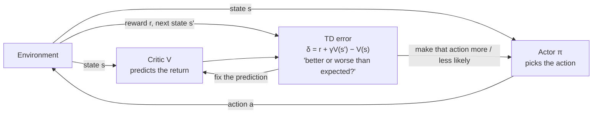

---
aliases:
  - Actor Critic
  - Actor-Critic Methods
  - A2C
  - A3C
  - Advantage Actor-Critic
  - Advantage Actor Critic
  - GAE
  - Generalized Advantage Estimation
  - Generalised Advantage Estimation
  - Critic
  - Actor
tags:
  - reinforcement-learning
  - decision-sciences
  - deep-rl
---
> [!ABSTRACT] 🧠 Recall
> **In one line:** Two learners in one agent. The **actor** chooses actions; the **critic** predicts how well things will go — and the gap between prediction and reality ("better or worse than I expected") is what trains them both.
> **Metaphor:** An actor rehearsing with a director in the stalls. She doesn't tell him what to do. She says, straight away, *"that was better than I expected."*
> **Where it bites:** A2C, PPO, SAC, DDPG — and the policy + value-model pair inside RLHF.

---
[[Policy Gradient|REINFORCE]] has two problems, and they're both about waiting.

It has to **finish the episode** before it learns anything — the multiplier is the full return. And that return is a sum of hundreds of random steps, so it's **wildly noisy**: the same good move gets a big thumbs-up in one episode and a thumbs-down in the next, purely because of what happened *afterwards*.

The baseline helped with the noise. But it was only a running average.

~={blue}What if you had someone watching who could tell you, *the moment you did something*, whether it made things better or worse than they'd expected?=~

---
# The rehearsal 🎭

![[actor_critic_stage.png]]

An actor is rehearsing. In the stalls sits a director. She has seen this scene a hundred times and carries a running sense of *how well it's going*.

The actor tries a new gesture. Before the scene is even over she calls out: *"Oh — that was better than I expected."* He keeps it. He tries another. *"Worse."* He drops it.

Two things to notice. She never tells him **what to do** — she only says how it compared with her expectation. And her expectations are *themselves* being revised: every time she's surprised, she updates her sense of how the scene goes.

- **The actor** is a policy $\pi_\theta(a \mid s)$.
- **The critic** is a [[Value Function]] $V_\phi(s)$ — a prediction of the return from here.
- **"Better than expected"** is the **TD error**:

$$\delta = r + \gamma V(s') - V(s)$$

and that one number trains both of them:

$$\text{critic:}\;\; V(s) \leftarrow V(s) + \alpha_c\, \delta \qquad\qquad \text{actor:}\;\; \theta \leftarrow \theta + \alpha_a\, \delta\, \nabla_\theta \log \pi_\theta(a \mid s)$$

> [!NOTE] Actor–critic
> A policy-gradient method in which a learned value function (the **critic**) supplies the advantage estimate used to update the policy (the **actor**), and is itself trained by [[Temporal Difference Learning|TD learning]]. ^actor-critic-def

> [!SUCCESS] Core idea
> ~={pink}The critic turns one late, noisy score into an immediate, low-noise one.=~ $\delta$ is a one-step estimate of the [[Value Function|advantage]] — *"was that action better than my usual from here?"* — available **every step**, without waiting for the curtain. It's [[Value and Policy Iteration#^gpi|generalised policy iteration]] with both halves running at once: the critic *evaluates*, the actor *improves*. ^critic-gives-immediate-advantage

---
# What you buy, what you pay

| | [[Policy Gradient\|REINFORCE]] | **Actor–critic** | [[Q-Learning]] / [[DQN]] |
|---|---|---|---|
| Learns | policy | **policy + value** | value only |
| Update signal | full return $G$ | TD error / advantage | TD error |
| Variance | very high | **low** | low |
| Bias | none | some — the critic is imperfect | some |
| Learns mid-episode | ❌ | ✅ | ✅ |
| Continuous actions | ✅ | ✅ | ❌ |

The price is that bias. Early on the critic is *rubbish*, and an actor faithfully following a rubbish critic goes nowhere useful. So in practice the critic gets a larger learning rate, or a head start.

---
# GAE — the bias/variance dial, again

How far should the critic look before giving its verdict?

- **One step** ($\delta$ alone): low variance, but leans hard on a possibly-wrong $V$.
- **The whole episode**: unbiased, and as noisy as REINFORCE.

**Generalised Advantage Estimation** blends them — an exponentially-weighted sum of the TD errors that follow:

$$\hat{A}_t = \delta_t + (\gamma\lambda)\,\delta_{t+1} + (\gamma\lambda)^2\,\delta_{t+2} + \cdots$$

$\lambda = 0$ → one-step. $\lambda = 1$ → Monte Carlo. It's the identical dial as TD($\lambda$) and [[Credit Assignment#How RL moves credit backwards|eligibility traces]], just pointing forwards. The near-universal setting is $\gamma = 0.99$, $\lambda = 0.95$. → [[High-Dimensional Continuous Control Using Generalized Advantage Estimation (GAE)]]

---
# The family

| Name | What it adds |
|---|---|
| **A2C / A3C** | many copies of the agent collecting experience in parallel — decorrelates the data without a replay buffer |
| **[[PPO]]** | actor–critic + a limit on how far the actor may move per update. The default |
| **DDPG / TD3 / [[SAC]]** | off-policy actor–critics for continuous control; the critic is a $Q$-function |
| **[[RLHF]]** | the LLM is the actor; a separate **value model** is the critic; the reward model supplies $r$ |

> [!TIP] Why GRPO could delete the critic
> In RLHF the critic is a second network as large as the policy — a serious memory bill ([[Distributed Training#Start with the real question|~16 bytes per parameter]], twice). [[GRPO]] observes that for one-shot tasks you can get a perfectly good baseline by sampling a *group* of answers to the same prompt and using their mean score. No critic. That only works because the "episode" is a single step; for long-horizon control you still want one.

> [!WARNING] The critic is not the reward, and it doesn't pick actions
> Three things get blurred. The **reward** is given by the environment, per step. The **critic** is *learned* and predicts the *sum of future* rewards. And the critic never says which action is best — it scores what the actor **did**, relative to expectation. ~={red}If your critic's predictions are poor, no policy-side trick will save the run=~ — check its explained variance before anything else. ^critic-is-not-reward

---
---
#### 🖼️ One surprise signal, two students

---
> [!SUCCESS] If you remember one thing
> The actor acts; the critic says **"better or worse than I expected"**; ~={pink}that one surprise signal teaches both of them, every step.=~

---
# ⁉️
Every method in this section has quietly assumed the agent *tries enough different things* to find out what's good. We've hand-waved it with "10% random moves". It deserves better than that — it's half the problem.

→ [[Exploration vs Exploitation]]
