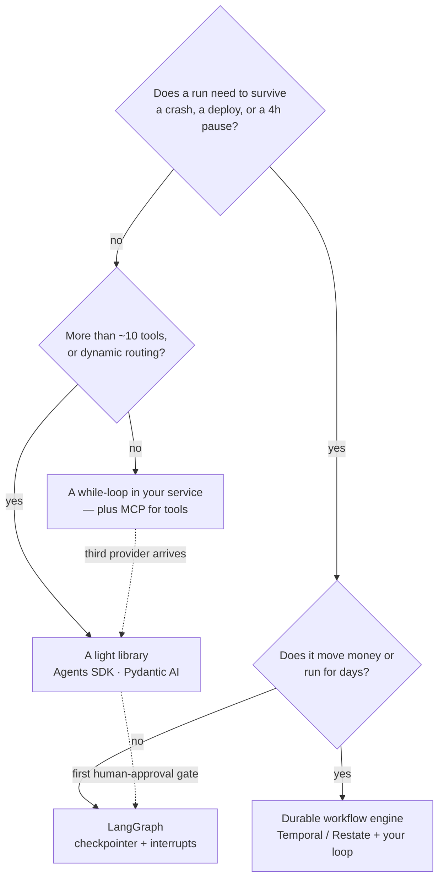

---
aliases:
  - CrewAI
  - AutoGen
  - OpenAI Agents SDK
  - Pydantic AI
  - Agent SDK
tags:
  - llm
  - agents
  - engineering
  - tooling
---
> [!ABSTRACT] 🧠 Recall
> **In one line:** The agent loop is ~200 lines and you can write it; **durability, interrupts and tracing are not** — so choose a framework for those, never for its agent abstraction.
> **Metaphor:** A tent, a campervan, a hotel. None is best. It depends how long the trip is and whether you'll be somewhere strange at 3am.
> **Where it bites:** Every team picks in week 1, fights it by week 3, and discovers in week 6 which two features it was actually buying.

---
Here is everything an agent framework does for you. Be honest about each line:

```
1. normalise providers (messages, tool calls, streaming)   ~150 lines
2. the tool-call loop (emit → execute → append → repeat)   ~60 lines
3. retries, timeouts, fallbacks                            ~80 lines
4. streaming to a client                                   ~100 lines
5. persist state so a run survives a crash or a 4h pause   ← not 200 lines
6. a trace you can actually read when a run goes wrong     ← not 200 lines
7. human approval that resumes mid-run                     ← not 200 lines
```

Lines 1–4 are an afternoon each, and you'd end up with something you fully understand. Lines 5–7 are systems: a schema, a store, a replay model, a UI, an ingestion path.

~={blue}Almost every framework argument is people comparing line 2 and deciding on lines 5–7 by accident.=~

---
# The tent, the campervan and the hotel

Three ways to sleep on a long trip.

![[agent_frameworks_tent_campervan_hotel.png]]

**The tent.** You carry it all, you pitch it yourself, and you know exactly what you have. When it rains at 3am it is entirely your problem — and you can actually fix it, because you packed every item.

**The campervan.** The bed is made and the water's plumbed, but you're still driving and you can pull over anywhere. Somebody else decided where the sink goes.

**The hotel.** Enormous infrastructure, free at the point of use: laundry, a kitchen, a night porter. And you sleep in the room they built, at the times they operate, and getting your stuff out later means checking out properly.

Nobody thinks the hotel is objectively better than the tent. The question is **how long the trip is**, and **whether you'll be somewhere strange at 3am**. A two-night hop: pitch the tent. Six months on the road with clients: take the hotel and stop pretending.

> [!SUCCESS] Core idea
> The agent *abstraction* — `Agent`, `Task`, `Crew`, `Tool` — is the least valuable thing a framework sells, because it's the part you could write and the part you'll eventually want to change. ~={pink}Buy the state store, the trace and the interrupt. Those are the 3am features.=~ ^buy-the-3am-features

---
# The landscape, with a verdict

| Option | The thing it's genuinely good at | Shape | Verdict |
|---|---|---|---|
| **Just a `while` loop** | You understand every line; zero indirection | Your code | **Correct for a single-purpose agent under ~10 tools.** Start here more often than people do |
| **[[LangGraph]]** | Checkpointed state, interrupts, time travel, explicit graphs | State machine | **Default when the run is long, resumable or human-gated** 🥇 |
| **OpenAI Agents SDK** | Small surface: agents, handoffs, guardrails, sessions, tracing built in | Lightweight lib | **Best "campervan".** Excellent if you're mostly on one provider |
| **Pydantic AI** | Typed, validated outputs and dependency injection; FastAPI ergonomics | Typed lib | **Pick for a typed Python service.** Strong on [[Structured Output]] |
| **CrewAI** | Role/task/crew modelling; demo-to-running in an hour | Opinionated multi-agent | Fast to a demo; the abstraction gets in the way once routing gets real |
| **AutoGen / AG2** | Conversational multi-agent, group chat, code execution | Research-leaning | Great for exploring patterns. Watch the token bill — see [[Multi-Agent LLM Systems]] |
| **Smolagents** | Agents that write *code* instead of JSON tool calls | Minimal | Neat where the task is computational. Needs a real [[Sandboxing\|sandbox]] |
| **[[DSPy]]** | Optimising the prompts, not orchestrating the loop | Compiler | Orthogonal. Use *with* one of the above |
| **Temporal / Restate + your loop** | Durability as a first-class system, not a library feature | Workflow engine | **Money-moving, multi-day work.** The hotel with a legal department |

> [!WARNING] When no framework is right
> Three cases, and they're common:
> 1. **One agent, one provider, under ten tools, no human gate.** The loop is 200 lines; a framework adds a dependency, a migration path and a layer between you and the prompt.
> 2. **Latency is the product.** Every abstraction is a few milliseconds and a few unknowns. For a sub-second classifier, call the API.
> 3. **You already run a workflow engine.** If Temporal (or Airflow, or Step Functions) is in production, you have durability, retries and observability. Adding a second execution model to get them again is a downgrade. ~={red}Put the model call inside the workflow you already trust.=~ ^when-no-framework

---
# The question to ask in the evaluation, not after it 🧪

Score candidates on these six, in this order. Notice that none of them is "how nice is the agent class."

| Question | Why it decides everything |
|---|---|
| **Can I see the exact string sent to the model?** | If not, you can't debug, cost-model, or [[Prompt Caching\|cache]]. Disqualifying |
| **Where does run state live, and what's its schema?** | This is your migration cost. It is the lock-in |
| **Can a run pause for four hours and resume elsewhere?** | [[Human in the Loop]] is a *storage* requirement |
| **What does a failed run look like in the UI?** | You'll spend more time here than writing agents |
| **Can I inject a tool call / edit state / re-run from step 9?** | The difference between debugging and guessing |
| **Can I use my own model gateway?** | Routing and spend caps belong to you — [[Model Gateway]] |

> [!TIP] The migration test — run it before you commit 🚪
> Write one small agent in the candidate. Then ask: *if I had to move this to something else next quarter, what would I lose?*
> - Prompts you can see and own → **portable**
> - Tool functions → **portable**
> - The state schema → 🟠 painful but mechanical
> - Traces and their history → ~={red}gone=~
> - Prompts baked inside the library's classes → ~={red}you never had them=~
>
> Keep the first two in your own modules from day one and the framework becomes a *host* rather than a *home*. That one habit is worth more than picking correctly.

And the pattern that ages best: **`langchain-core` for model portability + LangGraph (or your own loop) for the graph + [[Model Context Protocol|MCP]] for tools + OpenTelemetry for traces.** Every piece is replaceable, and none of them owns your prompts.

Related: [[Agentic Workflows]] (what the loop is), [[LangChain]], [[LlamaIndex]], [[Agent State and Checkpointing]], [[Observability and Tracing]].

---
---
#### 🖼️ Answer these four in order and the choice makes itself



---
> [!SUCCESS] If you remember one thing
> The loop is 200 lines and you can write it. ~={pink}Buy the durable state, the interrupt and the trace — the 3am features=~ — and keep prompts and tools in your own modules so the framework stays a host rather than a home.

---
# ⁉️
Every option above ends at the same line: a call to a provider. Which provider, at what price, with what fallback when it 503s, and under whose spend cap — that's a decision you should be able to change without touching any of this code.

→ [[Model Gateway]]
