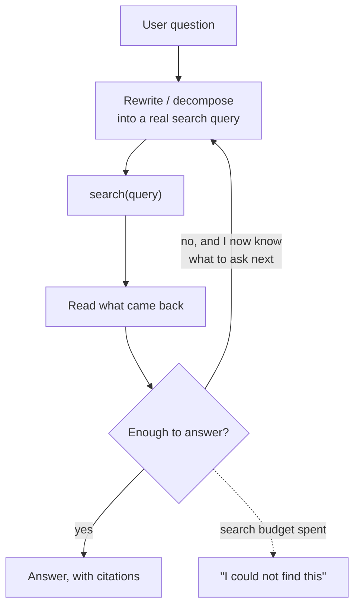

---
aliases:
  - Agentic Retrieval
  - Query Rewriting
  - Multi-hop Retrieval
  - Iterative Retrieval
  - Self-RAG
tags:
  - llm
  - retrieval
  - agents
---
> [!ABSTRACT] 🧠 Recall
> **In one line:** Make retrieval a **tool the model decides to call** — so it can rewrite the query, search again after reading, and stop when it has enough, instead of being handed five chunks once and told to cope.
> **Metaphor:** A vending machine versus a librarian. One dispenses five items for your coin; the other asks what you're actually trying to find out.
> **Where it bites:** Any question whose answer requires a *second* lookup that depends on the first. One-shot [[RAG]] cannot do those at all.

---
Your RAG system answers *"what's our refund window?"* perfectly. Then someone asks:

> *"Which enterprise customers churned after the March pricing change, and what reason did they give?"*

Embed that sentence, take the top 5 chunks, and you get: a pricing FAQ, a churn dashboard description, two customer-success playbooks, and a blog post about enterprise onboarding. The model produces a confident paragraph made of nothing.

Look at what the question actually needs:

```
1. when was the March pricing change?          → one lookup
2. which enterprise accounts closed after it?  → needs the answer to (1)
3. what did those accounts say on exit?        → needs the answer to (2)
```

Three retrievals, and **two of them cannot be written until the previous one returns**. No amount of better embeddings, better [[Chunking|chunks]] or better [[Reranking]] fixes this, because ~={blue}the query you needed to run did not exist when you ran the only query you were allowed.=~

---
# The vending machine and the librarian

Put a coin in a vending machine and you get one shot. You press B4, five things drop, and if none of them is what you wanted, your options are: put in another coin, or make do.

![[agentic_rag_vending_machine_vs_librarian.png]]

Ask a librarian the same question and something different happens. She asks what you're *actually* after. She fetches three books, **reads the index of one**, says "this cites a 1974 report — hang on", disappears, and comes back with the report. Then she stops, because she now has enough.

Four things the machine can't do, and each one is a named technique:

| The librarian… | is called |
|---|---|
| Rephrases your question into something the catalogue will match | **Query rewriting** |
| Splits it into several searches | **Query decomposition** |
| Reads a result, then searches for what it *mentioned* | **Multi-hop retrieval** |
| Decides she has enough and stops | **Sufficiency check** |

> [!NOTE] Agentic RAG
> Retrieval exposed as a **tool** in an [[Agentic Workflows|agent loop]] rather than a fixed pre-processing step. The model chooses *whether* to search, *what* to search for, *when to search again* given what came back, and *when to stop*. Control flow moves from your pipeline into the model — see [[Agentic Workflows#^agency-is-control-flow|the definition of agency]]. ^agentic-rag-def

> [!SUCCESS] Core idea
> Classic RAG retrieves **once, before** the model has read anything. Agentic RAG retrieves **as a consequence of** what the model just read. ~={pink}The second one can answer questions whose search terms only exist after the first search returns.=~ That's not an improvement in degree; it's a different set of answerable questions. ^retrieval-after-reading

---
# Query rewriting, which is the cheap half

You can have most of the value without any loop at all, because **the user's question is a terrible search query**:

```
user:      "does that also apply to the new tier?"
as a query: useless — no nouns, "that" is two turns back
rewritten:  "refund eligibility rules, Enterprise Plus tier, 2026"
```

One extra model call, ~150 tokens, before you touch the [[Vector Database|index]]. It resolves pronouns from the conversation, adds the vocabulary the documents actually use, and splits a compound question in two. On conversational RAG it is routinely worth more than swapping the embedding model.

A close cousin: **HyDE** — ask the model to *write the answer it would expect*, then embed that hypothetical answer instead of the question. Questions and answers live in different parts of [[Embeddings|embedding space]]; documents look like answers, so search with an answer-shaped thing.

---
# The bill 💸

Be honest about what the loop costs. One-shot versus three hops, at $3/M in and $15/M out:

```
one-shot   : 1 model call  · 5 chunks × 700 tok = 3,500 tok in   → ~£0.01, ~2s
agentic ×3 : 4 model calls · 3 searches × 3 chunks, context grows
             ≈ 1,200 + 4,300 + 8,100 + 11,400 = 25,000 tok in    → ~£0.08, ~9s
```

**Roughly 7× the tokens and 4× the latency.** For *"what's our refund window?"* that buys you exactly nothing, and one more chance to wander off. Which gives the routing rule:

| Question shape | Use |
|---|---|
| Single fact, one document | **One-shot** ✅ |
| Vague or pronoun-laden | One-shot **+ query rewriting** 🥇 |
| Compound ("A and also B") | Decompose into parallel searches |
| Chained ("…after the X that happened when?") | **Agentic, multi-hop** — nothing else works |
| Aggregation ("how many contracts auto-renew?") | ~={red}Neither.=~ This is a SQL question. Give it a query tool |

> [!WARNING] The aggregation trap
> "How many of our 400 contracts auto-renew?" cannot be answered by retrieving the top 5 contracts, and the model will answer anyway — from five. Semantic search returns *similar* things, never *all* things. When the answer needs a count, a max, or a complete set, the right tool is a database, not an index. ~={red}Retrieval has no notion of exhaustiveness.=~ ^retrieval-cannot-count

> [!TIP] The two caps that keep it from being a doom loop
> **A hard search budget** (3–5 retrievals) and **a stop condition the model must state**: *"list the facts you still lack; if the list is empty, answer."* Without both, a failed search gets rephrased forever, each attempt re-sent with the whole growing transcript — see [[Context Engineering]]. Cap it, and make "I could not find it" an allowed, rewarded outcome. 🛑

Related: [[RAG]] for the pipeline, [[Tool Use]] for how retrieval becomes a tool, [[Grounding]] for making each hop's claims traceable, [[Reranking]], and [[Agent Evaluation]] for grading a multi-hop trajectory rather than just the final paragraph.

---
---
#### 🖼️ Retrieve, read, decide whether to retrieve again



---
> [!SUCCESS] If you remember one thing
> Classic RAG searches *before* reading; agentic RAG searches *because of* what it read. ~={pink}Only the second can ask a question whose search terms didn't exist a moment ago.=~

---
# ⁉️
One loop, one context, one set of tools. The obvious next move is to split the work across several specialised agents — a researcher, a writer, a checker. That move is far more expensive than it looks, and the cost is paid in a place nobody watches.

→ [[Multi-Agent LLM Systems]]
