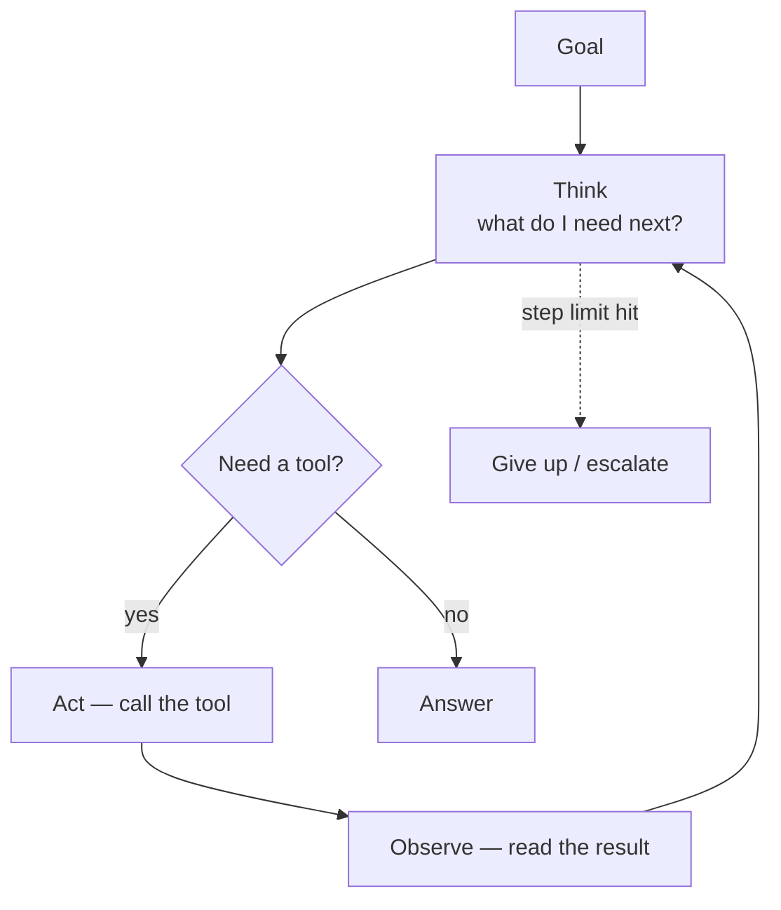

---
aliases:
  - Agents
  - AI Agents
  - ReAct
  - Agent Loop
  - Reflexion
tags:
  - llm
  - agents
  - architecture
---
> [!ABSTRACT] 🧠 Recall
> **In one line:** A loop — **think → act → observe → repeat** — where the model decides the next step based on what actually happened, instead of following a fixed script.
> **Metaphor:** A junior researcher with a task and a library card, not a factory conveyor belt.
> **Where it bites:** The autonomy dial. More autonomy = more capability = more compounding error. Most "agents" should be workflows.

---
Build a bot that answers *"How did our Q3 revenue compare to the industry average?"*

**Attempt 1 — a fixed pipeline.** Retrieve docs → generate answer. It returns our Q3 revenue and nothing about the industry, because the industry number lives somewhere else entirely. The pipeline had no step for "go and find a second thing."

**Attempt 2 — add a step.** Retrieve internal → retrieve external → compare → answer. Works! Until the next question is *"and why did it drop?"*, which needs a different number of steps in a different order.

You can keep adding branches. But you're trying to enumerate, in advance, ~={blue}every sequence of actions a question might require=~ — and the whole point of the model is that it can figure that out on the fly.

So what if you don't specify the sequence at all — just the tools, and the goal?

---
# The junior researcher

Two ways to get a piece of research done.

**The conveyor belt:** you write the steps. Step 1, search this database. Step 2, extract these fields. Step 3, format. Predictable, auditable, cheap — and completely stuck the moment the answer isn't where you assumed.

**The junior researcher:** you say *"find out how our Q3 compares to the industry, here's your library card."* She thinks about where to look, looks, ~={blue}reads what came back=~, notices the industry figures are quarterly-lagged, adjusts, checks a second source, and comes back with an answer.

The critical difference isn't intelligence. It's that **her next action depends on what the last one returned.** The conveyor belt's doesn't.

> [!NOTE] ReAct — Reason + Act
> The canonical loop, and it's just three steps repeated:
> ```
> Thought:      I need Q3 revenue. I should query the warehouse.
> Action:       query_warehouse(metric="revenue", period="2026-Q3")
> Observation:  £4.2M
> Thought:      Now I need the industry average for the same period.
> Action:       search_web("SaaS industry revenue growth Q3 2026")
> Observation:  ...
> Thought:      I can now compare. Answer: ...
> ```
> The **Thought** step is [[Chain of Thought]] inside the loop; the **Action** step is [[Tool Use]]; the **Observation** is real, external ground truth re-entering the [[Context Window]]. ^react-def

> [!SUCCESS] Core idea
> ~={pink}Agency = the control flow is decided by the model at runtime, not by you at design time.=~ That's the entire distinction, and it's a *spectrum*, not a category. The moment you can't draw the flowchart in advance, you have an agent — with everything that implies for testing, cost and safety. ^agency-is-control-flow

---
# Workflows vs agents — the decision that matters 🧭

| | **Workflow** (you fix the path) | **Agent** (model picks the path) |
|---|---|---|
| Control flow | Code | The model |
| Cost/latency | Predictable | ~={red}Unbounded without limits=~ |
| Debuggable | Yes, it's a DAG | Every run is different |
| Handles novelty | ❌ | ✅ |
| Test with | Unit tests | [[Evals]] over trajectories |

> [!TIP] Start with the least autonomy that works 🪜
> 1. **Single prompt** — most tasks
> 2. **Chain** — fixed sequence of prompts
> 3. **Routing** — a classifier picks one of $n$ fixed branches
> 4. **Parallel + aggregate** — fan out, combine
> 5. **Orchestrator–worker** — a planner *does* decide sub-tasks dynamically
> 6. **Autonomous loop** — full ReAct with tools and no fixed path
>
> Most production systems that call themselves agents are rungs 2–4, and that's a **success**, not a compromise. Autonomy is a cost you pay for novelty you actually face. ~={blue}If you can draw the flowchart, write the flowchart.=~

---
# Why long-horizon agents fail 📉

**Compounding error.** 95% reliability per step sounds fine. Over 20 steps: $0.95^{20} \approx 36\%$. This single multiplication explains most agent demos that don't survive contact with production. Fewer steps, or much higher per-step reliability, or checkpoints that verify — there is no fourth option. ^compounding-error

**Context rot.** Every observation accumulates. By step 30 the window is full of stale tool output, the instructions are buried ([[Lost in the Middle]]), and quality drops. Fix: summarise, or externalise to a [[Memory|scratchpad]] file.

**No verifier.** A loop with no way to check its own work will loop confidently toward a wrong answer. Where verification *is* cheap (tests, compilers, schemas), agents get dramatically better — the same asymmetry that powers [[Test-Time Compute]].

**Doom loops.** Same failing action retried forever. You need hard caps on steps, time, and spend, plus detection of repeated states.

> [!WARNING] Non-determinism is the operational shock
> Same input, different trajectory, different cost, different latency — every run. You cannot unit-test it, you cannot cache it naively, and you cannot promise a p99 latency without a hard step limit. Build in: **step/token/cost budgets**, **full trajectory logging** (every thought, call, and observation), **idempotency keys** on side-effecting tools, and a **human confirmation** gate for anything irreversible. See [[Guardrails]]. ^agent-nondeterminism

**Patterns worth knowing:** *Reflexion* (critique your own output, retry), *Plan-and-Execute* (plan once, then execute — fewer planning calls), *multi-agent* (specialised roles; often more overhead than it's worth, and note that agent-to-agent messages are another untrusted channel — [[Prompt Injection]]).

Related: [[Markov Decision Process]], [[Multi-Agent Reinforcement Learning]], [[What Makes Good Agentic Data- An ACE Lens on Data Generation for LLM Agents]], [[The Handoff Tax- Continuing Non-Native Trajectories in LLM Agents]], [[DRACO- Fine-Grained Credit Assignment with Dynamic Rubrics for Long-Horizon Agent Training]], [[Using Grounded Theory for Agent Behavior Analysis at Scale]].

---
---
#### 🖼️ The ReAct loop — it is just a while-loop with a model in it



# ⁉️
Every agent needs tools, and every team has been writing bespoke glue for each tool, for each framework, over and over. That's an integration problem — and integration problems get solved by protocols.

→ [[Model Context Protocol]]
