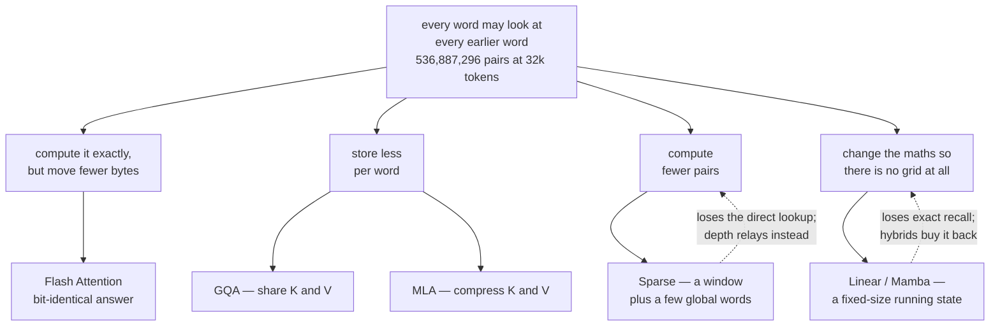

---
aliases:
  - Attention
  - Attention Mechanism
  - Self-Attention
  - MOC - Attention
tags:
  - attention
  - transformers
  - architecture
  - moc
---
> [!ABSTRACT] 🧠 Recall
> **In one line:** Attention lets every word in a sentence **look at every other word** and decide for itself which ones matter.
> **Metaphor:** A room where everyone is allowed to speak to everyone. Wonderful — and the cost grows with the *square* of how many people are in the room.
> **Where it bites:** Use this page to *find* the note. Use the chain at the bottom to read them in order.

---
**Attention** is a mechanism inside a neural network. What it does is let every position in a sequence look at every other position, and work out for itself which ones are worth paying attention to.

That's the whole idea. Really.

The rest of this page is two things: **how the looking actually works**, and **what the looking costs**.

Let's start with why anyone needed it in the first place.

---
# Why it had to be invented

Read this sentence:

> *The **bill** that the senator who the lobbyists funded opposed **was** withdrawn.*

For a model to write `was` and not `were`, something has to connect **was** back to **bill**. That's nine words and two nested clauses apart.

Before attention, models read a sentence strictly left to right, one word at a time, carrying everything they had seen so far in a single fixed-size memory. By the time you reach `was`, the word `bill` has been squeezed through nine rounds of that memory being overwritten. Usually it's gone.

So people asked a fairly obvious question. Why make the information travel *through* all nine words? Why not let `was` just **look directly at** `bill`?

That's attention. Every position gets to reach any other position in **one hop**, no matter how far apart they are.

And it turns out that one change is most of what made transformers work — both because long-range connections survive, and because every position can be computed at the same time instead of waiting in a queue. (More on that in [[Causal Attention]].)

---
# What "look at" actually means

Here is where it stops being a metaphor and becomes arithmetic.

Every word produces **three** different versions of itself:

- what it's **looking for** — the Query
- what it **advertises** about itself — the Key
- what it actually **hands over** if chosen — the Value

`was` puts out a Query meaning roughly *"I need my subject, a singular noun."* `bill` puts out a Key meaning *"I'm a singular noun in subject position."* Those two match well, so a lot of `bill`'s Value flows into `was`.

Compare every Query against every Key, turn the scores into weights that add up to 1, and take a weighted average of everyone's Values. That's it. That's the mechanism.

Let's park the details for now — the three vectors have a note of their own, and it's the right first stop: [[Query, Key, and Value (QKV)]].

---
# Now the bill 💸

So every position looks at every other position. How much work is that?

For a document of $n$ tokens, and attention that only looks backwards, it's:

```
pairs = n(n+1)/2
```

Put a real number in. A 32,768-token document:

```
32,768 × 32,769 / 2  =  536,887,296 pairs
```

**Half a billion** — and that's for *one* attention head, in *one* layer. A model has 64 heads and 80 layers.

~={blue}Almost every term in this whole area is either a rule about **who is allowed to look at whom**, or a trick for **not paying that full bill**.=~

So rather than a glossary, follow the bill.

---
# 1. The mechanism

Three views of every word, one weighted average, and — the part everyone forgets — a fourth matrix at the end.

→ **[[Linear Projection]]** — multiply by a learned matrix to re-express something in a more useful space. This is the operation underneath all of it.
→ **[[Query, Key, and Value (QKV)]]** — what I'm looking for, what I advertise, what I hand over. Three different jobs, so three different matrices. **Start here.**
→ **[[Multi-Head Attention]]** — run 64 small attentions side by side instead of one big one. They split a fixed budget, so 64 heads cost what one costs.

> [!NOTE] The one sentence to internalise here
> Attention is a **weighted average of every word's content**, where the weights come from how well one word's question matched another word's advertisement. There is no memory in it, no state, no sequence — only a lookup over a set. ^weighted-average

---
# 2. Who is allowed to look at whom

The formula never changes. What changes is the **mask** (which pairs are forbidden) and **where Q comes from versus K and V**. Between them, those two choices explain every transformer diagram you will ever see.

→ **[[Causal Attention]]** — set everything in the future to $-\infty$ before the softmax, so a word can only see what came before it. This single mask is what makes a model able to generate text at all.
→ **[[Cross Attention]]** — take the Query from one sequence and the Keys and Values from a *different* one. It's how a text prompt steers an image model. Decoder-only LLMs gave it up and just concatenate everything instead.

---
# 3. Where position comes from

A weighted average over a set has no idea what order the set was in. *"Dog bites man"* and *"man bites dog"* are the same bag of vectors as far as the maths is concerned.

So position has to be added deliberately.

→ **[[RoPE]]** — rotate each Query and Key by an angle proportional to its position. The dot product then depends only on how far apart two words are, not where they sit absolutely.

---
# 4. Same answer, computed faster

Nothing in this section changes what the model outputs — not by a single bit. Worth saying plainly, because the *next* section does change it.

→ **[[Flash Attention]]** — compute attention in tiles that fit in the GPU's fast memory, so the giant score matrix never gets written to slow memory. Exactly the same answer, several times faster.
→ **[[KV Cache]]** — when generating word by word, don't recompute the Keys and Values of everything you've already written. Store them. And now memory, not arithmetic, is what limits how many users you can serve at once.

---
# 5. Same capacity, smaller cache

That cache is what actually caps how many people can use your model at once, so this is where most architecture work has gone.

→ **[[Grouped Query Attention]]** — keep all 64 questions, but let groups of them share one set of Keys and Values. 4–8× less cache, and quality barely moves.
→ **[[Multi-head Latent Attention]]** — don't share the Keys and Values, **compress** them into one small vector per word, and fold the decompression into the query so it never actually runs. ~28× less cache, and every head is kept.

Same model shape — 80 layers, 64 heads, fp16 — four ways of storing what each word needs to remember:

| Variant | Cache per token | Tokens that fit in 20 GB |
|---|---|---|
| Plain multi-head | 2.50 MB | 8,000 |
| [[Grouped Query Attention\|GQA]] · 8 shared sets | 0.31 MB | 66,000 |
| One shared set (MQA) | 0.04 MB | 524,000 |
| **[[Multi-head Latent Attention\|MLA]]** · compressed | **0.09 MB** | **233,000** |

One warning about this section. Flash Attention you can simply switch on. These two you cannot — they change what the model **is**, so they have to be trained in from the start. GQA at least lets you convert an existing model for about 5% of the original training cost. MLA doesn't.

---
# 6. A different answer, much cheaper

Here you deliberately stop computing things. The output *does* change. The only question is whether it changes anywhere that matters to you.

→ **[[Sparse Attention]]** — give each word a local window plus a handful of globally-visible words, and let depth carry information the rest of the way. About 3% of the pairs, and most of the reach.
→ **[[Linear Attention]]** — remove the softmax, and the multiplication can be re-bracketed so that attention becomes a running total instead of a grid. No cache at all — and the modern versions of this are Mamba and RWKV.

The question that separates them from full attention is always the same one: **how much of your work needs exact recall, and from how far back?** Summarising a long document tolerates a lossy summary. Finding a 6-digit code mentioned 40,000 tokens ago does not. That's why what actually ships is a **hybrid** — mostly cheap layers, with a few full-attention layers kept to do the remembering.

---
# 7. Where it still breaks

→ **[[Long Context]]** — three separate walls: quadratic compute, linear cache growth, and positions the model was never trained on. Each has its own fix.
→ **[[Lost in the Middle]]** — accuracy is U-shaped in position. The model reads the start and the end well, and the middle badly.
→ **[[Context Engineering]]** — the window is a budget you re-allocate every turn, not a container you fill once.

> [!WARNING] A long window is not a long memory
> A model can attend over 200,000 tokens. It attends *well* over the start and the end, it costs you linearly in cache to hold them all, and ~={red}none of it survives the request.=~ Capacity, quality and persistence are three different things, and a model's advertised context length only describes the first. ^window-not-memory

---
# Symptom → read this 🩺

| If this is your problem | Read this |
|---|---|
| "Why three matrices?" in an interview | [[Query, Key, and Value (QKV)]], [[Multi-Head Attention]] |
| Out of memory at long context, GPU not busy | [[Flash Attention]], [[KV Cache]] |
| Too few concurrent users | [[Grouped Query Attention]], [[Multi-head Latent Attention]] |
| Works at 4k tokens, falls apart at 40k | [[RoPE]], [[Long Context]] |
| A streaming app degrades suddenly after a while | [[Sparse Attention#^attention-sinks\|attention sinks]] |
| Conditioning on an image or a prompt | [[Cross Attention]], [[Conditional Generation]] |
| Needs one exact fact recalled from far back | [[Linear Attention]] — and why you still want full attention somewhere |
| Retrieval finds the right document, answer still wrong | [[Lost in the Middle]], [[Chunking]] |

---
# The reading order 📖

Each note ends with a `# ⁉️` hook to the next, so the whole area reads as one chain:

> [[Linear Projection]] → [[Query, Key, and Value (QKV)]] → [[Multi-Head Attention]] → [[Causal Attention]] → [[Cross Attention]] → [[RoPE]] → [[Flash Attention]] → [[Grouped Query Attention]] → [[Multi-head Latent Attention]] → [[Sparse Attention]] → [[Linear Attention]] → [[Long Context]] → back here. ^reading-chain

> [!SUCCESS] If you remember one thing
> Three questions cover almost any conversation about attention:
> 1. **Who is allowed to look at whom?** (causal or bidirectional · self or cross · windowed or full)
> 2. **Is this change exact, or approximate?** (Flash is exact · sparse and linear are not · GQA and MLA are architecture)
> 3. **What does one token cost to remember?** (the KV cache is the number that decides your concurrency)
>
> ~={pink}Everything else is an implementation detail of one of those three.=~ ^three-questions

---
# Papers worth reading in this area 📚
[[Attention Is All You Need]] · [[FlashAttention- Fast and Memory-Efficient Exact Attention]] · [[GQA- Training Generalized Multi-Query Transformer Models]] · [[Fast Transformer Decoding- One Write-Head is All You Need (MQA)]] · [[RoFormer- Enhanced Transformer with Rotary Position Embedding]] · [[Train Short, Test Long (ALiBi)]] · [[DeepSeek-V4.1-Flash- Pushing the Limits of KV Cache Compression]] · [[SAS- Simple Attention Sparsification via End-to-End Optimization of Context Ranking]] · [[Efficient Memory Management for LLM Serving with PagedAttention (vLLM)]] · [[BERT- Pre-training of Deep Bidirectional Transformers]]

---
---
#### 🖼️ One bill, four ways of not paying it



# ⁉️
Attention is one block inside a much larger machine. What surrounds it — the residual stream, the MLP, the normalisation, and the loss that trains all of it — is [[Deep Learning]], [[Backpropagation]] and [[Cross Entropy]]. What it costs to actually *serve* is [[LLM Engineering]], [[Prefill and Decode]] and [[GPU processing]].
