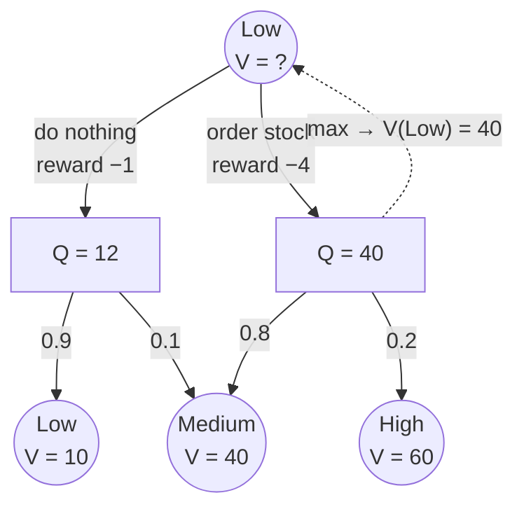

---
aliases:
  - Bellman Equations
  - Bellman Optimality Equation
  - Bellman Expectation Equation
  - Bellman Backup
  - Bellman Update
  - Bellman Operator
  - Bellman Recursion
  - Bellman Error
  - Bellman Residual
tags:
  - planning
  - reinforcement-learning
  - decision-sciences
  - fundamentals
---
> [!ABSTRACT] 🧠 Recall
> **In one line:** *The value of here = the reward for one step + the (discounted) value of wherever that step lands you.* A consistency rule that the true values must satisfy — and every RL algorithm is a way of enforcing it.
> **Metaphor:** The signpost rule from [[Dynamic Programming]]: your sign must equal *one leg* plus *the next sign along*.
> **Where it bites:** Value iteration, TD error, the Q-learning target, the DQN loss — they're all this equation with different bits estimated.

---
A shop. Stock is `Low`, `Medium` or `High`. You already know how good each of those situations is in the long run:

$$V(\text{Low}) = 10 \qquad V(\text{Medium}) = 40 \qquad V(\text{High}) = 60$$

You're in `Low`, and you're deciding whether to **do nothing**. If you do nothing, you lose a sale today (−1), and tomorrow you'll still be `Low` with probability 0.9, or drift up to `Medium` with probability 0.1.

~={blue}What is "do nothing" *worth*?=~ You have everything you need. Try it before reading on.

---
# The signpost rule 🪧

$$\underbrace{-1}_{\text{today}} + \underbrace{0.9 \times 10}_{\text{stay Low}} + \underbrace{0.1 \times 40}_{\text{drift to Medium}} = \mathbf{12}$$

And **ordering stock** (costs 4 today; lands you in `Medium` 80% of the time, `High` 20%):

$$-4 + 0.8 \times 40 + 0.2 \times 60 = \mathbf{40}$$

(That's with $\gamma = 1$ to keep the arithmetic clean.) So: order. And the value of being in `Low`, *if you act sensibly*, is 40.

Look at what you did. You never imagined next week, or next month. You took **one step** of reward, then a **weighted average of numbers you already had**. Everything after tomorrow was already folded into the 10, the 40 and the 60.

> [!NOTE] The Bellman equation
> $$V(s) = \max_a \Big[\, R(s,a) + \gamma \sum_{s'} P(s' \mid s,a)\, V(s') \,\Big]$$
> In words: *value of here = best over actions of (immediate reward + discounted average value of where I land).* It turns "sum an infinite future" into "one step, plus a lookup". ^bellman-eq

> [!SUCCESS] Core idea
> ~={pink}The future is infinite and branching — but you never have to look at it, because your neighbour's value already contains it.=~ See [[Decision Sciences#^bellman-intuition|the chapter]] and [[Markov Decision Process#^bellman-is-everything|the MDP note]]. ^bellman-core

---
# Four versions, and they're easy to mix up

Two independent switches: are you scoring **states** or **state–action pairs**, and are you evaluating a **given policy** or the **best possible** one?

| | **for a given policy $\pi$** — *expectation* | **for the best policy** — *optimality* |
|---|---|---|
| **$V$** (states) | $V^\pi(s) = \sum_a \pi(a \mid s)\,[\,R + \gamma \sum_{s'} P\, V^\pi(s')\,]$ | $V^*(s) = \max_a [\,R + \gamma \sum_{s'} P\, V^*(s')\,]$ |
| **$Q$** (state–actions) | $Q^\pi(s,a) = R + \gamma \sum_{s'} P \sum_{a'} \pi(a' \mid s')\, Q^\pi(s',a')$ | $Q^*(s,a) = R + \gamma \sum_{s'} P \max_{a'} Q^*(s',a')$ |

The only difference between the columns: **average over what the policy does** vs **take the max**. That's the same [[Hidden Markov Model#^sum-vs-max|sum-vs-max]] switch as forward vs Viterbi. The shop sums above *are* the $Q$ row: $Q(\text{Low}, \text{nothing}) = 12$, $Q(\text{Low}, \text{order}) = 40$, and $V^*(\text{Low}) = \max = 40$.

---
# Why just *iterating* it works

Guess any values at all. Apply the right-hand side to every state. Repeat. It converges — to the true values, from any starting guess. Why?

Because each application pulls any two guesses **closer together by a factor of at least $\gamma$**. The error can't grow; it can only shrink geometrically. (Formally: the Bellman operator is a *contraction*.)

![[bellman_contraction.png]]
> [!TIP] Reading the chart
> Straight lines on a log axis = geometric shrinkage, hugging the $\gamma^k$ bound. With $\gamma = 0.5$ the error is below 0.001 in **12 sweeps**. With $\gamma = 0.9$: **85**. With $\gamma = 0.99$: not within 120 — it'd take ~1,000. ~={red}A far-sighted agent is a slow-converging one=~ — see [[Discount Factor]].

---
# Everything is this equation with something estimated

| Method | What it does to the Bellman equation |
|---|---|
| [[Value and Policy Iteration\|Value iteration]] | applies it exactly, to every state, using the known $P$ and $R$ |
| [[Temporal Difference Learning\|TD learning]] | replaces the $\sum_{s'} P$ with **one sampled** next state. The **TD error** is how badly the equation is violated *on that sample* |
| [[Q-Learning]] | the sampled **optimality** version for $Q$ |
| [[DQN]] | minimises the squared violation — the **Bellman error** — with a neural net |
| [[LQR]] | solves it in closed form; there it's called the *Riccati equation* |

> [!WARNING] It's a condition, not an algorithm
> This is the mix-up worth avoiding. The Bellman equation doesn't *tell you how* to find the values. It's a **test the right values pass** — "my number equals one step plus my neighbour's number". Algorithms differ only in how they push a table or a network toward passing it. That's why there are so many of them and why they all feel related. ^condition-not-algorithm

---
---
#### 🖼️ One backup: look one step ahead, then read the numbers

---
> [!SUCCESS] If you remember one thing
> **Value of here = one step + value of there.** ~={pink}Every method in RL is a different way of making that sentence true=~ — exactly when you know the model, approximately and from samples when you don't.

---
# ⁉️
Iterating Bellman means touching **every state**, again and again. Three stock levels is nothing. But how many states does a *real* problem have — and how fast does that number grow?

→ [[Curse of Dimensionality]]
