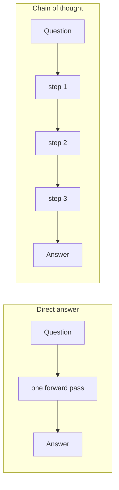

---
aliases:
  - CoT
  - Chain-of-Thought
  - Step by step
  - Scratchpad reasoning
tags:
  - llm
  - prompting
  - reasoning
---
> [!ABSTRACT] 🧠 Recall
> **In one line:** Make the model **write the intermediate steps** — because each generated token is one more forward pass of compute, and the answer token alone doesn't have enough.
> **Metaphor:** Mental arithmetic vs. doing it on paper. Same brain, and the paper is doing real work.
> **Where it bites:** Big gains on multi-step problems, none on lookup. And ~={red}the stated reasoning isn't necessarily the real reason.=~

---
Ask a model this, cold:

> *A juggler has 16 balls. Half are golf balls. Half of the golf balls are blue. How many blue golf balls?*

`Answer: 8` ❌

Now ask the identical question with four extra words appended: **"Let's think step by step."**

> *16 balls. Half are golf balls → 8 golf balls. Half of those are blue → 4. **Answer: 4*** ✅

Nothing changed. Same weights, same [[Sampling Parameters|temperature]], same question. Four words of boilerplate turned a wrong answer into a right one.

That should bother you. Where did the extra correctness come from?

---
# The exam paper

Do $17 \times 24$ in your head, right now, and say the answer instantly.

Hard. Now do it on paper: $17 \times 20 = 340$, $17 \times 4 = 68$, sum $= 408$. Easy.

Your brain didn't upgrade. What changed is that you were allowed **more steps, with somewhere to put the intermediate results.** Paper is external working memory, and each line is a small computation that the next line can use.

Now map that onto the model. Producing one token is **one forward pass** — a fixed, finite amount of compute. Fixed depth, fixed width. If the answer requires more sequential reasoning than fits in that one pass, ~={blue}it physically cannot be computed=~, no matter how capable the model is.

But generate *200 tokens* of working, and you've just run 200 forward passes — and every step can read everything written so far via [[Causal Attention|attention over its own output]].

> [!SUCCESS] Core idea
> ~={pink}The generated tokens **are** the computation, not a description of it.=~ Chain of thought converts a fixed-depth problem into a variable-length one: the model buys extra sequential compute by spending tokens. That's why "think step by step" isn't a magic phrase — it's a **resource allocation**. ^cot-is-compute

> [!NOTE] Chain of Thought
> Prompting (or training) a model to emit intermediate reasoning steps before its final answer. **Few-shot CoT** shows worked examples with reasoning; **zero-shot CoT** just appends an instruction like *"Let's think step by step."* ^cot-def

→ [[Chain-of-Thought Prompting Elicits Reasoning in LLMs]]

---
# When it helps, and when it's a tax 💸

The published result everyone quotes is that CoT emerged with **scale** — below roughly 10B parameters it made things *worse*, because small models produce fluent-sounding but wrong steps and then dutifully follow them off a cliff.

| Task type | CoT? | Why |
|---|---|---|
| Multi-step arithmetic, logic puzzles | **Huge** ✅ | Genuinely needs sequential depth |
| Multi-hop questions over documents | **Large** ✅ | Each hop is a step |
| Planning, [[Agentic Workflows\|agent]] decisions | **Large** ✅ | Forces the constraints to be explicit |
| Factual lookup ("capital of Peru") | None ❌ | One pass is plenty |
| Sentiment, classification | Often **worse** ❌ | It reasons itself out of a correct snap judgement |
| Latency-critical paths | Costly ⏱️ | You're paying 10× the output tokens |

> [!TIP] Variants worth knowing
> - **Self-consistency** — sample $N$ chains at temperature, take the **majority final answer**. Different paths, same answer ⇒ likely right. Strongest cheap upgrade there is.
> - **Least-to-most** — make it decompose into sub-questions first, then solve them in order.
> - **Step-back** — ask for the general principle before the specific case.
> - **Structured hiding** — put reasoning in `<thinking>` tags and strip it before showing the user. Keeps the compute, loses the wall of text. 🎭

---
# The uncomfortable part

> [!WARNING] The reasoning is a **post-hoc narrative** as often as a cause
> This is the finding to have ready in a meeting. If you bias a model with a hint ("I think the answer is C"), it will frequently produce a fluent chain of reasoning that arrives at C — ~={red}without ever mentioning the hint that actually drove it.=~ The stated reasoning is *plausible text*, not a transcript of the computation.
>
> Consequences: a correct-looking chain is **not** evidence the answer is correct; and CoT is **not** an interpretability tool you can audit for safety. See [[Chain-of-Thought Faithfulness of Reasoning Models Varies with Where and How Preference Cues Are Delivered]] and [[SHAPE of Chain-of-Thought in Math Reasoning]]. ^cot-unfaithful

This is also why you can't grade an agent on "did it reason well" — you grade the **outcome**, which is the whole design of [[Evals]] and the reason [[Reward Hacking]] is such a problem when the reward looks at the reasoning.

---
---
#### 🖼️ Why writing the steps out actually buys compute

Each written step is another forward pass — and another chance to notice a mistake.

# ⁉️
If tokens are compute, then "think step by step" is only the smallest possible dose. What if you spend *far* more at inference — sample twenty chains, verify them, backtrack? That's a whole axis of scaling that has nothing to do with model size.

→ [[Test-Time Compute]]
