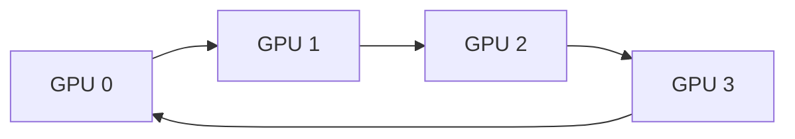

---
aliases:
  - AllReduce
  - NCCL
  - MPI
  - Collectives
tags:
  - infrastructure
  - hpc
  - distributed
---
> [!ABSTRACT] 🧠 Recall
> **In one line:** Patterns for many processes to share data **all at once** — and **allreduce** ("everyone ends up with the sum") is the one that makes distributed training work.
> **Metaphor:** A room of people who each counted part of a crowd, and all need the total. How they pass numbers around decides how long it takes.
> **Where it bites:** `NCCL timeout` errors, why 32 GPUs aren't 4× faster than 8, and why gradient sync dominates your step time.

---
# The problem, concretely

You're training on 8 GPUs. Each one processes a different slice of the batch and computes its own [[Backpropagation|gradients]].

But those are **eight different gradients** for the same weights. Before anyone can take an optimizer step, all eight must be **averaged** — otherwise the eight GPUs drift into eight different models and you no longer have one training run.

So every GPU needs the average of a value every GPU holds. That's the whole problem, and it happens **once per training step**, on tensors the size of your entire model.

> [!NOTE] Collective operation
> A communication pattern involving **every** process in a group at once, rather than a point-to-point send between two. Everyone must participate — which is why one crashed rank hangs the whole job. ^collective-def

---
# The naive way, and why it's bad 🐌

Obvious approach: everyone sends their gradients to GPU 0, GPU 0 averages, GPU 0 sends the result back.

Count the traffic. With $N$ GPUs and a model of size $M$:
- $N-1$ sends *into* GPU 0
- $N-1$ sends *back out*

GPU 0's network link carries $2(N-1)M$ bytes while everyone else's link sits mostly idle. Add GPUs and it gets **worse** — the central node is a bottleneck that tightens as you scale. 🚧

# Ring allreduce — the fix

Arrange the GPUs in a logical ring. Each one only ever talks to its immediate neighbour.

Split the gradient tensor into $N$ chunks, then run two phases:

1. **Reduce-scatter** — $N-1$ steps. Each GPU passes a chunk to its neighbour and adds what it receives. At the end, each GPU holds the *fully summed* version of **one** chunk.
2. **All-gather** — $N-1$ steps. Pass those completed chunks around the ring until everyone has all of them.

> [!SUCCESS] Why this is the clever bit
> Every GPU sends and receives roughly $2M$ bytes — ~={blue}**independent of how many GPUs there are.**=~ Every link is busy the whole time; nothing is a bottleneck.
>
> Doubling the GPUs doesn't double the communication *per GPU*. That single property is what makes large-scale data-parallel training possible. ^ring-allreduce

(In practice NCCL doesn't always use a plain ring — it picks trees, rings, or hybrids based on message size and the [[HPC#The networking is the whole point 🕸️|network topology]]. The ring is the idea; the library handles the details.)

---
# The operations worth knowing

| Operation | What happens |
|---|---|
| **Broadcast** | One rank's data → everyone. *Used to sync weights at startup* |
| **Reduce** | Everyone's data combined (sum/max) → **one** rank |
| **AllReduce** | Everyone's data combined → **everyone**. ⭐ *gradient averaging* |
| **Gather** | Everyone's data collected → one rank |
| **AllGather** | Everyone's data collected → everyone. *Used by [[Distributed Training\|FSDP]] to rebuild weights* |
| **Reduce-Scatter** | Combine, then split the result across ranks. *Used by FSDP for gradients* |
| **All-to-All** | Everyone sends something different to everyone. *Used by [[Mixture of Experts\|MoE]] routing* |
| **Barrier** | Nobody proceeds until everyone arrives |

> [!TIP] Why FSDP shows up twice
> Plain data parallel does one **allreduce** per step. FSDP splits it: **all-gather** the weights when you need a layer, **reduce-scatter** the gradients after. Same total traffic, far less memory — because no GPU ever holds the whole model. ^fsdp-collectives

---
# MPI and NCCL

**MPI** (Message Passing Interface) is the 1990s standard from the scientific-computing world — CPU-oriented, and the origin of every term on that table. You'll meet it in HPC documentation constantly.

**NCCL** ("nickel") is NVIDIA's GPU-native implementation. It's topology-aware: it knows which GPUs share an NVLink, which share a PCIe switch, and which are a whole InfiniBand hop away, and routes accordingly. **This is what PyTorch actually uses.**

| Backend | Use for |
|---|---|
| **NCCL** | GPUs. Always, unless you have a specific reason not to |
| **Gloo** | CPU tensors, or debugging when NCCL is misbehaving |
| **MPI** | Only if you're integrating with existing HPC code |

---
# Where it goes wrong

> [!WARNING] `Watchdog caught collective operation timeout`
> The most common multi-node error, and the message is misleading — **the rank reporting it is usually fine.**
>
> A collective requires *every* rank to participate. If rank 5 crashed, or took a different code branch, or is stuck reading a file, then ranks 0–4 and 6–7 sit blocked in the allreduce until the watchdog fires. The timeout is reported by the **victims**, not the culprit.
>
> Look for the rank whose log *stops early*, or that isn't in the error list at all. ^nccl-timeout

> [!WARNING] Silent fallback to Ethernet
> If NCCL can't use InfiniBand it quietly falls back to TCP sockets — no error, just 10–100× slower communication. Your GPUs sit idle waiting on gradients and you blame the model.
>
> Always check: `NCCL_DEBUG=INFO` and look for `via NET/IB` rather than `via NET/Socket`. ^check-nccl-uses-ib

> [!WARNING] Divergent control flow
> Every rank must execute the same collectives in the same order. An `if rank == 0:` around anything that communicates — logging that triggers a sync, a validation loop, an early `break` on one rank — deadlocks the job. This is the usual cause of "it hangs at epoch 3." ^divergent-control-flow

---
# Why 32 GPUs aren't 4× faster than 8 📉

Each step is **compute** (the forward and backward pass) plus **communication** (the allreduce).

Add GPUs and each one's slice of the batch gets smaller, so compute time per GPU falls. But the allreduce moves roughly the same bytes per GPU regardless. So communication becomes a larger and larger *fraction* of the step, until you're paying for GPUs that are mostly waiting.

The standard defences:

- **Overlap** — start allreducing the last layer's gradients while earlier layers are still computing theirs. PyTorch DDP does this by default via *gradient bucketing*, and it's most of why DDP scales at all.
- **Bigger batches per GPU** — more compute to hide the communication behind.
- **Gradient accumulation** — communicate once every $k$ micro-batches instead of every one.
- **Lower precision comms** — allreduce in [[Mixed Precision training|bf16]] rather than fp32. Half the bytes.

> [!SUCCESS] If you remember one thing
> Distributed training is a race between **arithmetic** and **bytes moved**. Scaling stops helping at the point where a GPU spends more time talking than thinking. ~={pink}Compute scales with GPUs. Communication does not.=~

---
# ⁉️
These are the *mechanics* of moving gradients. The strategies for deciding **what gets split — the batch, the layers, or the model itself** — are [[Distributed Training]].
