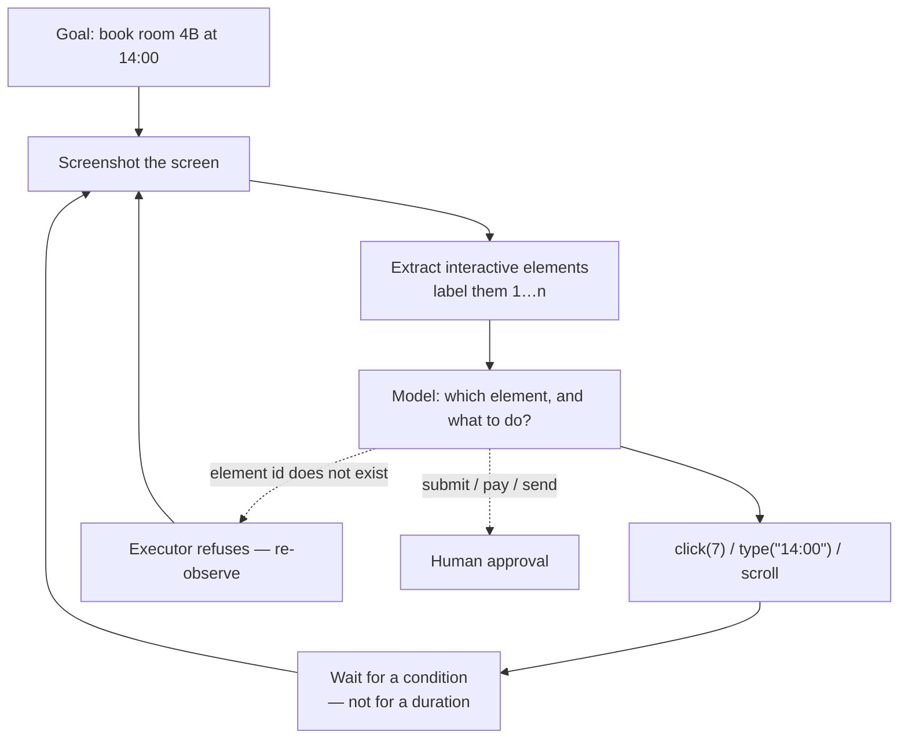

---
aliases:
  - Browser Agent
  - GUI Agent
  - Computer-Using Agent
  - Browser Use
  - Screenshot Loop
tags:
  - llm
  - agents
  - architecture
---
> [!ABSTRACT] 🧠 Recall
> **In one line:** Give the model a **screenshot** and let it reply with `click(x, y)` and `type("…")` — the universal interface, and the slowest, most brittle and most expensive one you own.
> **Metaphor:** Guiding your dad through a website over the phone. "The blue button. No — the *other* blue button."
> **Where it bites:** It's a last resort, not a strategy. Reach for it only when there is genuinely no API, no CLI and no DOM.

---
Your operations team books meeting rooms in an intranet system from 1998. No API. No export. No vendor on the planet still supports it. It is a set of frames, a Java applet, and a submit button.

So you point a model at a screenshot of it. Every step looks like this:

```
→ screenshot (1280×800)          ≈ 1,450 image tokens, 0.4 s to capture
→ model reads it, replies        3.1 s
   {"action":"click","x":412,"y":638}
→ executor moves and clicks      0.3 s
→ wait for the page to settle    1.0 s
                                 ─────
                                 4.8 s per step
```

Booking one room takes 26 steps. **Two minutes** and roughly **38,000 image tokens** for a form a human fills in forty seconds.

And at step 19, a "your session will expire" modal appears over the button. The model clicks at (412, 638) anyway, because that's where the button *was* in the screenshot it was reasoning about.

~={blue}It isn't acting on the screen. It's acting on a photograph of the screen, taken three seconds ago.=~

---
# On the phone to your dad

You're on the phone talking your father through a website. You can't see his screen; he describes it, you say what to do, and there's a pause each way.

![[computer_use_phone_guidance.png]]

Everything that makes this hard is in that call:

- **The round trip is enormous** relative to the action. "Click the blue button" takes four seconds to deliver and a hundred milliseconds to perform.
- **Reference is ambiguous.** "The blue button" — there are two. You meant top-right. He clicked the other one and is now in the archive.
- **The world moves between frames.** A cookie banner appeared while you were talking. Your instruction was about the page underneath it.
- **You can't see the result until he tells you**, so every mistake costs a full round trip to even *notice*.

Now the important part: none of this is a model-quality problem. Give the dad perfect eyesight and you've changed nothing. ~={blue}The cost is in the loop, not in the eyes.=~

> [!NOTE] Computer use
> An agent loop where the **observation is a rendered screen** (a screenshot, sometimes plus an accessibility tree) and the **actions are human input primitives**: click at a coordinate, type, scroll, key press, drag. It works on anything a person can use, which is exactly why it's slow — the interface was designed for eyes and hands. ^computer-use-def

> [!SUCCESS] Core idea
> Every other integration reads *structure*; this one reads **pixels**. That's the trade in one line: ~={pink}universal coverage bought with a 5-second control loop, a grounding problem, and no error signal until the next frame.=~ Use it exactly where the coverage is the point. ^pixels-vs-structure

---
# The ladder — take the highest rung available 🪜

| Rung | Interface | Per step | Reliability | Verdict |
|---|---|---|---|---|
| **API** | JSON in, JSON out | ~200 ms | Deterministic | **Always, if it exists.** See [[Tool Use]] |
| **CLI / SDK** | Text | ~300 ms | Deterministic | As good as an API, usually |
| **DOM / Playwright** | Selectors, accessibility tree | ~0.6 s | Breaks when the markup changes | **The right default for web** 🥇 |
| **Accessibility tree + vision** | Labelled elements *and* the picture | ~3 s | Grounding mostly solved | Best of the two vision options |
| **Pure pixels + coordinates** | Screenshot only | ~5 s | ~={red}Brittle=~ | Legacy desktop apps, canvas UIs, last resort |

The jump worth knowing is from **coordinates** to **labelled elements**. Instead of asking the model for `(412, 638)`, extract the interactive elements first, draw numbered boxes over them, and let it reply `click(7)`. You've turned a continuous regression problem into a small classification problem — and the executor can then refuse an id that doesn't exist, which a coordinate can never be checked against.

That's the whole of the **grounding problem**: not "what should I do" but "which pixel is the thing I decided to do."

---
# The bill 💸

Screenshots are the expensive part and they're invisible on the invoice because they're billed as input tokens.

```
1280×800 screenshot        ≈ 1,450 image tokens
26-step booking            ≈ 37,700 tokens of images alone
           at $3/M input   ≈ $0.11 per booking, just to look
100 bookings/day           ≈ $11/day → ~$4,000/year to read one screen
```

And that's the *floor*: if the whole transcript of screenshots is re-sent every step — the default in a naive loop — the run is quadratic in steps and you're at dollars per booking. **Keep only the latest screenshot plus a text summary of the earlier ones.** This is [[Context Engineering]] with a 1,450-token-per-turn appetite.

> [!TIP] Three changes that do most of the work
> 1. **Halve the resolution** until the text is still readable. Tokens scale with area, so 960×600 is ~45% cheaper per frame.
> 2. **Drop stale screenshots** from context — keep the current frame and a one-line description of each previous one.
> 3. **Wait for a *condition*, not a duration.** `sleep(1)` is a guess; "wait until the network is idle / this element exists" removes the single biggest source of clicking into a page that hasn't finished rendering. ⏱️

> [!WARNING] The screen is untrusted input, at full bandwidth
> A web page can contain text addressed to your agent — in a comment, in alt text, in white-on-white type, in an image. The model reads the page as one undifferentiated observation, exactly as it reads your instructions. This is [[Prompt Injection]], and computer use is its best-ever delivery mechanism because *the whole interface is attacker-renderable*.
>
> Three non-negotiables: **a fresh browser profile with no real cookies or saved passwords** (never point it at your logged-in Chrome), **an allowlist of domains**, and **[[Human in the Loop|human approval]] for anything that submits, pays or sends**. And run it in a [[Sandboxing|sandbox]] — the browser is code execution with a nicer icon. ~={red}A computer-use agent with your session cookies is your session, operated by whoever writes the best paragraph.=~ ^screen-is-untrusted

**Where it genuinely is the right answer:** legacy internal systems with no API, vendor portals that will never build one, QA and regression testing of your own UI, and one-off scrapes not worth an integration. Everywhere else, the 40 minutes spent finding the API pays for itself in the first hundred runs.

Related: [[Agentic Workflows]] for the loop, [[Sandboxing]] for containment, [[Agent Evaluation]] for grading a 26-step trajectory, and [[Cost and Latency]] for why the step count is the only number that matters.

---
---
#### 🖼️ Look, decide, act, wait — and everything you know is one frame old



---
> [!SUCCESS] If you remember one thing
> ~={pink}Take the highest rung that exists: API, then CLI, then DOM, then pixels.=~ Computer use buys universal coverage with a five-second control loop and no error signal until the next frame.

---
# ⁉️
Ten notes of agent mechanics — loops, plans, retrieval, state, containment — and every one of them is something you'd otherwise write by hand. At some point a library offers to write them for you, and the first question is what that abstraction is actually buying.

→ [[LangChain]]
