---
aliases:
  - In-flight Batching
  - Dynamic Batching
  - Iteration-level Scheduling
tags:
  - llm
  - inference
  - serving
  - performance
---
> [!ABSTRACT] 🧠 Recall
> **In one line:** Schedule at the level of **one decode step**, not one request — a finished sequence leaves the batch immediately and a queued one takes its slot.
> **Metaphor:** A bus that stops wherever you like and picks up new passengers at every corner, instead of a coach that waits for the whole group and only unloads at the terminus.
> **Where it bites:** 10–20× throughput over static batching. It's the main reason vLLM/TGI exist.

---
You're serving a model with static batching, batch size 8. Eight requests arrive. Their output lengths turn out to be:

```
req 1:   12 tokens   ✅ done at step 12 ... then waits
req 2:   20 tokens   ✅ done at step 20 ... then waits
req 3:   35 tokens
...
req 8: 2,000 tokens  🐢
```

The batch runs until the **longest** one finishes: 2,000 steps.

So from step 20 onward, seven of your eight slots are computing **padding**. Request 9 is sitting in the queue, ready to go, while the GPU burns 2,000 steps to produce one sequence at 1/8th occupancy.

What fraction of that run did useful work? Roughly the average length over the max — here under **5%**.

Why are we waiting at all?

---
# The coach vs the bus

**Static batching is a coach tour.** Everyone boards at the depot. Nobody gets off until the last stop, even if their hotel was the second one. New passengers wait at the depot for the next coach.

**Continuous batching is a city bus.** It stops at every corner. You get off when you arrive. Someone else gets on in your seat. The bus is nearly full the whole route.

The unit of scheduling changed from **"a journey"** to **"a corner"**.

> [!NOTE] Continuous batching
> Also called *in-flight batching* or *iteration-level scheduling*. The scheduler runs **once per forward pass**: sequences that emitted an end-of-sequence token are evicted, waiting requests are admitted into the free slots, and the next decode step runs over whatever is currently resident. ^continuous-batching-def

> [!SUCCESS] Core idea
> It works because [[Prefill and Decode#^decode-def|decode is memory-bound]]. ~={blue}You must read all 140 GB of weights to generate one token — so you may as well generate 64 tokens from that same read.=~ Batching is nearly free throughput: the weight traffic is paid once and shared. ~={pink}Bigger batch = more arithmetic per byte moved = higher GPU utilisation.=~ ^why-batching-is-free

---
# What it costs, and what makes it possible

Two things had to be solved before per-step scheduling was practical:

**1. Memory has to be dynamic.** If you pre-reserve each slot's [[KV Cache]] for the maximum possible length, you can't fit many slots and you can't hand a slot over cleanly. This is precisely what **PagedAttention** fixed — small blocks, allocated on demand → [[Efficient Memory Management for LLM Serving with PagedAttention (vLLM)]].

**2. Prefill has to be interleaved.** A new arrival needs a prefill, which is a big compute-bound chunk that stalls everyone's decode. That's the **chunked prefill** trick from [[Prefill and Decode]] — slice it up and mix it in.

| | Static batching | Continuous batching |
|---|---|---|
| Schedules per | request | **decode step** |
| Slot freed when | the whole batch finishes | *that* sequence finishes ✅ |
| GPU occupancy | collapses as sequences finish | stays near full |
| New request waits | for the next batch | for the next **step** (ms) |
| Needs | nothing | paged KV + a scheduler |

---
# The dial you actually turn ⚖️

Raising concurrency doesn't make any single request faster — it makes each one *slightly slower* (more sequences sharing each step) while making the system serve far more of them.

> [!WARNING] Throughput and latency pull in opposite directions
> Push max-batch-size up and your **tokens/sec/GPU** (your $/token) improves while **per-user tokens/sec** degrades. You cannot optimise both. Decide which one your product sells:
> - **Interactive chat** → cap the batch, protect inter-token latency
> - **Bulk/offline jobs** → max the batch, protect cost
> There's also a stability trap: admit too many and you run out of KV memory mid-generation, forcing the scheduler to **preempt and recompute** sequences — a latency cliff, not a slope. ~={red}Watch the preemption counter, not just utilisation.=~ ^throughput-latency-dial

See [[ML Infrastructure]] for the surrounding serving stack.

---
---
#### 🖼️ Why the old way wasted the GPU

```mermaid
gantt
  title Static batching — everyone waits for the slowest
  dateFormat X
  axisFormat %s
  section Static
  req A (short) :done, 0, 3
  req A idle    :crit, 3, 10
  req B (long)  :done, 0, 10
  section Continuous
  req A (short) :done, 0, 3
  req C slots in:active, 3, 9
  req B (long)  :done, 0, 10
```


In static batching a finished request sits there burning a slot. Continuous batching evicts it the moment it's done and drops a waiting request into the gap.

# ⁉️
Batching wins by getting *more sequences* out of one weight-read. There's a second way to play the same trick: get **more tokens of a single sequence** out of one weight-read.

→ [[Speculative Decoding]]
