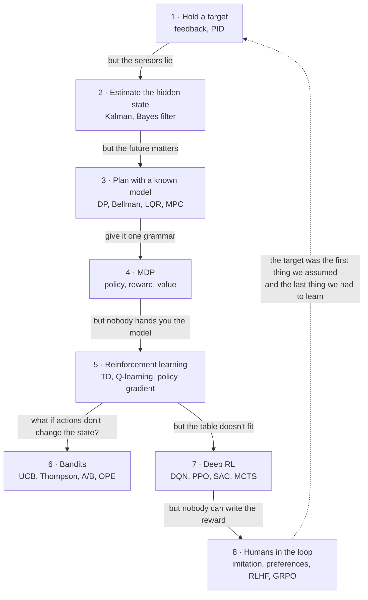

---
aliases:
  - MOC - Decision Sciences
  - MOC - Control and RL
  - Decision Sciences Map
  - Control and RL
  - Control Theory
  - Sequential Decision Making
  - Decision Making Under Uncertainty
tags:
  - moc
  - decision-sciences
  - control-theory
  - reinforcement-learning
---
> [!ABSTRACT] 🧠 Recall
> **In one line:** The map — follow **one loop** (*sense → decide → act*) while the assumptions get taken away one at a time, and every term in control, estimation, planning, RL and bandits lands in the place it belongs.
> **Metaphor:** A car that grows up. Cruise control → a speedometer that lies → a route to plan → learning to drive → guessing what the passenger actually wants.
> **Where it bites:** Use this page to *find* the note. Read [[Decision Sciences]] for the *story*. Use the chain at the bottom to read them in order.

---
**Control theory** is the study of making a system behave the way you want it to, when the world won't cooperate.

You have something you're trying to hold steady, or steer somewhere. A room at 20°. A car at 60 mph. A rocket on a trajectory.

And you have something you can push on. A heater. A pedal. A thruster.

The gap between where you are and where you wanted to be is called the **error**. And essentially every idea on this page is a different answer to one question: *given the error, what do I push, and by how much?*

Let's start with the simplest possible answer.

A thermostat holds a room at 20°.
It reads the temperature.
It compares that reading to 20.
Colder? Turn the heat on. Warmer? Turn it off.

That's the entire algorithm.

Now notice what the thermostat does **not** have. It has no model of the room. It doesn't know how big the room is, whether the window is open, or how cold it is outside. It has never heard of physics, and it certainly has never heard of probability.

And yet it works. ~={blue}Feedback buys you competence without understanding.=~

Here's the part worth sitting with. A language model gets a little more polite because ten thousand people clicked 👍 on the polite answers. Measure, compare with what you wanted, adjust. Again and again.

That's the same machine as the thermostat.

Between those two sits about a century of people discovering, over and over, that the loop was too simple — and **every term in this field is the name of one assumption being taken away, or the name of what breaks when it goes.**

So rather than a glossary, let's follow the loop.

(If you'd rather have this as a story with the history in it, that's [[Decision Sciences]]. This page is the map.)

---
# 1. Hold a target

*The car: cruise control. Keep 60 mph, whatever the hill does.* — story: [[Decision Sciences#1. The first instinct: feedback before intelligence|Chapter 1]]

The thermostat above is on/off — full heat or no heat. That works for a room, because rooms are slow and nobody minds a degree of wobble.

It does not work for a car. Full throttle or no throttle, over and over, is not a pleasant drive. You want the *size* of the correction to match the *size* of the error.

→ **[[Feedback Loop]]** — an open loop has to be right in advance; a closed loop is allowed to be wrong and then recover. **Start here.**
→ **[[PID Controller]]** — react to the error **now** (P), the error **so far** (I), and where it's **heading** (D).
→ **[[Step Response]]** — poke the system once and read four numbers off the result: how fast, how far past, how long it rings, where it settles.
→ **[[Stability]]** — a strong reaction plus stale information equals oscillation. Nothing is broken; the *loop* is.
→ **[[PID Tuning]]** — P first, then I, then D, one knob at a time. And any integrator plus any limit equals **windup**.
→ **[[Feedforward Control]]** — if you can see the hill coming, don't wait for the error to appear. Act first, then correct what's left.
→ **[[Transfer Function]]** — calculus turned into algebra, so you can *prove* the loop is stable instead of testing it.

---
# 2. The sensors lie

*The car: the speedometer jitters and the GPS is ten metres out.* — story: [[Decision Sciences#2. Reality intrudes: noise, partial observation|Chapter 2]]

Everything in section 1 assumed you can *measure* the error. You usually can't — not exactly.

Your sensor is noisy. Or it's slow. Or it measures something next to the thing you actually care about. So now you have two different quantities: the **state** (what's really going on, which is hidden) and the **observation** (the smudged version you get to see).

→ **[[State-Space Model]]** — two equations. One says how the hidden state moves; the other says what you get to observe of it.
→ **[[Kalman Filter]]** — blend your prediction with your measurement, weighting each by how much you trust it.
→ **[[Bayes Filter]]** — the general heartbeat underneath: *predict* (you know less), then *update* (you know more). Kalman, HMM and particle filters are all costumes over this.
→ **[[Beliefs]]** · **[[Uncertainty]]** — stop storing a number. Store a guess **and how wide it is**.
→ **[[Observability]]** — if something leaves no trace in your data, no algorithm will ever recover it. That's plumbing, not tuning.
→ **[[Extended Kalman Filter]]** — curves break bell curves. Either flatten the curve (EKF) or sample it (UKF).
→ **[[Particle Filter]]** — hold your belief as thousands of separate guesses. The only one here that can say "it's *here* **or** *there*".
→ **[[Hidden Markov Model]]** — the same filter when the hidden state is a label rather than a number. Sum to track, max to decode.

---
# 3. The future matters

*The car: motorway or back road? The quicker first leg is the slower trip.* — story: [[Decision Sciences#3. Decisions become mathematical|Chapter 3]]

Sections 1 and 2 are both reactive. Something happens, you respond.

But some decisions only make sense if you look ahead. Taking the fast road now can drop you into a jam in ten minutes. The best *first* move is not always the move that looks best right now.

The obvious approach is to check every possible sequence of moves. That blows up immediately — ten decisions with two options each is already a thousand paths.

The trick that saves you is to start at the **end** and work backwards.

→ **[[Dynamic Programming]]** — start at the finish, label every junction with "the best I can do from here", and never solve the same sub-problem twice.
→ **[[Bellman Equation]]** — *the value of here = one step + the value of there.* It's a condition, not an algorithm.
→ **[[Curse of Dimensionality]]** — every variable you add **multiplies** the size of the table. Bellman named it himself.
→ **[[LQR]]** — a linear world plus a quadratic bill means the optimal policy is just a constant gain. State your priorities; the gains fall out of the maths.
→ **[[Model Predictive Control]]** — plan N steps ahead, take one step, then re-plan from scratch. The only method here that respects hard limits.
→ **[[System Identification]]** — every planner needs a model of the world. Poke the system and fit one.

---
# 4. One grammar for all of it

*The car, formalised: states, actions, odds, rewards.* — story: [[Decision Sciences#4. The unifying abstraction|Chapter 4]]

By now there are a lot of separate ideas floating around. This section is where they all get written in one notation.

Five things: where you can be, what you can do, what happens when you do it, what you get paid, and how much you care about later versus now.

→ **[[Markov Property]]** — "the present is enough". It's not a fact about the world; it's something you *design into* your state.
→ **[[Markov Decision Process]]** — $(S, A, P, R, \gamma)$. And the thing that trips everyone up: an action doesn't pick the outcome, it picks the **odds**.
→ **[[Policy]]** — a satnav, not a list of directions. It has an answer for *every* state, including the ones you didn't plan for.
→ **[[Reward Function]]** — it says **what**, never **how**. The agent does what you pay for, not what you meant.
→ **[[Discount Factor]]** — your horizon is roughly $1/(1-\gamma)$. Changing it changes *which problem* you're solving.
→ **[[Value Function]]** — a forecast of total future reward. $V$ scores a place, $Q$ scores a move, and the advantage scores "better than usual".
→ **[[Value and Policy Iteration]]** — evaluate, then improve, then evaluate again. That dance is the skeleton of every RL algorithm.
→ **[[Credit Assignment]]** — one score arrives late, after five thousand decisions. Which of them earned it?
→ **[[POMDP]]** — if you can't see the state, your **belief** becomes the state. And sometimes the best move is simply to go and look.

---
# 5. Nobody hands you the model

*The car: a learner driver. No equations — just trying things, and consequences.* — story: [[Decision Sciences#5. Reality intrudes again: the model is unknown|Chapter 5]]

Everything in section 3 assumed you know the rules — what your actions do, and what they pay.

In most real problems you don't. So you have to find out by trying.

→ **[[Reinforcement Learning]]** — no labels, feedback arrives late, and you generate your own training data by acting. **Start here.**
→ **[[Model-Based vs Model-Free RL]]** — learn the **map**, or just learn the **habits**. ("Model" here means a model *of the environment*, not a neural network.)
→ **[[Monte Carlo Methods]]** — can't compute it? Sample it and average. The error falls as $1/\sqrt{N}$ no matter how many dimensions you have.
→ **[[Temporal Difference Learning]]** — learn a guess from a guess. The **TD error** is surprise, and surprise turns out to be the whole learning signal.
→ **[[Q-Learning]]** — $Q \leftarrow r + \gamma \max Q'$. It learns the best policy while following a worse one — and it systematically over-estimates.
→ **[[On-Policy vs Off-Policy]]** — "how good is what *I'm* doing?" versus "how good would *that* be?". Walking near a cliff is what decides which you want.
→ **[[Policy Gradient]]** — just do more of whatever worked. The reward can be a black box, which is exactly why LLMs use this family.
→ **[[Actor-Critic]]** — the critic says "that was better than I expected", and that single signal trains both halves.
→ **[[Exploration vs Exploitation]]** — you only ever learn about things you actually try. So explore where you're most **unsure**.
→ **[[Regret]]** — don't ask how much you lost, ask what **shape** the loss has. Linear means you never learned. Logarithmic means you did.

> [!TIP] The escalation ladder — stop at the first rung that works 🪜
> right answers already available → **supervised** · your action doesn't change what comes next → **bandit** · you know the rules → **plan** · you only have logs → **off-policy evaluation / offline RL** · none of the above → **RL**.
> Most problems pitched as RL are rung one or two. ^rl-ladder

---
# 6. When your action doesn't change the world

*The car: which of three coffee stops? Tomorrow's choice is unaffected by today's.* — story: [[Decision Sciences#6. Bandits split off as a special case|Chapter 6]]

Take the MDP from section 4 and delete one thing: the idea that your action changes what you face next.

Every round looks the same as the last. Nothing carries over.

That sounds like a toy, but it's most of the decisions a company actually makes — which headline, which price, which layout. And once the state is gone, the *only* remaining problem is exploration. Which turns out to be solvable.

→ **[[Multi-Armed Bandit]]** — RL with no state at all. Only exploration is left.
→ **[[Upper Confidence Bound]]** — the average so far, plus a bonus for how ignorant you still are. Optimism is self-correcting: you either win, or you learn.
→ **[[Thompson Sampling]]** — sample one plausible version of the world and act as if it's true. The exploration rate tunes itself.
→ **[[Contextual Bandit]]** — "best for **whom**?" Supervised learning, except you only ever see the label for the option you picked.
→ **[[AB Testing]]** — an A/B test buys certainty about a fact; a bandit buys reward while learning. Different shopping lists.
→ **[[Off-Policy Evaluation]]** — what *would* the new policy have earned, judged only from the old one's logs? Log the propensity or you can't do this at all.
→ **[[Bayesian Optimization]]** — a bandit where the arms are expensive and related. Spend cheap compute deciding where to spend expensive compute.

| If this is your problem | Read this |
|---|---|
| It overshoots / oscillates / flaps | [[Stability]], [[PID Tuning]], [[Step Response]] |
| It never quite reaches the target | [[PID Controller]] (the **I** term), [[Step Response]] |
| It goes wild after being maxed out for a while | [[PID Tuning#^windup-pattern\|integral windup]] |
| My metric / sensor is jittery | [[Kalman Filter]], [[Bayes Filter]] |
| "Can I even estimate this from what I log?" | [[Observability]] |
| A/B test, bandit, or RL? | [[AB Testing]], [[Multi-Armed Bandit]], [[Contextual Bandit]], [[Reinforcement Learning#^rl-escalation-ladder\|the ladder]] |
| Offline metrics up, A/B test flat | [[Off-Policy Evaluation]] |
| I only have logs; I can't experiment | [[Off-Policy Evaluation]], [[Offline RL]] |
| Reward is rare or arrives late | [[Credit Assignment]], [[Reward Function]], [[Temporal Difference Learning]] |
| The agent found a loophole | [[Reward Function]], [[Reward Hacking]] |
| Deep RL training diverges | [[Function Approximation#^deadly-triad\|the deadly triad]], [[DQN]], [[PPO]] |
| Too many states to table | [[Curse of Dimensionality]], [[Function Approximation]] |
| Continuous actions | [[SAC]], [[Policy Gradient]], [[LQR]] |
| Hard limits on the actuator | [[Model Predictive Control]] |
| Nobody can write down the reward | [[Preference Learning]], [[Inverse Reinforcement Learning]], [[RLHF]] |
| Expensive trials, ~20 of them | [[Bayesian Optimization]] |
| Agent only sees part of the state | [[POMDP]], [[Observability]] |

---
# 7. The table doesn't fit

*The car: the state is now a camera image.* — story: [[Decision Sciences#7. Deep learning bends the curve|Chapter 7]]

Everything so far has quietly assumed you can keep a **table** — one row per state, or one row per state-action pair.

Now the state is a camera frame. 84×84 pixels, 256 shades each. The number of possible states is larger than the number of atoms in the observable universe, and you will never visit the same one twice.

So the table has to go. You replace it with a function — a neural network that takes a state and returns a value — and it *generalises*: states it has never seen get a sensible answer because they look like states it has.

That's the blessing. The curse arrives immediately after, and everything in this section is a way of managing it.

→ **[[Function Approximation]]** — generalise instead of tabulating. The blessing, the curse, and the **deadly triad**.
→ **[[DQN]]** — Q-learning + a CNN + two stabilisers. The network was the easy part.
→ **[[Experience Replay]]** — write experience in order; read it back shuffled. Off-policy methods only.
→ **[[PPO]]** — improve the policy, but never by much at once. A gain limiter on a loop that feeds itself.
→ **[[SAC]]** — continuous actions, off-policy, and *paid to stay random*. DDPG → TD3 → SAC.
→ **[[Monte Carlo Tree Search]]** — every node is a bandit. AlphaGo: think at decision time, train on what the thinking found.
→ **[[Offline RL]]** — no way to try things ⇒ **pessimism**. An untried action is a liability.

> [!WARNING] The thing every deep-RL trick is doing
> A learner that trains on its own outputs is a feedback loop, and loops go [[Stability|unstable]]. Frozen target networks, replay buffers, clipped ratios, KL leashes, twin critics — ~={red}each one is a way of making the problem hold still or capping the gain.=~ Section 1 never really left. ^deep-rl-is-loop-stabilisation

---
# 8. Nobody can write down the reward

*The car: a chauffeur. "Drive nicely." What does that even mean?* — story: [[Decision Sciences#8. Humans re-enter the loop|Chapter 8]]

One assumption has survived every section up to here: that somebody can write down the reward.

For a thermostat that's easy — the error is the reward, negated. For a game, the score is right there.

Now try writing the reward function for "drive nicely". Or "be helpful and don't be rude". You can't. Not as an equation.

But people can still *recognise* it. Show someone two drives and they'll tell you which was nicer, even though they could never have written the rule. That comparison is the signal this whole section is built on.

→ **[[Imitation Learning]]** — copy the expert. Works until you drift somewhere they never went. SFT *is* this.
→ **[[Inverse Reinforcement Learning]]** — infer the goal from the behaviour. A reward transfers; a policy doesn't.
→ **[[Preference Learning]]** — people can't score, but they can compare. Only the *gap* between scores is real.
→ **[[RLHF]]** — comparisons → reward model → RL on a [[KL Divergence|KL]] leash.
→ **[[DPO]]** — the algebra that deletes the reward model and the RL loop.
→ **[[GRPO]]** — sample a group, grade on the curve, delete the critic. With rewards a program can check.
→ **[[Reward Hacking]]** — optimisation is an exhaustive adversary against your specification.

---
# 9. More than one driver

One last assumption to remove. Everything above treats the world as a fixed thing you are learning about.

But if the other cars on the road are also learning, the world itself is changing while you learn it. The thing you figured out yesterday may be wrong today, purely because everyone else got better too.

→ **[[Multi-Agent Reinforcement Learning]]** — everyone else is learning too, so the world won't hold still.
→ **[[Dec-POMDP]]** — many agents, each looking through its own keyhole.
→ **[[Value Function Factorization]]** — one team value, split into per-agent values you can act on alone.

---
# The reading order 📖

Each note ends with a `# ⁉️` hook to the next, so the whole thing reads as one chain:

> [[Feedback Loop]] → [[PID Controller]] → [[Step Response]] → [[Stability]] → [[PID Tuning]] → [[Feedforward Control]] → [[Transfer Function]] → [[State-Space Model]] → [[Kalman Filter]] → [[Bayes Filter]] → [[Observability]] → [[Extended Kalman Filter]] → [[Particle Filter]] → [[Hidden Markov Model]] → [[Dynamic Programming]] → [[Bellman Equation]] → [[Curse of Dimensionality]] → [[LQR]] → [[Model Predictive Control]] → [[System Identification]] → [[Markov Property]] → [[Markov Decision Process]] → [[Policy]] → [[Reward Function]] → [[Discount Factor]] → [[Value Function]] → [[Value and Policy Iteration]] → [[Credit Assignment]] → [[POMDP]] → [[Reinforcement Learning]] → [[Model-Based vs Model-Free RL]] → [[Monte Carlo Methods]] → [[Temporal Difference Learning]] → [[Q-Learning]] → [[On-Policy vs Off-Policy]] → [[Policy Gradient]] → [[Actor-Critic]] → [[Exploration vs Exploitation]] → [[Regret]] → [[Multi-Armed Bandit]] → [[Upper Confidence Bound]] → [[Thompson Sampling]] → [[Contextual Bandit]] → [[AB Testing]] → [[Off-Policy Evaluation]] → [[Bayesian Optimization]] → [[Function Approximation]] → [[DQN]] → [[Experience Replay]] → [[PPO]] → [[SAC]] → [[Monte Carlo Tree Search]] → [[Offline RL]] → [[Imitation Learning]] → [[Inverse Reinforcement Learning]] → [[Preference Learning]] → [[RLHF]] → [[DPO]] → [[GRPO]] → back here. ^reading-chain

> [!SUCCESS] If you remember one thing
> Five questions place almost any problem on this map:
> 1. **Can I see the state — or only a shadow of it?** (estimation, observability, POMDP)
> 2. **Does my action change what I'll face next?** (bandit vs MDP)
> 3. **Do I know the rules?** (planning vs learning)
> 4. **Can I try things, or do I only have logs?** (online vs offline; optimism vs pessimism)
> 5. **Who wrote the reward — and how would it be gamed?** (reward design, preferences, hacking)
>
> ~={pink}Every algorithm here is a different combination of answers to those five.=~ ^five-questions

---
# The same equation, four times 🎯

Worth seeing in one place, because it's the thread through the whole area:

| Where | The update |
|---|---|
| [[Kalman Filter]] | new estimate = prediction + **gain** × (measurement − prediction) |
| [[Monte Carlo Methods\|Running average]] | new mean = old mean + **1/n** × (sample − old mean) |
| [[Temporal Difference Learning\|TD learning]] | new value = old value + **α** × (target − old value) |
| Gradient descent | new weights = old weights − **lr** × (gradient of the error) |

*Old estimate, plus a fraction of the surprise.* Control, estimation and learning are one idea with the fraction chosen differently.

---
# Papers worth reading in this area 📚
[[Playing Atari with Deep Reinforcement Learning (DQN)]] · [[Mastering the game of Go with deep neural networks (AlphaGo)]] · [[Mastering Chess and Shogi by Self-Play (AlphaZero)]] · [[Simple Statistical Gradient-Following Algorithms (REINFORCE)]] · [[Trust Region Policy Optimization (TRPO)]] · [[Proximal Policy Optimization Algorithms]] · [[High-Dimensional Continuous Control Using Generalized Advantage Estimation (GAE)]] · [[Continuous control with deep reinforcement learning (DDPG)]] · [[Soft Actor-Critic]] · [[A Distributional Perspective on Reinforcement Learning]] · [[Dream to Control- Learning Behaviors by Latent Imagination (Dreamer)]] · [[Mastering Diverse Domains through World Models (DreamerV3)]] · [[Conservative Q-Learning for Offline RL]] · [[Offline Reinforcement Learning- Tutorial, Review, and Perspectives]] · [[Finite-time Analysis of the Multiarmed Bandit Problem (UCB1)]] · [[A Tutorial on Thompson Sampling]] · [[An Empirical Evaluation of Thompson Sampling (NeurIPS)]] · [[A Contextual-Bandit Approach to Personalized News Article Recommendation (LinUCB)]] · [[Practical Bayesian Optimization of Machine Learning Algorithms]] · [[Gaussian Process Optimization in the Bandit Setting (GP-UCB)]] · [[Counterfactual Reasoning and Learning Systems]] · [[Doubly Robust Policy Evaluation and Learning]] · [[Controlled experiments on the web- survey and practical guide (DMKD)]] · [[Always Valid Inference- Bringing Sequential Analysis to A-B Testing]] · [[Training language models to follow instructions with human feedback]] · [[Direct Preference Optimization (DPO)]] · [[Constitutional AI- Harmlessness from AI Feedback]] · [[The Bitter Lesson (essay)]]

---
---
#### 🖼️ One loop, with one more assumption removed at every stage

![[control_to_rl_journey.png]]

# ⁉️
The narrative behind this map — the one to re-read when you want the intuition rebuilt and not just the term located — is [[Decision Sciences]].
The probability underneath it: [[Random variable]], [[Beliefs]], [[Uncertainty]], [[KL Divergence]]. The optimisation underneath it: [[Derivative]], [[Momentum]], [[Backpropagation]]. And where all of this meets language models: [[LLM Engineering]].
