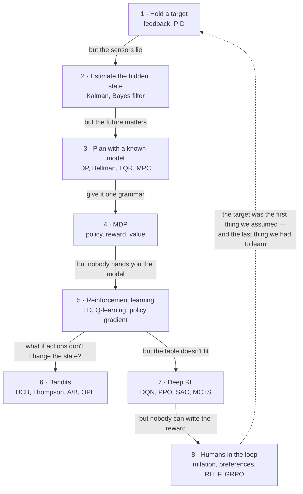

---
aliases:
  - MOC - Decision Sciences
  - MOC - Control and RL
  - Decision Sciences Map
  - Control and RL
  - Control Theory
  - Sequential Decision Making
  - Decision Making Under Uncertainty
tags:
  - moc
  - decision-sciences
  - control-theory
  - reinforcement-learning
---
> [!ABSTRACT] 🧠 Recall
> **In one line:** The map — follow **one loop** (*sense → decide → act*) while the assumptions get taken away one at a time, and every term in control, estimation, planning, RL and bandits lands in the place it belongs.
> **Metaphor:** A car that grows up. Cruise control → a speedometer that lies → a route to plan → learning to drive → guessing what the passenger actually wants.
> **Where it bites:** Use this page to *find* the note. Read [[Decision Sciences]] for the *story*. Use the chain at the bottom to read them in order.

---
A thermostat holds a room at 20°. It knows no physics. It has never heard of probability.

A language model gets a little more polite, because ten thousand people clicked 👍 on the polite answers.

Those are the same machine. **Measure, compare with what you wanted, adjust — again and again.** Between them sits a century of people discovering that the loop was too simple, and ~={blue}almost every term in this field is the name of one assumption being taken away — or the name of what breaks when it goes.=~

So rather than a glossary, follow the loop.

---
# 1. Hold a target

*The car: cruise control. Keep 60 mph, whatever the hill does.* — story: [[Decision Sciences#1. The first instinct: feedback before intelligence|Chapter 1]]

→ **[[Feedback Loop]]** — open loop must be right in advance; closed loop is allowed to be wrong and recover. Start here.
→ **[[PID Controller]]** — react to the error **now** (P), the error **so far** (I), and where it's **heading** (D).
→ **[[Step Response]]** — poke it once, read four numbers: how fast, how far past, how long, where it ends up.
→ **[[Stability]]** — a strong reaction + stale information = oscillation. Nothing is broken; the *loop* is.
→ **[[PID Tuning]]** — P → I → D, one knob at a time. And any integrator + any limit = **windup**.
→ **[[Feedforward Control]]** — if you can see the hill coming, don't wait for the error. Forecast, then correct.
→ **[[Transfer Function]]** — calculus turned into algebra. *Poles in the right half-plane* = unstable.

> [!NOTE] The one sentence to internalise here
> ~={blue}Feedback buys you competence **without understanding**=~ — no model of the world required. Every later section is about what happens when you need more than that. ^competence-without-a-model

---
# 2. The sensors lie

*The car: the speedometer jitters and the GPS is ten metres out.* — story: [[Decision Sciences#2. Reality intrudes: noise, partial observation|Chapter 2]]

→ **[[State-Space Model]]** — two equations: how the hidden **state** moves, and what you get to **observe** of it.
→ **[[Kalman Filter]]** — blend a prediction and a measurement, weighting each by how much you trust it.
→ **[[Bayes Filter]]** — the general heartbeat: *predict* (know less), *update* (know more). Kalman, HMM and particles are costumes.
→ **[[Beliefs]]** · **[[Uncertainty]]** — stop storing a number; store a guess **and its width**.
→ **[[Observability]]** — if it leaves no trace in the data, no algorithm will find it. Plumbing, not tuning.
→ **[[Extended Kalman Filter]]** — curves break bell curves. Flatten the curve (EKF) or sample it (UKF).
→ **[[Particle Filter]]** — a belief held as thousands of guesses. Can say "here *or* there".
→ **[[Hidden Markov Model]]** — the same filter when the hidden state is a label. Sum to track, max to decode.

---
# 3. The future matters

*The car: motorway or back road? The quicker first leg is the slower trip.* — story: [[Decision Sciences#3. Decisions become mathematical|Chapter 3]]

→ **[[Dynamic Programming]]** — start at the end; label every junction with "best from here"; never solve a sub-problem twice.
→ **[[Bellman Equation]]** — *value of here = one step + value of there.* A condition, not an algorithm.
→ **[[Curse of Dimensionality]]** — every variable **multiplies** the table. Bellman named it himself.
→ **[[LQR]]** — linear world + quadratic bill ⇒ the optimal policy is a constant gain. State your priorities; the gains fall out.
→ **[[Model Predictive Control]]** — plan N steps, do one, re-plan. The only one here that respects hard limits.
→ **[[System Identification]]** — every planner needs a model. Poke the system and fit one.

---
# 4. One grammar for all of it

*The car, formalised: states, actions, odds, rewards.* — story: [[Decision Sciences#4. The unifying abstraction|Chapter 4]]

→ **[[Markov Property]]** — "the present is enough" — a property you *design into* the state.
→ **[[Markov Decision Process]]** — $(S, A, P, R, \gamma)$. An action doesn't pick the outcome; it picks the **odds**.
→ **[[Policy]]** — a satnav, not a list of directions: an answer for *every* state.
→ **[[Reward Function]]** — says **what**, never **how**. The agent does what you pay for, not what you meant.
→ **[[Discount Factor]]** — horizon ≈ $1/(1-\gamma)$. It changes *which problem* is being solved.
→ **[[Value Function]]** — a forecast of total future reward. $V$ scores a place, $Q$ a move, $A$ = better-than-usual.
→ **[[Value and Policy Iteration]]** — evaluate ⇄ improve. That dance (**GPI**) is the skeleton of all RL.
→ **[[Credit Assignment]]** — one late score, five thousand decisions. Which ones earned it?
→ **[[POMDP]]** — can't see the state ⇒ your **belief** becomes the state. Sometimes the best move is to go and look.

---
# 5. Nobody hands you the model

*The car: a learner driver. No equations — just trying, and consequences.* — story: [[Decision Sciences#5. Reality intrudes again: the model is unknown|Chapter 5]]

→ **[[Reinforcement Learning]]** — no labels, late feedback, and you generate your own data. Start here.
→ **[[Model-Based vs Model-Free RL]]** — learn the **map**, or learn the **habits**. ("Model" = model *of the environment*.)
→ **[[Monte Carlo Methods]]** — can't compute it? Sample and average. Error falls as $1/\sqrt{N}$ in any dimension.
→ **[[Temporal Difference Learning]]** — learn a guess from a guess. The **TD error** is surprise, and surprise is the signal.
→ **[[Q-Learning]]** — $Q \leftarrow r + \gamma \max Q'$. Learns the best policy while following a worse one — and over-estimates.
→ **[[On-Policy vs Off-Policy]]** — "how good is what *I'm* doing?" vs "how good would *that* be?". The cliff decides.
→ **[[Policy Gradient]]** — do more of what worked. The reward can be a black box — which is why LLMs use it.
→ **[[Actor-Critic]]** — the critic says "better than I expected"; that one signal trains both.
→ **[[Exploration vs Exploitation]]** — you only learn about what you try. Explore where you're **unsure**.
→ **[[Regret]]** — don't ask how much; ask what **shape**. Linear = never learned. Log = learned.

> [!TIP] The escalation ladder — stop at the first rung that works 🪜
> right answers available → **supervised** · action doesn't change the future → **bandit** · you know the rules → **plan** · only logs → **off-policy evaluation / offline RL** · none of those → **RL**.
> Most problems pitched as RL are rung one or two. ^rl-ladder

---
# 6. When your action doesn't change the world

*The car: which of three coffee stops? Tomorrow's choice is unaffected by today's.* — story: [[Decision Sciences#6. Bandits split off as a special case|Chapter 6]]

→ **[[Multi-Armed Bandit]]** — RL with no state. Only exploration is left — and that's a solved problem.
→ **[[Upper Confidence Bound]]** — average + a bonus for ignorance. Optimism is self-correcting.
→ **[[Thompson Sampling]]** — sample a plausible world, act in it. The exploration rate tunes itself.
→ **[[Contextual Bandit]]** — "best for **whom**?" Supervised learning where you only see the label you chose.
→ **[[AB Testing]]** — buys certainty about a fact; a bandit buys reward while learning. Different shopping lists.
→ **[[Off-Policy Evaluation]]** — what would the *new* policy have earned, judged from the *old* one's logs? Log the propensity.
→ **[[Bayesian Optimization]]** — a bandit with expensive, related arms. Spend cheap compute deciding where to spend expensive compute.

| If this is your problem | Read this |
|---|---|
| It overshoots / oscillates / flaps | [[Stability]], [[PID Tuning]], [[Step Response]] |
| It never quite reaches the target | [[PID Controller]] (the **I** term), [[Step Response]] |
| It goes wild after being maxed out for a while | [[PID Tuning#^windup-pattern\|integral windup]] |
| My metric / sensor is jittery | [[Kalman Filter]], [[Bayes Filter]] |
| "Can I even estimate this from what I log?" | [[Observability]] |
| A/B test, bandit, or RL? | [[AB Testing]], [[Multi-Armed Bandit]], [[Contextual Bandit]], [[Reinforcement Learning#^rl-escalation-ladder\|the ladder]] |
| Offline metrics up, A/B test flat | [[Off-Policy Evaluation]] |
| I only have logs; I can't experiment | [[Off-Policy Evaluation]], [[Offline RL]] |
| Reward is rare or arrives late | [[Credit Assignment]], [[Reward Function]], [[Temporal Difference Learning]] |
| The agent found a loophole | [[Reward Function]], [[Reward Hacking]] |
| Deep RL training diverges | [[Function Approximation#^deadly-triad\|the deadly triad]], [[DQN]], [[PPO]] |
| Too many states to table | [[Curse of Dimensionality]], [[Function Approximation]] |
| Continuous actions | [[SAC]], [[Policy Gradient]], [[LQR]] |
| Hard limits on the actuator | [[Model Predictive Control]] |
| Nobody can write down the reward | [[Preference Learning]], [[Inverse Reinforcement Learning]], [[RLHF]] |
| Expensive trials, ~20 of them | [[Bayesian Optimization]] |
| Agent only sees part of the state | [[POMDP]], [[Observability]] |

---
# 7. The table doesn't fit

*The car: the state is now a camera image.* — story: [[Decision Sciences#7. Deep learning bends the curve|Chapter 7]]

→ **[[Function Approximation]]** — generalise instead of tabulating. The blessing, the curse, and the **deadly triad**.
→ **[[DQN]]** — Q-learning + a CNN + two stabilisers. The network was the easy part.
→ **[[Experience Replay]]** — write experience in order; read it back shuffled. Off-policy methods only.
→ **[[PPO]]** — improve the policy, but never by much at once. A gain limiter on a loop that feeds itself.
→ **[[SAC]]** — continuous actions, off-policy, and *paid to stay random*. DDPG → TD3 → SAC.
→ **[[Monte Carlo Tree Search]]** — every node is a bandit. AlphaGo: think at decision time, train on what the thinking found.
→ **[[Offline RL]]** — no way to try things ⇒ **pessimism**. An untried action is a liability.

> [!WARNING] The thing every deep-RL trick is doing
> A learner that trains on its own outputs is a feedback loop, and loops go [[Stability|unstable]]. Frozen target networks, replay buffers, clipped ratios, KL leashes, twin critics — ~={red}each one is a way of making the problem hold still or capping the gain.=~ Section 1 never really left. ^deep-rl-is-loop-stabilisation

---
# 8. Nobody can write down the reward

*The car: a chauffeur. "Drive nicely." What does that even mean?* — story: [[Decision Sciences#8. Humans re-enter the loop|Chapter 8]]

→ **[[Imitation Learning]]** — copy the expert. Works until you drift somewhere they never went. SFT *is* this.
→ **[[Inverse Reinforcement Learning]]** — infer the goal from the behaviour. A reward transfers; a policy doesn't.
→ **[[Preference Learning]]** — people can't score, but they can compare. Only the *gap* between scores is real.
→ **[[RLHF]]** — comparisons → reward model → RL on a [[KL Divergence|KL]] leash.
→ **[[DPO]]** — the algebra that deletes the reward model and the RL loop.
→ **[[GRPO]]** — sample a group, grade on the curve, delete the critic. With rewards a program can check.
→ **[[Reward Hacking]]** — optimisation is an exhaustive adversary against your specification.

---
# 9. More than one driver

→ **[[Multi-Agent Reinforcement Learning]]** — everyone else is learning too, so the world won't hold still.
→ **[[Dec-POMDP]]** — many agents, each looking through its own keyhole.
→ **[[Value Function Factorization]]** — one team value, split into per-agent values you can act on alone.

---
# The reading order 📖

Each note ends with a `# ⁉️` hook to the next, so the whole thing reads as one chain:

> [[Feedback Loop]] → [[PID Controller]] → [[Step Response]] → [[Stability]] → [[PID Tuning]] → [[Feedforward Control]] → [[Transfer Function]] → [[State-Space Model]] → [[Kalman Filter]] → [[Bayes Filter]] → [[Observability]] → [[Extended Kalman Filter]] → [[Particle Filter]] → [[Hidden Markov Model]] → [[Dynamic Programming]] → [[Bellman Equation]] → [[Curse of Dimensionality]] → [[LQR]] → [[Model Predictive Control]] → [[System Identification]] → [[Markov Property]] → [[Markov Decision Process]] → [[Policy]] → [[Reward Function]] → [[Discount Factor]] → [[Value Function]] → [[Value and Policy Iteration]] → [[Credit Assignment]] → [[POMDP]] → [[Reinforcement Learning]] → [[Model-Based vs Model-Free RL]] → [[Monte Carlo Methods]] → [[Temporal Difference Learning]] → [[Q-Learning]] → [[On-Policy vs Off-Policy]] → [[Policy Gradient]] → [[Actor-Critic]] → [[Exploration vs Exploitation]] → [[Regret]] → [[Multi-Armed Bandit]] → [[Upper Confidence Bound]] → [[Thompson Sampling]] → [[Contextual Bandit]] → [[AB Testing]] → [[Off-Policy Evaluation]] → [[Bayesian Optimization]] → [[Function Approximation]] → [[DQN]] → [[Experience Replay]] → [[PPO]] → [[SAC]] → [[Monte Carlo Tree Search]] → [[Offline RL]] → [[Imitation Learning]] → [[Inverse Reinforcement Learning]] → [[Preference Learning]] → [[RLHF]] → [[DPO]] → [[GRPO]] → back here. ^reading-chain

> [!SUCCESS] If you remember one thing
> Five questions place almost any problem on this map:
> 1. **Can I see the state — or only a shadow of it?** (estimation, observability, POMDP)
> 2. **Does my action change what I'll face next?** (bandit vs MDP)
> 3. **Do I know the rules?** (planning vs learning)
> 4. **Can I try things, or do I only have logs?** (online vs offline; optimism vs pessimism)
> 5. **Who wrote the reward — and how would it be gamed?** (reward design, preferences, hacking)
>
> ~={pink}Every algorithm here is a different combination of answers to those five.=~ ^five-questions

---
# The same equation, four times 🎯

Worth seeing in one place, because it's the thread through the whole area:

| Where | The update |
|---|---|
| [[Kalman Filter]] | new estimate = prediction + **gain** × (measurement − prediction) |
| [[Monte Carlo Methods\|Running average]] | new mean = old mean + **1/n** × (sample − old mean) |
| [[Temporal Difference Learning\|TD learning]] | new value = old value + **α** × (target − old value) |
| Gradient descent | new weights = old weights − **lr** × (gradient of the error) |

*Old estimate, plus a fraction of the surprise.* Control, estimation and learning are one idea with the fraction chosen differently.

---
# Papers worth reading in this area 📚
[[Playing Atari with Deep Reinforcement Learning (DQN)]] · [[Mastering the game of Go with deep neural networks (AlphaGo)]] · [[Mastering Chess and Shogi by Self-Play (AlphaZero)]] · [[Simple Statistical Gradient-Following Algorithms (REINFORCE)]] · [[Trust Region Policy Optimization (TRPO)]] · [[Proximal Policy Optimization Algorithms]] · [[High-Dimensional Continuous Control Using Generalized Advantage Estimation (GAE)]] · [[Continuous control with deep reinforcement learning (DDPG)]] · [[Soft Actor-Critic]] · [[A Distributional Perspective on Reinforcement Learning]] · [[Dream to Control- Learning Behaviors by Latent Imagination (Dreamer)]] · [[Mastering Diverse Domains through World Models (DreamerV3)]] · [[Conservative Q-Learning for Offline RL]] · [[Offline Reinforcement Learning- Tutorial, Review, and Perspectives]] · [[Finite-time Analysis of the Multiarmed Bandit Problem (UCB1)]] · [[A Tutorial on Thompson Sampling]] · [[An Empirical Evaluation of Thompson Sampling (NeurIPS)]] · [[A Contextual-Bandit Approach to Personalized News Article Recommendation (LinUCB)]] · [[Practical Bayesian Optimization of Machine Learning Algorithms]] · [[Gaussian Process Optimization in the Bandit Setting (GP-UCB)]] · [[Counterfactual Reasoning and Learning Systems]] · [[Doubly Robust Policy Evaluation and Learning]] · [[Controlled experiments on the web- survey and practical guide (DMKD)]] · [[Always Valid Inference- Bringing Sequential Analysis to A-B Testing]] · [[Training language models to follow instructions with human feedback]] · [[Direct Preference Optimization (DPO)]] · [[Constitutional AI- Harmlessness from AI Feedback]] · [[The Bitter Lesson (essay)]]

---
---
#### 🖼️ One loop, with one more assumption removed at every stage

![[control_to_rl_journey.png]]

# ⁉️
The narrative behind this map — the one to re-read when you want the intuition rebuilt and not just the term located — is [[Decision Sciences]].
The probability underneath it: [[Random variable]], [[Beliefs]], [[Uncertainty]], [[KL Divergence]]. The optimisation underneath it: [[Derivative]], [[Momentum]], [[Backpropagation]]. And where all of this meets language models: [[LLM Engineering]].
