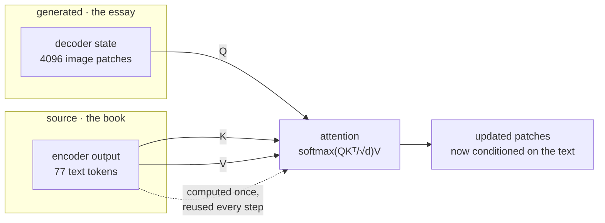

---
aliases:
  - Cross Attention
  - Cross-Attention
  - Encoder-Decoder Attention
tags:
  - transformers
  - attention
  - architecture
  - multimodal
---
> [!ABSTRACT] 🧠 Recall
> **In one line:** Same attention formula — the **queries come from one sequence and the keys and values from another**. That single change is how one modality conditions another.
> **Metaphor:** Writing an essay with the source book open beside you. Each sentence you write looks back into the book; the book never changes.
> **Where it bites:** How a diffusion U-Net obeys a text prompt, how translation decoders work — and why modern decoder-only LLMs threw it away and just concatenate instead.

---
Stable Diffusion is generating a 512×512 image. Inside the U-Net, the picture is **4096 latent patches**. The prompt, after [[CLIP]], is **77 text tokens**.

Two sequences. Different lengths, different modalities, produced by different networks.

```
image side :  4096 vectors,  "what should this patch become?"
text  side :    77 vectors,  "a red bicycle in the rain"
```

Nothing in [[Query, Key, and Value (QKV)|the attention formula]] mentions images or text — it just needs a Q, a K and a V. ~={blue}So what happens if you take the Q from one of these sequences and the K and V from the other?=~

---
# The essay and the source book

You're writing an essay with a book open on the desk beside you.

Every sentence you write, you glance at the book. Which page you glance at depends entirely on what you're currently writing — write about the 1929 crash and your eye goes to chapter four. **Your sentence is the query.** The book's page headings are the keys. The paragraphs you actually take are the values.

Three things about this scene are the whole mechanism:

1. **The book doesn't change while you write.** You read it once, index it once, and that index serves every sentence.
2. **You don't have to write in the book's order**, and your essay needn't be the same length as the book. 4096 patches can attend over 77 tokens perfectly happily — the attention matrix is just $4096 \times 77$ instead of square.
3. **Nothing flows the other way.** The book never attends to your essay.

> [!NOTE] Cross-attention
> Attention where $Q$ is projected from sequence **A** and $K, V$ are projected from sequence **B**. When A and B are the same sequence it's self-attention; nothing else about the computation differs. ^cross-def

> [!SUCCESS] Core idea
> There is no "cross-attention layer". There is one attention operation, and ~={pink}cross-attention is just the wiring diagram where two of the three arrows come from somewhere else.=~ ^cross-is-wiring

---
# Self vs cross, precisely

| | Self-attention | Cross-attention |
|---|---|---|
| **Q from** | this sequence | this sequence |
| **K, V from** | **this** sequence | **the other** sequence |
| **Matrix shape** | $n \times n$ | $n \times m$ |
| **Masking** | causal, usually ([[Causal Attention]]) | **none** — the source is fully visible |
| **[[KV Cache\|KV cache]]** | grows with every token generated | **computed once, fixed size** |
| **Job** | build context within a stream | inject a *condition* from outside |

That fifth row is the practical gift. In a translation decoder the encoder's K and V are computed **once per request** and reused for all 200 generated tokens. The cross-attention cache doesn't grow, so it never becomes the [[KV Cache|memory problem]] that self-attention is.

> [!TIP] Reading any architecture diagram in three seconds 📐
> Find the three arrows entering each attention block. All from the same place → self-attention. Q from one place, K/V from another → cross-attention. That is genuinely the entire taxonomy, and it works on every transformer figure ever drawn.

---
# Where it actually lives now 🗺️

| System | Q | K, V | What it buys |
|---|---|---|---|
| Translation ([[Seq2Seq models]]) | decoder tokens | encoder tokens | The original use — kills the fixed-vector bottleneck |
| [[Latent Diffusion\|Stable Diffusion]] U-Net | image patches | [[CLIP]] text tokens | Text steers pixels ([[Conditional Generation]]) |
| Whisper, T5 | decoder | audio / text encoder | Encoder-decoder, still standard for speech |
| Flamingo-style VLMs | text tokens | vision-encoder patches | Bolt vision onto a frozen LLM, gated so it starts as a no-op |
| Perceiver / Q-Former | a few learned queries | thousands of inputs | **Resample** a huge input down to a fixed small one |

That last row is the underrated trick: a stack of 32 *learned* query vectors cross-attending over 4096 patches compresses the input to 32 vectors, at cost $32 \times 4096$ instead of $4096^2$. Cross-attention used as a bottleneck rather than a bridge.

---
# So why has your favourite LLM got none of it? 🤔

GPT-class models are **decoder-only**. There is no encoder, so there is nothing to cross-attend to. The image, the retrieved documents, the tool results — they all get turned into tokens and **concatenated into the one sequence**, where ordinary [[Causal Attention|causal self-attention]] handles them.

> [!WARNING] Conditioning moved from the architecture to the context window
> Cross-attention says *"this is the condition, here is a dedicated pathway for it."* Concatenation says *"it's all just tokens, sort it out."* The second won for LLMs because it needs no architectural change per modality and scales with the same [[Prefill and Decode|serving stack]] — but it's also precisely why [[Prompt Injection]] is unfixable. The channel that carries your instructions is the channel that carries untrusted data. **Cross-attention was a real separation of concerns; concatenation gave it up for flexibility.** ^conditioning-moved

Image generation kept cross-attention, because there the condition genuinely is a different kind of object from the thing being generated.

![[cross_attention_essay_and_source.png]]

---
---
#### 🖼️ Where the three arrows come from



---
> [!SUCCESS] If you remember one thing
> The formula never changes; only the *source* of Q versus K/V does. ~={pink}Cross-attention is conditioning with a dedicated pathway — and modern LLMs gave that pathway up to make everything a token.=~

---
# ⁉️
Every version of attention so far is a weighted average over a **set** — nothing in $QK^T$ knows that "dog bites man" differs from "man bites dog". Position has to be injected deliberately, and the way it's done decides whether your model survives past its training length.

→ [[RoPE]]
