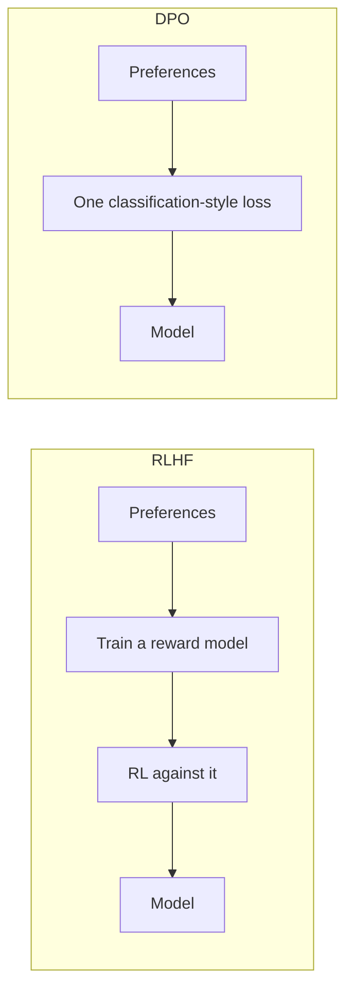

---
aliases:
  - Direct Preference Optimization
  - Direct Preference Optimisation
  - Preference Tuning
  - ORPO
tags:
  - llm
  - training
  - alignment
---
> [!ABSTRACT] 🧠 Recall
> **In one line:** Skip the reward model and the RL loop — a bit of algebra shows the optimal policy **is** the reward, so you can train directly on preference pairs with one classification-style loss.
> **Metaphor:** You don't need to measure the critic's scoring rubric if you can just cook toward what she picked.
> **Where it bites:** ~90% of [[RLHF]]'s benefit at ~10% of the complexity. It's the default for open-weights alignment.

---
Look at what [[RLHF]] costs to run, in one list:

- Train a **reward model** on preference pairs
- Hold **four models** in memory (policy, frozen reference, reward, value)
- Run **PPO** — sampling, advantage estimation, clipping, and hyperparameters that are famously unforgiving
- Discover the policy drifted, retune $\beta$, start again

And look at what the data actually was: triples of $(x,\ y_{\text{win}},\ y_{\text{lose}})$. That's it. Prompt, better answer, worse answer.

Now stare at the two ends of that pipeline. Data in: pairwise preferences. Model out: a policy that prefers the winners.

Is the reward model in the middle ~={blue}load-bearing, or just the route somebody happened to take?=~

---
# Skipping the middleman

The critic from [[RLHF]] tasted the dishes. You trained a junior taster to imitate her scoring, then had the chef cook toward the taster's scores.

But the chef only ever needed one thing: **for the dishes the critic picked to become more likely, and the ones she rejected less likely.** The numeric score was scaffolding to get there.

The DPO paper's contribution is a piece of algebra showing the scaffolding is removable. Under the KL-constrained objective RLHF is solving, the optimal policy has a closed form:

$$\pi^*(y|x) = \frac{1}{Z(x)} \pi_{\text{ref}}(y|x)\, e^{r(x,y)/\beta}$$

Rearrange for $r$:

$$r(x,y) = \beta \log \frac{\pi^*(y|x)}{\pi_{\text{ref}}(y|x)} + \beta \log Z(x)$$

Read that carefully — ~={pink}**the language model *is* a reward model**, implicitly.=~ The log-ratio of its probability to the reference model's *is* the reward, up to a constant.

And the constant $\log Z(x)$? It depends only on $x$, so in a *pairwise* comparison it ~={blue}cancels=~. Substitute into the Bradley-Terry preference likelihood and the whole reward model evaporates:

$$\mathcal{L}_{\text{DPO}} = -\log \sigma\!\left(\beta \log \frac{\pi_\theta(y_w|x)}{\pi_{\text{ref}}(y_w|x)} - \beta \log \frac{\pi_\theta(y_l|x)}{\pi_{\text{ref}}(y_l|x)}\right)$$

> [!SUCCESS] Core idea
> The gradient raises the log-probability of the preferred response and lowers the rejected one, **weighted by how wrong the implicit reward currently is** — so it pushes hardest exactly where the model most disagrees with the human. It's a binary classification loss. ~={pink}No reward model, no sampling, no RL.=~ ^dpo-core

> [!NOTE] Where the KL leash went
> It didn't disappear — it's baked into the $\pi_{\text{ref}}$ terms. Every update is measured *relative to* the frozen reference model, so $\beta$ still controls how far the policy may drift. Same constraint, expressed inside the loss instead of policed by a separate penalty. ^dpo-kl

→ [[Direct Preference Optimization (DPO)]]

---
# The comparison you'll be asked for 📊

| | **RLHF (PPO)** | **DPO** |
|---|---|---|
| Models in memory | 4 | **2** (policy + frozen ref) ✅ |
| Explicit reward model | Yes | **No** |
| Online sampling during training | Yes | **No** — fixed dataset, like SFT |
| Stability | Finicky | Much better |
| Compute | High | ~SFT-level |
| Ceiling at the frontier | **Higher** 🥇 | Slightly lower |
| Can improve past its dataset | Yes (it explores) | ~={red}No=~ |

> [!WARNING] The real limitation: it's off-policy
> DPO trains on a **fixed dataset** of pairs, usually generated by *some other* model. PPO samples fresh responses from the *current* policy and gets them judged — so it can discover and reinforce behaviours nobody demonstrated.
>
> DPO can only rank what it was handed. As the policy moves away from whatever generated those pairs, the preference data gets progressively less relevant to it. This is why frontier labs still run online RL, and why **iterative/online DPO** (generate with the current model, judge with an LLM, retrain, repeat) closes much of the gap. ^dpo-off-policy

> [!TIP] Practical gotchas
> - **$\beta$ ≈ 0.1** is the standard start. Too low → the model degenerates; too high → nothing moves.
> - **Both probabilities can fall.** DPO reliably pushes $y_l$ down, and often drags $y_w$ down too — just less. Watch the *absolute* chosen-logprob, not only the margin. A model that has made everything unlikely is broken. 🚨
> - **Run SFT first** on the preferred responses. DPO on a base model that's never seen the domain works poorly.
> - **Length bias survives.** If your preferred answers are longer, DPO learns "longer = better" just as eagerly as [[RLHF]] did. The method changed; [[Reward Hacking]] didn't go away.

**The family:** **IPO** fixes a DPO overfitting pathology; **KTO** needs only thumbs-up/down labels, not pairs (far easier to collect from production); **ORPO** folds preference optimisation *into* SFT so there's no reference model and no separate stage at all; **GRPO** (of DeepSeek-R1 fame) goes back to online RL but drops the value network, which matters for [[Test-Time Compute|reasoning]] training.

Related: [[KL Divergence]], [[Cross Entropy]], [[Fine-Tuning]], [[Best Practice Critic Optimization]].

---
---
#### 🖼️ The same goal, with the middleman removed

No reward model, no rollouts, no RL loop. Simpler and far more stable — at the cost of not being able to keep sampling fresh data.

# ⁉️
That's the full adaptation stack — prompt, retrieve, tune, align. Now back inside the model itself: how do you get a trillion parameters of capacity without paying for a trillion parameters on every token?

→ [[Mixture of Experts]]

Reading the [[Control and Reinforcement Learning]] chain instead? DPO removed the *reward model*. The other branch keeps the reward, makes it something a program can check, and removes the *critic* → [[GRPO]]
