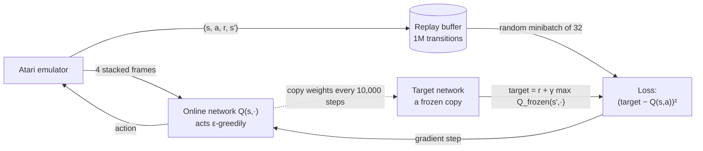

---
aliases:
  - Deep Q-Network
  - Deep Q Network
  - Deep Q-Networks
  - Deep Q-Learning
  - Deep Q Learning
  - Double DQN
  - DDQN
  - Dueling DQN
  - Target Network
  - Rainbow DQN
  - Rainbow
tags:
  - deep-rl
  - reinforcement-learning
  - decision-sciences
---
> [!ABSTRACT] 🧠 Recall
> **In one line:** [[Q-Learning]] with a **neural network instead of a table** — made stable by two tricks: **replay** old experience in random order, and compute targets from a **frozen copy** of the network.
> **Metaphor:** Archery at a target that lurches every time you adjust your aim. The fix: bolt the target down, and only move it occasionally.
> **Where it bites:** The paper that started deep RL (Atari, 2013/2015). The template for every value-based deep method since.

---
2013. A team at DeepMind takes **one** neural network and points it at the raw screen of Atari games — seven of them at first, and **49** by the 2015 *Nature* paper.

No game-specific features. No rules. Same architecture, same hyperparameters for every game. Input: pixels. Output: which joystick button. Feedback: the score.

It reaches human level or better on more than half of them. On *Breakout* it discovers, unprompted, that you can dig a tunnel up the side of the wall and send the ball bouncing around behind it.

The algorithm underneath is [[Q-Learning]] — from 1989. And we just saw that [[Function Approximation#^deadly-triad|Q-learning + a neural network diverges]].

~={blue}So what did they change?=~

---
# The moving target 🎯

![[dqn_architecture.png]]

The network takes the screen and outputs **one Q-value per action** — a single forward pass scores every button. Training minimises the squared [[Bellman Equation|Bellman]] error:

$$L(\theta) = \Big(\underbrace{r + \gamma \max_{a'} Q(s', a';\, \theta^-)}_{\text{target}} - Q(s, a;\, \theta)\Big)^2$$

Two problems sink the naive version. Picture learning archery:

**Problem 1 — the target moves when you do.** The target is computed by *the same network you're training*. Adjust your aim, and the bullseye shifts. You chase it; it moves again.
**Fix — the target network** (the 2015 addition). Keep a **frozen copy** of the weights, $\theta^-$, used only to compute targets. Train against it for 10,000 steps. Then copy the fresh weights across, and freeze again. ~={blue}Bolt the target down, and move it only occasionally.=~

**Problem 2 — your practice shots are all the same shot.** Consecutive game frames are nearly identical, so a minibatch of recent experience is one situation repeated 32 times. The network fits it, forgets everything else, and lurches.
**Fix — [[Experience Replay]].** Store the last million transitions and train on **random** draws from the whole lot.

> [!NOTE] DQN
> Deep Q-Network: a convolutional network approximating $Q(s, \cdot)$ from pixels, trained off-policy by minimising TD error against a periodically-updated **target network**, on minibatches sampled uniformly from an **experience replay** buffer. → [[Playing Atari with Deep Reinforcement Learning (DQN)]] ^dqn-def

> [!SUCCESS] Core idea
> ~={pink}The network was the easy part. The contribution was making the learning problem *hold still*.=~ A frozen target turns a moving-target problem back into (a sequence of) ordinary regressions. Replay turns a correlated stream back into (something like) an i.i.d. dataset. Both are ways of making RL look enough like supervised learning that SGD behaves. ^make-it-hold-still

---
# The details that carry ideas

| Detail | Value | Why it's interesting |
|---|---|---|
| Input | **4 stacked** 84×84 grey frames | one frame shows where the ball *is*, not where it's *going*. Velocity is [[Observability\|unobservable]] from a single frame — stacking repairs the [[State-Space Model\|state]]. It's a [[POMDP]] patch |
| Output | one Q per action (4–18) | all actions scored in one pass. Only possible because actions are **discrete** |
| Exploration | ε from 1.0 → 0.1 over 1M frames | plain [[Exploration vs Exploitation\|ε-greedy]] |
| Replay buffer | 1M transitions | → [[Experience Replay]] |
| Target sync | every 10,000 steps | the bolt |
| Reward clipping | to [−1, +1] | so one set of hyperparameters works on games scoring in 1s *and* in 1,000s |
| Training | 200M frames **per game** | ≈ 38 days of non-stop play. Sample-hungry |

---
# What came next — each fixes one named flaw

| Variant | Flaw | Fix |
|---|---|---|
| **Double DQN** | the $\max$ over-estimates — [[Q-Learning#^maximisation-bias\|maximisation bias]] | the **online** net *picks* the action, the **target** net *scores* it |
| **Prioritised replay** | uniform sampling wastes time on boring transitions | sample in proportion to TD error |
| **Dueling DQN** | in most states, which action you pick barely matters | two heads: $V(s)$ and the [[Value Function\|advantage]] $A(s,a)$, recombined |
| **Multi-step targets** | one-step bootstrapping propagates reward slowly | [[Temporal Difference Learning\|$n$-step returns]] |
| **Distributional RL** | a mean hides the *shape* of the return | predict the whole distribution → [[A Distributional Perspective on Reinforcement Learning]] |
| **Noisy nets** | ε-greedy is blind | learn the exploration noise inside the weights |
| **Rainbow** | — | all six together. They stack |

---
# Where it stops

> [!WARNING] Three walls
> 1. **Discrete actions only.** The $\max_{a'}$ and the one-output-per-action head both need a short list of actions. A 7-joint robot arm has a *continuum* → [[SAC]].
> 2. **Sample efficiency.** Hundreds of millions of frames is fine in an emulator and unthinkable on a real robot → [[Model-Based vs Model-Free RL]], [[Offline RL]].
> 3. **Brittleness.** Small hyperparameter changes or a different random seed can turn success into failure. The tricks *tame* the [[Function Approximation#^deadly-triad|triad]]; they don't abolish it. ^dqn-limits

> [!TIP] The shape that transfers
> A **slowly-updated reference copy** to stabilise learning is now everywhere: target networks here, the EMA "teacher" in BYOL-style self-supervised learning, and the frozen **reference model** that the [[RLHF#^kl-leash|KL leash]] in RLHF is measured against. Whenever a system is learning from its own outputs, someone has usually frozen a copy of it somewhere.

---
---
#### 🖼️ The training loop — and the two things keeping it stable

---
> [!SUCCESS] If you remember one thing
> DQN = Q-learning + a CNN + **two stabilisers**: shuffle the past (replay), and freeze the target. ~={pink}Deep RL's breakthroughs are mostly about making the problem stand still long enough to learn it.=~

---
# ⁉️
One of those two stabilisers deserves a closer look, because it turns out to be one of the most reused ideas in the field — and it explains why some algorithms can use it and others can't.

→ [[Experience Replay]]
