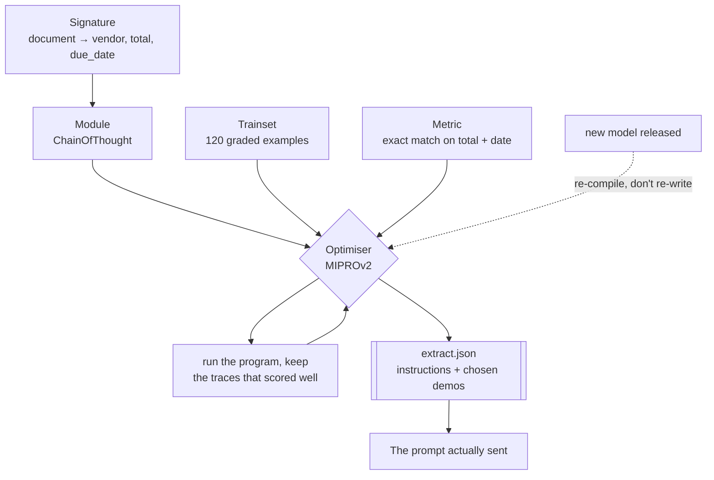

---
aliases:
  - Prompt Optimization
  - Prompt Compilation
  - MIPRO
  - BootstrapFewShot
tags:
  - llm
  - engineering
  - tooling
  - metrics
---
> [!ABSTRACT] 🧠 Recall
> **In one line:** Declare **what goes in and what comes out**, supply a metric and some examples, and let an optimiser *search* for the prompt and few-shot demos — instead of you editing a string.
> **Metaphor:** A compiler. You stopped writing assembly not because it was wrong, but because you wanted to state the intent once and re-target it when the chip changed.
> **Where it bites:** The barrier isn't the library. It's that you need a graded dataset — which is [[Evals]] wearing a different hat.

---
Open `prompts/extract_invoice.txt` and run `git log` on it.

```
14 commits, 9 authors, 11 months
"add: emphasise ISO date format"
"fix: model kept returning tax-inclusive totals"
"tweak: ALL CAPS on 'do not guess'"
"add two more examples"
"revert tweak — made it worse on scanned docs"
```

Fourteen afternoons. Nobody can tell you which three of those lines are load-bearing, because nobody ever ablated them.

Then the provider ships a new model. It's better on every benchmark. On *your* task it's worse — because eleven months of edits were tuned against the old one's quirks, and half of them are now actively harmful.

So you start the fourteen afternoons again.

~={blue}The string in that file is a hand-optimised artefact with no record of what it was optimised against.=~ Which is an oddly familiar situation.

---
# The compiler

In 1975 you wrote assembly by hand, and you were good at it. You knew which instruction pairing the pipeline liked, you scheduled the delay slots yourself, and your code was fast.

Then the next chip came out with a different pipeline, and every one of those decisions was wrong.

![[dspy_compiler_not_assembly.png]]

What a compiler changed was not *quality*. It was **where the intent lives**. You write `total = subtotal + tax` once — the statement of intent, permanent, portable — and a separate program decides the register allocation, for *this* chip, and re-decides for the next one.

So ask the uncomfortable question about that prompt file. Which parts of it are **intent** ("extract the vendor, the total excluding tax, and an ISO date") and which parts are **register allocation** ("say ALL CAPS on 'do not guess', put the examples before the instructions, use three demos not two")?

The first part you should own forever. The second part you should never have been writing by hand.

> [!NOTE] Signature, Module, Optimiser
> - **Signature** — a typed declaration of the transformation: named inputs, named outputs, short descriptions. *No prompt text.*
> - **Module** — the strategy that implements it: `Predict`, `ChainOfThought`, `ReAct`, `ProgramOfThought`. Modules compose like ordinary Python.
> - **Optimiser (the "compiler")** — takes your program, a **metric**, and a training set, and searches over instructions and few-shot demonstrations to maximise the metric. It emits an artefact you save and load. ^dspy-three-parts

---
# What the code looks like

```python
import dspy

class ExtractInvoice(dspy.Signature):
    """Pull the payable fields out of an invoice."""
    document: str  = dspy.InputField()
    vendor: str    = dspy.OutputField(desc="legal entity name")
    total: float   = dspy.OutputField(desc="amount due, EXCLUDING tax")
    due_date: str  = dspy.OutputField(desc="ISO 8601")

extract = dspy.ChainOfThought(ExtractInvoice)      # still no prompt anywhere
```

Now the part that replaces the fourteen afternoons:

```python
def scored(gold, pred, trace=None):                # ← this is the real work
    return float(gold.total == pred.total and gold.due_date == pred.due_date)

tuned = dspy.MIPROv2(metric=scored, auto="medium").compile(
            extract, trainset=train[:120], valset=dev[:60])

tuned.save("extract.json")     # instructions + selected demos, as data
```

`extract.json` is the compiled prompt. It's an *artefact*, versioned like a build output, not a source file people edit. New model? Re-run `compile`. The signature — the intent — never changed.

> [!SUCCESS] Core idea
> The reversal is this: the prompt stops being **source** and becomes **output**. ~={pink}You edit the metric and the examples; the optimiser edits the string.=~ Which means every question about your prompt now has an experimental answer instead of an opinion. ^prompt-as-output

---
# What the optimiser actually does

Less magic than it sounds, and that's reassuring:

| Optimiser | Searches over | When |
|---|---|---|
| **`BootstrapFewShot`** | Which of *your* examples to use as demos — bootstrapped by running the program and keeping the traces that scored well | Start here. Cheap |
| **`…WithRandomSearch`** | The above, several times, keep the best | When you have ≥50 examples |
| **`MIPROv2`** | **Instructions *and* demos**, jointly, with a Bayesian search over candidates | The default for real tasks 🥇 |
| **`BootstrapFinetune`** | Distils the compiled behaviour into weights | When latency or cost rules out the big model. See [[Distillation]] |

The bootstrapping trick is worth naming, because it's the clever bit: it runs your program on training inputs, **keeps the execution traces that the metric scored well**, and uses those as few-shot demonstrations. The demos aren't written by a human or by a model — they're *the system's own successful runs*. That's [[In Context Learning]] with the examples chosen by measurement.

**The budget, roughly.** A `medium` MIPROv2 run tries on the order of ~10–20 candidate configurations over a ~100-example train set, so a few thousand model calls. At ~2,000 tokens each on a cheap model (~$0.15/M in):

$$3{,}000 \times 2{,}000 \times \$0.15/10^6 \approx \$0.90 \text{ in, plus output} \approx \textbf{a few dollars per compile}$$

Cheaper than one of those fourteen afternoons, and unlike the afternoon it produces a number.

---
# The honest constraints

> [!WARNING] No metric, no DSPy
> The optimiser is a search procedure and the metric is its objective. If your metric is `llm_judge(output) > 0.7` with an unvalidated judge, you will optimise the prompt to please the judge. That's [[Reward Hacking]] with a 40-minute feedback loop.
>
> So the prerequisite is the thing most teams don't have: **50–200 examples with graded outputs**, and a metric you trust. If you have that, DSPy is very strong. If you don't, ~={red}the library isn't your bottleneck and installing it won't help.=~ Go and build the [[Evals|eval set]] first — you needed it anyway. ^no-metric-no-dspy

| | Hand-tuned prompt | Compiled program |
|---|---|---|
| Where intent lives | Mixed into the string | The signature |
| Swapping models | Re-tune by hand | `compile` again |
| Why it's like that | Folklore | A metric and a trainset |
| Needs labelled data | No | **Yes — the real cost** |
| Debuggability | Read the string | Read the string it emitted |
| Fits unusual style needs | ✅ Easily | Awkward — encode it in the metric |

Two more things people trip on. **Over-fitting is real**: with 40 training examples the optimiser will happily find demos that work on those 40 and nowhere else — hold out a validation set and believe only that. And **the artefact is model-specific by design**: `extract.json` compiled for one model is not valid for another. That's not a bug, it's the entire point of having a compiler — but it does mean "swap the model" now means "swap the model and re-compile."

Related: [[Prompt Engineering]] (what you're automating), [[In Context Learning]] (what the demos exploit), [[Evals]] (the prerequisite), [[Bayesian Optimization]] (what MIPRO's search is doing), [[Test-Time Compute]] and [[Distillation]].

---
---
#### 🖼️ Intent up top, string at the bottom, a metric in between



---
> [!SUCCESS] If you remember one thing
> ~={pink}The prompt stops being source and becomes output.=~ Which means the prerequisite is a metric and a graded set — and if you don't have those, the library was never your bottleneck.

---
# ⁉️
Four frameworks, four different centres of gravity, and a dozen more competing for the same slot. At some point you have to choose — including the option of choosing none of them.

→ [[Agent Frameworks]]
