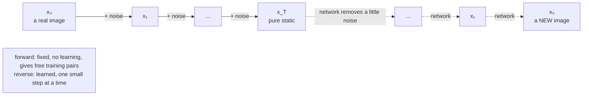

---
aliases:
  - Diffusion
  - Diffusion Model
  - DDPM
  - Denoising Diffusion
  - Diffusion Probabilistic Models
  - Generative Diffusion
tags:
  - generative-models
  - diffusion
  - deep-learning
---
> [!ABSTRACT] 🧠 Recall
> **In one line:** **Destroy** data by adding noise in many small steps until it's pure static (easy, fixed, no learning). **Train a network to undo one small step.** Generate by starting from static and undoing a thousand small steps.
> **Metaphor:** A drop of ink dispersing in water — and a film of it played backwards.
> **Where it bites:** Stable Diffusion, DALL·E 2/3, Imagen, Midjourney, Sora-style video, audio, protein design, robot policies. The dominant generative recipe for anything continuous.

---
Every family so far tries to go from **noise to image in one leap**. One pass through a network, static in, face out. That's an absurdly hard function — and each family paid for it somewhere: [[Variational Autoencoder|VAEs]] blur, [[Generative Adverserial Network|GANs]] are unstable and [[Mode Collapse|drop modes]], [[Normalizing Flows|flows]] wear architectural handcuffs.

Here's a different question. Take a photo and add a **tiny** amount of noise — so little you can barely see it.

~={blue}How hard is it to guess what the clean photo looked like?=~

---
# Ink in water 💧

![[diffusion_ink_in_water.png]]

Easy. Almost trivially easy. And that's the whole idea.

Drop ink into a glass of water. It spreads, slowly, until the glass is a uniform grey. Going *that* way needs no intelligence — it's just physics. And it's gradual: between any two consecutive frames of the film, almost nothing changes.

Now play the film **backwards**. Uniform grey gathers itself into a drop of ink. Any *single* backwards frame is a tiny, local, learnable correction. String a thousand of them together and you've turned noise into structure.

![[diffusion_noising_denoising_strip.png]]

| | **Forward process** $q$ | **Reverse process** $p_\theta$ |
|---|---|---|
| Direction | data → noise | noise → data |
| What it does | adds a little Gaussian noise, $T$ times | removes a little noise, $T$ times |
| Learned? | **no** — fixed by a schedule | **yes** — this is the network |
| Difficulty | none | each step is easy; there are just many |
| Detail | [[Forward Diffusion Process]] | [[Denoising Objective]], [[Diffusion Sampling]] |

> [!NOTE] Diffusion model
> A generative model defined by a fixed **forward** Markov chain that gradually turns data into Gaussian noise, and a learned **reverse** chain that turns noise back into data. Training reduces to regression: *given a noised image and the noise level, predict the noise that was added.* → [[Denoising Diffusion Probabilistic Models]] (Ho, Jain & Abbeel, 2020) ^diffusion-def

> [!SUCCESS] Core idea
> ~={pink}Replace one impossible leap with a thousand easy steps.=~ Nobody can write the function "static → face". Anyone can learn "slightly noisy face → slightly less noisy face". And because the destruction is *fixed and known*, you get unlimited perfectly-labelled training pairs for free: take a real image, add noise yourself, and you know exactly what the right answer was. ^many-easy-steps

---
# Why it won — against every rival at once

![[reverse_diffusion_2d.png]]
> [!TIP] Reading the chart
> 2,500 points of pure noise, 500 reverse steps, the exact score of a six-cluster target. **100% of samples land on a cluster**, and the clusters are filled almost evenly (15–19% each; the truth is 16.7%). Compare [[Langevin Dynamics#^langevin-mixes-badly|plain Langevin]], which got the proportions badly wrong: walking down the noise ladder is what fixes it.

| | [[Variational Autoencoder\|VAE]] | [[Generative Adverserial Network\|GAN]] | [[Normalizing Flows\|Flow]] | **Diffusion** |
|---|---|---|---|---|
| Sample quality | soft | **sharp** | OK | **sharp** |
| Covers all the modes | ✅ | ❌ collapses | ✅ | ✅ |
| Training stability | ✅ | ❌ a two-player game | ✅ | ✅ **a plain regression loss** |
| Architecture freedom | ✅ | ✅ | ❌ invertible only | ✅ |
| Sampling speed | **1 pass** | **1 pass** | **1 pass** | ❌ **tens to hundreds of passes** |

It's the first family to tick *sharp*, *diverse* **and** *stable* together. It pays with the last row — and most research since 2021 has been about clawing that back → [[Diffusion Sampling]], [[Flow Matching]], [[Consistency Models]].

> [!TIP] The generative trilemma
> **Quality · coverage · speed — pick two.** GANs: quality + speed. VAEs and flows: coverage + speed. Diffusion: quality + coverage. Everything in §7 of [[Generative Models]] is an attempt to get the third.

---
# Four ways to look at the same model

This is what makes the literature confusing: four communities arrived at the same object and each kept its own vocabulary.

| View | What the network "is" | Note |
|---|---|---|
| **Hierarchical VAE** | the decoder of a 1,000-layer [[Variational Autoencoder\|VAE]] with a *fixed* encoder; the loss is its ELBO | [[Latent Variable Models]] |
| **Denoising autoencoder** | a [[Autoencoder\|denoiser]] trained at every noise level | [[Denoising Objective]] |
| **Score-based model** | an estimator of $\nabla \log p_t(x)$; sampling is annealed [[Langevin Dynamics]] | [[Score Function]] |
| **SDE / ODE** | the drift of a reverse-time differential equation | [[Score SDE]] → [[Flow Matching]] |

They're the same network, the same loss (up to weighting), and the same samples. Use whichever makes the thing in front of you easiest to think about.

---
# The history, in six lines

- **2015** — Sohl-Dickstein et al., *"Deep Unsupervised Learning using Nonequilibrium Thermodynamics"*. The idea, borrowed from physics. Ignored for five years.
- **2019** — Song & Ermon: score matching at multiple noise scales. Same idea, arrived at from the other side.
- **2020** — **DDPM**: the simplified "predict the noise" loss. Image quality suddenly rivals GANs.
- **2021** — Score SDEs unify the two lines; *"Diffusion Models Beat GANs"*; **classifier-free guidance**.
- **2022** — **Latent diffusion** makes it cheap → Stable Diffusion, DALL·E 2, Imagen. The public notices.
- **2023 →** — transformers replace U-Nets ([[Diffusion Transformer|DiT]]); [[Flow Matching|flow matching]] replaces the diffusion objective; few-step distillation; video.

---
# What it *isn't* good at

> [!WARNING] Know the limits
> - **Slow.** Generation is a loop around a large network. No amount of cleverness makes it a single matmul.
> - **Continuous data.** Pixels, audio, latents: natural. Text and other discrete data: awkward — needs a different kind of noise → [[Discrete Diffusion]].
> - **No useful likelihood.** You can bound it, but nobody evaluates diffusion models that way → [[Evaluating Generative Models]].
> - **Exact structure.** Counting, spelling, hands, spatial relations — nothing in the objective enforces global consistency; each step is a local denoise.
> - **It can memorise.** Images duplicated in the training set can be regenerated near-verbatim. ^diffusion-limits

---
---
#### 🖼️ Destroy with a fixed rule, rebuild with a learned one

---
> [!SUCCESS] If you remember one thing
> **Noising is free; denoising one small step is easy; chain the easy steps.** ~={pink}That trade — many cheap steps instead of one impossible one — is why diffusion is sharp, diverse and stable all at once, and why it's slow.=~

---
# ⁉️
The forward half is "just add noise" — but *how much, how fast, and in what pattern* turns out to matter a great deal. And there's a lovely shortcut hiding in it: you never actually have to run the thousand steps.

→ [[Forward Diffusion Process]]
