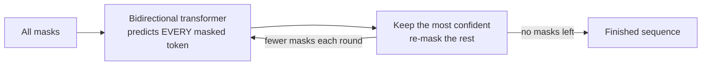

---
aliases:
  - Discrete Diffusion Models
  - Masked Diffusion
  - Masked Diffusion Models
  - Diffusion Language Models
  - Diffusion LM
  - dLLM
  - Text Diffusion
  - D3PM
  - Absorbing Diffusion
  - MaskGIT
  - LLaDA
  - Masked Generative Modelling
  - Parallel Decoding
tags:
  - generative-models
  - diffusion
  - llm
  - transformers
---
> [!ABSTRACT] 🧠 Recall
> **In one line:** Diffusion for **tokens**. The "noise" is **masking**: forward = progressively replace tokens with `[MASK]`; reverse = a transformer fills masks back in, **many at a time, in any order**, over a handful of rounds.
> **Metaphor:** A crossword. You don't fill it left-to-right — you write in what you're sure of, and every answer makes the rest easier.
> **Where it bites:** Diffusion language models (LLaDA, Mercury, Gemini Diffusion), fast image-token generators (MaskGIT, MUSE), and the live question of whether autoregression is *necessary* for language.

---
[[Diffusion Models|Diffusion]] rests on *"add a little Gaussian noise"*. For a pixel — 0.62 becomes 0.65 — that's a meaningful small step.

Now try it on the word **"cat"**. Cat plus 3% noise is… what? Tokens are IDs in a vocabulary. There's no halfway point between token 4,021 and token 17,388. Nothing is "slightly noisier".

Yet the *shape* of diffusion is very attractive for text: [[Auto-regressive models]] write strictly left to right, one token per network pass, and [[Auto-regressive models#Exposure bias — the flaw worth knowing|can never go back]]. A diffusion model refines the **whole** sequence in parallel.

~={blue}What does "gradually destroy, then gradually restore" mean for something that can't be gradually anything?=~

---
# The crossword ✏️

![[discrete_diffusion_unmasking.png]]

It means: **hide it**. The discrete analogue of noise is a `[MASK]` token.

- **Forward:** each token is independently replaced by `[MASK]` with probability $t$. At $t = 0$: the clean sentence. At $t = 1$: all masks. (An *absorbing* state — once masked, always masked.)
- **Reverse:** a bidirectional transformer looks at the partly-masked sequence and predicts **every** masked position at once. Keep the predictions it's most confident about; leave the rest masked; go again.

```
t=1.0   [M]  [M]  [M]  [M]  [M]  [M]  [M]
t=0.7   The  [M]  [M]  [M]  on   [M]  [M]
t=0.4   The  cat  [M]  [M]  on   the  [M]
t=0.0   The  cat  sat  down on   the  mat
```

That's a crossword: commit to what's certain; each commitment constrains everything else; repeat. Order is chosen by **confidence**, not position.

> [!NOTE] Discrete (masked) diffusion
> A diffusion process over categorical variables whose forward corruption is a Markov chain on the vocabulary — most successfully the **absorbing** (masking) chain — and whose learned reverse process predicts clean tokens from corrupted sequences. D3PM (Austin et al., 2021) is the general framework; masked diffusion is the variant that works. ^discrete-diffusion-def

> [!SUCCESS] Core idea
> ~={pink}The training loss turns out to be a weighted **masked-language-modelling** loss — BERT's objective — averaged over *every* masking ratio from 0 to 100%.=~ BERT masks a fixed 15% and can't generate. Randomise the ratio all the way up to "everything masked", and the same cross-entropy gives you a proper generative model — a bound on likelihood, like the [[Variational Autoencoder#The loss — two forces in tension|ELBO]]. **BERT was one hyperparameter away from a generator.** ^bert-to-generator

---
# Autoregressive vs masked diffusion

| | [[Auto-regressive models\|Autoregressive]] | **Masked diffusion** |
|---|---|---|
| Generation order | fixed: left → right | **any** — by confidence |
| Tokens per network pass | **1** | **many** |
| Passes for $N$ tokens | $N$ | $K \ll N$ (e.g. 16–64) |
| Attention | [[Causal Attention\|causal]] | **bidirectional** |
| [[KV Cache]] | ✅ — the key serving optimisation | ❌ not directly — every position can change, so nothing is frozen |
| Revise an earlier token | never | in principle yes (with re-masking) |
| Infilling / editing the middle | awkward | **native** |
| Exact likelihood | ✅ | a bound |
| Quality at scale | **the incumbent** | close — and closing |

> [!WARNING] "Parallel" isn't free
> Predict ten masked tokens in one pass and they're predicted **independently** — each is plausible alone, but nothing ensures they agree. Ask for a two-word city and you can get *"New Francisco"*. Fewer rounds → more of this. So there's a real **speed ↔ coherence** dial, just like steps ↔ quality in [[Diffusion Sampling]]. And without a [[KV Cache]], each pass is a full bidirectional forward over the whole sequence — the per-token economics are nothing like [[Prefill and Decode|decode]]. ^parallel-tokens-are-independent

---
# Where it shows up

**Images as tokens.** Turn an image into a grid of [[VQ-VAE]] tokens, then generate the grid by iterative unmasking: **MaskGIT** and **MUSE** produce a 256-token image in ~8–16 passes instead of 256. The vault's [[LLaDA-Image- Building Strong Image Generators with Fully Open Training Recipes]] is in this line.

**Language.** **LLaDA** (2025) trained an 8B masked-diffusion LM from scratch and landed in the same range as a comparable autoregressive model — including [[In Context Learning|in-context learning]] and instruction following, which people had assumed were products of next-token prediction. Commercial systems (Mercury, Gemini Diffusion) sell the **speed**.

**Anything discrete with structure:** proteins and DNA, molecular graphs, code infilling, symbolic music.

> [!TIP] What it says about *why LLMs work*
> If a model that never predicts "the next token" still develops in-context learning, then those abilities likely come from **generative modelling of text at scale** — maximum likelihood on a huge corpus — and not from the left-to-right factorisation specifically. Autoregression may be a *convenient* way to do that, with a fantastic systems story ([[KV Cache]], streaming), rather than the essential ingredient. An open question, and an interesting one.

> [!TIP] The other route: continuous diffusion on embeddings
> Diffuse in *embedding* space with Gaussian noise and round to the nearest token at the end (Diffusion-LM, CDCD). It lets you reuse all the continuous machinery — [[Classifier-Free Guidance|guidance]] especially — but the rounding step is lossy, and so far masking has scaled better.

---
---
#### 🖼️ Fill in what you're sure of; let that inform the rest



---
> [!SUCCESS] If you remember one thing
> **For tokens, noise = masking; denoising = filling masks, several at once, most-confident first.** ~={pink}It's BERT's objective at every masking ratio — a real generative model that trades the KV cache and exact likelihood for parallel, any-order, editable generation.=~

---
# ⁉️
From still images to sequences of tokens. The other direction is *more* continuous data, not less: add a time axis, and an image becomes a video — where the hard part isn't drawing any one frame, it's making a hundred of them agree.

→ [[Video Diffusion]]
