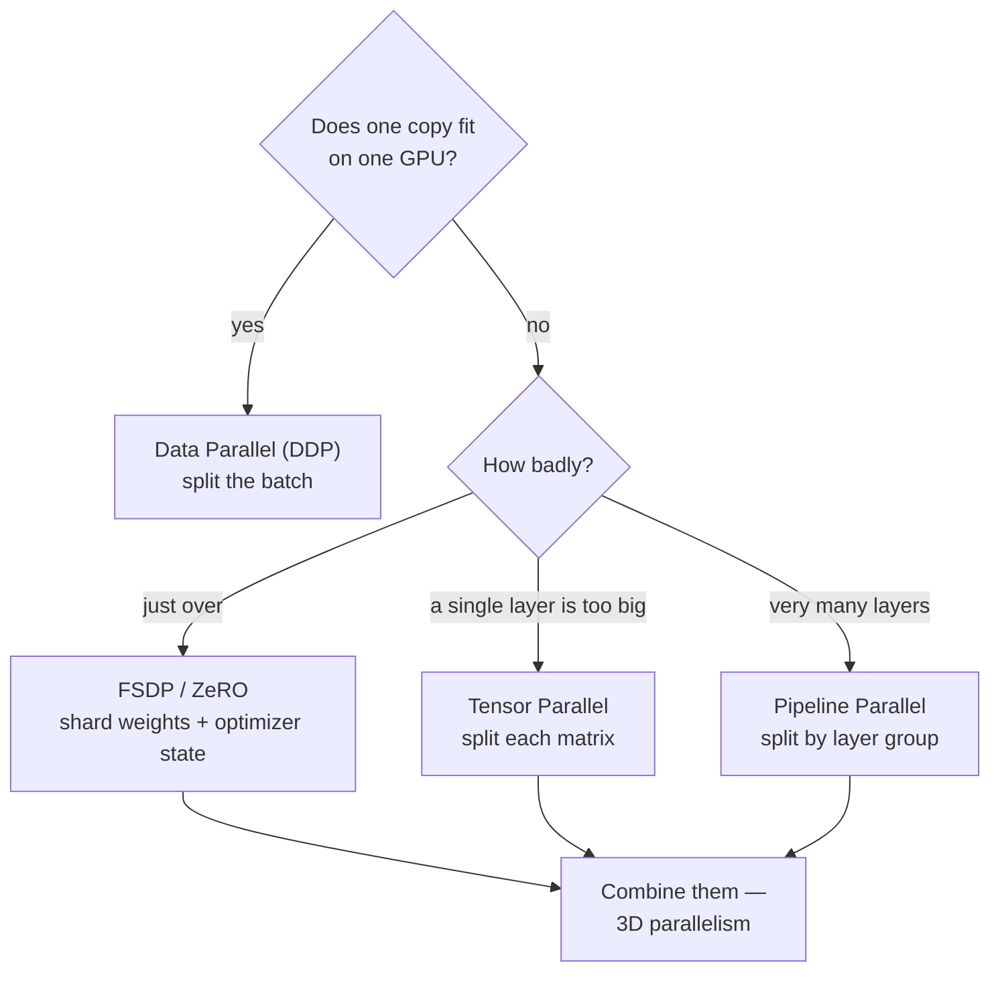

---
aliases:
  - DDP
  - FSDP
  - Data Parallel
  - Model Parallel
  - Parallelism
tags:
  - infrastructure
  - distributed
  - training
---
> [!ABSTRACT] 🧠 Recall
> **In one line:** Split the **work** (data parallel) when the model fits on one GPU; split the **model** (tensor/pipeline/FSDP) when it doesn't.
> **Metaphor:** A restaurant kitchen. Many chefs cooking the same dish in parallel — or one dish passed down a line of specialists.
> **Where it bites:** "Which parallelism do I need?" The answer is almost always decided by **memory**, not speed.

---
# Start with the real question

People reach for distributed training saying *"it's too slow."* That's usually the second problem. The first is nearly always:

> **Does the model even fit on one GPU?**

And "the model" is more than the weights. For an Adam-trained model in mixed precision, per parameter you hold roughly:

| What | Bytes per parameter |
|---|---|
| Weights (bf16) | 2 |
| Gradients (bf16) | 2 |
| Adam momentum (fp32) | 4 |
| Adam variance (fp32) | 4 |
| fp32 master weights | 4 |
| **Total** | **~16** |

So a **7B** model needs about **112 GB** before a single activation exists — on an 80 GB H100, it does not fit. 😬

> [!SUCCESS] Core idea
> ~={blue}The optimizer state, not the weights, is usually what breaks you.=~ Weights are 2 bytes; the machinery around them is 14. That ratio is why sharding the *optimizer* was the first big win. See [[Momentum#Momentum inside Adam|what Adam actually stores]]. ^optimizer-state-dominates

---
# The four ways to split

## 1 · Data parallel — split the batch

Every GPU holds a **full copy** of the model and processes a different slice of the batch. After the backward pass, an [[Collective Communication#^ring-allreduce|allreduce]] averages the gradients so every copy stays identical.

- ✅ Simple. One line: `model = DDP(model)`
- ✅ Scales well — communication per GPU is constant
- ❌ Every GPU needs the whole model in memory

**This is the default. Use it whenever you can.**

## 2 · FSDP / ZeRO — shard the *state*

The insight: each GPU holds a full copy of the weights and optimizer state, but only ever *uses* one layer at a time. So why store all of it?

FSDP shards weights, gradients and optimizer state across GPUs. When a layer is needed, an **all-gather** temporarily rebuilds it; after the backward pass, a **reduce-scatter** distributes the gradients. Then it's thrown away again.

- ✅ Memory drops roughly linearly with GPU count
- ✅ Still feels like data parallel to write
- ❌ More communication — you're moving weights, not just gradients

**ZeRO stages:** 1 shards optimizer state, 2 adds gradients, 3 adds the weights themselves. FSDP ≈ ZeRO-3.

## 3 · Tensor parallel — split each matrix

One weight matrix is too big for one GPU, so split the matrix itself. Each GPU computes part of the matmul and the results are combined.

- ✅ The only option when a **single layer** doesn't fit
- ❌ Communicates **within every layer** — needs NVLink-class bandwidth
- ⚠️ Keep it **inside a node**. Tensor parallel across nodes is usually a mistake

## 4 · Pipeline parallel — split by layer

Layers 1–8 on GPU 0, 9–16 on GPU 1, and so on. Activations pass down the line.

- ✅ Very little communication — just activations at the boundaries
- ❌ **The bubble**: GPU 1 idles while GPU 0 does the first batch

> [!TIP] The bubble, and the fix
> Naively, only one GPU works at a time and the rest idle. The fix is **micro-batching**: split the batch into chunks so that while GPU 1 works on chunk 1, GPU 0 is already starting chunk 2 — like an assembly line filling up. More micro-batches means a smaller bubble. 🫧 ^pipeline-bubble

---
# How they're actually combined

At frontier scale you use all of them at once — **3D parallelism**:

| Dimension | Where it's applied | Why |
|---|---|---|
| **Tensor** | within a node (8 GPUs) | needs NVLink bandwidth |
| **Pipeline** | across a few nodes | tolerates slower links |
| **Data** | across everything else | scales best, communicates least |

> [!SUCCESS] The rule that decides the layout
> ~={pink}Put the chattiest parallelism on the fastest wire.=~ Tensor parallel talks constantly → keep it on NVLink inside one box. Data parallel talks once per step → it can happily cross the [[HPC#The networking is the whole point 🕸️|InfiniBand fabric]]. Getting this backwards is a classic and expensive mistake. ^chattiest-on-fastest-wire

---
# Things that quietly break

> [!WARNING] The four that cost real time
> 1. **Your effective batch size changed.** 8 GPUs × batch 32 = 256, not 32. Your learning rate almost certainly needs scaling, and you need **warmup**. See [[GPU processing#Fix 1: the linear scaling rule|the linear scaling rule]].
> 2. **BatchNorm is now wrong.** It normalises over each GPU's *local* batch, so 8 GPUs means 8 different statistics. Use `SyncBatchNorm`, or a normalisation that doesn't depend on the batch (LayerNorm doesn't — one reason transformers avoid the problem entirely).
> 3. **Everyone writes the checkpoint.** Eight processes writing to the same path corrupts it. Guard with `if rank == 0:` — but be careful that the guard doesn't skip a collective, or you'll [[Collective Communication#^divergent-control-flow|deadlock]].
> 4. **Data loader overlap.** Every rank must get a *different* slice. `DistributedSampler` handles it — and you must call `sampler.set_epoch(epoch)` or every epoch sees the identical shuffle. ^ddp-gotchas

---
# The order to try things

> [!TIP] Before reaching for more GPUs
> 1. **[[Mixed Precision training|bf16]]** — halves activation memory, near-free
> 2. **Gradient accumulation** — a big effective batch on one GPU
> 3. **Gradient checkpointing** — recompute activations instead of storing them; ~30% slower, large memory saving
> 4. **DDP** — now scale out
> 5. **FSDP** — when one copy stops fitting
> 6. **Tensor + pipeline** — only at genuine frontier scale
>
> Most people jump to step 4 when steps 1–3 would have done it, and pay for it in complexity and debugging for months. ^scale-up-before-out

---
# ⁉️
The machinery moving the gradients is [[Collective Communication]]. The cluster you run it on is [[HPC]] and [[Slurm]]. The hardware underneath is [[GPU processing]] and [[ML Infrastructure]].
