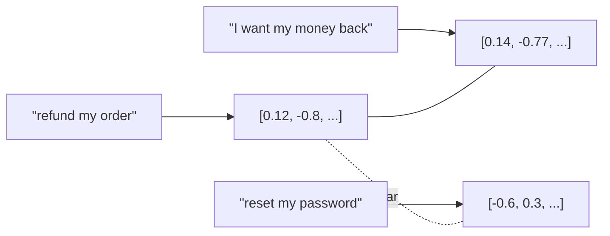

---
aliases:
  - Embedding
  - Vector Embeddings
  - Text Embeddings
  - Dense Vectors
tags:
  - llm
  - retrieval
  - fundamentals
---
> [!ABSTRACT] 🧠 Recall
> **In one line:** A learned map from text to a point in $\mathbb{R}^d$ where **distance means dissimilarity of meaning** — so "nearby" becomes computable.
> **Metaphor:** A map of a country. Two towns near each other on the map are near each other in reality; the coordinates themselves mean nothing.
> **Where it bites:** All of [[RAG]] and [[Vector Database|vector search]]. And the classic trap: *similar ≠ relevant*.

---
You want to find documents about "how do I get my money back" — and the relevant document says **"refund policy"**.

Zero words in common. Keyword search returns nothing.

So you need a function that puts those two strings *close together*. What would such a function even look like?

Start with the crudest version: give every word an ID. `refund` = 8,124, `money` = 402. Is 8,124 near 402? The numbers are arbitrary — adjacency means nothing. Dead end.

Try one-hot vectors: a 50,000-dim vector, 1 in one slot. Now every pair of distinct words is **exactly equidistant**. `cat` is as far from `kitten` as from `sovereignty`. Also dead.

The problem in both cases is the same: we *assigned* the coordinates. What if the coordinates were **learned**, from usage?

---
# The map

Look at a map of Britain. Manchester and Liverpool are 2cm apart; Manchester and Brighton are 15cm apart. The map is useful because ~={blue}distance on it corresponds to distance in the world.=~

And notice: the numbers themselves — "53.48°N, 2.24°W" — are meaningless on their own. Nobody reads a latitude and pictures Manchester. The *geometry* carries all the information, not the coordinates.

Embeddings are that, for meaning. A model is trained so that texts used in similar ways land in similar places. `refund` and `get my money back` end up as neighbours not because anyone said they were synonyms, but because **they appear in the same sorts of contexts across billions of documents** — the distributional hypothesis, doing all the work.

> [!NOTE] Embedding
> A dense, learned vector $\mathbf{v} \in \mathbb{R}^d$ (typically $d = 384$–3072) representing a word, sentence, document, image or user, trained so that **geometric proximity encodes semantic relatedness**. The individual dimensions are not interpretable; only relative positions are. ^embedding-def

> [!SUCCESS] Core idea
> Embeddings turn **"is this about the same thing?"** — a question no database can answer — into ~={pink}"is this vector nearby?"=~, a question a database answers in microseconds over a billion rows. That conversion is the entire point. ^embeddings-make-meaning-computable

The famous party trick, $\text{king} - \text{man} + \text{woman} \approx \text{queen}$, is from [[Efficient Estimation of Word Representations (word2vec)]] — evidence the space has *structure*, with directions that correspond to relations. (It's also over-sold; it only works cleanly for a narrow family of analogies.)

---
# Static vs contextual — the upgrade people skip past

word2vec gives `bank` **one** vector, averaged over riverbanks and Barclays. A transformer gives `bank` a *different* vector in each sentence, because it's built from [[Query, Key, and Value (QKV)|attention over the surrounding words]] — see [[How Contextual are Contextualized Word Representations]].

But there's a catch that trips people up: **you cannot just mean-pool BERT's token vectors and get a good sentence embedding.** It performs terribly — worse than averaging word2vec. The space is anisotropic (everything crammed into a narrow cone) and was never trained for sentence-level distance.

The fix is **contrastive training**: show the model pairs that *should* be close (a question and its answer, a sentence and its paraphrase) and negatives that shouldn't, and train the geometry directly. That's [[Sentence-BERT]], [[SimCSE- Simple Contrastive Learning of Sentence Embeddings]], [[Dense Passage Retrieval (DPR)]], and every modern embedding API.

| | Static (word2vec, GloVe) | Contextual token (BERT) | Sentence/retrieval (SBERT, E5, OpenAI) |
|---|---|---|---|
| One vector per | word type | word **occurrence** | passage ✅ |
| Handles polysemy | ❌ | ✅ | ✅ |
| Good for search | Weak | ~={red}Not out of the box=~ | Yes — it's what they're trained for |

---
# The traps that cost real money 🪤

> [!WARNING] Similarity is not relevance
> The single biggest misconception. Cosine similarity measures **"talks about the same topic in the same register."** That is *not* the same as "answers this question."
>
> `"How do I cancel my subscription?"` and `"You cannot cancel your subscription"` are near-maximally similar and opposite in meaning. Embeddings are largely blind to **negation, numbers, dates and identifiers** — `error code 4021` and `error code 4012` are neighbours. ~={red}That's why you need hybrid search (vectors + BM25) and a [[Reranking|reranker]], not a better embedding model.=~ ^similarity-is-not-relevance

> [!TIP] Operational rules
> - **Query and document must use the same model** — and honour its asymmetric prefixes (`query:` / `passage:`) if it has them. Getting this wrong silently halves your recall.
> - **Changing the embedding model means re-indexing everything.** Two models' spaces are unrelated; you cannot mix vectors from different models in one index. Budget for it. 🔁
> - **Normalise** to unit length, then cosine similarity is just a dot product.
> - **Dimensions cost money** — 3072-dim over 50M chunks is a lot of RAM. [[Matryoshka Representation Learning]] trains vectors that can be **truncated** to 512 dims with graceful degradation; use it.
> - Embeddings aren't only for text: [[Recommender Systems - Evolution|recsys]] has embedded users and items for a decade, and the [[Recommender Systems with Generative Retrieval (TIGER)|semantic ID]] line of work connects the two.

---
---
#### 🖼️ Meaning becomes geometry

No shared words between the first two, yet they land next to each other. That is the entire point — similarity of *meaning*, not of characters.

# ⁉️
You now have 50 million vectors. Comparing a query against every one of them is a linear scan of 50 million dot products, per request. Nobody does that.

→ [[Vector Database]]
