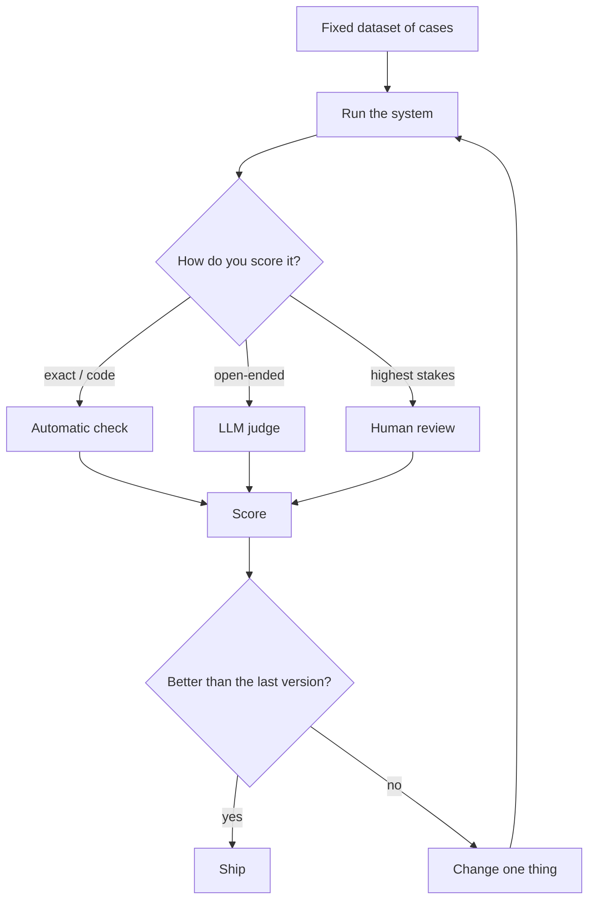

---
aliases:
  - Evaluation
  - LLM Evals
  - LLM-as-a-Judge
  - Benchmarks
tags:
  - llm
  - evaluation
  - metrics
---
> [!ABSTRACT] 🧠 Recall
> **In one line:** A **test suite for a non-deterministic system** — fixed inputs, graded outputs, tracked over time. Without it, every prompt change is a guess.
> **Metaphor:** Regression tests for a colleague who gives a slightly different answer every time you ask.
> **Where it bites:** It's the difference between an LLM demo and an LLM product. Also the most-skipped step in the industry.

---
You ship an assistant. A user complains about a bad answer. You tweak the [[System Prompt]] and the bad answer goes away. Ship it.

A week later, different complaint. Different tweak. Ship.

Third week, a customer reports that something which worked in week one is now broken.

Now try to answer a simple question: **is the system better or worse than it was three weeks ago?**

You can't. There's no measurement. Every change was validated against a sample of exactly one, and the sample was chosen by whoever complained loudest. You've been doing ~={red}three weeks of undirected random walk=~ and calling it iteration.

What would you have needed?

---
# Regression tests for a colleague

In normal software the answer is trivial: a test suite. Same input, same output, assert equality, run in CI.

But this system gives a *different* answer every time. There's no `assertEqual` for "was that a good explanation of our refund policy?"

So what survives from the test-suite idea when determinism is gone? Three things:

1. **Fixed inputs** — a set of cases that doesn't change when your mood does
2. **A grader** — not equality, but *something* that produces a number
3. **A tracked history** — so "better than last week" is a fact, not a feeling

That's it. That's an eval. It is much less sophisticated than people imagine, and much more valuable than they expect. ~={blue}The hard part is never the tooling; it's writing down what "good" means.=~

> [!SUCCESS] Core idea
> You cannot improve what you cannot measure, and with a non-deterministic system you cannot measure with anecdotes. ~={pink}An eval set turns prompt engineering from folklore into engineering=~ — and 30 well-chosen cases built in an afternoon beat a 5,000-case suite you never build. ^evals-make-it-engineering

---
# The grader ladder — always take the lowest rung that works 🪜

| Grader | How | Cost | Use when |
|---|---|---|---|
| **Exact / regex** | String match | Free ✅ | Classification, extraction, [[Structured Output]] |
| **Programmatic** | Run the code, validate the schema, execute the SQL | Free ✅ | Code, JSON, queries — a **real verifier** |
| **Reference-based** | Similarity to a gold answer ([[Embeddings]], ROUGE) | Cheap | Summarisation, translation |
| **LLM-as-judge** | Another model scores against a rubric | £ + slow | Open-ended quality, tone, [[Grounding\|faithfulness]] |
| **Human** | People rate | ££££ | The ground truth you calibrate judges against |

Most teams jump straight to LLM-as-judge because the task "feels subjective." Often a chunk of it isn't: *did it cite a real document id?* is a regex. *Did the SQL run?* is an execution. ~={blue}Decompose the quality question and grade each piece at the cheapest rung it admits.=~

---
# LLM-as-judge, done properly ⚖️

It works — judge/human agreement in the 80% range is typical, comparable to human/human agreement. But only with discipline:

> [!TIP] Rules for judges
> - **Give a rubric with concrete criteria**, not "rate 1–10." Ten-point scales are noise; **binary or 3-point** is far more reliable.
> - **Ask for reasoning first, score last** ([[Chain of Thought]] + [[Structured Output|field order]]).
> - **Pairwise beats absolute.** "Which is better, A or B?" is much more stable than "score this 0–100."
> - **Randomise A/B order** — judges have a strong position bias 🎲
> - **Validate the judge against human labels** on 50 cases. An unvalidated judge is an unmeasured instrument.
> - Known biases to correct for: **length** (longer wins), **self-preference** (a model favours its own family), **style over substance** (confident formatting wins). ^judge-rules

---
# Building a set that's actually worth having

> [!NOTE] Where cases come from
> - **Production failures** — the single best source. Every bug report becomes a permanent case 🥇
> - **Edge cases you fear** — empty input, hostile input, ambiguity, out-of-scope questions, the thing legal worries about
> - **Refusals** — cases where the *right* answer is "I don't know" or "I can't help with that." Almost always missing, and their absence is why systems over-answer
> - **A "does it still work" core** — 10 bread-and-butter cases that must never regress ^eval-case-sources

Layer them like a test pyramid: **unit** evals (one prompt, one behaviour) → **component** evals (retrieval recall separately from generation faithfulness — see [[RAG]]) → **end-to-end/trajectory** evals ([[Agentic Workflows|agent]] runs, graded on outcome). For agents, grade the **outcome and the cost**, not the prettiness of the reasoning — the reasoning [[Chain of Thought#^cot-unfaithful|may not be why it did what it did]].

> [!WARNING] Public benchmarks measure less than you think
> **Contamination** — the test sets are on the internet, so they're in the training data. Model cards report decontamination; trust it partially.
> **Saturation** — everything is at 90%+; the remaining points are often label noise.
> **Construct mismatch** — MMLU score tells you nothing about whether it handles *your* support tickets.
>
> Leaderboards are for **model selection shortlists**. ~={red}Your eval set is what decides anything.=~ See [[On the Difficulty of Evaluating Baselines]], [[Troubling Trends in Machine Learning Scholarship]], [[Towards Quantifying Benchmark Optimization in ASR Models]]. ^benchmarks-are-weak

> [!TIP] The minimum viable eval — do this today
> A CSV of 30 rows: `input`, `expected_behaviour`, `grader`. A script that runs them and prints a score. Commit it. Run it on every prompt change, in CI.
>
> That's an afternoon's work and it's the difference between engineering and superstition. Everything more sophisticated is an optimisation of this. 📋

Related: [[Perplexity]] (the pre-training metric, and why it doesn't answer these questions), [[NDCG]] and [[Recommender Systems - Evolution]] for retrieval metrics, [[Uncertainty]], [[Loss, Objectives, and Business Alignment]].

---
---
#### 🖼️ The loop that stops you shipping vibes

# ⁉️
Your evals measure whether the system does the right thing for a *cooperative* user. Nothing so far assumes anyone is actively trying to break it — and the attack surface here is unlike anything in normal software, because the instructions and the data share one channel.

→ [[Prompt Injection]]
