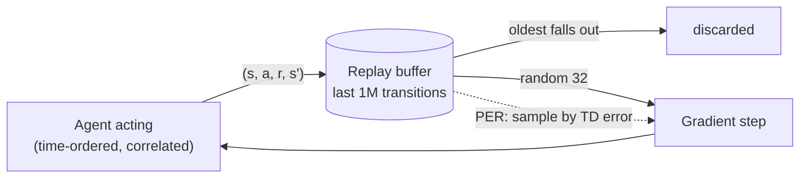

---
aliases:
  - Replay Buffer
  - Replay Memory
  - Experience Replay Buffer
  - Prioritized Experience Replay
  - Prioritised Experience Replay
  - PER
  - Hindsight Experience Replay
  - HER
tags:
  - deep-rl
  - reinforcement-learning
  - decision-sciences
---
> [!ABSTRACT] 🧠 Recall
> **In one line:** Store past transitions in a big buffer and train on **random draws** from it — instead of on experience in the order it happened. Breaks the correlation between samples, and lets each experience be learned from many times.
> **Metaphor:** Revising with a shuffled deck of flashcards from the whole term — not by re-reading today's lecture, in order, once.
> **Where it bites:** DQN, DDPG, SAC — every off-policy deep RL method. And the reason PPO *can't* have one.

---
An agent plays a game at 60 frames a second. Think about what two consecutive frames look like.

Almost identical. The ball has moved three pixels. So a minibatch made of the **last 32 frames** is, to a very good approximation, *one* training example — copied 32 times.

Stochastic gradient descent rests on an assumption so basic nobody states it: that the examples in a batch are roughly **independent** draws from the data you care about ([[Random variable#Why this underpins all of ML|the mini-batch as a sample]]).

~={blue}What happens to a network fed 32 copies of "the ball is top-left", then 32 copies of "the ball is a bit lower"…?=~

---
# The flashcards 🗂️

It fits whatever it's looking at right now — hard — and overwrites what it learned a minute ago. It spends ten minutes in the left half of the screen and forgets how to play the right half. **Catastrophic forgetting**, caused entirely by the *order* of the data.

You know the cure from revising for exams. You don't re-read today's lecture in order and call it done. You build a **deck of flashcards from the whole term**, shuffle it, and revisit cards long after the lecture they came from.

1. Every step, write a card: $(s,\ a,\ r,\ s')$. Drop it into a buffer of the last ~1,000,000.
2. To train, draw **32 cards at random** from the *whole* buffer.
3. When it's full, the oldest card falls out.

![[replay_decorrelation.png]]
> [!TIP] Reading the chart
> **Left:** the 32 red dots are one consecutive minibatch — a single tiny patch of the state space. The 32 green dots are one replay minibatch — scattered across everything the agent has seen. **Right:** in the raw stream, a sample is **0.994** correlated with the next one, and still **0.52** correlated with the one *100 steps later*. Draws from the buffer: **≈ 0**.

> [!NOTE] Experience replay
> Store transitions $(s, a, r, s')$ in a finite buffer; train on minibatches sampled from it rather than on the most recent experience. Lin, 1992; made famous by [[DQN]]. ^experience-replay-def

> [!SUCCESS] Core idea
> ~={pink}Replay turns a stream back into a dataset.=~ It buys two things at once. **Decorrelation** — batches look i.i.d. again, so SGD behaves. **Reuse** — each hard-won interaction is learned from many times (about 8× each in DQN), instead of once and gone. ^stream-into-dataset

---
# The catch — it only works off-policy

Every card in the buffer was written by an **older version of you**. The policy that produced it no longer exists.

So whatever learns from the buffer must be able to learn from *someone else's* behaviour → [[On-Policy vs Off-Policy]].

| | Can use a replay buffer? | Why |
|---|---|---|
| [[Q-Learning]], [[DQN]] | ✅ | the target $\max_{a'} Q(s', a')$ doesn't care who chose $a$ |
| DDPG, TD3, [[SAC]] | ✅ | off-policy actor–critics |
| [[Policy Gradient\|REINFORCE]], A2C | ❌ | the gradient is only valid for data from the *current* policy |
| [[PPO]] | ⚠️ barely | re-uses **one fresh batch** for a few epochs, guarded by the clipped [[On-Policy vs Off-Policy#The correction — importance sampling\|importance ratio]] — then bins it |

This is the single biggest reason off-policy methods are so much more **sample-efficient** than on-policy ones. It's also one leg of the [[Function Approximation#^deadly-triad|deadly triad]] — efficiency bought with stability.

---
# Variants worth knowing

| Variant | Idea | The catch |
|---|---|---|
| **Prioritised replay (PER)** | sample cards in proportion to their **TD error** — revise the ones that still surprise you | it skews the data distribution → needs importance weights to de-bias. Same instinct as [[Value and Policy Iteration\|prioritised sweeping]] |
| **Hindsight replay (HER)** | the robot aimed for A, ended up at B, got zero reward. **Relabel** the episode as *"the goal was B"* — now it's a success | only for goal-conditioned tasks. A brilliant fix for [[Reward Function#Sparse, dense, shaped\|sparse rewards]]: every failure becomes a lesson in how to reach *somewhere* |
| **$n$-step replay** | store short sequences, not single transitions | slightly off-policy inside the $n$ steps |
| **Demonstrations in the buffer** | seed it with expert transitions | → [[Imitation Learning]] |
| **A fixed buffer, never added to** | that's just [[Offline RL]] | and then a new problem appears |

> [!TIP] Replay is a degenerate world model
> [[Model-Based vs Model-Free RL#Dyna — just do both|Dyna]] learns a model and replays *imagined* transitions from it. A replay buffer is a model with perfect accuracy and zero generalisation: it can only "predict" transitions it has literally seen. Same purpose — squeeze more learning out of each real step — at opposite ends of the generalisation scale.

---
# Practicalities

- **Size.** Too small → correlated again, and it forgets rare events. Too large → dominated by data from a much worse, much older policy. 1M is the folk default.
- **Memory.** A million 84×84 frames is ~7 GB as `uint8` — *if* each frame is stored once. Store every 4-frame stack separately and it's 28 GB; store them as floats and it's over 100 GB. Keep `uint8`, and rebuild the stacks at sampling time.
- **Warm-up.** Don't train until a few thousand transitions are in, or the first batches are near-duplicates again.

> [!WARNING] "A bigger buffer is always better"
> Older cards describe a game the agent no longer plays: early on it died in ten seconds, so the buffer is full of opening moves. As the policy improves, that data becomes both **stale** (off-policy error grows) and **unrepresentative**. There's a real optimum, and it moves during training. ^bigger-buffer-isnt-better

---
---
#### 🖼️ Write in order, read at random

---
> [!SUCCESS] If you remember one thing
> **Write experience in order; read it back shuffled.** ~={pink}That one change makes RL data look enough like a dataset for SGD to work — but only for algorithms that can learn from a past self.=~

---
# ⁉️
Replay and frozen targets are how the *value-based* family got stable. The *policy-gradient* family had its own, different stability crisis: a single over-enthusiastic update could wreck the policy — which then collected wrecked data, and never recovered.

→ [[PPO]]
