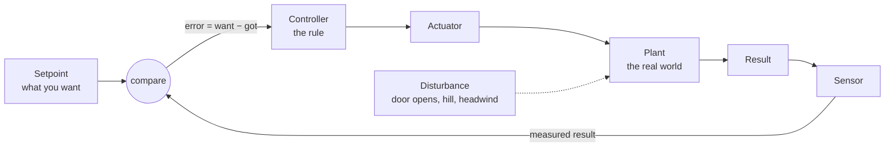

---
aliases:
  - Feedback
  - Feedback Control
  - Closed-Loop Control
  - Open-Loop Control
  - Closed Loop
  - Open Loop
  - Negative Feedback
  - Positive Feedback
  - Bang-Bang Control
  - On-Off Control
  - Hysteresis
  - Setpoint
  - Control Loop
tags:
  - control-theory
  - decision-sciences
  - fundamentals
---
> [!ABSTRACT] 🧠 Recall
> **In one line:** Measure the result, compare it with what you wanted, and let the **gap** drive the next action — over and over. A closed loop is allowed to be wrong and recover; an open loop has to be right in advance.
> **Metaphor:** A toaster vs an oven. One runs a timer and hopes. The other keeps checking the temperature.
> **Where it bites:** Thermostats and cruise control, yes — but also autoscalers, training loops, retraining pipelines, and any recommender whose output becomes its own training data.

---
You put a slice of bread in the toaster, turn the dial to 3, push the lever down. Two minutes later: golden. Perfect.

Next morning the bread is straight from the freezer. Same dial, same two minutes. It pops up pale, with a cold middle.

The morning after, you put in a second round straight after the first. The toaster is already hot. It comes out burnt.

Same machine. Same setting. Three different results. ~={blue}What did the toaster never do, on any of those three mornings?=~

---
# The toaster and the oven

It never **looked at the bread**.

A toaster is a timer wired to a heater. You tell it *what to do* ("heat for two minutes"), it does exactly that, and whether the bread ends up toasted is, frankly, none of its business. If anything about the world differs from the day you picked the setting — frozen bread, a warm machine, a thicker slice — it has no way of knowing.

Now the oven. You set **180°**. Inside there's a thermometer. Colder than 180? Element on. Hotter? Element off. Open the door and dump the heat out, put in a frozen lasagne — it doesn't matter. It notices, because ~={blue}the *result* is wired back into the *decision*.=~

You told the toaster what to **do**. You told the oven what you **want**. That's the whole difference.

![[feedback_loop_toaster_vs_oven.png]]

> [!NOTE] Open loop vs closed loop
> **Open-loop** control acts on a plan made in advance and never checks the outcome. **Closed-loop** (feedback) control measures the outcome, compares it with the target, and acts on the difference — continuously. ^open-closed-def

> [!SUCCESS] Core idea
> ~={pink}A closed loop is a machine that is allowed to be wrong and recover.=~ An open loop must be correct before it starts. Feedback buys you competence *without* needing a model of the world — a thermostat knows no thermodynamics. See [[Decision Sciences#^open-vs-closed-loop|the story version]]. ^feedback-core

---
# The seven words

Every control conversation uses these, so pin them to the oven once:

| Term | In the oven | In general |
|---|---|---|
| **Plant** | the oven cavity | the thing being controlled |
| **Setpoint** | 180° | the target |
| **Sensor** | the thermometer | how you observe the result |
| **Error** | 180° − measured | **the gap.** The star of the whole field |
| **Controller** | the thermostat logic | the rule that turns error into action |
| **Actuator** | the heating element | what you can physically change |
| **Disturbance** | you opening the door | anything pushing the plant that you didn't command |

> [!TIP] Error is the only thing a controller ever looks at
> Control theory is very nearly the study of *"what should I do with the error?"* React to it now, add it up over time, watch how fast it's changing — those three answers are [[PID Controller|P, I and D]].

---
# The crudest controller that works — on/off 🌡️

The oven's rule is as simple as a rule can be: *below target → full on. Above → off.* That's called **bang-bang** (or on-off) control, and it runs most of the heating on the planet.

But try it exactly as stated and something ugly happens. Right at 20.0° the sensor reading flickers — 19.98, 20.01, 19.99 — and the heater clicks on, off, on, off, several times a second. That's **chatter**, and it kills relays and compressors.

So what else can we do? Stop demanding *exactly* 20. Switch on below **19.5°**, off above **20.5°**, and inside that band — leave it alone.

![[bangbang_hysteresis.png]]
> [!TIP] Reading the chart
> Same room, same noisy sensor. With a ±0.5° band the heater switches **35 times** in 90 minutes. With no band: **493 times.** The temperature never settles — it bounces inside the band *on purpose*. That gap between the on-threshold and the off-threshold is **hysteresis**. ^hysteresis

---
# "Positive" feedback is not the good kind

> [!WARNING] A naming trap
> **Negative** feedback pushes *against* the error — too hot, so heat less. It's the stabilising kind, and it's what everything above is.
> **Positive** feedback pushes *with* the deviation — and runs away. A microphone too close to its speaker. A bank run. A recommender that shows popular items, which get more clicks, which makes them more popular ([[Recommender Systems - Evolution]]).
> ~={red}Positive here means "same sign", not "desirable".=~ ^positive-feedback-is-runaway

---
# You already run feedback loops 🔁

| System | Setpoint | Sensor | Actuator |
|---|---|---|---|
| Autoscaler | CPU at 60% | metrics pipeline | replica count |
| Gradient descent | loss → minimum | the gradient | the weight update (learning rate = how hard you push) |
| `ReduceLROnPlateau`, early stopping | val loss improving | validation run | the schedule |
| Drift monitor + retraining | accuracy ≥ target | labelled feedback | a retrain |
| An RL agent | maximum reward | observations | actions → [[Reinforcement Learning]] |

Which is why control vocabulary — overshoot, oscillation, lag, [[Stability|instability]] — describes training curves and autoscalers so well. They're the same animal.

---
---
#### 🖼️ The loop every controller lives in

---
> [!SUCCESS] If you remember one thing
> Open loop: *"here's what to do."* Closed loop: *"here's what I want — keep checking."* ~={pink}The moment the world can surprise you, only the second one survives.=~

---
# ⁉️
On/off is crude — it's either flat out or nothing, which is why the temperature saws up and down forever. The obvious next question: instead of *whether* to push, can the controller decide **how hard**?

→ [[PID Controller]]
