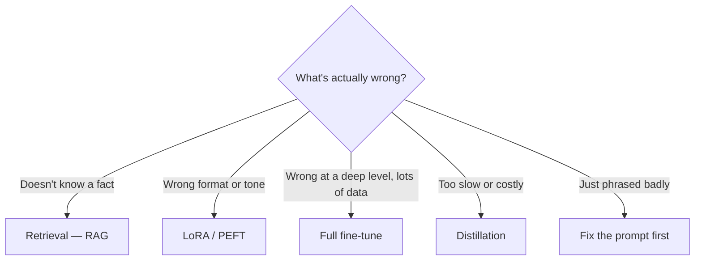

---
aliases:
  - Finetuning
  - SFT
  - Supervised Fine-Tuning
  - Continued Pretraining
tags:
  - llm
  - training
  - adaptation
---
> [!ABSTRACT] 🧠 Recall
> **In one line:** Keep training a pre-trained model on *your* data so the **weights** change — it teaches **behaviour and form**, and is a poor way to teach facts.
> **Metaphor:** Onboarding a new hire. You teach them how *we* do things here; you don't teach them the contents of the wiki.
> **Where it bites:** The default wrong answer to "the model doesn't know our stuff." That's a [[RAG]] problem.

---
Two teams, same complaint: *"the model gets our domain wrong."* Both fine-tune. One succeeds, one wastes six weeks.

**Team A** wanted every response formatted as their clinical triage template, in their house register, always ending with an escalation flag. They fine-tuned on 3,000 examples. It worked beautifully.

**Team B** wanted the model to know their 40,000 internal policy documents. They fine-tuned on all of it. The model came back *sounding* exactly like their documentation and confidently citing policies that don't exist. Worse than before, because now the [[Hallucination|fabrications]] were stylistically perfect.

Same technique, same effort. Why did one land and the other backfire?

---
# The new hire

You hire someone experienced. Onboarding week.

What onboarding actually does: teaches them **how things are done here.** The tone in client emails. That we escalate rather than improvise. The format of our reports. Which judgement calls to make ourselves.

What onboarding does **not** do: implant the contents of the company wiki. Nobody memorises 40,000 documents in a week. And you wouldn't want them to — the wiki changes on Tuesdays. You teach them **where to look** and trust them to look.

> [!SUCCESS] Core idea
> Fine-tuning shifts a **distribution over behaviour**, not a lookup table of facts. It's excellent at *"respond like this"* and bad at *"know this."* Team B was trying to use onboarding as a filing cabinet. ~={pink}Form and behaviour → fine-tune. Facts → [[RAG]].=~ ^what-finetuning-teaches

> [!NOTE] Fine-tuning
> Continuing gradient-descent training of a pre-trained model on a smaller, task-specific dataset, at a much lower learning rate. Same objective as pre-training (next-token prediction, [[Cross Entropy]]), different data — and usually a loss **mask** so only the *response* tokens contribute, not the prompt. ^finetuning-def

---
# The varieties (people say "fine-tuning" for all of them) 🧬

| Kind | Data | Purpose |
|---|---|---|
| **Continued pre-training** | Raw domain text, no labels | Shift the base distribution into a domain (legal, code, a language) |
| **SFT** (supervised fine-tuning) | (prompt, ideal response) pairs | Teach a task, a format, a persona ← *the usual meaning* |
| **[[Instruction Tuning]]** | Many diverse tasks as instructions | Turn a text-completer into an assistant |
| **Preference tuning** ([[RLHF]], [[DPO]]) | (prompt, better, worse) triples | Teach *which* of two good-looking answers is better |

And orthogonally: **full** fine-tuning (update all weights — needs ~16× the model size in VRAM for optimizer state) vs **parameter-efficient** ([[LoRA]] — update ~0.1%, which is what nearly everyone actually does).

---
# When it's genuinely the right call ✅

- **Format and structure** you can't reliably prompt into place
- **A consistent voice** across thousands of outputs
- **Latency/cost**: a fine-tuned 7B matching a prompted 70B is a real and large win 💰
- **Prompt compression**: fold a 2,000-token [[System Prompt]] into the weights
- **[[Distillation]]**: train a small model on a big one's outputs
- **Skills genuinely absent** from the base model (an unusual DSL, a proprietary protocol)

## And when it isn't ❌
- You want it to know current/changing facts → [[RAG]]
- You have 200 examples → [[In Context Learning|few-shot prompting]]
- You haven't tried a serious prompt yet → do that first, it's free
- You need citations and auditability → weights can't cite
- The requirement changes weekly → you now own a retraining treadmill

---
# The failure modes 🪤

> [!WARNING] Catastrophic forgetting
> Train hard on narrow data and the model gets better at your task while ~={red}silently getting worse at everything else=~ — reasoning, other languages, instruction-following, refusals. Safety behaviour is especially fragile: a few hundred benign-looking examples can meaningfully erode alignment training.
>
> Mitigations: low learning rate (1e-5 → 1e-6 range), few epochs (1–3), mix in ~10–20% general data, prefer [[LoRA]], and **always** run a general-capability [[Evals|eval]] alongside your task eval — not just the task one. ^catastrophic-forgetting

> [!WARNING] Data quality dominates everything
> 1,000 carefully curated examples beat 100,000 scraped ones, repeatedly and by a lot. And the model imitates the **shape** of your data with uncomfortable fidelity: if your examples all hedge, it hedges; if none of them ever say "I don't know," ~={red}it will never say "I don't know"=~ — you will have trained the hallucination in. Include refusals, edge cases, and short answers on purpose. ^data-quality-dominates

> [!TIP] Checklist before you start
> 1. A held-out eval set that exists **before** training 🎯
> 2. A prompted baseline on that same set (surprisingly often it wins)
> 3. Deliberate negative/refusal examples in the data
> 4. A general-capability regression check
> 5. A plan for who retrains this in six months

Related: [[Regularization]] (same overfitting story), [[Backpropagation]], [[Mixed Precision training]], [[Is Next-Chunk Reasoning RL Really Better than SFT- Revisiting Training Strategies under no-CoT Data]].

---
---
#### 🖼️ Which knob to reach for

# ⁉️
Full fine-tuning of a 70B model needs well over a terabyte of GPU memory for weights, gradients and optimizer state. There's a trick that gets it onto one card — by noticing that the *update* is far simpler than the weights.

→ [[LoRA]]
