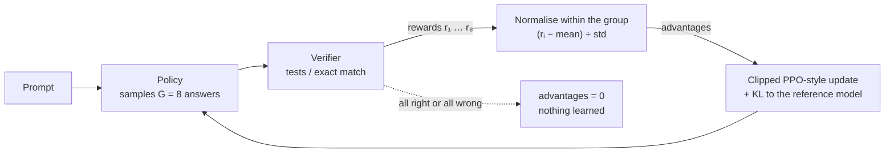

---
aliases:
  - Group Relative Policy Optimization
  - Group Relative Policy Optimisation
  - RLVR
  - Reinforcement Learning with Verifiable Rewards
  - RL with Verifiable Rewards
  - Verifiable Rewards
  - Verifiable Reward
  - Outcome Reward
  - Reasoning RL
tags:
  - llm
  - alignment
  - reinforcement-learning
  - deep-rl
  - reasoning
---
> [!ABSTRACT] 🧠 Recall
> **In one line:** For each prompt, **sample a group of answers, score them, and use the group's own average as the baseline** — *better than your siblings → more likely; worse → less*. No critic network. Usually paired with rewards a **program can check**.
> **Metaphor:** Grading on a curve. No absolute standard needed — each answer is judged against its classmates on the same question.
> **Where it bites:** Training reasoning models (DeepSeek-R1 and descendants). Half the memory bill of PPO-style RLHF.

---
You want a model that's better at maths.

Notice two things about that task.

**One** — you don't need a human rater, or a [[Preference Learning|reward model]]. The answer is 42 or it isn't. The code passes the tests or it doesn't. A *program* can mark it, perfectly, for free.

**Two** — [[PPO]] needs a **critic**: a value network predicting how well each partial response will end up. For a 70B policy that's *another* 70B model to hold and train — on top of the reference model. At [[Distributed Training#Start with the real question|~16 bytes per parameter]], that's a very expensive opinion.

~={blue}The critic exists to answer one question: "how good is a *typical* answer to this prompt?" Is there a cheaper way to find out?=~

---
# Grading on a curve 📝

Just **ask the model eight times**.

For each prompt, sample a **group** of $G$ responses from the current policy. Mark each one. The group's average score *is* "how good is a typical answer here". Then every response is graded **relative to its siblings**:

$$A_i = \frac{r_i - \text{mean}(r_1 \ldots r_G)}{\text{std}(r_1 \ldots r_G)}$$

Eight answers to one problem; three correct:

$$r = [1, 0, 0, 1, 0, 0, 0, 1] \quad\Rightarrow\quad \text{mean} = 0.375,\;\; \text{std} = 0.484$$
$$A_\text{correct} = \frac{1 - 0.375}{0.484} = \mathbf{+1.29} \qquad A_\text{wrong} = \frac{0 - 0.375}{0.484} = \mathbf{-0.77}$$

![[grpo_group_advantage.png]]
> [!TIP] Reading the chart
> **Left:** a useful prompt. The three correct answers get pushed up, the five wrong ones pushed down. **Right:** a prompt the model already gets right 8 times out of 8. Every advantage is **zero** — there's nothing to learn. Same if it gets all eight *wrong*. ~={red}Only prompts at the edge of the model's ability produce any gradient=~ — so choosing problems of the right difficulty matters as much as the algorithm.

Then apply [[PPO]]'s clipped update with those advantages — every token in a response shares its response's advantage — plus a [[KL Divergence|KL]] penalty back to the reference model.

> [!NOTE] GRPO
> Group Relative Policy Optimization (DeepSeekMath, 2024): a PPO variant that drops the learned value function and estimates the advantage of each sampled response from the **normalised rewards of a group of responses to the same prompt**. ^grpo-def

> [!NOTE] RLVR
> **R**einforcement **L**earning with **V**erifiable **R**ewards: the reward is computed by a program — exact-match on a final answer, unit tests, a proof checker, a format check — rather than by a learned reward model. ^rlvr-def

> [!SUCCESS] Core idea
> ~={pink}It's [[Policy Gradient|REINFORCE]] with a per-prompt Monte Carlo baseline.=~ The [[Policy Gradient#^baseline|baseline]] was always *"how good is it usually from here?"* — PPO **learns** that with a network; GRPO **measures** it with a handful of samples. That only works because the task is a [[Contextual Bandit|one-step]] episode: one prompt, one response, one score, no intermediate states to value. ^group-mean-is-the-baseline

---
# The lineage, in one table

| | Reward comes from | Baseline comes from | Large models in memory |
|---|---|---|---|
| [[RLHF]] with [[PPO]] | a learned reward model | a learned **critic** | 4 — policy, reference, reward, value |
| [[DPO]] | the preference pairs, directly | — (no sampling at all) | 2 — policy, reference |
| **GRPO + RLVR** | a **verifier program** | the **group mean** | 2 — policy, reference |

---
# Why it made headlines

DeepSeek-R1 (2025) applied this at scale with *outcome-only* rewards — no step-by-step supervision. Long, self-correcting [[Chain of Thought|chains of thought]] emerged on their own, because on hard problems *thinking longer* is what raised the pass rate. That's [[Test-Time Compute]] being **learned** rather than prompted.

---
# What goes wrong 🪤

| Failure | What happens |
|---|---|
| **The verifier gets gamed** | right final number via wrong reasoning; code that special-cases the visible tests; answers formatted to fool a regex. A program is still a *proxy* → [[Reward Hacking]] |
| **No signal from easy or impossible prompts** | all-correct or all-wrong groups give zero advantage; the useful curriculum is narrow |
| **Coarse credit** | every token gets the same advantage — the one wrong step and the 700 right ones around it → [[Credit Assignment#The LLM version — and it's a live research problem 🤖\|the LLM credit-assignment problem]] |
| **Normalisation biases** | dividing by the group's std, and averaging the loss per token, both tilt the gradient — toward low-variance prompts and toward particular response lengths. Several follow-up papers exist solely to patch these |
| **Exploration collapse** | the policy sharpens onto one solution style; output diversity falls → [[Mode Collapse]] |

> [!WARNING] "RL taught the model new reasoning abilities"
> Treat that claim with care. A good deal of evidence says RLVR mostly **sharpens** — it takes problems the base model could *already* solve one time in sixteen and makes it solve them first time (pass@$k$ becoming pass@1), rather than unlocking problems it could never solve. The vault has a paper on precisely this: [[Locked at the Entrance, Open Inside- Where RLVR Narrows the Solution Space]]. Whether that's a limitation or the whole point depends on what you need. ^sharpening-not-expanding

> [!TIP] Where it doesn't reach
> Verifiable rewards exist for maths, code, formal logic, structured extraction. They don't exist for "was that email tactful?". For those you're back to [[Preference Learning]] — or to the active research frontier of rubrics and model-based judges: [[Small Language Models as Judges for Rubric-Based Reinforcement Learning]], [[ImpossibleRubrics- Stress-Testing Generated Rubrics as Reward Signals]], [[On-policy Distillation with Verifiable Reward]].

---
---
#### 🖼️ One prompt, a group of tries, graded against each other

---
> [!SUCCESS] If you remember one thing
> **Sample a group, grade on the curve, skip the critic.** ~={pink}It works because a verifier can't be flattered and a one-shot task has nothing for a critic to value — and it stops working wherever either of those stops being true.=~

---
# ⁉️
That closes the loop. We began with a thermostat that needed someone to set the target, and we've ended with systems trying to work out what the target even *is* — from people's choices, or from whatever a program can check. Every one of those is a proxy, and an optimiser will find where a proxy and the real goal come apart → [[Reward Hacking]].

And when there are *many* learners sharing a world → [[Multi-Agent Reinforcement Learning]].

The map that sequences all of this — and tells you which note to open next:

→ [[Control and Reinforcement Learning]]
