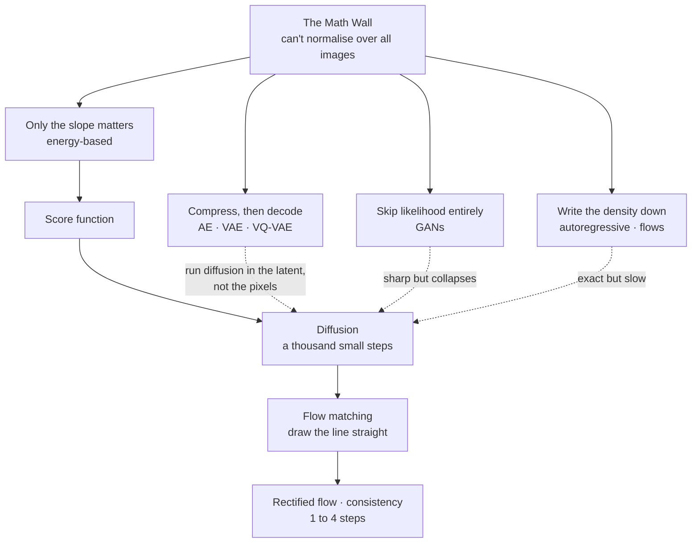

---
aliases:
  - Generative Modelling
  - Generative Modeling
  - Generative Model
  - Deep Generative Models
  - MOC - Generative Models
  - MOC - Diffusion
  - Diffusion and Flows
  - Image Generation
tags:
  - moc
  - generative-models
  - diffusion
---

> [!ABSTRACT] 🧠 Recall
> **In one line:** The map — every family here answers one question: **how do you turn simple noise into data?** Follow the answers in the order people found them, and each term lands as *one family's trick*, or *the thing that broke the previous one*.
> **Metaphor:** A sculptor. The statue is already in the block; every family is a different way of removing what isn't the statue — in one blow, or in a thousand small cuts.
> **Where it bites:** Use this page to *find* the note. Use the chain at the bottom to read them in order.

---

**Generative Modeling** is training a computer to turn simple random noise (like TV static) into realistic data (like a photo, text, or audio).

Because we cannot write down a exact mathematical formula for "what makes an image look real," we train neural networks using real examples to map random numbers to realistic data.

## The Sculptor Metaphor

- **Real Concept**: Generative models start with a simple Gaussian probability distribution of random noise $p(z)$ and gradually transform it into a complex distribution of real data $p(x)$.    
- **Metaphor**: Think of random noise as a block of marble. Generating an image is like a sculptor chipping away marble to reveal the statue inside.
- **Where the metaphor breaks**: A sculptor only _remores_ material. Generative models actually calculate vectors and directions in multi-dimensional space to construct coherent patterns step-by-step.
- **Plain Technical Meaning**: Every generative model learns a specific mathematical rule to transform unstructured random noise vectors into structured data vectors.

~={blue}Every family of generative model is a different answer to two questions: **what path do you take from noise to data — and what do you train a network to do along it?**=~

## 🔺 The Central Obstacle: The Math Wall
To mathematically calculate how likely an image is, you have to divide by the sum of _every possible image configuration_.

- **The Problem:** Calculating every possible image configuration is mathematically impossible (intractable).
- **The Solution:** Every generative model family is just a clever trick to bypass or approximate this impossible step.

The two notes underneath that obstacle, before any family arrives:

→ **[[Maximum Likelihood]]** — turn the knobs until your data stops being a surprise. Also *why* likelihood models blur while GANs collapse.
→ **[[Latent Variable Models]]** — a handful of hidden sliders drive a million pixels. *Noise in → network → data out* is the template for everything below.
→ **[[KL Divergence]]** · **[[Cross Entropy]]** · **[[Random variable]]** — the measuring sticks underneath all of it.

## The Generative Trilemma

You can almost never get all three at once:

```
                  [ High Quality ]
                        /  \
                       /    \
                      /   🔺  \
                     /         \
[ High Diversity ] -------------- [ Fast (1 Step) ]
```

- **GANs:** High Quality + Fast _(Lacks Diversity / Mode Collapse)_
- **VAEs / Flows:** High Diversity + Fast _(Lacks Quality / Lacks Sharpness / Blurry)_
- **Diffusion:** High Quality + High Diversity _(Lacks Speed / Needs many steps)_

## 🗺️ The 5 Main Model Families

### 1. Direct Density Models (Writing Down the Odds)

Instead of guessing, these models try to write down exact mathematical probabilities.
- **Autoregressive Models** (e.g., GPT, PixelCNN)
    - **How it works:** Predicts data element-by-element (pixel-by-pixel or word-by-word), using the previous elements to predict the next.
    - **Trade-off:** Exact probabilities, but painfully slow generation.
    
- **Normalizing Flows**  
    - **How it works:** Uses reversible mathematical equations to stretch and warp a simple noise distribution directly into the shape of real data.
    - **Trade-off:** Exact probabilities, but the math forces strict architectural limits on the network.
    
- **Energy-Based Models (EBMs)**  
    - **How it works:** Assigns a single "unrealism score" (energy) to an image. Lower energy = more realistic.
    - **Key Insight:** You don't need to know the total probability of all images—you only need to know the **slope** (which direction makes the image lower energy).

→ **[[Auto-regressive models]]** · **[[Normalizing Flows]]** · **[[Energy-Based Models]]**

That last one is the bridge to everything modern. Hold onto it — "only the slope matters" comes back in family 4.

### 2. Compression Models (Squeeze & Rebuild)

Pass the data through a tight bottleneck to extract its core meaning (latents).

- **Autoencoder (AE)**
    - **How it works:** Compresses an image into a tiny vector (code), then rebuilds it.
    - **Limitation:** Great for compressing, but cannot generate new random images smoothly because its latent space has empty gaps.
    
- **Variational Autoencoder (VAE)** 
    - **How it works:** Compresses the image into a smooth, randomized probability distribution (a fuzzy cloud) rather than a single fixed point.
    - **Trade-off:** Easy to sample new data, but outputs are often blurry because the model averages together multiple possible realistic details.
    
- **VQ-VAE** 
    - **How it works:** Snaps the latent vector to a grid of predefined codebook numbers (discrete tokens). Think of it as "building blocks" for visual features.

→ **[[Autoencoder]]** · **[[Variational Autoencoder]]** · **[[VQ-VAE]]**

### 3. Adversarial Models (The Game)

Skip calculating probabilities entirely. Treat generation as a game between two networks.

- **Generative Adversarial Network (GAN)**
    - **How it works:**
        1. **Generator (The Forger):** Tries to create fake images from noise.
        2. **Discriminator (The Detective):** Tries to spot if an image is fake or real.
    - **Trade-off:** Generates razor-sharp images instantly in 1 step, but training is unstable and prone to **Mode Collapse** (the forger finds one single fake image that tricks the detective, and outputs only that image forever).

→ **[[Generative Adverserial Network]]** · **[[Mode Collapse]]**

### 4. Denoising & Diffusion (1,000 Small Steps)

Instead of making one giant leap from noise to image, take hundreds of tiny cleaning steps.

```
[ Pure Static ]  ->  [ Denoise 1% ]  ->  [ Denoise 1% ]  -> ... ->  [ Clean Image ]
```

- **Score Function & Score Matching**
    - **Definition:** The "score" is an arrow pointing in the direction of higher data density (more realism).
    - **How it works:** Learning to remove a small amount of noise from an image is mathematically identical to finding the score arrow.

- **Diffusion Models (e.g., DDPM)**
    - **Forward Process:** Slowly destroy an image by adding Gaussian noise over ~1,000 steps until it becomes pure static.
    - **Reverse Process:** Train a neural network to predict the noise added at any given step, and subtract it.
    - **Trade-off:** Top-tier image quality and full diversity, but generation requires dozens to hundreds of network passes.

→ **[[Score Function]]** — the arrow, at every point in space, pointing toward "more like the data".
→ **[[Langevin Dynamics]]** — follow the arrows, plus exactly the right amount of noise. Gets the locations right and the proportions wrong, unless you anneal.
→ **[[Diffusion Models]]** — one impossible leap replaced by a thousand easy steps. **Start here** for this family.
→ **[[Forward Diffusion Process]]** — a crossfade from image to static that you can jump into at any point. The noise schedule decides what the model gets good at.
→ **[[Denoising Objective]]** — noise an image, predict the noise, MSE. ε vs x₀ vs v — and the loss curve will lie to you.
→ **[[Diffusion Sampling]]** — step a little toward a blurry guess, then repeat. What all the sampler names actually mean.
→ **[[Score SDE]]** — the framework that shows diffusion and score matching were the same thing all along.

### 5. Flow Matching & Distillation (Straightening the Path)

The modern evolution of diffusion designed to solve the speed problem.

- **Flow Matching / Rectified Flow**
    - **How it works:** Standard diffusion paths curve randomly through noise space. Flow Matching draws a **straight line** directly from noise to the target image.
    - **Why it matters:** Straight paths allow step-solvers to take massive jumps without losing image quality.
    
- **Consistency Models**
    - **How it works:** Instead of learning how to take one small step along the path, the model is trained to predict the final destination directly from any point on the trajectory.
    - **Result:** High-quality generation in just **1 to 4 steps**.

→ **[[Neural ODE]]** · **[[Flow Matching]]** · **[[Rectified Flow]]** · **[[Consistency Models]]**

*(If you arrived here calling this "flow control" — [[Flow Matching]] is the note you want.)*

## Making Generation Fast & Controllable

- **Latent Diffusion (e.g., Stable Diffusion):** Runs the diffusion process inside a compressed latent space (via a VAE) rather than full pixel resolution. This makes training and sampling up to 50x cheaper.
- **CLIP:** A shared map between text and images. Translates your text prompt into vectors that guide the diffusion model's direction.
-  **Classifier-Free Guidance (CFG):** Runs the model twice per step (once with your prompt, once without) and amplifies the difference to force the image to follow your prompt strictly. 
- **Diffusion Transformer (DiT):** Replaces the traditional U-Net backbone with a Vision Transformer (ViT). Scales far better with compute and data size.

→ **[[Conditional Generation]]** — the prompt is just another input. Concatenate it, modulate with it, or cross-attend to it.
→ **[[Classifier-Free Guidance]]** — the fidelity ↔ diversity dial. Costs you two forward passes per step.
→ **[[CLIP]]** — how the prompt gets in, and why prompts get read as a bag of concepts.
→ **[[Latent Diffusion]]** — autoencoder for the pixels, diffusion for the meaning. 48× fewer numbers to touch on every step.
→ **[[U-Net]]** — down for *what*, up for *where*, bridges for *detail*.
→ **[[Diffusion Transformer]]** — patches as tokens. Worse when small, better when large, and onto the LLM scaling curve.
→ **[[Controlling Diffusion]]** — img2img, inpainting, ControlNet, LoRA, DreamBooth, IP-Adapter, inversion.
→ **[[Evaluating Generative Models]]** — fidelity *and* diversity, measured on sets. FID is a smoke alarm, not a judge.

## Beyond images

The same machinery, pointed at things that aren't pictures.

→ **[[Discrete Diffusion]]** — for tokens, "noise" means masking. BERT's objective at every masking ratio at once.
→ **[[Video Diffusion]]** — generate the whole clip as one block so the frames agree. Condition it on actions and it becomes a **world model**.
→ **[[Diffusion Policy]]** — actions are just another thing to generate. And the reverse: RL fine-tuning *of* diffusion models.
→ **[[JEPA]]** — the dissent. Predict the *meaning*, not the pixels. It can't generate, and that's on purpose.

## Rosetta Stone: 1 Network, 5 Perspectives

Different papers describe the exact same neural network using different targets. They are all mathematically equivalent conversions of one another:

| **Framework**                 | **What the Network Predicts**                       |
| ----------------------------- | --------------------------------------------------- |
| **Energy-Based**              | The slope of the energy landscape ($\nabla_x E(x)$) |
| **Score Matching**            | The score arrow ($\nabla_x \log p(x)$)              |
| **DDPM (Standard Diffusion)** | The noise added to the image ($\varepsilon$)        |
| **Denoising Autoencoders**    | The clean underlying image ($x_0$)                  |
| **Flow Matching**             | The velocity vector ($v$)                           |

## Quick Diagnostic Guide

| **If your output looks like...**               | **The likely cause is...**                                                           |
| ---------------------------------------------- | ------------------------------------------------------------------------------------ |
| **Blurry or averaged out**                     | Likelihood-averaging issue (standard VAE behavior).                                  |
| **Sharp, but repeating the exact same output** | **Mode Collapse** (GAN) or **CFG scale set too high**.                               |
| **Oversaturated or "deep-fried" colors**       | **Classifier-Free Guidance (CFG)** scale is pushed too high.                         |
| **Mangled fine text or tiny faces**            | You hit the compression ceiling of the **VAE decoder**.                              |
| **Generation takes too long**                  | Unoptimized sampling steps (switch to **Rectified Flow** or **Consistency Models**). |

And the same thing again, but pointing at which note to open:

| If this is your problem | Read this |
|---|---|
| Samples are blurry / averaged | [[Maximum Likelihood#^covering-vs-seeking\|mode-covering]], [[Variational Autoencoder#^why-vaes-blur\|why VAEs blur]] |
| Samples are sharp but all alike | [[Mode Collapse]], [[Classifier-Free Guidance]] (scale too high), [[Consistency Models#^distillation-tradeoffs\|distillation]] |
| Generation is too slow | [[Diffusion Sampling]], [[Rectified Flow]], [[Consistency Models]], [[Latent Diffusion]] |
| It ignores or garbles the prompt | [[Classifier-Free Guidance]], [[CLIP#^clip-bag-of-concepts\|CLIP's limits]], [[Conditional Generation#^text-encoder-is-the-bottleneck\|the text encoder]] |
| Can't make very dark / very bright images | [[Forward Diffusion Process#^zero-terminal-snr\|zero terminal SNR]] |
| Fine text and small faces are mangled | [[Latent Diffusion#^vae-is-the-ceiling\|the VAE is the ceiling]] |
| Training loss is flat — is it learning? | [[Denoising Objective#^loss-curve-lies\|the loss curve lies]] |
| Need pose / layout / a specific subject | [[Controlling Diffusion]] |
| "FID improved" — do I believe it? | [[Evaluating Generative Models#^fid-blind-spots\|FID's blind spots]] |
| What do the sampler names mean? | [[Diffusion Sampling#The decoder ring for sampler names 🔎\|the decoder ring]] |
| Diffusion vs flow matching — the real difference? | [[Flow Matching#So how much straighter is it, really?\|the honest comparison]] |
| Reading a paper full of $dx = f\,dt + g\,dw$ | [[Score SDE]] |

---
# The reading order 📖

Each note ends with a `# ⁉️` hook to the next, so the whole thing reads as one chain:

> [[Maximum Likelihood]] → [[Latent Variable Models]] → [[Normalizing Flows]] → [[Energy-Based Models]] → [[Autoencoder]] → [[Variational Autoencoder]] → [[VQ-VAE]] → [[Generative Adverserial Network]] → [[Mode Collapse]] → [[Score Function]] → [[Langevin Dynamics]] → [[Diffusion Models]] → [[Forward Diffusion Process]] → [[Denoising Objective]] → [[Diffusion Sampling]] → [[Score SDE]] → [[Neural ODE]] → [[Flow Matching]] → [[Rectified Flow]] → [[Consistency Models]] → [[Conditional Generation]] → [[Classifier-Free Guidance]] → [[CLIP]] → [[Latent Diffusion]] → [[U-Net]] → [[Diffusion Transformer]] → [[Controlling Diffusion]] → [[Evaluating Generative Models]] → [[Discrete Diffusion]] → [[Video Diffusion]] → [[Diffusion Policy]] → [[JEPA]] → back here. ^reading-chain

> [!SUCCESS] If you remember one thing
> Five questions place any generative model on this map:
> 1. **Can it compute a likelihood?** (exactly · a bound · not at all)
> 2. **One leap or many steps from noise to data?** (GAN/VAE/flow vs diffusion/flow-matching)
> 3. **What does the network actually predict?** (the image · the noise · the score · a velocity · the destination)
> 4. **Where does it run — pixels, a continuous latent, or tokens?**
> 5. **How is it steered, and what did that cost in diversity?**
>
> ~={pink}Every model here is a different set of answers to those five.=~ ^five-questions

---
# Papers worth reading in this area 📚
[[Auto-Encoding Variational Bayes (VAE)]] · [[Generative Adversarial Networks]] · [[Denoising Diffusion Probabilistic Models]] · [[Score-Based Generative Modeling through SDEs]] · [[Classifier-Free Diffusion Guidance]] · [[An Image is Worth 16x16 Words (ViT)]] · [[LeJEPA- Provable and Scalable Self-Supervised Learning]]

Missing from `Papers/` and worth adding: DDIM · Latent Diffusion (LDM) · CLIP · DiT · Flow Matching · Rectified Flow · Consistency Models · ControlNet · EDM.

---
---
#### 🖼️ How the families descend from one another



# ⁉️
The machinery underneath all of this — what a neural network is, how it's trained, what a loss actually measures — is [[Deep Learning]], [[Backpropagation]] and [[Cross Entropy]]. The probability underneath it is [[Random variable]], [[KL Divergence]] and [[Maximum Likelihood]]. And where generation meets language models: [[LLM Engineering]].
