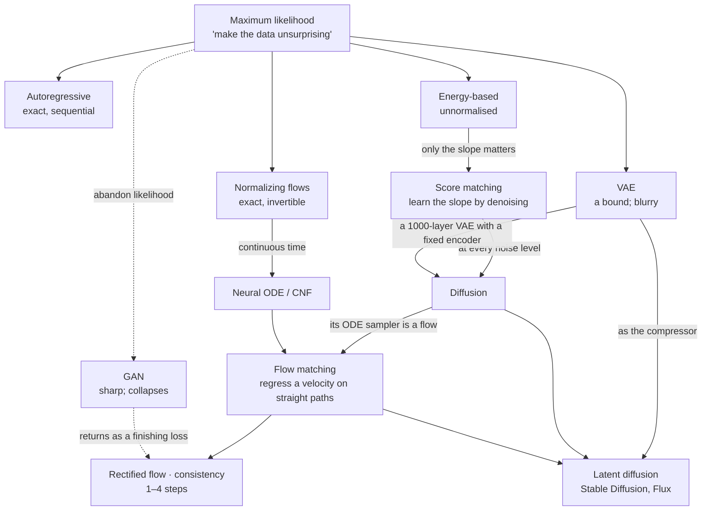

---
aliases:
  - Generative Modelling
  - Generative Modeling
  - Generative Model
  - Deep Generative Models
  - MOC - Generative Models
  - MOC - Diffusion
  - Diffusion and Flows
  - Image Generation
tags:
  - moc
  - generative-models
  - diffusion
---

> [!ABSTRACT] 🧠 Recall
> **In one line:** The map — every family here answers one question: **how do you turn simple noise into data?** Follow the answers in the order people found them, and each term lands as *one family's trick*, or *the thing that broke the previous one*.
> **Metaphor:** A sculptor. The statue is already in the block; every family is a different way of removing what isn't the statue — in one blow, or in a thousand small cuts.
> **Where it bites:** Use this page to *find* the note. Use the chain at the bottom to read them in order.

---
You have a folder of ten million photographs. You want a machine that produces **an eleven-millionth** — not a copy of any of them, not an average of them, but a new one that could have been in the folder.

That's the whole problem. Nobody can write down the rule for "a plausible photograph"; you only have examples. So you need a machine that starts from something trivially easy to produce — **random noise** — and turns it into something that looks like it came from the folder.

~={blue}Every family of generative model is a different answer to two questions: **what path do you take from noise to data — and what do you train a network to do along it?**=~

So rather than a glossary, follow the answers.

---
# 1. The problem

→ **[[Maximum Likelihood]]** — turn the knobs until your data stops being a surprise. And *why* likelihood models blur while GANs collapse.
→ **[[Latent Variable Models]]** — a handful of hidden sliders drive a million pixels. *Noise in → network → data out* is the template for everything below.
→ **[[KL Divergence]]** · **[[Cross Entropy]]** · **[[Random variable]]** — the measuring sticks underneath.h,hoh

> [!NOTE] The one sentence to internalise here
> ~={blue}Normalising a probability over a few thousand classes is trivial; over all possible images it's impossible.=~ Every family below is a way of getting round that one obstacle. ^the-normalisation-problem

---
# 2. Write the density down

*Keep a real probability — and pay for it somewhere.*

→ **[[Auto-regressive models]]** — chain rule: one element at a time. Exact likelihood; slow, sequential sampling. (How LLMs — and some image models — work.)
→ **[[Normalizing Flows]]** — invertible warps, and keep the books on how much you stretched. Exact density; architecture in handcuffs.
→ **[[Energy-Based Models]]** — output one number, *plausibility*; give up on the normalising constant. Total freedom — and **the slope still works**. The bridge to diffusion.

---
# 3. Compress, then decode

→ **[[Autoencoder]]** — squeeze through a bottleneck and rebuild. A compressor, *not* a generator — and why.
→ **[[Variational Autoencoder]]** — encode to a fuzzy cloud, pull the clouds toward a bell curve. Sampleable; blurry. ELBO and the reparameterisation trick live here.
→ **[[VQ-VAE]]** — snap every patch to a codebook entry. An image becomes a grid of **tokens**. BPE for pixels.

---
# 4. Play a game

→ **[[Generative Adverserial Network]]** — a forger and a detective. No likelihood at all; razor-sharp; unstable.
→ **[[Mode Collapse]]** — the forger finds one painting that fools the detective and paints it forever.

---
# 5. Learn the slope, not the height

*The idea that unlocked everything after it.*

→ **[[Score Function]]** — an arrow, at every point in space, toward "more like the data". Needs no normalising constant, and **learning to denoise *is* learning the score**.
→ **[[Langevin Dynamics]]** — follow the arrows, plus exactly the right amount of noise. Finds the right places; gets the proportions wrong — unless you anneal the noise. Which is…

---
# 6. Destroy, then rebuild

→ **[[Diffusion Models]]** — replace one impossible leap with a thousand easy steps. Sharp **and** diverse **and** stable — and slow. Start here.
→ **[[Forward Diffusion Process]]** — a crossfade from image to static that you can jump into at any point. The **noise schedule** decides what the model gets good at.
→ **[[Denoising Objective]]** — noise an image, predict the noise, MSE. ε vs x₀ vs v. *The loss curve will lie to you.*
→ **[[Diffusion Sampling]]** — step a little toward a blurry guess; repeat. Stochastic vs deterministic; DDIM; what the sampler names mean.
→ **[[Score SDE]]** — the Rosetta stone. Forward = an SDE you design; reverse = fixed by the score; and a deterministic ODE twin with the same distribution.

> [!TIP] The trilemma 🔺
> **Quality · coverage · speed — pick two.** GANs: quality + speed. VAEs and flows: coverage + speed. Diffusion: quality + coverage. Section 7 is the hunt for the third. ^trilemma

---
# 7. Straighten the path

→ **[[Neural ODE]]** — a network that outputs a *velocity*; integrate it to travel from noise to data. Free invertibility; originally too expensive to train.
→ **[[Flow Matching]]** — draw a straight line from noise to data, regress the velocity. Diffusion with the scaffolding removed. (*This is what "flow control" usually turns out to mean.*)
→ **[[Rectified Flow]]** — paths curve because training pairs **cross**. Re-pair them, the flow goes straight, and a straight flow is a one-step generator.
→ **[[Consistency Models]]** — don't learn the step; learn the destination. 1–4 step generation, by distillation.

---
# 8. Steer it, and make it affordable

→ **[[Conditional Generation]]** — the prompt is just another input. Concatenate, modulate, or cross-attend.
→ **[[Classifier-Free Guidance]]** — predict with and without the prompt; exaggerate the difference. The fidelity ↔ diversity dial. Costs two passes.
→ **[[CLIP]]** — one shared map for pictures and sentences. How the prompt gets in — and why prompts are read as a bag of concepts.
→ **[[Latent Diffusion]]** — autoencoder for the pixels, diffusion for the meaning. 48× cheaper. *This is Stable Diffusion.*
→ **[[U-Net]]** — down for *what*, up for *where*, bridges for *detail*.
→ **[[Diffusion Transformer]]** — patches as tokens. Worse when small, better when large — and onto the LLM scaling curve.
→ **[[Controlling Diffusion]]** — img2img, inpainting, ControlNet, LoRA, DreamBooth, IP-Adapter, inversion.
→ **[[Evaluating Generative Models]]** — fidelity *and* diversity, on sets. FID is a smoke alarm, not a judge.

| If this is your problem | Read this |
|---|---|
| Samples are blurry / averaged | [[Maximum Likelihood#^covering-vs-seeking\|mode-covering]], [[Variational Autoencoder#^why-vaes-blur\|why VAEs blur]] |
| Samples are sharp but all alike | [[Mode Collapse]], [[Classifier-Free Guidance]] (scale too high), [[Consistency Models#^distillation-tradeoffs\|distillation]] |
| Generation is too slow | [[Diffusion Sampling]], [[Rectified Flow]], [[Consistency Models]], [[Latent Diffusion]] |
| It ignores / garbles the prompt | [[Classifier-Free Guidance]], [[CLIP#^clip-bag-of-concepts\|CLIP's limits]], [[Conditional Generation#^text-encoder-is-the-bottleneck\|the text encoder]] |
| Oversaturated, "deep-fried" | [[Classifier-Free Guidance]] — scale too high |
| Can't make very dark / very bright images | [[Forward Diffusion Process#^zero-terminal-snr\|zero terminal SNR]] |
| Fine text and small faces are mangled | [[Latent Diffusion#^vae-is-the-ceiling\|the VAE is the ceiling]] |
| Training loss is flat — is it learning? | [[Denoising Objective#^loss-curve-lies\|the loss curve lies]] |
| Need pose / layout / a specific subject | [[Controlling Diffusion]] |
| "FID improved" — do I believe it? | [[Evaluating Generative Models#^fid-blind-spots\|FID's blind spots]] |
| What do the sampler names mean? | [[Diffusion Sampling#The decoder ring for sampler names 🔎\|the decoder ring]] |
| Diffusion vs flow matching — what's the real difference? | [[Flow Matching#So how much straighter is it, really?\|the honest comparison]] |
| Reading a paper full of $dx = f\,dt + g\,dw$ | [[Score SDE]] |
| How do energy-based models relate to all this? | [[Energy-Based Models]] → [[Score Function]] |

---
# 9. Beyond images

→ **[[Discrete Diffusion]]** — for tokens, noise = masking. BERT's objective at every masking ratio. Diffusion language models.
→ **[[Video Diffusion]]** — generate the clip as one block, so the frames agree. Condition on actions and it's a **world model**.
→ **[[Diffusion Policy]]** — actions are just another thing to generate. And the reverse: RL fine-tuning *of* diffusion models.
→ **[[JEPA]]** — the dissent: predict the *meaning*, not the pixels. Can't generate, on purpose.

---
# The reading order 📖

Each note ends with a `# ⁉️` hook to the next, so the whole thing reads as one chain:

> [[Maximum Likelihood]] → [[Latent Variable Models]] → [[Normalizing Flows]] → [[Energy-Based Models]] → [[Autoencoder]] → [[Variational Autoencoder]] → [[VQ-VAE]] → [[Generative Adverserial Network]] → [[Mode Collapse]] → [[Score Function]] → [[Langevin Dynamics]] → [[Diffusion Models]] → [[Forward Diffusion Process]] → [[Denoising Objective]] → [[Diffusion Sampling]] → [[Score SDE]] → [[Neural ODE]] → [[Flow Matching]] → [[Rectified Flow]] → [[Consistency Models]] → [[Conditional Generation]] → [[Classifier-Free Guidance]] → [[CLIP]] → [[Latent Diffusion]] → [[U-Net]] → [[Diffusion Transformer]] → [[Controlling Diffusion]] → [[Evaluating Generative Models]] → [[Discrete Diffusion]] → [[Video Diffusion]] → [[Diffusion Policy]] → [[JEPA]] → back here. ^reading-chain

> [!SUCCESS] If you remember one thing
> Five questions place any generative model on this map:
> 1. **Can it compute a likelihood?** (exactly · a bound · not at all)
> 2. **One leap or many steps from noise to data?** (GAN/VAE/flow vs diffusion/flow-matching)
> 3. **What does the network actually predict?** (the image · the noise · the score · a velocity · the destination)
> 4. **Where does it run — pixels, a continuous latent, or tokens?**
> 5. **How is it steered, and what did that cost in diversity?**
>
> ~={pink}And one line of history: *EBMs said "only the slope matters" → score matching learned the slope by denoising → diffusion made that work at every noise level → flow matching kept the idea and threw away the scaffolding.*=~ ^five-questions

---
# The same network, five names 🎯

The single most confusing thing in this literature, in one table:

| Community | Calls the network's output | Relation |
|---|---|---|
| Energy-based | $-\nabla_x E(x)$ | the slope of the energy landscape |
| Score matching | the **score** $\nabla_x \log p_t(x)$ | same thing |
| DDPM | the **noise** $\varepsilon_\theta(x_t, t)$ | score × $(-\sigma_t)$ |
| Denoising autoencoders | the **clean image** $\hat{x}_0$ | $(x_t - \sigma_t \varepsilon)/\alpha_t$ |
| Flow matching | the **velocity** $v_\theta(x_t, t)$ | a linear mix of $\varepsilon$ and $x_0$ |

*One network, one piece of information, five unit systems.*

---
# Papers worth reading in this area 📚
[[Auto-Encoding Variational Bayes (VAE)]] · [[Generative Adversarial Networks]] · [[A Tutorial on Energy-Based Learning]] · [[Denoising Diffusion Probabilistic Models]] · [[Score-Based Generative Modeling through SDEs]] · [[Classifier-Free Diffusion Guidance]] · [[An Image is Worth 16x16 Words (ViT)]] · [[Representation Learning with Contrastive Predictive Coding (CPC - InfoNCE)]] · [[A Simple Framework for Contrastive Learning (SimCLR)]] · [[LLaDA-Image- Building Strong Image Generators with Fully Open Training Recipes]] · [[Studying Image Tokenizers as Visual Languages in Unified Multimodal Models]] · [[Self-Supervised Learning from Images with I-JEPA]] · [[LeJEPA- Provable and Scalable Self-Supervised Learning]] · [[Mastering Diverse Domains through World Models (DreamerV3)]] · [[LoRA- Low-Rank Adaptation of Large Language Models]] · [[The Bitter Lesson (essay)]]

*Not yet in `Papers/` and worth adding:* Sohl-Dickstein 2015 (the original diffusion paper) · Song & Ermon 2019 (NCSN) · DDIM · Improved DDPM · Latent Diffusion · CLIP · DiT · Flow Matching (Lipman) · Rectified Flow (Liu) · Consistency Models · ControlNet · SD3 (Esser) · EDM (Karras) · Diffusion Policy.

---
---
#### 🖼️ How the families descend from one another

![[generative_models_sculptor.png]]

# ⁉️
The probability underneath all of this: [[Random variable]], [[KL Divergence]], [[Cross Entropy]], [[Beliefs]]. The sampling machinery: [[Monte Carlo Methods]], [[Markov Chain Monte Carlo]], [[Hamiltonian Monte Carlo]]. The networks: [[Deep Learning]], [[Query, Key, and Value (QKV)]]. Where generation meets decision-making: [[Control and Reinforcement Learning]]. And where it meets language: [[LLM Engineering]].
