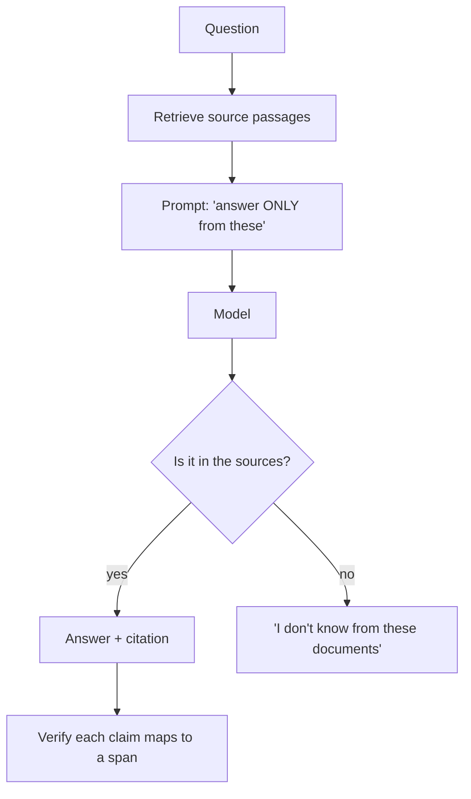

---
aliases:
  - Faithfulness
  - Attribution
  - Groundedness
  - Citations
tags:
  - llm
  - retrieval
  - evaluation
---
> [!ABSTRACT] 🧠 Recall
> **In one line:** Every claim must be **traceable to a provided source** — and "grounded" (supported by the source) is a *different* property from "correct."
> **Metaphor:** A court witness. Only what you personally observed is admissible; "everyone knows that" is not evidence.
> **Where it bites:** It's the property you can actually **measure and enforce**, which is why it's the practical answer to [[Hallucination]].

---
Your [[RAG]] system retrieves the right document and answers the question. Here's the document:

> *"The Q3 refund window was extended to 45 days for enterprise customers."*

And here's the answer:

> *"Enterprise customers have a 45-day refund window, in line with standard industry practice."*

The first clause is perfect. The second clause — *"in line with standard industry practice"* — appears **nowhere** in the source. The model added it from parametric memory, because it makes for a better-sounding sentence.

It might even be true. Now ask yourself the harder question: ~={blue}does that make it acceptable?=~

If a regulator asks where that claim came from, you cannot answer. If the industry practice is actually 14 days, you've published a falsehood under your brand. And you have **no way to tell which clauses came from your documents and which the model supplied**, because they're formatted identically.

---
# The witness box

A witness in court is bound by a strict rule: testify to **what you personally observed**. Not what you inferred, not what you read somewhere, not what everyone knows. And every statement must be attributable — *"I saw the blue car at 9:15 from the window."*

Why is the rule so strict? Not because inference is worthless. Because ~={blue}it is the court's job to weigh evidence, and it can only do that if it knows where each piece came from.=~ A witness who blends observation with hearsay in identical tones has destroyed the court's ability to evaluate anything they said — including the true parts.

That's the argument for grounding, and it's an argument about *auditability*, not about the model being wrong.

> [!NOTE] Grounding / faithfulness
> The property that every claim in the output is **supported by, and attributable to, the provided context**. Distinct from *correctness*, which is about the world. ^grounding-def

> [!SUCCESS] Core idea
> The four cases are the thing to have in your head:
>
> | | **Grounded** | **Ungrounded** |
> |---|---|---|
> | **Correct** | 🥇 What you want | Right by luck — unverifiable, not reproducible |
> | **Incorrect** | Your *source* is wrong — a data problem you can fix ✅ | 💀 Classic hallucination |
>
> ~={pink}Grounded-but-incorrect is a **good** failure=~: it points at a document you can go and fix. Ungrounded-but-correct is a *bad success* — you got away with it this time and learned nothing. That's why you measure grounding, not vibes. ^grounded-vs-correct

---
# How you actually enforce it 🔧

**In the prompt** — and precision here matters more than length:

```
Answer ONLY using the CONTEXT below.
Cite the source id in brackets after every claim, e.g. [doc_3].
If the context does not contain the answer, reply exactly: NOT_FOUND.
Do not use outside knowledge, even if you are confident it is correct.
```

That last line does real work: without it, the model treats its own knowledge as a helpful supplement. ~={blue}And the `NOT_FOUND` escape hatch is essential=~ — without a permitted way to fail, the most probable continuation of a question is always an answer ([[Hallucination#^hallucination-is-the-objective|the exam-marking problem]]).

**In the pipeline:**
- **Citation enforcement** — [[Structured Output|schema-constrain]] every claim to carry a `source_id`, then verify programmatically that the id exists
- **Quote verification** — require a verbatim span and string-match it against the source. Fabricated quotes fail instantly and cheaply 🔍
- **Post-hoc NLI checking** — run an entailment model over (claim, source) pairs. Fast, cheap, catches most drift
- **LLM-as-judge** — "is this claim entailed by this passage?" per sentence, not per answer

> [!TIP] Metrics worth tracking (the RAGAS-style split)
> - **Faithfulness** — fraction of claims entailed by the retrieved context
> - **Answer relevance** — does it actually address the question
> - **Context precision / recall** — was the right material retrieved *at all*
>
> Track them **separately**. A faithfulness score of 0.95 with context recall of 0.4 means ~={red}you're faithfully answering from the wrong documents=~ — and a single end-to-end score would have hidden that completely. 📊 (See [[Evals]].)

> [!WARNING] The limits
> - Grounding can't save you from a **wrong source**. Garbage in, faithfully-cited garbage out.
> - Citations can be **decorative** — models will attach a plausible id to an unsupported claim unless you verify it. An unverified citation is theatre.
> - Over-constraining causes **refusal spirals**: the model says NOT_FOUND when a small, safe inference was warranted. Tune the strictness to the stakes — a medical assistant and a brainstorming tool want different settings.
> - Summarisation and multi-hop questions genuinely require synthesis, so "every sentence maps to one span" is too strict there. ^grounding-limits

---
---
#### 🖼️ Answer from the page, not from memory


Grounding is retrieval **plus** the discipline of refusing when the sources don't cover it. Without that second half you've just given the model more to hallucinate around.

# ⁉️
Faithfulness, relevance, recall — all of these are numbers. Which means the real question is the one underneath: what's your test set, and who wrote it?

→ [[Evals]]
