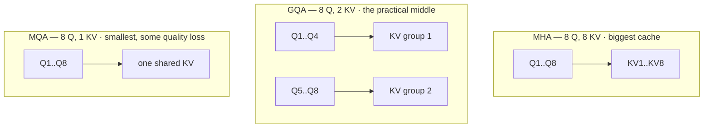

---
aliases:
  - GQA
  - MQA
  - Multi-Query Attention
tags:
  - llm
  - attention
  - inference
  - performance
---
> [!ABSTRACT] 🧠 Recall
> **In one line:** Keep all the query heads, but let **groups of them share one K/V head** — the [[KV Cache]] shrinks 4–8× and quality barely moves.
> **Metaphor:** 32 analysts in a room, but 8 filing cabinets instead of 32. Four analysts share a cabinet; they still ask their own questions.
> **Where it bites:** It's why modern models serve long contexts at all. Llama-2-70B, Mistral, Gemma — all GQA.

---
You've done the [[KV Cache]] arithmetic and it's grim: 6.7 GB per user at 8k context, eight concurrent users, done.

Look at where those bytes go. Per layer, per token, you store a key and a value **for every head**. 40 heads → 40 keys and 40 values.

Now ask the awkward question: does each head genuinely need its *own* key and value?

Go back to [[Query, Key, and Value (QKV)|what the three roles do]]. The **query** is "what am I looking for" — that's the head's *personality*, its specialisation. The **key** and **value** are "who I am" and "what I offer" — properties of ~={blue}the token, not of the asker.=~

So what happens if you keep 32 distinct askers, but have them consult a shared set of filing cabinets?

---
# The filing room

32 analysts share a room. Today each one has a private filing cabinet holding a copy of the same case files, indexed their own way. That's a lot of cabinets and a lot of duplicated paper.

**Extreme fix (MQA):** one cabinet for the whole room. Paper cost drops 32×. But now every analyst is forced to use one index — and they start losing the specialisations that made having 32 of them useful. Quality dips, and training gets unstable.

**The compromise (GQA):** 8 cabinets, 4 analysts each. Each group indexes the files its own way; within a group they share. 4× less paper, and the specialisation survives almost intact.

> [!NOTE] Grouped Query Attention
> Attention where $H$ query heads are partitioned into $G$ groups, and each group shares a single key head and value head. $G = H$ is ordinary **Multi-Head Attention**; $G = 1$ is **Multi-Query Attention**; $1 < G < H$ is **GQA**. ^gqa-def

| Variant | Q heads | KV heads | KV cache | Quality |
|---|---|---|---|---|
| **MHA** | 32 | 32 | 1× (baseline) | Best |
| **GQA** | 32 | **8** | **¼** ✅ | ~Indistinguishable |
| **MQA** | 32 | **1** | **1/32** 🤯 | Noticeable drop, less stable |

> [!SUCCESS] Core idea
> ~={pink}The number of *questions* you can ask and the number of *filing systems* you keep are separable.=~ GQA cuts the second without touching the first — which is why you get a near-free 4× on the thing that actually caps your concurrency. ^gqa-core

---
# Why this is a *decode* fix specifically

Prefill is compute-bound; it wouldn't care much. Decode is [[Prefill and Decode#^decode-def|memory-bandwidth-bound]], and at every step you must **read the entire KV cache** to attend over it.

Quarter the cache and you quarter that read. So GQA gives you two wins at once:

1. **More concurrent users** (memory) → and via [[Continuous Batching]], higher throughput
2. **Faster per-token decode** (bandwidth) → lower inter-token latency

Both land exactly where the pain is.

> [!TIP] Uptraining — you don't retrain from scratch
> The GQA paper's practical contribution: take an existing MHA checkpoint, **mean-pool** each group's key heads (and value heads) into one, then continue pre-training for ~5% of the original compute. You get a GQA model without paying for a new run. That's why GQA spread so fast. 🔁

→ [[GQA- Training Generalized Multi-Query Transformer Models]] and the original [[Fast Transformer Decoding- One Write-Head is All You Need (MQA)]].

> [!WARNING] Don't confuse it with [[Flash Attention]]
> Flash Attention changes **how** attention is computed (tiling in SRAM to avoid materialising the $n\times n$ matrix) — same maths, same outputs, same cache. GQA changes **what** the architecture *is* — fewer parameters, different weights, must be trained or uptrained in. One is a kernel; the other is a model change. They compose. ^gqa-vs-flash

---
---
#### 🖼️ Sharing K and V is what shrinks the cache

# ⁉️
Smaller cache means more requests fit at once. But the naive way of batching them — wait for a group, run them in lockstep, wait for the slowest — throws most of that gain away.

→ [[Continuous Batching]]

*On the [[Attention]] path: GQA shrank the cache by **deleting** K/V heads. There's a way to keep all 64 and shrink it further →* [[Multi-head Latent Attention]]
