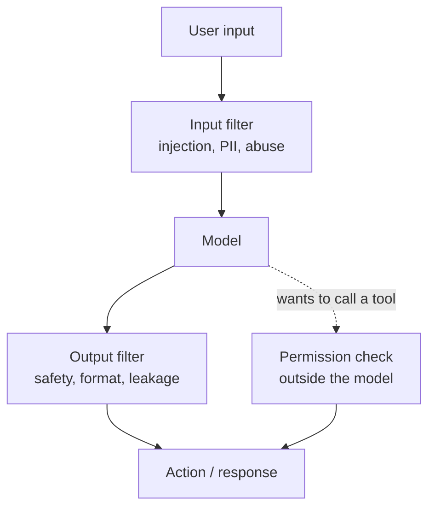

---
aliases:
  - Safety Filters
  - Content Moderation
  - Output Validation
  - Policy Layer
tags:
  - llm
  - safety
  - engineering
---
> [!ABSTRACT] 🧠 Recall
> **In one line:** Deterministic checks **outside** the model — on inputs, outputs and tool calls — because anything inside the prompt shares a channel with the attacker.
> **Metaphor:** A nuclear plant. The operator is well trained; you still have interlocks, because the interlocks don't share the operator's state of mind.
> **Where it bites:** Every control that lives in the [[System Prompt]] is a *suggestion*. Only code is a control.

---
Your assistant must never give medical dosage advice. You write it into the system prompt, in bold, three times.

It works. Mostly. Until:

- a user role-plays a scenario and the model obliges ([[Jailbreak]])
- a retrieved document contains instructions the model follows ([[Prompt Injection]])
- an ordinary phrasing lands off-distribution and the instruction just… doesn't fire
- someone edits the prompt for a different reason and breaks it silently

Each failure has its own explanation. But they share one root cause, and it's worth naming precisely: ~={red}your control and your attacker occupy the same channel, and the referee is a probabilistic model.=~

So where does a control have to live to not have that problem?

---
# The interlock

A nuclear plant operator is highly trained, tested, and follows procedure. The plant still has **physical interlocks**: the rods drop if pressure exceeds a threshold, regardless of what the operator intends, believes, or has been told.

Nobody thinks this insults the operator. The interlock exists because:

- it is **outside** the operator's judgement — it cannot be confused, tired, or persuaded
- it is **deterministic** — same condition, same action, every time
- it is **auditable** — you can prove it fired
- it fails **closed**

That's a guardrail. ~={blue}Not a better instruction to the operator. A mechanism that doesn't depend on the operator at all.=~

> [!SUCCESS] Core idea
> A control inside the prompt is a **preference**; a control in code is a **constraint**. The entire discipline is moving each requirement from the first category to the second wherever the stakes justify it. ~={pink}If a requirement matters, it cannot live only in the prompt.=~ ^prompt-is-not-a-control

---
# The five places a guardrail goes 🚧

| Stage | Checks | Examples |
|---|---|---|
| **1. Input** | Before the model sees it | PII redaction, topic classifier, jailbreak detector, length/rate limits |
| **2. Retrieval** | What enters context | Permission filtering (**per user**, at query time), source allowlists, untrusted-content tagging |
| **3. Generation** | During decoding | [[Structured Output\|Schema constraints]], stop sequences, token limits |
| **4. Output** | Before the user sees it | Toxicity, PII leakage, [[Grounding\|citation verification]], regex for forbidden claims, secret scanning |
| **5. Action** | Before a tool runs | ~={red}The most important one=~ — allowlists, parameter validation, spend caps, human confirmation, egress filtering |

> [!TIP] Stage 5 is where the value is
> Stages 1 and 4 stop *embarrassment*. Stage 5 stops **damage**. A model that says something inappropriate is a bad day; a model that drops a table, sends the email, or refunds £40,000 is an incident.
>
> Concretely: allowlist tools per context, validate parameters against a schema *and* a policy (`amount <= 500`, `table in {...}`), require confirmation for anything irreversible, cap spend and step count, filter outbound URLs against an allowlist ~={blue}(this is your anti-exfiltration control)=~, and log every call with its arguments. 🔒

---
# Design choices you'll actually have to make ⚖️

**Blocking vs flagging.** Synchronous checks add latency and can cause false-positive refusals; async flagging is fast but the user already saw it. Usually: block on stage 5 and on high-severity output, flag on the rest.

**Streaming breaks output guardrails.** If you stream tokens to the user, the output check can only run on text they've *already read*. Options: buffer (kills the streaming feel), check in chunks (partial-text false positives), or stream and retract (ugly but honest). ~={red}There is no clean answer=~ — decide deliberately rather than discovering it in production.

**LLM-based guardrails share the weakness.** A classifier model can itself be injected or jailbroken. It helps because it's a *separate context* with a narrow job — not because it's immune. Prefer deterministic checks where the requirement is expressible in code, and treat model-based checks as probability reduction.

> [!WARNING] Over-blocking is a real failure, not a safe default
> Aggressive filters break legitimate use: the medical app that can't discuss symptoms, the security tool that can't discuss vulnerabilities, the support bot that refuses to explain a refund. ~={red}Every false positive is a user who stops trusting the product=~, and they're rarely measured because nobody reports a refusal as a bug.
>
> Measure **both** error rates on a real eval set. "How often do we block something we shouldn't?" deserves the same dashboard space as "how often do we let something through?" ^over-blocking

> [!NOTE] The governance layer nobody enjoys but everyone needs
> Log every input, output, tool call, guardrail decision and prompt/model version. You need it for incident forensics, for regression evals, and increasingly for regulators (EU AI Act, sector rules). Treat prompts and policies as **versioned artefacts with a review process** — a one-word change is a production change. ^guardrail-observability

Related: [[Evals]] (guardrails need their own test set), [[Tool Use]], [[ML Infrastructure]], [[CLEAR- Continuous Latent Adapter Routing for Utility-Preserving LLM Safety Alignment]].

---
---
#### 🖼️ Defence in depth, because the model is not the control

Every box except the middle one is ordinary software. That is deliberate — you cannot ask the model to be its own bouncer.

# ⁉️
Guardrails constrain what the system may *do*. But there's a subtler failure where nothing is blocked and nothing is attacked — the system optimises your stated objective perfectly and gives you something you didn't want.

→ [[Reward Hacking]]
