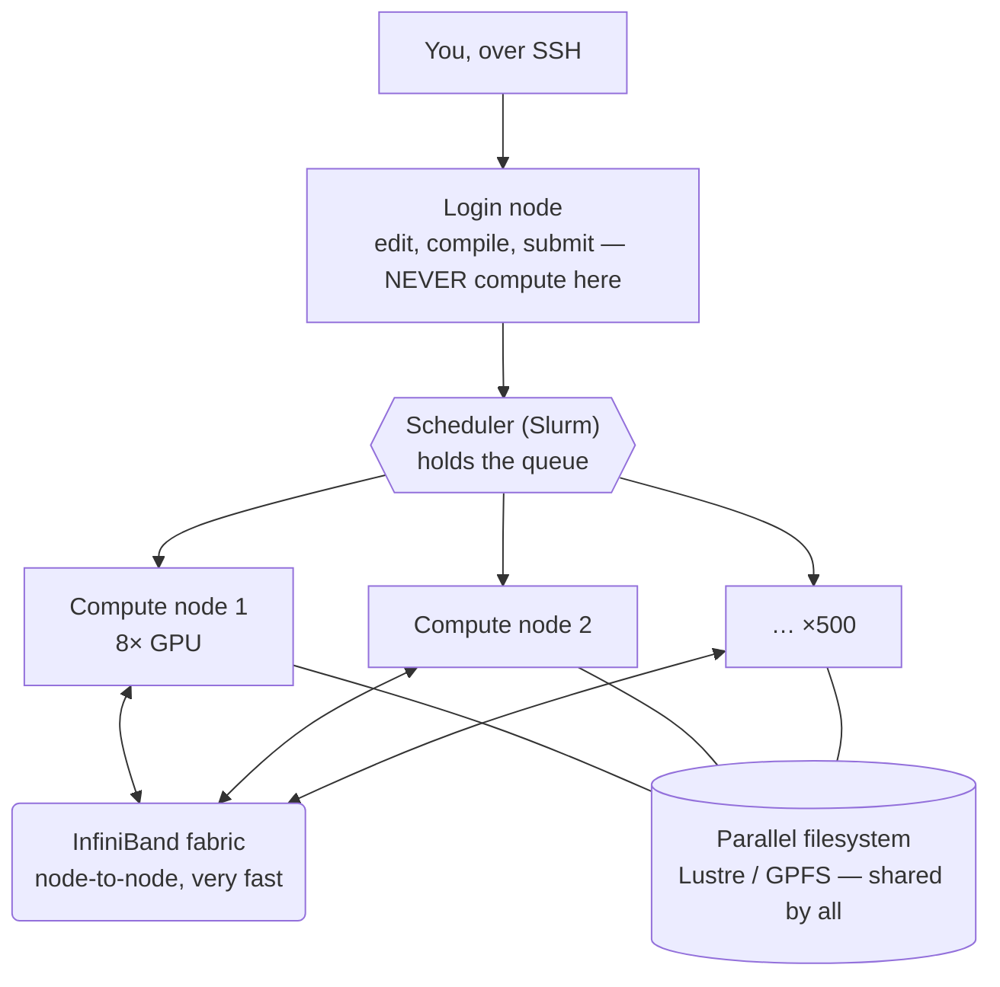

---
aliases:
  - High Performance Computing
  - Supercomputing
  - Cluster Computing
  - On-prem cluster
tags:
  - infrastructure
  - hpc
  - engineering
---
> [!ABSTRACT] 🧠 Recall
> **In one line:** A shared cluster you **book time on** rather than log into and use — you declare what you need up front, join a queue, and your job runs later without you watching.
> **Metaphor:** A hospital operating theatre list. Scarce rooms, booked in advance, packed by a central scheduler. Overrun your slot and you get pulled.
> **Where it bites:** The mental shift from *"run it now"* to *"submit it and walk away."* Also: [[Slurm]], shared filesystems, and why `pip install` can anger 400 other people.

---
# It is not "on-prem ML infrastructure"

Worth clearing up first, because the name suggests something it isn't.

HPC is a **fifty-year-old tradition** that predates machine learning entirely. It was built for weather forecasting, nuclear weapons simulation, protein folding, computational fluid dynamics, astrophysics. Problems that share a shape: one enormous calculation, split across thousands of processors, that must run for days.

ML arrived late and **borrowed the buildings**. Which means a lot of what you'll meet on a cluster was designed for a physicist in 1998 and fits ML awkwardly. ~={blue}Knowing which parts were built for someone else explains most of the friction.=~

> [!NOTE] HPC
> Coordinating many machines to work on **one problem**, as though they were a single very large computer. The emphasis is on *one problem* — that's what separates it from a web server farm, where a thousand machines handle a thousand unrelated requests. ^hpc-def

---
# The theatre list 🏥

Picture a hospital with eight operating theatres and forty surgeons who all want one.

You don't wander in and start operating. You **book**. And when you book you must declare, in advance:

- how many theatres you need
- what equipment (is an X-ray machine required?)
- **how long you'll take**

A central coordinator takes everyone's requests and packs them onto a timetable. If you overrun your slot, you get pulled out mid-operation — because someone else is scheduled behind you.

That's a cluster. Every part of that maps:

| Theatre | Cluster |
|---|---|
| Surgeon | You |
| Theatre | Compute node |
| Booking request | A **job script** |
| The coordinator | The **[[Slurm\|scheduler]]** |
| "I need 4 theatres for 6 hours" | `--nodes=4 --time=06:00:00` |
| Pulled out for overrunning | Job killed at walltime |
| A 20-minute op slotted into a gap | **Backfill** |

> [!SUCCESS] Core idea
> On a laptop you own the machine, so you *run* things. On a cluster you own a **share of a machine**, so you ~={pink}request, queue, and collect results later.=~ Everything else follows from that one difference. ^you-book-you-dont-run

---
# Anatomy of a cluster



**Login node.** Where you land when you SSH in. Shared by everyone. Edit files, compile, submit jobs — and **nothing else**.

> [!WARNING] The fastest way to get an angry email
> Running your training script directly on the login node. It's one machine shared by hundreds of people; saturating its CPU or RAM degrades the cluster for everyone, and most sites have watchdogs that kill your process and email your supervisor. 📧
>
> If you need a shell on a real machine, ask the scheduler for an **interactive job** (`salloc` / `srun --pty bash`). ^never-compute-on-login

**Compute nodes.** The actual machines. You only reach them *through* the scheduler.

**The scheduler.** The booking system. Almost always **[[Slurm]]**.

**The parallel filesystem.** One namespace visible identically from every node — so a file written by node 12 is readable by node 340. This is what makes a cluster feel like one computer, and it's also the most common thing to accidentally destroy.

---
# The filesystem is the part that bites 💾

A laptop filesystem is a local disk. A cluster filesystem is a **networked, shared, striped** system (Lustre, GPFS/Spectrum Scale, BeeGFS) tuned for one thing: **few, enormous, sequential** reads and writes.

That's exactly what a physicist does — write one 400 GB simulation dump.

It is exactly **not** what ML does. ImageNet is 1.2 million small files. And that mismatch causes most cluster ML pain.

> [!WARNING] Why your `pip install` can slow down the whole cluster
> These filesystems keep metadata (filenames, permissions, sizes) on a small number of **metadata servers**. Creating and stat-ing thousands of tiny files hammers them — and metadata servers are a shared, global resource.
>
> A conda environment is ~100,000 small files. Installing one into your shared home directory, on several nodes at once, is a genuine denial-of-service on your colleagues. This is why sites push you toward **containers** or toward building environments on **node-local disk**. ^small-files-kill-lustre

Most clusters give you several filesystems with different jobs. Learn which is which on day one:

| Mount | Backed up? | Quota | Speed | Use for |
|---|---|---|---|---|
| `/home` | ✅ usually | small | slow | code, configs, scripts |
| `/scratch` or `/work` | ❌ **never** | large | fast | datasets, checkpoints, everything active |
| `/project` | ✅ sometimes | medium | medium | shared team data |
| `$TMPDIR` (node-local SSD) | ❌ wiped at job end | varies | **fastest** | unpack your dataset here at job start |

> [!TIP] The standard ML pattern
> Keep the dataset as **one tar/shard** on `/scratch`. At the start of each job, copy it to node-local `$TMPDIR` and unpack. One big sequential read instead of a million random ones. Formats like **WebDataset** exist precisely for this. 📦 ^stage-to-node-local

---
# Software: modules and containers

**The module system.** Clusters serve many fields with conflicting dependencies, so nothing useful is installed globally. You *load* what you need:

```bash
module avail                  # what's here
module load cuda/12.4 gcc/11.3
module list
```

It just rewrites `PATH` and `LD_LIBRARY_PATH`. Crude, and ancient, and it works.

**Containers.** You almost certainly cannot run Docker — it needs root, and you don't have root on a shared cluster. HPC uses **Apptainer** (formerly Singularity) instead, which runs containers as *you*, unprivileged:

```bash
apptainer exec --nv train.sif python train.py    # --nv passes the GPUs through
```

> [!TIP] Why containers win on clusters
> One `.sif` file is **one file** to the filesystem — instead of the 100,000 files a conda env would be. You dodge the metadata problem entirely, and you get reproducibility. If your site supports it, use it. ^containers-beat-conda

---
# The networking is the whole point 🕸️

A cluster is not "some computers in a room." What makes it a cluster is the **interconnect**.

Ordinary Ethernet goes through the operating system's network stack, which costs CPU time and latency on every packet. HPC uses **InfiniBand** (or RoCE, or Slingshot) with **RDMA** — Remote Direct Memory Access.

> [!NOTE] RDMA
> One machine reads or writes another machine's memory **directly**, without either CPU being involved. The network card does it. Latency drops to ~1 microsecond, versus tens for TCP/Ethernet. ^rdma

And the ML-specific extension: **GPUDirect RDMA** lets a GPU on node A write straight into a GPU on node B's memory — never touching either machine's CPU or system RAM.

That path is the only reason multi-node training is viable at all. When it's misconfigured, training silently falls back to TCP and you wonder why 32 GPUs are slower than 8. See [[Collective Communication]].

**Topology matters too.** Nodes aren't all equally close. A **fat-tree** keeps bandwidth constant as you go up the tree; a **torus** or **dragonfly** trades some of that for cost. This is why a scheduler often tries to give you nodes on the same switch, and why `--switches=1` exists as a hint.

---
# Why any of this instead of cloud?

| | **On-prem HPC** | **Cloud** |
|---|---|---|
| Cost at high utilisation | **much cheaper** | expensive |
| Cost at low utilisation | wasteful — it idles | you stop paying |
| Getting 256 GPUs *right now* | queue for it | possible, at a price |
| Interconnect | usually excellent | excellent only on specific instance types |
| Capital outlay | enormous, up front | none |
| Who fixes a dead node | **you do** | someone else |

> [!SUCCESS] The rule of thumb
> ~={blue}Steady, predictable, high utilisation → own the hardware. Bursty or uncertain → rent it.=~ A cluster that sits at 30% utilisation is a very expensive room; one at 90% is dramatically cheaper than the cloud equivalent. Most large labs run **both**. See [[ML Infrastructure]] for the cloud side. ^onprem-vs-cloud

---
# Failure modes you will actually meet

> [!WARNING] The five that cost the most time
> 1. **Walltime kill.** Your job died at exactly 24:00:00 with no error. It wasn't a bug — you hit your requested limit. **Always checkpoint.**
> 2. **The straggler.** 63 GPUs finish their step and wait for the 64th. One slow node sets the pace for the whole job, so throughput is set by the *worst* participant, not the average.
> 3. **NCCL timeout.** `Watchdog caught collective operation timeout`. Usually one rank crashed or diverged, and everyone else is blocked forever waiting for it in an allreduce. Look for the rank that *isn't* in the log.
> 4. **Node failure.** At 500 nodes, hardware fails weekly. A multi-day job **must** be able to restart from a checkpoint — this is not optional at scale.
> 5. **Silent Ethernet fallback.** Set `NCCL_DEBUG=INFO` and check it actually says `IB` rather than `Socket`. ^hpc-failure-modes

The defence for most of these is the same: **checkpoint often, and make restarts automatic.** Slurm job arrays with `--requeue` let a job resubmit itself and pick up where it stopped.

---
# The vocabulary, in one place

| Term | Meaning |
|---|---|
| **Node** | One physical machine |
| **Task / rank** | One process. Usually one per GPU |
| **Walltime** | Real elapsed time you booked |
| **Partition / queue** | A named pool of nodes with its own rules |
| **Allocation** | Your account's budget, in node-hours |
| **Backfill** | Scheduler slotting a small job into a gap |
| **Fair-share** | Priority that drops the more you've recently used |
| **MPI** | The old standard for inter-process communication |
| **NCCL** | NVIDIA's GPU-to-GPU equivalent — what PyTorch uses |
| **Job array** | Many near-identical jobs from one script |

---
# ⁉️
The booking system you'll actually type commands into every day is [[Slurm]].
What your ranks are *saying* to each other over that fast network is [[Collective Communication]].
And how a model gets split across them in the first place is [[Distributed Training]].
