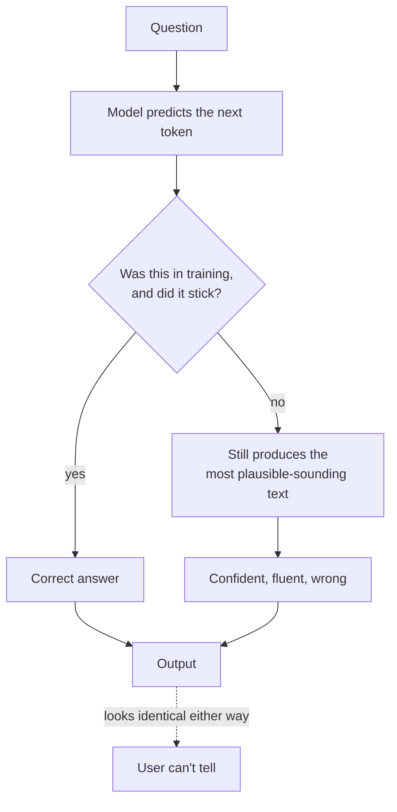

---
aliases:
  - Confabulation
  - Fabrication
  - Making things up
tags:
  - llm
  - failure-mode
  - evaluation
---
> [!ABSTRACT] 🧠 Recall
> **In one line:** Fluent, confident, **false** output — not a bug in the model but a direct consequence of an objective that rewards *plausible* text, with no term for *true*.
> **Metaphor:** A student who never leaves a blank. Writing *something* scores better than writing nothing, so they always write something.
> **Where it bites:** Citations, numbers, APIs, names, dates. Anything where "plausible-shaped" and "correct" come apart.

---
Ask a model for papers on a niche topic. It gives you:

```
Kowalski, M. & Diaz, R. (2019). "Attention Dynamics in Sparse
Transformer Architectures." NeurIPS, pp. 4412-4423.
```

Perfect format. Real venue. Plausible authors. Plausible title. Realistic page numbers.

It does not exist. None of it.

Now the diagnostic question — what *exactly* went wrong? It's tempting to say "the model lied" or "it doesn't know it's wrong."

But look at what it was asked to do. Given `Kowalski, M. & Diaz, R. (2019). "` — what token comes next? The training objective says: ~={blue}the most probable continuation.=~ And the most probable continuation of a citation opening is *more citation*. The model did its job flawlessly.

The problem is that its job was never "be true."

---
# The student who never leaves a blank

An exam. Five marks for a correct answer, zero for a wrong one, zero for a blank.

What's the optimal strategy? **Always write something.** A guess has positive expected value; a blank has exactly zero. A rational student under that marking scheme never leaves a blank — and if the marker also rewards *confident, well-structured prose*, the student learns to write confident well-structured guesses.

Now notice what would fix it: **negative marks for a wrong answer**, and explicit credit for "I don't know."

That's precisely the term missing from next-token prediction. [[Cross Entropy]] loss penalises assigning low probability to the actual next token in the corpus. There is ~={red}no term anywhere in pre-training that penalises being false=~ — the corpus is the only ground truth, and the corpus contains no examples of the model admitting ignorance about *this* question.

> [!SUCCESS] Core idea
> Hallucination isn't the model malfunctioning — it's ~={pink}the model doing exactly what it was trained to do, in a situation where fluency and truth diverge.=~ Correct that misconception and the mitigations stop looking like patches and start looking obvious: change what's in the context, or change what gets rewarded. ^hallucination-is-the-objective

> [!NOTE] Hallucination
> Output that is fluent, syntactically valid and confidently stated, but factually false or unsupported by any provided source. Two kinds worth separating:
> - **Intrinsic** — contradicts the source you gave it (a summarisation/[[Grounding]] failure)
> - **Extrinsic** — unsupported by any source; invented from parametric memory ^hallucination-def

---
# Why [[RLHF]] made it worse in one specific way

Human raters prefer confident, complete answers. So preference training ~={red}rewards confidence=~ — including on questions the model shouldn't be confident about. A hedged "I'm not certain, but…" loses to a crisp wrong answer in a side-by-side rating.

Which means the model's **calibration** degrades: the internal signal distinguishing "I know this" from "I'm pattern-matching" gets partially trained away, because expressing it was penalised. Related: [[RLHF#^sycophancy|sycophancy]], and [[Uncertainty]] for what calibration actually means.

---
# Where it concentrates 🎯

| High risk 🔴 | Low risk 🟢 |
|---|---|
| Citations, DOIs, URLs | Common-knowledge facts |
| Specific numbers, dates, statistics | Summarising provided text |
| API methods and library functions | Reformatting, translation |
| Legal cases, regulations | Pure reasoning from given premises |
| Anything niche or long-tail | High-frequency, well-attested content |
| Anything **after** the training cutoff | |

The pattern: risk is highest where the *shape* is highly predictable but the *content* is arbitrary. A citation has a rigid format and essentially random specifics — the worst possible combination.

---
# Mitigations, in order of effectiveness 🛡️

1. **[[RAG]]** — give it the source. Removes the need to recall.
2. **[[Tool Use]]** — let it *look up* rather than recall. A calculator never hallucinates arithmetic.
3. **[[Grounding]] instructions** — "answer only from the context; if it's not there, say NOT_FOUND." ~={blue}The escape hatch is the single cheapest win=~ — it converts "always write something" into "a blank is allowed."
4. **Require citations, then verify them** programmatically. Fabricated quotes fail string matching.
5. **Self-consistency** — sample $N$ times; fabrications vary wildly, facts don't. Semantic-entropy detectors are a formalisation of exactly this.
6. **Lower [[Sampling Parameters|temperature]]** — helps a little, and note it does *not* help when the model is confidently wrong.
7. **[[Evals]]** with a factuality suite in CI.

> [!WARNING] What does **not** work
> - **"Don't hallucinate"** in the [[System Prompt]] — the model has no internal flag for it
> - **Asking "are you sure?"** — it will apologise and often invent something *different*. Not a verification signal
> - **[[Fine-Tuning]] on more facts** — this can make it *worse*: teaching it to state facts confidently, in a format where it never says "I don't know," trains the behaviour in. See [[Fine-Tuning#^data-quality-dominates|data quality dominates]]
> - **A bigger model** — reduces frequency, raises plausibility. ~={red}Harder to catch, not gone.=~ ^what-doesnt-work

> [!TIP] The framing for a product conversation
> Hallucination cannot be eliminated by any known method — plan for **detection and containment**, not prevention. Design the *surface*: show sources, show confidence, make verification one click away, and keep a human in the loop wherever a wrong answer is expensive. A system that's right 97% of the time and *shows you which 3%* is more valuable than one that's right 99% opaquely. 🎛️

---
---
#### 🖼️ It isn't lying — there's no mechanism for it to know



# ⁉️
Every real mitigation above has the same shape: tie the output to a source and make that tie checkable.

→ [[Grounding]]
