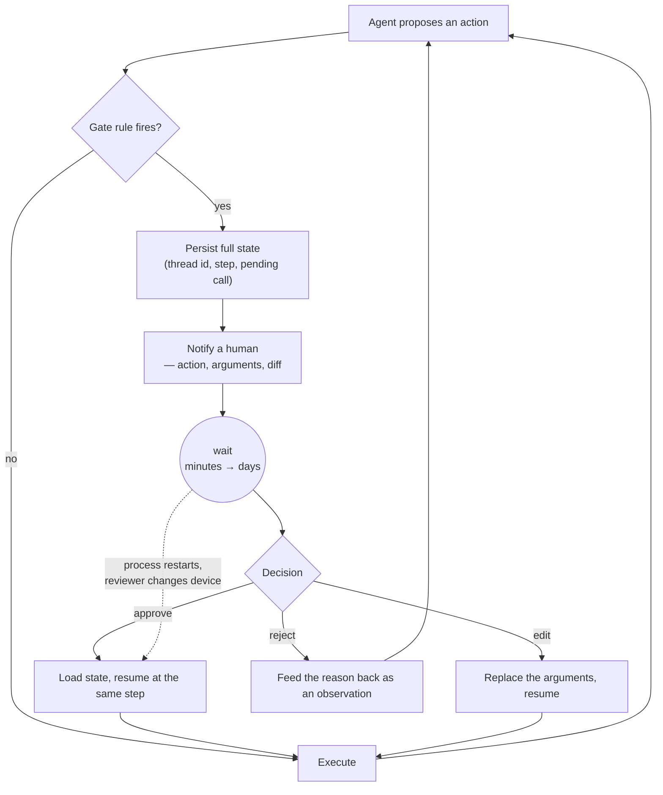

---
aliases:
  - HITL
  - Approval Gate
  - Human Approval
  - Agent Escalation
tags:
  - llm
  - agents
  - engineering
  - failure-mode
---
> [!ABSTRACT] 🧠 Recall
> **In one line:** A gate that stops the loop, asks a person, and resumes — and its value is set entirely by **how rarely and how precisely it fires**, not by the fact that it exists.
> **Metaphor:** The self-checkout attendant. One person supervises six tills, and it works only because the light comes on for real problems.
> **Where it bites:** A gate on every action is rubber-stamped by Tuesday. A gate on the wrong action is decoration with a latency cost.

---
An agent files expense reports. It is **99% accurate** — genuinely good — and it handles 400 a day.

99% of 400 means **four wrong payments a day**. Some are £8 typos. One, eventually, is a £40,000 wire to a vendor that doesn't exist.

So you add human approval. Every report goes to a reviewer first.

```
400 reports × 45 seconds each  =  5 hours of a person's day
```

Day 1, the reviewer reads them. Day 3, they're clicking approve while on a call. By week two, approval rate is 99.7% and the median review takes **1.4 seconds** — less time than it takes to read the vendor name.

You now have five hours a day of cost, a slower system, and ~={blue}the same four bad payments, with a human's name attached to them.=~

What went wrong isn't the idea. It's the firing rate.

---
# The self-checkout attendant

One attendant covers six self-checkout tills. She is not watching six people scan four hundred items. She is watching for a light.

![[hitl_self_checkout_attendant.png]]

The light comes on for specific things: alcohol, an item that didn't scan, a weight that doesn't match. When it comes on she walks over, looks at **one** decision, and resolves it in fifteen seconds.

Now imagine the light came on for every item. She'd clear them without looking within an hour — and the one bottle of whisky in the day's ten thousand items would go through exactly as fast as the bananas.

That's the whole design problem. ~={blue}The attendant's attention is the scarce resource, and a gate spends it.=~ The question is never "should there be a human?" It's "**what is the smallest set of decisions worth a human's fifteen seconds, and can they actually decide in fifteen seconds?**"

> [!NOTE] Human in the loop
> A point in an agent's execution where the loop **halts**, its state is **persisted**, a person is asked for a decision, and execution **resumes from the same point** with the answer folded in. The three hard parts are: choosing where it fires, presenting a decidable question, and surviving the wait. ^hitl-def

> [!SUCCESS] Core idea
> A gate converts *risk* into *latency and attention*. It only pays if its **precision** is high — fires mostly on things that were genuinely wrong. ~={pink}A gate with low precision doesn't get ignored by bad people; it gets ignored by good people, automatically, within days.=~ That's automation complacency, and it's a property of the design, not the reviewer. ^gate-precision

---
# Building the gate that actually works 🧮

Go back to the 400 reports. Instead of gating everything, gate on a **rule**:

```
escalate if:  amount > £250          (7% of reports)
           or vendor not seen before (2%)
           or duplicate within 7 days (0.5%)
```

That fires on ~**6%** — 24 reports a day, 18 minutes of review instead of 5 hours — and it catches **3 of the 4** daily errors, because errors concentrate in exactly those three populations. The fourth is an £8 typo you were always going to eat.

$$\text{gate value} = \underbrace{P(\text{error} \mid \text{fired})}_{\text{precision}} \times \text{cost of the error} - \underbrace{\text{fire rate} \times \text{review time}}_{\text{attention spent}}$$

Notice what the formula says: making the gate *more sensitive* raises the fire rate and lowers precision, and past a point the first term stops growing because the reviewer has stopped reading. There is an optimum, and it is **not** "gate everything."

---
# What must never be autonomous

Rules, not preferences. These are the ones that don't get a threshold:

| Category | Examples | Why |
|---|---|---|
| **Irreversible** | Deleting data, sending email, publishing | No undo means no retry |
| **Money out** | Payments, refunds, purchases above a floor | Errors compound with fraud |
| **Legal / regulated** | Medical, credit, hiring, insurance decisions | Somebody must be accountable by law |
| **Identity & access** | Granting permissions, rotating keys | The blast radius is everything else |
| **Third-party visible** | Anything a customer sees with your name on it | Reputational, and un-recallable |

Everything else — reads, drafts, analysis, anything with a clean undo — should run free. **Make things reversible and you buy autonomy back.** A draft in a folder needs no gate; the same text in a sent email needs one. That's often a cheaper fix than the gate itself.

> [!TIP] The five shapes a gate can take 🚦
> - **Approve / reject** — cheapest, and the weakest signal
> - **Edit then approve** — the reviewer's correction is free training data and free [[Evals|eval]] cases 🥇
> - **Pick one of $n$** — the agent proposes options; good when the model can't judge preference
> - **Fill in the blank** — the agent is missing a fact only a human has
> - **Take over** — hand the whole task to a person, with the transcript
>
> Prefer **edit-then-approve**: it produces a corrected artefact *and* tells you what the agent got wrong. Bare approve/reject tells you almost nothing.

---
# The part that breaks in production ⏸️

A gate turns a **12-second** run into a **four-hour** one, and that changes the architecture more than the gate does.

Your agent loop is now a process that must survive: the reviewer going to lunch, the server redeploying, the websocket dropping, the reviewer answering on their phone from a different session. An in-memory `while` loop cannot do any of that.

So a human-in-the-loop gate is not a feature you add to the prompt. It's a **requirement that the run be durable and resumable** — which is the whole of [[Agent State and Checkpointing]], and it's why frameworks that support interrupts ([[LangGraph]]) put a checkpointer underneath them rather than beside them.

> [!WARNING] Give the reviewer the decision, not the transcript
> The most common way a gate fails in practice: the UI shows 40 turns of agent reasoning and a button. Nobody reads 40 turns. Show **the action, its arguments, the diff it will cause, and the one fact the decision turns on** — then the button. If you can't summarise the decision in two lines, the agent shouldn't be asking for approval; it should be asking a narrower question. ~={red}A gate the reviewer cannot answer in fifteen seconds is a gate that will be answered without reading.=~ ^decidable-in-fifteen-seconds

Related: [[Tool Use#^tool-trust-boundary|where authorisation belongs]], [[Guardrails]] for the controls that need no human at all, [[Imitation Learning]] and [[Preference Learning]] for turning those corrections into something the system learns from, and [[RLHF]].

---
---
#### 🖼️ Halt, persist, ask, resume — the loop has to survive the wait



---
> [!SUCCESS] If you remember one thing
> A gate spends attention, so fire it rarely and precisely. ~={pink}Make the decision answerable in fifteen seconds=~ — or it will be answered without being read.

---
# ⁉️
"Persist full state" was one box on that diagram and it is the hardest box in the whole system. A run that can pause for four hours is a run that can also crash at step 14 of 20 — and the difference between those two is nothing at all.

→ [[Agent State and Checkpointing]]
