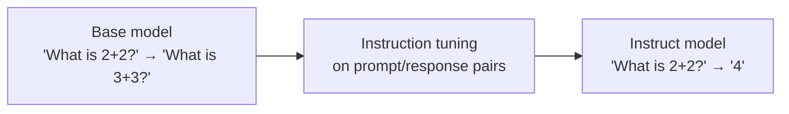

---
aliases:
  - Instruction Following
  - SFT stage
  - Alignment (SFT)
tags:
  - llm
  - training
  - adaptation
---
> [!ABSTRACT] 🧠 Recall
> **In one line:** Train the base model on thousands of **(instruction, good response)** pairs across many diverse tasks — it stops *continuing* text and starts *answering*.
> **Metaphor:** A brilliant, unfiltered savant taught the social convention that a question deserves an answer.
> **Where it bites:** It's the step that made LLMs usable. "Base model" vs "instruct model" is a distinction to never mix up.

---
Take a raw pre-trained model — [[Foundation Models|a foundation model]], fresh from next-token prediction on the internet — and type:

> `What is the capital of France?`

You might get:

```
What is the capital of France?
What is the capital of Germany?
What is the population of Paris?
What is the largest city in Europe?
```

It generated a **quiz**. Ask it to summarise a document and it may append *another* document. Ask for advice and it writes a forum thread with three disagreeing replies.

The model isn't broken and it isn't stupid — it knows the capital of France perfectly well. It is doing **exactly** what it was trained to do: predict what text plausibly follows. And on the internet, what follows a list-like question is often ~={blue}another question.=~

So the gap isn't knowledge. What is it?

---
# The savant

Imagine someone who has read every book, paper and forum post ever written. Total recall. Extraordinary pattern sense.

And they've never had a conversation.

You ask "what's the capital of France?" and they say: *"That's the kind of question that appears in geography textbooks, usually followed by questions about Germany and Spain."*

They're not being difficult. Nobody ever taught them the **social convention** that a question directed at you is a request for the answer — not a text specimen to be continued.

Teaching that convention takes remarkably little: show them a few thousand examples of *someone being asked something and answering it*, across all kinds of requests. That's it. The knowledge was already there; what was missing was the **interaction protocol**.

> [!NOTE] Instruction tuning
> Supervised [[Fine-Tuning]] on a diverse set of (instruction, response) pairs spanning many task types — summarise, translate, classify, brainstorm, write code, refuse. The model learns the *format of being helpful*, and the behaviour generalises to instructions never seen in training. ^instruction-tuning-def

> [!SUCCESS] Core idea
> ~={pink}Instruction tuning adds almost no knowledge. It unlocks knowledge that was already in the weights=~ by teaching the model which *mode* to be in. That's why it's so cheap — thousands of examples, not trillions of tokens — and why the base model is where all the capability actually lives. ^unlocks-not-adds

**Diversity is the active ingredient.** Tune on 50,000 summarisation pairs and you get a summariser. Tune on 1,000 examples spread across 60 *different* task types and you get a model that follows instructions it has never seen. Breadth of task, not volume of data, is what generalises.

---
# Base vs instruct — know which one you're holding 🪪

| | **Base model** | **Instruct / chat model** |
|---|---|---|
| Trained on | Raw text, next-token | + (instruction, response) pairs |
| Give it a question | Continues the text | **Answers it** ✅ |
| Prompt style | Few-shot completions, careful priming | Direct requests, chat roles |
| Uses a chat template | ❌ | ✅ — and it's **mandatory** |
| Refuses harmful requests | Barely | Yes (after [[RLHF]]) |
| Best for | Your own [[Fine-Tuning]] base, raw completion, [[Perplexity]] research | Everything product-facing |

> [!WARNING] The chat template is not optional
> An instruct model was trained with specific special tokens marking turn boundaries (`<|im_start|>user` … or whatever that family uses). Send it a bare string and you're ~={red}off-distribution=~ — quality drops, it may not stop generating, and [[System Prompt]] precedence stops working. Use the tokenizer's `apply_chat_template`, always. This is the single most common cause of "the open-weights model is much worse than the API." ^chat-template

---
# Where the data comes from

- **Human-written** (FLAN, Dolly) — highest quality, slow, expensive
- **Existing NLP datasets reformatted as instructions** — the original FLAN/T5 trick, cheap and effective → [[Exploring the Limits of Transfer Learning (T5)]]
- **Model-generated** (Self-Instruct, Alpaca) — seed with ~175 human examples, have a strong model expand to 52,000. Cheap, and it's [[Distillation]] with a licence question attached
- **Curated small sets** (LIMA) — 1,000 extremely good examples beat 50,000 mediocre ones. The strongest empirical evidence for the "unlocks, doesn't add" view

> [!TIP] Three stages, three jobs — the mental model to keep
> 1. **Pre-training** → *knowledge and capability* (trillions of tokens, £millions)
> 2. **Instruction tuning / SFT** → *the ability to be asked* (thousands of examples, £hundreds)
> 3. **Preference tuning** ([[RLHF]] / [[DPO]]) → *which of two plausible answers people actually prefer*
>
> Each stage answers a question the previous one can't. Get these three straight and most of post-training reads clearly. 🪜

Note what SFT structurally *cannot* do: it can only imitate a demonstration. It has no way to express "this answer is better than that one" — and for tone, helpfulness and harmlessness, ranking is far easier for humans to produce than a perfect demonstration.

---
---
#### 🖼️ Turning a text-predictor into something that answers you


The base model isn't broken. It's doing exactly what it was trained for — continuing text. Instruction tuning teaches it that a question is a request, not a pattern to extend.

# ⁉️
Which is exactly the next problem. Writing the ideal answer is hard; *picking* the better of two is easy. Can you train on that?

→ [[RLHF]]
