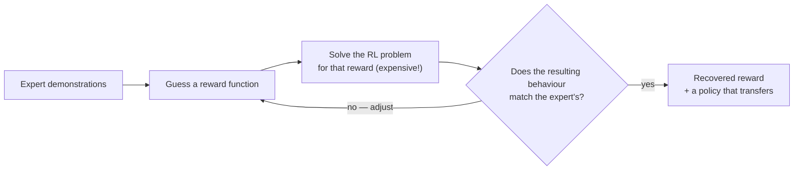

---
aliases:
  - IRL
  - Inverse RL
  - Inverse Optimal Control
  - Maximum Entropy IRL
  - MaxEnt IRL
  - GAIL
  - Generative Adversarial Imitation Learning
  - Apprenticeship Learning
  - Reward Learning
  - Reward Inference
tags:
  - reinforcement-learning
  - alignment
  - decision-sciences
---
> [!ABSTRACT] 🧠 Recall
> **In one line:** RL runs *reward → behaviour*. IRL runs it backwards: **watch the behaviour, infer the reward that explains it** — so you can then plan well in situations the expert never faced.
> **Metaphor:** Watching a colleague's commute for a month and working out what she cares about — time, safety, and that bakery on Fridays.
> **Where it bites:** The intellectual ancestor of reward modelling in RLHF. And a clean example of an *unidentifiable* problem.

---
You watch a colleague drive to work every day for a month.

She takes the motorway — except when it rains, when she uses the slower back road. On Fridays she goes a longer way round that passes a bakery. She never uses the shortcut through the estate with the speed bumps.

Now she moves to a city you've never seen, and you're asked to plan her commute there.

~={blue}A recording of her old turns — "left, left, right" — is useless. What would you actually *want* to have learned from that month?=~

---
# The commute 🥐

Not her **moves**. Her **priorities**: *minimise time — but not at the cost of wet-motorway risk; she'll trade ten minutes for a croissant once a week; she hates speed bumps.*

With those, you can plan a sensible route in **any** city. That's what [[Imitation Learning|behaviour cloning]] can't do — it copies the policy, and a policy is tied to the world it was learned in. A reward function travels.

| | Given | Find |
|---|---|---|
| **[[Reinforcement Learning\|RL]]** | the reward | the best behaviour |
| **IRL** | the (expert's) behaviour | the reward that makes it best |

> [!NOTE] Inverse reinforcement learning
> Given demonstrations from an expert assumed to be (near-)optimal for *some* reward function, recover that reward function. Then run ordinary RL on it to get a policy. ^irl-def

> [!SUCCESS] Core idea
> ~={pink}The reward is the most compact, most transferable description of a task=~ — far more so than the policy. Learn the policy and you can repeat what you saw. Learn the reward and you can do the right thing somewhere new. ^reward-transfers

---
# Why it's hard — the problem is ill-posed

Here's a reward function that explains her behaviour perfectly: **zero, everywhere**. If nothing matters, every route is optimal, including hers. So is *"+1 for being in a car"*.

Infinitely many rewards are consistent with any behaviour. Behaviour alone does **not** pin down the reward — it's an [[Observability|unobservable]] quantity, in exactly the sense of that note.

So every IRL method is really a **tie-breaking principle**:

| Method | The extra assumption |
|---|---|
| **Max-margin** | the expert's behaviour should beat every alternative *by a clear margin* |
| **Maximum-entropy IRL** (Ziebart, 2008) | the expert is *noisily* rational: $P(\text{trajectory}) \propto \exp(\text{its total reward})$. Better routes are exponentially more likely, but she isn't perfect. Find the reward that makes her actual routes most probable — and otherwise assume as little as possible |
| **Bayesian IRL** | keep a [[Beliefs\|posterior]] over rewards instead of choosing one |
| **GAIL** | skip the explicit reward — next row |

> [!TIP] That $\exp(\text{reward})$ again
> The noisily-rational expert is the same Boltzmann form as [[SAC#Step two — keep your options open (SAC) 🥾|the max-entropy policy]], and as the [[Preference Learning|Bradley–Terry]] model of which answer a human prefers. One assumption — *people pick better options exponentially more often, not always* — sits underneath all three.

**GAIL** takes the [[Generative Adverserial Network|GAN]] route. A **discriminator** learns to tell expert trajectories from the learner's. The learner is rewarded for fooling it. The discriminator *is* the reward function — learned implicitly, never written down. It scales to deep networks and inherits GAN training's instability → [[Mode Collapse]].

---
# The classical loop — and why it was slow

An entire RL problem sits *inside* the loop. That cost is why classical IRL mostly stayed in small domains.

---
# What it grew into 🌱

Demonstrations are one signal about what a person wants. They're an awkward one: showing the *best* answer to every prompt is slow, and often the person can't produce it themselves. But almost anyone can look at two attempts and say **which is better**.

| Signal about the hidden reward | Method |
|---|---|
| "Watch me do it" | [[Imitation Learning]] (copy) · **IRL** (infer why) |
| "This one's better than that one" | [[Preference Learning]] → [[RLHF]] |
| "Here's a rubric" / "here's a test" | rubric and verifier rewards → [[GRPO]] |
| A written constitution, applied by another model | [[Constitutional AI- Harmlessness from AI Feedback]] |

Reward modelling from comparisons is IRL's practical descendant: **same goal — recover a reward you can't write down — with a far cheaper signal.**

And it closes a loop that opened in the very first chapter of [[Decision Sciences]]. A thermostat needs someone to [[Decision Sciences#^who-sets-the-setpoint|walk up and set the target]]. Eight chapters later nobody can state the target at all, and the machine has to infer it from people who can't articulate it either. *You never observe the true objective — only signals about it.* That's [[Kalman Filter|Kalman's]] insight, pointed at the goal instead of the state.

> [!WARNING] "IRL recovers *the* reward"
> It recovers **a** reward that's consistent with what you saw, under the tie-breaking assumption you chose — and only over situations the demonstrations covered. Extrapolate that reward to new situations and then **optimise hard against it**, and you're in [[Reward Hacking]] territory: the optimiser will find wherever your inferred reward and the person's real wishes part company. ^a-reward-not-the-reward

---
> [!SUCCESS] If you remember one thing
> **Copy the moves and you can repeat the past. Infer the goal and you can handle the future.** ~={pink}But behaviour never fully determines the goal — so every such method is quietly an assumption about how people choose.=~

---
# ⁉️
Demonstrations are expensive, and people often can't *show* you the ideal. But ask them to compare two attempts and they'll answer in seconds, consistently. Can you build a reward function out of nothing but "A or B?"

→ [[Preference Learning]]
