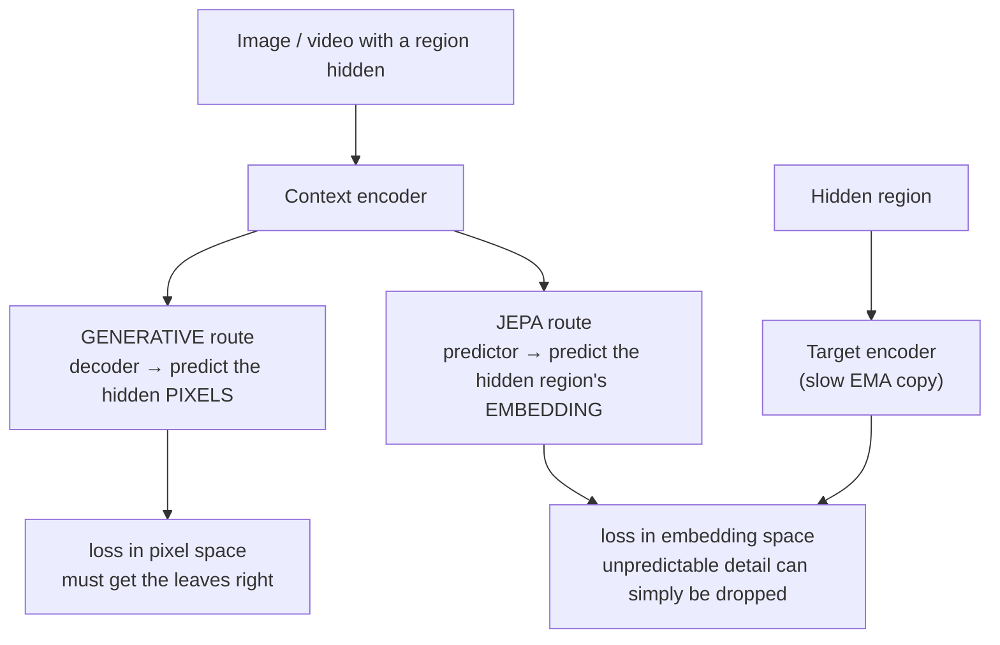

---
aliases:
  - Joint Embedding Predictive Architecture
  - Joint-Embedding Predictive Architecture
  - I-JEPA
  - V-JEPA
  - Joint Embedding
  - Non-Generative Self-Supervised Learning
  - Representation Collapse
  - Predictive Representation Learning
tags:
  - generative-models
  - self-supervised
  - deep-learning
  - world-models
---
> [!ABSTRACT] 🧠 Recall
> **In one line:** Don't predict the missing **pixels** — predict the missing part's **representation**. Encode the visible context, encode the hidden target, and train a predictor to go from one embedding to the other. No decoder, no pixels, nothing generated.
> **Metaphor:** Watching a football fly toward the goal. You predict *where it's going* — not the position of every blade of grass in the next frame.
> **Where it bites:** LeCun's proposed alternative to generative modelling for *understanding* and *world models*. The counter-argument to everything else in this chain.

---
A video of a street. Pause it. Predict the next second.

A [[Video Diffusion|generative model]] must produce every pixel: the exact flutter of each leaf on that tree, the glint on every windscreen, the texture of the tarmac.

Now ask what you, a person, would predict. *The cyclist keeps going. The light's about to change. That car is going to pull out.*

You predicted three things that **matter** — and said nothing whatsoever about the leaves. Not because you're lazy: the leaves are genuinely **unpredictable**. No amount of intelligence tells you which way leaf #4,012 flutters.

~={blue}What happens to a model that's scored on getting the leaves right?=~

---
# Where the ball is going ⚽

It spends almost all its capacity on them. Most of the *bits* in an image are in exactly this kind of high-entropy, low-meaning detail. A pixel-level loss can't tell the difference between "got the cyclist wrong" and "got the leaves wrong" — and there are far more leaves.

Worse, when the future is genuinely uncertain, a model trained to predict pixels under squared error outputs the **average of all possible futures**: blur → [[Variational Autoencoder#^why-vaes-blur|the same reason VAEs blur]]. Diffusion fixes the blur by *sampling* one sharp future — but it's still paying, in compute and capacity, to invent leaves.

JEPA's move: **change the space in which you predict.**

![[jepa_predict_in_latent.png]]

1. A **context encoder** embeds the part you can see.
2. A **target encoder** embeds the part you can't (a masked region; the next frames).
3. A **predictor** maps context-embedding → predicted target-embedding.
4. The loss is a distance **between embeddings**. Pixels are never reconstructed.

The target encoder is free to **discard** whatever is unpredictable. If leaf-flutter can't be predicted, the best representation simply doesn't contain it — and then there's nothing to get wrong.

> [!NOTE] JEPA
> **J**oint-**E**mbedding **P**redictive **A**rchitecture (LeCun, 2022): learn representations by predicting the embedding of a target signal from the embedding of a context signal. **Non-generative** — there is no decoder back to the input space. *I-JEPA* (images), *V-JEPA* (video). → [[Self-Supervised Learning from Images with I-JEPA]] ^jepa-def

> [!SUCCESS] Core idea
> ~={pink}Predict in a space where the unpredictable has already been thrown away.=~ Generative models learn representations as a by-product of reproducing the input. JEPA makes the representation the *only* product — and lets the model decide what's worth representing by what turns out to be predictable. ^predict-in-representation-space

---
# The catch: collapse

There's an embarrassingly good solution to "make the predicted embedding match the target embedding": **make every embedding the same constant vector.** Loss = 0. Information = 0.

> [!WARNING] Every joint-embedding method is mostly a collapse-prevention method
> This is [[Energy-Based Models#^push-up-somewhere|the EBM problem]] exactly: you've pushed the energy *down* on compatible pairs, and nothing is pushing it *up* anywhere else, so the landscape goes flat. The families differ only in how they stop that:
>
> | Approach | How collapse is prevented | Examples |
> |---|---|---|
> | **Contrastive** | explicitly push apart mismatched pairs | [[CLIP]], [[A Simple Framework for Contrastive Learning (SimCLR)\|SimCLR]], InfoNCE — needs many negatives |
> | **Architectural asymmetry** | the target encoder is a slow **EMA copy** of the context encoder, with a stop-gradient | BYOL, DINO, **I-JEPA** — the [[DQN#^make-it-hold-still\|target-network]] trick again |
> | **Regularise the embeddings** | force each dimension to have variance, and dimensions to be decorrelated | VICReg, Barlow Twins, **[[LeJEPA- Provable and Scalable Self-Supervised Learning\|LeJEPA]]** |
> ^jepa-collapse

---
# Where it sits

| | Pixel-generative (MAE, diffusion) | Contrastive ([[CLIP]], SimCLR) | **JEPA** |
|---|---|---|---|
| Predicts | pixels | *nothing* — pulls views together | **embeddings** |
| Needs hand-made augmentations | no | **yes** — and they bake in your assumptions | **no** — just masking |
| Wastes capacity on unpredictable detail | **yes** | no | no |
| Can generate | ✅ | ❌ | ❌ |
| Representation quality per FLOP | lower | good | **good — I-JEPA's headline result** |

And that's the honest trade: **a JEPA can't draw you anything.** It isn't a rival for image *generation*. It's a rival for the claim that generation is the road to *understanding*.

---
# The bigger argument 🧭

LeCun's position, roughly: an agent that plans needs a **world model** — and a world model should predict the *consequences of actions* in an abstract state space, at several time-scales, not render future video. Planning then happens **in representation space**: [[Model Predictive Control]] over embeddings → [[Model-Based vs Model-Free RL]]. The vault has [[JEPA-Anything- Learning Predictive Models across Different Worlds]] on exactly this.

It's the oldest idea in this vault wearing new clothes: a [[State-Space Model|**state**]] is *the minimum you need to know so the past stops mattering*. JEPA is an attempt to **learn the state** — what to keep, what to drop — instead of having an engineer choose it. (MuZero makes the same bet from the RL side: its latent model is never asked to reconstruct the board → [[Monte Carlo Tree Search]].)

> [!WARNING] This is a live debate, not a settled result
> The generative camp's reply: scale makes the "wasted capacity" cheap; pixel-level prediction is a *complete*, ungameable objective, whereas a learned target can quietly discard things you needed; and generative models demonstrably **do** learn excellent representations — [[Foundation Models|LLMs]] being Exhibit A. Text is an interesting case: it's already abstract, with little "leaf noise", which may be why generative pre-training works so spectacularly there and less obviously for video. ~={blue}Nobody knows yet which way this goes.=~ ^generative-vs-jepa-debate

---
---
#### 🖼️ Same masked input, two different targets

---
> [!SUCCESS] If you remember one thing
> **Generative models predict the data; JEPA predicts the *meaning* of the data.** ~={pink}It can't generate anything — and that's the point: it's a bet that understanding doesn't require rendering.=~

---
# ⁉️
That's the full arc: write the density down → compress and decode → play a game → learn the slope → destroy and rebuild → straighten the path → steer and scale → and finally, question whether generating is the goal at all. The map that sequences it:

→ [[Generative Models]]
