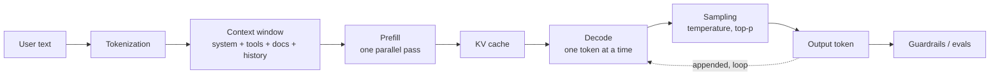

---
aliases:
  - LLM Engineering
  - LLM Ops
  - LLM Systems
  - MOC - LLM
tags:
  - llm
  - moc
  - engineering
---
> [!ABSTRACT] 🧠 Recall
> **In one line:** The map — follow **one request** from the user's keystroke to the answer on screen, and every LLM term lands in the place it belongs.
> **Metaphor:** A restaurant service. Order taken, kitchen fires, plate goes out, and somebody checks it before it reaches the table.
> **Where it bites:** Use this page to *find* the note. Use the chain at the bottom to read them in order.

---
Someone types a sentence into a box and presses enter. Eleven seconds later there's a paragraph on their screen with two citations and a link.

Between those two moments, a dozen systems ran. And almost every term in the LLM vocabulary is ~={blue}the name of one stage of that journey, or the name of one thing that goes wrong there.=~

So rather than a glossary, follow the request.

---
# 1. The request becomes numbers

The model never sees your sentence. It sees integers.

→ **[[Tokenization]]** — the vocabulary was frozen before training; it decides your bill, and it's why the model can't count letters.
→ **[[Context Window]]** — everything must fit: instructions, docs, history, *and* the answer. There is no memory outside it.

> [!NOTE] The one sentence to internalise here
> The API is **stateless**. A conversation is an illusion produced by re-sending the whole transcript every turn. Get that straight and half the confusion about "memory" disappears. ^stateless

---
# 2. The GPU does two completely different jobs

→ **[[Prefill and Decode]]** — reading the prompt is a bulk parallel matmul (compute-bound); writing the answer is a one-token-at-a-time crawl (memory-bound). **Different SLAs, different fixes.** Start here — most serving work only makes sense downstream of this split.
→ **[[KV Cache]]** — don't recompute the past. And now memory is your binding constraint, so this is what actually caps your concurrency.
→ **[[Grouped Query Attention]]** — share K/V heads; shrink the cache 4–8×.
→ **[[Continuous Batching]]** — schedule per *decode step*, not per request. 10–20× throughput.
→ **[[Speculative Decoding]]** — a cheap model guesses, the big one verifies in one pass. Exactly the same output distribution.
→ **[[Quantization]]** — 4-bit weights, fewer bytes to move.
→ **[[Sampling Parameters]]** — the model emits a distribution; temperature and top-p decide how you roll.
→ **[[Perplexity]]** — how good that distribution was in the first place.

| If this is your problem | Read this |
|---|---|
| Time to first token is bad | [[Prefill and Decode]], prompt caching, [[Flash Attention]] |
| Tokens/sec is bad | [[Quantization]], [[Speculative Decoding]], [[Continuous Batching]] |
| OOM / too few concurrent users | [[KV Cache]], [[Grouped Query Attention]] |
| Output is repetitive or unhinged | [[Sampling Parameters]] |
| Won't fit on the GPU at all | [[Quantization]], [[LoRA]], [[Mixture of Experts]] |

Deeper hardware context: [[GPU processing]], [[ML Infrastructure]], [[Mixed Precision training]], [[Flash Attention]].

---
# 3. What you put in the window

This is the cheapest lever you have, by an order of magnitude, and most teams under-invest in it before reaching for training.

→ **[[Prompt Engineering]]** — you're conditioning a distribution, not asking nicely.
→ **[[System Prompt]]** — standing configuration vs per-request content. Privileged by *training*, not enforcement.
→ **[[In Context Learning]]** — zero/one/few-shot. Learning with no weight updates, which is genuinely strange.
→ **[[Chain of Thought]]** — generated tokens **are** compute; make it think on paper.
→ **[[Test-Time Compute]]** — turn that dial all the way up. Capability becomes a per-request spend decision.
→ **[[Structured Output]]** — don't *request* JSON, mask the logits so invalid JSON is unreachable.

---
# 4. Knowledge it doesn't have

The weights are frozen, stale, and know nothing about your company.

→ **[[RAG]]** — fetch the documents, paste them in, answer from those. It's a **retrieval** problem wearing an LLM costume.
→ **[[Embeddings]]** — text → a point in space where distance means dissimilarity of meaning.
→ **[[Vector Database]]** — approximate nearest neighbours; recall is a dial you chose.
→ **[[Reranking]]** — a cross-encoder reads query and candidate *together*. Usually the biggest cheap win in RAG.
→ **[[Lost in the Middle]]** — accuracy is U-shaped in position. *Where* you put a chunk matters.
→ **[[Memory]]** — three different systems in one word: context, scratchpad, persistent store.
→ **[[Long Context]]** — three separate walls (quadratic compute, linear cache, untrained positions).

---
# 5. Changing the model itself

Only once prompting and retrieval are exhausted.

→ **[[Fine-Tuning]]** — teaches **form and behaviour**; a poor way to teach facts.
→ **[[LoRA]]** — the adaptation is low-rank, so learn 0.1% of the parameters. One GPU, swappable adapters.
→ **[[Instruction Tuning]]** — turns a text-continuer into an assistant. Unlocks; doesn't add.
→ **[[RLHF]]** — humans rank pairs → reward model → RL with a [[KL Divergence|KL]] leash.
→ **[[DPO]]** — the algebra that removes the reward model and the RL loop.
→ **[[Distillation]]** — copy a big model's whole distribution into a small one.

> [!TIP] The escalation ladder — stop at the first rung that works 🪜
> prompt → few-shot → retrieve → tools → think longer → **then** fine-tune.
> People skip to the last rung constantly. It fixes *form*; they usually wanted *facts*. ^escalation-ladder

---
# 6. Inside the architecture

→ **[[Query, Key, and Value (QKV)]]** → **[[Causal Attention]]** → **[[Flash Attention]]** — the core.
→ **[[RoPE]]** — position by rotation, so the dot product sees relative distance.
→ **[[Mixture of Experts]]** — decouple total parameters from active ones. Cheap FLOPs, expensive VRAM.
→ **[[Auto-regressive models]]**, **[[Foundation Models]]**, **[[Seq2Seq models]]**, **[[Linear Projection]]**, **[[Gated Activation]]**.

---
# 7. Giving it hands

→ **[[Tool Use]]** — the model *proposes*, your executor *disposes*. That boundary is where all the safety lives.
→ **[[Agentic Workflows]]** — think → act → observe → repeat. Agency = the model chooses the control flow.
→ **[[Model Context Protocol]]** — USB-C for tools. $M \times N$ integrations become $M + N$.

> [!WARNING] The number that kills agent demos
> 95% reliability per step, over 20 steps, is **36%**. Fewer steps, higher per-step reliability, or checkpoints that verify. There is no fourth option. ^compounding-error

---
# 8. What goes wrong, and how you'd know

→ **[[Hallucination]]** — the objective rewards *plausible*, and never mentions *true*.
→ **[[Grounding]]** — every claim traceable to a source. Grounded ≠ correct, and that's the useful distinction.
→ **[[Evals]]** — a test suite for a non-deterministic system. The step everyone skips.
→ **[[Prompt Injection]]** — instructions and data share one channel. No complete fix; contain the blast radius.
→ **[[Jailbreak]]** — safety training is a prior, not a gate.
→ **[[Guardrails]]** — a control in the prompt is a *preference*; a control in code is a *constraint*.
→ **[[Reward Hacking]]** — optimisation is an exhaustive adversary against your specification.

---
# The reading order 📖

Each note ends with a `# ⁉️` hook to the next, so you can read the whole thing as one chain:

> [[Tokenization]] → [[Context Window]] → [[Prefill and Decode]] → [[KV Cache]] → [[Grouped Query Attention]] → [[Continuous Batching]] → [[Speculative Decoding]] → [[Quantization]] → [[Sampling Parameters]] → [[Perplexity]] → [[Prompt Engineering]] → [[System Prompt]] → [[Chain of Thought]] → [[Test-Time Compute]] → [[Structured Output]] → [[RAG]] → [[Embeddings]] → [[Vector Database]] → [[Reranking]] → [[Lost in the Middle]] → [[Memory]] → [[Fine-Tuning]] → [[LoRA]] → [[Instruction Tuning]] → [[RLHF]] → [[DPO]] → [[Mixture of Experts]] → [[RoPE]] → [[Long Context]] → [[Tool Use]] → [[Agentic Workflows]] → [[Model Context Protocol]] → [[Hallucination]] → [[Grounding]] → [[Evals]] → [[Prompt Injection]] → [[Jailbreak]] → [[Guardrails]] → [[Reward Hacking]] → back here. ^reading-chain

> [!SUCCESS] If you remember one thing
> Four questions cover almost every LLM design conversation:
> 1. **What's in the context window?** (everything the model can possibly know)
> 2. **Who decides the control flow — you or the model?** (workflow vs agent)
> 3. **What's the proxy, and how would it be gamed?** (reward, metric, eval)
> 4. **If this model were fully controlled by an attacker, what could it reach?** (blast radius)
>
> ~={pink}Everything else is an implementation detail of one of those four.=~ ^four-questions

---
# Papers worth reading in this area 📚
[[Attention Is All You Need]] · [[Language Models are Few-Shot Learners (GPT-3)]] · [[Scaling Laws for Neural Language Models]] · [[Training Compute-Optimal Large Language Models (Chinchilla)]] · [[Training language models to follow instructions with human feedback]] · [[Chain-of-Thought Prompting Elicits Reasoning in LLMs]] · [[LoRA- Low-Rank Adaptation of Large Language Models]] · [[QLoRA- Efficient Finetuning of Quantized LLMs]] · [[Direct Preference Optimization (DPO)]] · [[Constitutional AI- Harmlessness from AI Feedback]] · [[FlashAttention- Fast and Memory-Efficient Exact Attention]] · [[Efficient Memory Management for LLM Serving with PagedAttention (vLLM)]] · [[GQA- Training Generalized Multi-Query Transformer Models]] · [[RoFormer- Enhanced Transformer with Rotary Position Embedding]] · [[Sparsely-Gated Mixture-of-Experts Layer]] · [[Dense Passage Retrieval (DPR)]] · [[Efficient and robust approximate nearest neighbor search using HNSW]] · [[The Bitter Lesson (essay)]]

---
---
#### 🖼️ The whole journey of one request

# ⁉️
The foundations underneath all of this — gradients, losses, what a transformer actually is — live in [[Deep Learning]], [[Backpropagation]], [[Cross Entropy]] and [[Fundamentals]]. The hardware it runs on is [[GPU processing]] and [[ML Infrastructure]].
