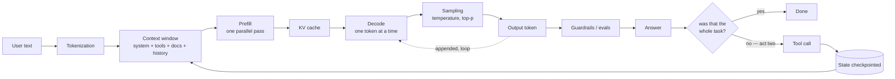

---
aliases:
  - LLM Engineering
  - LLM Ops
  - LLM Systems
  - MOC - LLM
tags:
  - llm
  - moc
  - engineering
---

> [!ABSTRACT] 🧠 Recall
> **In one line:** The map — follow **one request** from the keystroke to the answer on screen, and every LLM term lands in the place it belongs.
> **Metaphor:** A restaurant service. Order taken, kitchen fires, plate goes out, and somebody checks it before it reaches the table.
> **Where it bites:** Use this page to *find* the note. Use the chain at the bottom to read them in order.

---
LLM essentially stands for **large language model**. It is also called a **Foundational Model**.

What it means is, typically people build a huge neural network and then train it on a huge corpus. This training corpus could be just text or images or videos or a mix of more than 1 - when it's a mix it's called ~={purple}multi-modal=~. The format of train data is called ~={purple}modality=~. Let's park this thought for now.

So moving on, an LLM is simply put a huge neural network which is already _pretrained_ on some huge training corpus.
Typically when it's just a foundation model, then people actually can _finetune_ these models by training on more specific training corpus. Think for example using a BERT model and training it on a company's customer support data. Mostly in such cases you're essentially ~={yellow}retraining the whole network=~.

Now LLM is same, but since its so huge - typically with billions of parameters, there also exist more specialised way of finetuning than whole network retraining. Again, more later!

---
# So what actually happens when you use one?

So most LLMs these days are chatbots or some sit behind some app you interact with. Think ChatGPT!
Someone types a sentence into a box and presses enter.
Eleven seconds later there's a paragraph on their screen, with two citations and a link.

Between those two moments, a dozen separate systems ran.

And here's the useful part. Almost every term in the LLM vocabulary is the name of **one stage of that journey**, or the name of **one thing that goes wrong at that stage**.

~={blue}So rather than a glossary sorted alphabetically, let's just follow the request.=~

---
# 1. The request becomes numbers

The model never sees your sentence. Not really.

It sees a list of integers.

Your words get chopped into pieces, and each piece is looked up in a fixed vocabulary that was frozen before training ever started. `unhappiness` might become three pieces. A rare surname might become seven.

→ **[[Tokenization]]** — how the chopping works. It decides your bill, and it's the reason a model can't reliably count the letters in a word.
	In simple words, tokenization can be thought of splitting a sentence into words. So 1 word = 1 token. But in actuality most LLMs use subwords. There is a paper [[Neural Machine Translation of Rare Words with Subword Units]] which explains what subwords are and how they make better tokens than words themselves. Or we can simply look at the link above for simpler explanation. But worth reading the paper too and see how something that was invented for a completely different reason but used in a completely different problem statement and became a foundation for the world of LLMs.
→ **[[Context Window]]** — everything has to fit in one window: your instructions, your documents, the conversation so far, *and* the answer it's about to write.
	You see, what you ask and what's answered by the model both together is called the **context** of the model. So as your conversation keeps going, the context keeps growing too. It contains all the questions asked previously until now and all the answers given for every single 1 of them. But since there is a limit to how much can be held, sometimes it discards or compresses (think summarization) the previous conversations

> [!NOTE] The one sentence to internalise here
> The API is **stateless**. A conversation is an illusion, produced by re-sending the entire transcript every single turn. Get that straight and half the confusion about "memory" disappears. ^stateless

---
# 2. The GPU does two completely different jobs

This one surprises people, and almost all serving work depends on it.

Reading your prompt and writing the answer are **not** the same kind of work.

Reading the prompt happens all at once — every token processed in parallel, one big matrix multiplication. The GPU's arithmetic units are the bottleneck.

Writing the answer happens one token at a time (this kind of output generation is called [[Auto-regressive models | auto-regressive]]), and each token has to wait for the one before it. Now the bottleneck is *memory bandwidth*, not arithmetic. The GPU spends most of its time waiting for data to arrive.

Two different problems. Two different sets of fixes.

→ **[[Prefill and Decode]]** — That different problem we just discussed - that split itself is referred as prefill and decode. Every prompt to an LLM **Starts here** — most of what follows only makes sense once you've got this. **Prefill** is essentially the forward pass where the entire input is processed and **Decode** is the auto-regressive output generation process.
→ **[[KV Cache]]** — don't recompute the past on every token; store it. And now memory is your binding constraint, so this is what actually caps how many users you can serve.
→ **[[Grouped Query Attention]]** — let groups of attention heads share one set of keys and values. 4–8× less cache.
→ **[[Continuous Batching]]** — schedule work per *decode step* rather than per request. 10–20× the throughput.
→ **[[Speculative Decoding]]** — a small cheap model guesses several tokens ahead, the big model checks them all in one pass. Same output distribution, genuinely.
→ **[[Quantization]]** — store the weights in 4 bits instead of 16. Fewer bytes to move.
→ **[[Sampling Parameters]]** — the model gives you a probability for every possible next token. Temperature and top-p decide how you roll the dice.
→ **[[Perplexity]]** — how good those probabilities were in the first place.

| If this is your problem | Read this |
|---|---|
| Time to first token is bad | [[Prefill and Decode]], [[Prompt Caching]], [[Flash Attention]] |
| Tokens per second is bad | [[Quantization]], [[Speculative Decoding]], [[Continuous Batching]] |
| Out of memory, or too few concurrent users | [[KV Cache]], [[Grouped Query Attention]] |
| Output is repetitive, or unhinged | [[Sampling Parameters]] |
| Won't fit on the GPU at all | [[Quantization]], [[LoRA]], [[Mixture of Experts]] |

Deeper hardware context sits in [[GPU processing]], [[ML Infrastructure]], [[Mixed Precision training]] and [[Flash Attention]].

---
# 3. What you put in the window

Remember the context window from section 1 — everything the model knows has to be in there.

So the cheapest lever you have is simply **choosing what goes in it**. Cheaper than fine-tuning by an order of magnitude. Most teams under-invest here and reach for training instead.

→ **[[Prompt Engineering]]** — you're not asking nicely, you're conditioning a probability distribution.
→ **[[System Prompt]]** — standing configuration, as opposed to per-request content. It's privileged by *training*, not by any enforcement mechanism.
→ **[[In Context Learning]]** — show it three examples and it picks up the task, with no weight updates at all. Which is genuinely strange when you think about it.
→ **[[Chain of Thought]]** — the tokens it generates **are** its compute. Let it think on paper and it gets more of them.
→ **[[Test-Time Compute]]** — turn that dial all the way up. Capability becomes a per-request spending decision.
→ **[[Structured Output]]** — don't *ask* for JSON. Mask the logits so that invalid JSON is literally unreachable.

---
# 4. Knowledge it doesn't have

The weights were frozen when training stopped. They're stale, and they know nothing at all about your company.

So you fetch the relevant documents and paste them into the window alongside the question.

→ **[[RAG]]** — fetch, paste, answer from those. It's a **retrieval** problem wearing an LLM costume, and most RAG failures are retrieval failures.
→ **[[Embeddings]]** — turn text into a point in space, where being close together means meaning something similar.
→ **[[Vector Database]]** — find the nearest points, approximately, across a billion rows. How approximately is a dial you chose.
→ **[[Reranking]]** — a second model reads the query and each candidate *together* rather than separately. Usually the biggest cheap win available.
→ **[[Lost in the Middle]]** — accuracy is U-shaped in position. *Where* you put a chunk in the window matters.
→ **[[Chunking]]** — where you cut the documents decides both what can be *found* and whether the piece is *enough to answer*. Those are two different things.
→ **[[Context Engineering]]** — prompt engineering writes the instruction once. This decides what's in the window on turn 40.
→ **[[Memory]]** — three completely different systems share one word: the context, a scratchpad, and a persistent store.
→ **[[Long Context]]** — three separate walls: quadratic compute, cache that grows linearly, and positions the model never trained on.

---
# 5. Changing the model itself

Only once prompting and retrieval are genuinely exhausted.

→ **[[Fine-Tuning]]** — teaches **form and behaviour**. It's a poor way to teach facts, and that's the mistake people make.
→ **[[LoRA]]** — the change a fine-tune makes turns out to be low-rank, so you can learn about 0.1% of the parameters instead of all of them. One GPU, and adapters you can swap.
→ **[[Instruction Tuning]]** — turns a text-continuer into an assistant. It unlocks; it doesn't add.
→ **[[RLHF]]** — humans rank pairs of answers → train a reward model → use RL, on a [[KL Divergence|KL]] leash.
→ **[[DPO]]** — the algebra that removes the reward model and the RL loop entirely.
→ **[[Distillation]]** — copy a big model's whole output distribution into a small one.

> [!TIP] The escalation ladder — stop at the first rung that works 🪜
> prompt → few-shot → retrieve → tools → think longer → **then** fine-tune.
> People skip straight to the last rung constantly. It fixes *form*; they usually wanted *facts*. ^escalation-ladder

---
# 6. Inside the architecture

This is the layer underneath everything above. It has its own map, because it's large.

→ **[[Attention]]** — the hub for this whole layer: who is allowed to look at whom, and four different ways of not paying the $n^2$ bill. **Go there for the full chain.**
→ **[[Query, Key, and Value (QKV)]]** → **[[Causal Attention]]** → **[[Flash Attention]]** — the core three.
→ **[[Multi-Head Attention]]** — heads split a fixed budget, so 64 of them cost what one costs.
→ **[[Cross Attention]]** — queries from one sequence, keys and values from another. Decoder-only LLMs gave it up and concatenate instead.
→ **[[RoPE]]** — position encoded as rotation, so the dot product sees relative distance.
→ **[[Multi-head Latent Attention]]** — compress the cache rather than sharing it.
→ **[[Sparse Attention]]** — a local window plus a few globally visible tokens.
→ **[[Linear Attention]]** — remove the softmax and attention becomes a running total with a fixed-size state.
→ **[[Mixture of Experts]]** — separate the *total* parameters from the ones actually used per token. Cheap arithmetic, expensive VRAM.
→ **[[Auto-regressive models]]**, **[[Foundation Models]]**, **[[Seq2Seq models]]**, **[[Linear Projection]]**, **[[Gated Activation]]**.

---
# 7. Giving it hands

Everything up to here happens inside **one call**.

From here on, the request stops being a call and becomes a ~={blue}task the model carries out over many calls=~ — and that changes the cost model, the failure modes and the operations story all at once.

It starts simply. You describe some functions to the model. It replies with the name of one, and some arguments. **Your** code runs it, and you paste the result back in.

Notice what the model did and didn't do there. It proposed. It never executed anything.

→ **[[Tool Use]]** — the model *proposes*, your executor *disposes*. That boundary is where all the safety lives.
→ **[[Agentic Workflows]]** — think → act → observe → repeat. It's an agent when the *model* chooses the control flow.
→ **[[Model Context Protocol]]** — USB-C for tools. $M \times N$ integrations collapse to $M + N$.

> [!WARNING] The number that kills agent demos
> 95% reliability per step sounds fine. Over 20 steps it's $0.95^{20}$ — **36%**. Fewer steps, higher per-step reliability, or checkpoints that verify. There is no fourth option. ^compounding-error

---
# 8. From one call to a loop

Once the model is choosing the control flow, eight problems show up that a single call never had. Each note below is one of them.

→ **[[Planning and Decomposition]]** — planning adds no information. What it buys is a shorter run and visible parallelism.
→ **[[Reflection]]** — self-critique is a channel, not a signal. With a test behind it: 55% → 84%. Without one: about two points.
→ **[[Agentic RAG]]** — retrieval as a tool the model *chooses* to call. The only way to answer a question whose search terms didn't exist yet.
→ **[[Multi-Agent LLM Systems]]** — specialisation is mostly a costume. What you actually bought was a fresh context window. Share state; never pass summaries.
→ **[[Human in the Loop]]** — a gate that fires on everything is being rubber-stamped by Tuesday. Precision is the whole design.
→ **[[Agent State and Checkpointing]]** — "where we are" has to be a row in a database, not a Python stack frame.
→ **[[Sandboxing]]** — you can't make model output trustworthy. Bound what it can reach instead.
→ **[[Computer Use]]** — driving the screen when there's no API. Universal coverage, and the slowest loop you own.

> [!TIP] Autonomy is a budget, not a setting 🪜
> Every agent needs four caps chosen *before* launch — **steps, tokens, spend, wall clock** — plus a stop condition it is allowed to reach. The alternative is discovering all four from an invoice. ^agent-budgets

---
# 9. The frameworks you'll actually type

→ **[[LangChain]]** — one `Runnable` interface over many providers. Buy the portability; leave the pre-built chains.
→ **[[LangGraph]]** — the agent as a graph over persisted state. Checkpoints, interrupts, and time-travel debugging.
→ **[[LlamaIndex]]** — the ingestion half, which is where the three weeks actually go.
→ **[[DSPy]]** — the prompt becomes an *output*. You edit the metric; an optimiser edits the string.
→ **[[Agent Frameworks]]** — the landscape, with verdicts. Including "no framework, just write the loop".
→ **[[Model Gateway]]** — one endpoint in front of every provider: routing, fallbacks, spend caps, and the logs everything else needs.

> [!TIP] Choose a framework on the 3am features
> The agent loop itself is about 200 lines and you can write it. **Durable state, human interrupts and a readable trace** are not 200 lines. Score every framework on those three and the shortlist collapses to two. ^choose-on-3am

---
# 10. Running it in production

→ **[[Streaming]]** — total time is unchanged; the *wait* disappears. And validation, guardrails and retries all break.
→ **[[Prompt Caching]]** — keep the front of your prompt stable and you stop paying to re-read it. Same run, same words: $0.80 → $0.21.
→ **[[Retries and Fallbacks]]** — a retry converts a failure into latency and money. Budget them globally or they compound.
→ **[[Cost and Latency]]** — 93% of an agent's input bill is words you already sent, and it grows with the *square* of the number of steps.
→ **[[Observability and Tracing]]** — you can't re-run a non-deterministic system, so record it like a flight recorder.
→ **[[Agent Evaluation]]** — grade the route and the fare, not only the destination.

> [!WARNING] The production number almost everyone has backwards
> Output tokens cost ~5× more *per token*, but they're only about **7%** of an agent run's bill. The money is the context you re-send on every single step — so the lever is ~={red}fewer steps and a cached prefix=~, not shorter answers. ^resent-context

---
# 11. What goes wrong, and how you'd know

→ **[[Hallucination]]** — the training objective rewards *plausible*, and never once mentions *true*.
→ **[[Grounding]]** — every claim traceable to a source. Grounded ≠ correct, and that distinction is the useful part.
→ **[[Evals]]** — a test suite for a non-deterministic system. The step everyone skips.
→ **[[Prompt Injection]]** — your instructions and untrusted data travel down the same channel. There's no complete fix; you contain the blast radius.
→ **[[Jailbreak]]** — safety training is a prior, not a gate.
→ **[[Guardrails]]** — a control written in the prompt is a *preference*. A control written in code is a *constraint*.
→ **[[Reward Hacking]]** — optimisation is an exhaustive adversary against whatever you actually wrote down.

---
# Symptom → read this 🩺

| What you're seeing | Start here |
|---|---|
| Retrieval "works" but answers are half-right | [[Chunking]], [[Reranking]] |
| Quality falls off after about turn 20 | [[Context Engineering]], [[Lost in the Middle]] |
| The agent loops forever on the same failing action | [[Agentic Workflows]], [[Agentic RAG]], [[Planning and Decomposition]] |
| The bill exploded and nobody can say why | [[Cost and Latency]], [[Prompt Caching]], [[Model Gateway]] |
| You can't reproduce a bad run from four days ago | [[Observability and Tracing]] |
| A crash at step 14 of 20 restarted at step 1 | [[Agent State and Checkpointing]] |
| A handoff between agents lost a crucial qualifier | [[Multi-Agent LLM Systems]] |
| "Add a reflection step" changed nothing | [[Reflection]] |
| It writes convincing prose about a number it invented | [[Hallucination]], [[Grounding]] |
| Approvals are being rubber-stamped | [[Human in the Loop]] |
| A model-written script did something alarming | [[Sandboxing]], [[Prompt Injection]] |
| p99 latency doubled during a provider wobble | [[Retries and Fallbacks]] |
| Two versions score the same but feel different | [[Agent Evaluation]] |

---
# The reading order 📖

Each note ends with a `# ⁉️` hook to the next, so you can read the whole thing as one chain:

> [[Tokenization]] → [[Context Window]] → [[Prefill and Decode]] → [[KV Cache]] → [[Grouped Query Attention]] → [[Continuous Batching]] → [[Speculative Decoding]] → [[Quantization]] → [[Sampling Parameters]] → [[Perplexity]] → [[Prompt Engineering]] → [[System Prompt]] → [[Chain of Thought]] → [[Test-Time Compute]] → [[Structured Output]] → [[RAG]] → [[Embeddings]] → [[Vector Database]] → [[Reranking]] → [[Lost in the Middle]] → [[Chunking]] → [[Context Engineering]] → [[Memory]] → [[Fine-Tuning]] → [[LoRA]] → [[Instruction Tuning]] → [[RLHF]] → [[DPO]] → [[Mixture of Experts]] → [[RoPE]] → [[Long Context]] → [[Tool Use]] → [[Agentic Workflows]] → [[Model Context Protocol]] → [[Planning and Decomposition]] → [[Reflection]] → [[Agentic RAG]] → [[Multi-Agent LLM Systems]] → [[Human in the Loop]] → [[Agent State and Checkpointing]] → [[Sandboxing]] → [[Computer Use]] → [[LangChain]] → [[LangGraph]] → [[LlamaIndex]] → [[DSPy]] → [[Agent Frameworks]] → [[Model Gateway]] → [[Streaming]] → [[Prompt Caching]] → [[Retries and Fallbacks]] → [[Cost and Latency]] → [[Observability and Tracing]] → [[Agent Evaluation]] → [[Hallucination]] → [[Grounding]] → [[Evals]] → [[Prompt Injection]] → [[Jailbreak]] → [[Guardrails]] → [[Reward Hacking]] → back here. ^reading-chain

> [!SUCCESS] If you remember one thing
> Five questions cover almost every LLM design conversation:
> 1. **What's in the context window?** (everything the model can possibly know)
> 2. **Who decides the control flow — you or the model?** (workflow vs agent)
> 3. **What's the proxy, and how would it be gamed?** (reward, metric, eval)
> 4. **If this model were fully controlled by an attacker, what could it reach?** (blast radius)
> 5. **What does one run cost, and what happens if it dies halfway?** (tokens, steps, durable state)
>
> ~={pink}Everything else is an implementation detail of one of those five.=~ ^four-questions

---
# Papers worth reading in this area 📚
[[Attention Is All You Need]] · [[Language Models are Few-Shot Learners (GPT-3)]] · [[Scaling Laws for Neural Language Models]] · [[Training Compute-Optimal Large Language Models (Chinchilla)]] · [[Training language models to follow instructions with human feedback]] · [[Chain-of-Thought Prompting Elicits Reasoning in LLMs]] · [[LoRA- Low-Rank Adaptation of Large Language Models]] · [[QLoRA- Efficient Finetuning of Quantized LLMs]] · [[Direct Preference Optimization (DPO)]] · [[Constitutional AI- Harmlessness from AI Feedback]] · [[FlashAttention- Fast and Memory-Efficient Exact Attention]] · [[Efficient Memory Management for LLM Serving with PagedAttention (vLLM)]] · [[GQA- Training Generalized Multi-Query Transformer Models]] · [[RoFormer- Enhanced Transformer with Rotary Position Embedding]] · [[Sparsely-Gated Mixture-of-Experts Layer]] · [[Dense Passage Retrieval (DPR)]] · [[Efficient and robust approximate nearest neighbor search using HNSW]] · [[The Bitter Lesson (essay)]] · [[SWE Refactor Bench- Can Coding Agents Complete a Long-Horizon, Whole-Repository Stack Migration]] · [[The Handoff Tax- Continuing Non-Native Trajectories in LLM Agents]] · [[DRACO- Fine-Grained Credit Assignment with Dynamic Rubrics for Long-Horizon Agent Training]] · [[What Makes Good Agentic Data- An ACE Lens on Data Generation for LLM Agents]] · [[LatentPress- Context Compression Beyond Text and Vision]] · [[Using Grounded Theory for Agent Behavior Analysis at Scale]]

---
---
#### 🖼️ The whole journey of one request

Act one is one call. Act two is that same diagram forty times over, with the context growing on every lap — which is the whole reason sections 8 to 10 exist.

# ⁉️
The foundations underneath all of this — gradients, losses, what a transformer actually is — live in [[Deep Learning]], [[Backpropagation]], [[Cross Entropy]] and [[Fundamentals]]. The hardware it runs on is [[GPU processing]] and [[ML Infrastructure]].
