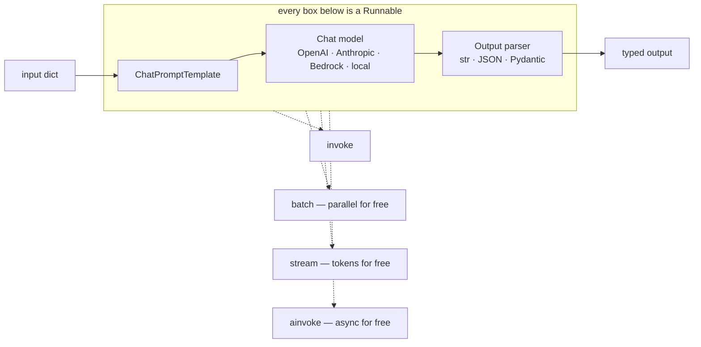

---
aliases:
  - LCEL
  - Runnables
  - LangChain Expression Language
tags:
  - llm
  - engineering
  - tooling
  - agents
---
> [!ABSTRACT] 🧠 Recall
> **In one line:** One interface — **`Runnable`** — that every prompt, model, retriever, parser and tool implements, so they compose with `|` and all get `invoke` / `stream` / `batch` / `async` for free.
> **Metaphor:** Unix pipes. `ls | grep | wc` works because every program agreed to read stdin and write stdout, not because anyone coordinated.
> **Where it bites:** The abstraction is worth most at the **integration** layer and least at the "here's a pre-built chain" layer. Teams adopt the second and blame the first.

---
Your app calls OpenAI. Product wants Claude as a fallback. Here's what changes, honestly:

```
client construction        different
message format             "content" is a string vs a list of blocks
tool-call field names       tool_calls[].function.arguments  vs  content[].input
streaming event shape       deltas vs typed events
token usage field           usage.prompt_tokens vs usage.input_tokens
error classes               different hierarchy, different retryable set
stop reason enum            different strings
```

Seven places, each somewhere else in the codebase, each with its own test. Two days, and then a third provider arrives.

Or:

```python
llm = ChatOpenAI(model="gpt-4o-mini")      # → ChatAnthropic(model="claude-sonnet-4-5")
```

One line. Same messages, same tool-call objects, same streaming events, same usage fields, same error types.

That swap is ~={blue}the entire product=~ — and once you see it, the arguments about LangChain get much easier to have.

---
# The pipe

`ls | grep foo | wc -l` composes three programs written by three people who never spoke, and it works because of one boring agreement: **read from stdin, write to stdout**.

![[langchain_runnable_pipe.png]]

Nobody built a "text processing framework". They built a *contract*, and composition fell out of it. Any program that honours the contract can be dropped into any pipeline, and the shell gets to add features — backgrounding, redirection — that every program inherits without knowing.

LangChain's bet is the same bet, on a different contract:

> [!NOTE] The `Runnable` contract
> Every component — `ChatPromptTemplate`, a chat model, a retriever, an output parser, a Python function — implements one interface with `invoke`, `batch`, `stream`, and the `a`-prefixed async versions. `|` composes two Runnables into a Runnable. **LCEL** (LangChain Expression Language) is that operator plus a few combinators. ^runnable-contract

```python
from langchain_openai import ChatOpenAI
from langchain_core.prompts import ChatPromptTemplate
from langchain_core.output_parsers import StrOutputParser

prompt = ChatPromptTemplate.from_template("Summarise in one line:\n\n{doc}")
chain  = prompt | ChatOpenAI(model="gpt-4o-mini") | StrOutputParser()

chain.invoke({"doc": text})                 # sync
await chain.ainvoke({"doc": text})          # async — you wrote no async code
chain.batch([{"doc": a}, {"doc": b}])       # parallel — you wrote no concurrency
for tok in chain.stream({"doc": text}):     # token streaming — you wrote no SSE
    print(tok, end="")
```

You defined one thing and got four execution modes. That's the payoff of the contract, and it's the same reason `|` is useful in a shell.

> [!SUCCESS] Core idea
> LangChain is not an agent framework and never was — it's a **portability and composition layer**. ~={pink}The value is one interface over N providers, not the pre-built chains on top of it.=~ Judge it on the swap in the cold open; if that swap isn't worth anything to you, most of the rest isn't either. ^langchain-is-portability

---
# What you're paying for it

Be straight about this, because the criticism is real and specific.

| Cost | What it looks like | How bad |
|---|---|---|
| **A stack trace through five layers** | `RunnableSequence` → `RunnableBinding` → `ChatOpenAI` → httpx | Real. Mitigated by [[Observability and Tracing\|tracing]], not by reading the trace |
| **Prompts you didn't write** | A helper class ships a default prompt that's in your product | ~={red}The one that bites.=~ Print what you send |
| **Version churn** | Imports moved three times in two years | Better since the `langchain-core` split; still non-zero |
| **Indirection tax** | Five minutes to find where `max_tokens` is applied | Proportional to how much of the high-level API you use |
| **Latency overhead** | Microseconds of Python per call | Irrelevant next to a 3-second model call |

Notice that four of the five get *smaller* the closer you stay to `langchain-core` + the provider packages, and larger the more pre-built abstractions you accept. That's the actual decision, and it isn't "LangChain: yes or no."

> [!TIP] The line worth drawing
> **Take:** `langchain-core` (messages, Runnables, tool schemas), the `langchain-<provider>` integrations, document loaders and splitters, and the retriever interface.
> **Leave:** legacy `Chain` classes, `AgentExecutor`, `ConversationChain`, and anything whose prompt you can't see in your own repo.
> **For the loop itself, use [[LangGraph]]** — an agent is a state machine, and expressing one as a pipeline is where LCEL stops being the right shape. ⚖️

---
# When plain SDK calls are the better answer

| Situation | Use |
|---|---|
| One provider, three prompts, no retrieval | ~={blue}The provider SDK.=~ A framework here is pure cost |
| Model portability matters (procurement, fallbacks, cost) | **LangChain core** 🥇 |
| A RAG pipeline with loaders, splitters, retrievers | LangChain — the loaders alone save weeks |
| A long-running agent with state, interrupts, resumption | [[LangGraph]] |
| You want prompts *optimised* rather than written | [[DSPy]] |
| You want a document/ingestion-first framework | [[LlamaIndex]] |
| Routing, fallbacks and spend caps across providers | A [[Model Gateway]] — that's an infra problem, not a code one |

And the honest one: if you only need the cold open's swap and nothing else, a 200-line adaptor of your own will do it, and you'll understand every line. That is a legitimate answer. It stops being legitimate around the third provider, the second streaming format, and the first time someone asks for structured output across both.

> [!WARNING] The abstraction hides the thing you must not stop watching
> `chain.invoke(...)` is a pleasant sentence with a [[Context Window]] behind it. Teams using a framework routinely cannot answer "how many tokens does turn 12 send?" — and every question in [[Cost and Latency]] starts there.
>
> Fix it on day one: turn on callbacks or [[Observability and Tracing|tracing]] and look at the **actual rendered prompt** for a real request. ~={red}If you can't print the exact string you sent, you are not engineering the prompt — you are decorating it.=~ ^print-what-you-send

Related: [[Tool Use]] (the schemas LangChain normalises), [[Structured Output]] (`with_structured_output`), [[RAG]] and [[Chunking]] (loaders and splitters), [[Agent Frameworks]] for the landscape.

---
---
#### 🖼️ One contract, and composition falls out of it



---
> [!SUCCESS] If you remember one thing
> ~={pink}The value is one interface over N providers, not the chains built on top of it.=~ And whatever you adopt, keep the ability to print the exact string you sent.

---
# ⁉️
A pipe runs left to right, once. An agent goes back to a step it already did, waits four hours for a human, and resumes after a crash. That isn't a pipeline — it's a state machine, and it needs a different shape entirely.

→ [[LangGraph]]
