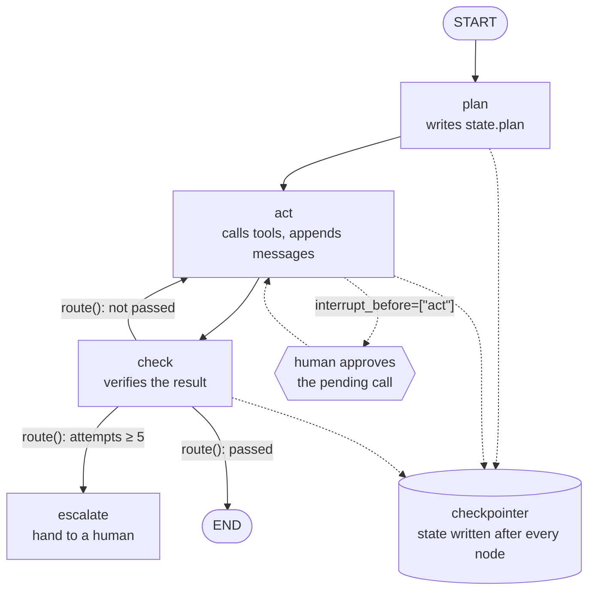

---
aliases:
  - StateGraph
  - Agent Graph
  - Graph Agent
tags:
  - llm
  - agents
  - engineering
  - tooling
  - architecture
---
> [!ABSTRACT] 🧠 Recall
> **In one line:** Write the agent as a **graph over a typed state object**, persisted after every node — so "where the run is" becomes a row in a database instead of a Python stack frame.
> **Metaphor:** A board game. The graph is the rulebook; the state is the position; and you can photograph the board, walk away for four hours, and put it back exactly.
> **Where it bites:** Crash recovery, human approval, time-travel debugging and parallel branches are all the *same* feature — and a `while` loop has none of them.

---
Here is the agent everybody writes first, and it's correct:

```python
messages = [system, user]
for _ in range(MAX_STEPS):
    reply = llm(messages, tools=TOOLS)
    if not reply.tool_calls:
        return reply.content
    for call in reply.tool_calls:
        messages += [reply, run_tool(call)]
```

Eight lines. Now production asks for five things:

```
1. the pod restarts mid-run  →  resume at step 15, don't redo 14
2. writes need approval      →  pause here for up to four hours
3. the UI needs progress     →  emit each step as it happens
4. after 3 failures, escalate →  branch on a condition, and log why
5. three lookups are independent → run them at once
```

Bolt each one on. You'll add a `state` dict so you can serialise it. Then a `step` field so you know where to resume. Then a `status` so a paused run isn't a crashed one. Then a dispatch table mapping `step` → function, because `for` can't start in the middle.

Stop at that point and look at what you've built: ~={blue}a set of named steps, a table saying which step follows which, and a serialised object holding the position. You have reinvented a state machine, badly, in your request handler.=~

---
# The board and the photograph

A board game has two separate things, and confusing them is the whole bug.

There's the **rulebook**: from this square you may go to that one; if you rolled a six, take the other branch. It never changes during play.

And there's the **position**: where the pieces are, what's in each player's hand, whose turn it is. It changes constantly.

![[langgraph_anatomy.png]]

Because those are separate, you can **photograph the board**. Put the photo in a drawer, go away for a week, set the pieces back up from it, and carry on — and nobody can tell. The photograph *is* the game; the rulebook is just paper.

Now say that about the `for` loop. Where is "whose turn it is"? It's the program counter, and the loop variable, and whatever is on the stack. You cannot photograph a stack frame. It dies with the process, which is exactly why a crash at step 14 restarts at step 1.

> [!SUCCESS] Core idea
> In a `while` loop, *where we are* lives in the Python stack. In a graph, *where we are* is ~={pink}a field in a row=~ — so it can be saved, loaded, forked, inspected, resumed on a different machine, and shown to a user. Every headline feature is a consequence of that one relocation. ^position-is-data

> [!NOTE] LangGraph
> A library for building agents as **directed graphs over a shared, typed state**. Nodes are functions `state → partial update`. Edges say what runs next; **conditional edges** are functions returning a node name. A **checkpointer** writes the state after every node, keyed by a `thread_id`. Compiled graphs expose the same `invoke` / `stream` / `batch` [[LangChain#^runnable-contract|Runnable interface]]. ^langgraph-def

---
# The actual code, and the one subtle part

```python
from typing import Annotated, TypedDict
from operator import add
from langgraph.graph import StateGraph, START, END

class State(TypedDict):
    messages: Annotated[list, add]   # reducer: new values are APPENDED
    plan: str                        # no reducer: last write wins
    attempts: int

def plan_node(s: State)  -> dict: return {"plan": write_plan(s)}
def act_node(s: State)   -> dict: return {"messages": [call_tools(s)],
                                          "attempts": s["attempts"] + 1}
def check_node(s: State) -> dict: return {"messages": [verify(s)]}

def route(s: State) -> str:
    if s["attempts"] >= 5:      return "escalate"
    if not passed(s):           return "act"
    return END

g = StateGraph(State)
for n, f in [("plan", plan_node), ("act", act_node), ("check", check_node)]:
    g.add_node(n, f)
g.add_edge(START, "plan")
g.add_edge("plan", "act")
g.add_edge("act", "check")
g.add_conditional_edges("check", route,
                        {"act": "act", "escalate": "escalate", END: END})

app = g.compile(checkpointer=checkpointer,          # durability
                interrupt_before=["act"])           # human approval

app.invoke({"messages": [user], "attempts": 0},
           config={"configurable": {"thread_id": "run-42"}})
```

The subtle part is `Annotated[list, add]`.

A node doesn't mutate the state and doesn't return the whole state. It returns a **partial update**, and the **reducer** says how that update merges. Default is overwrite; `add` appends. That sounds like a detail until you run two nodes in parallel — both return `{"messages": [...]}`, and the reducer is the reason they merge instead of clobbering each other. ~={blue}The reducer is where "shared mutable state" stops being a swear word=~: every write is a declared, typed merge.

| Concept | What it is | Why you care |
|---|---|---|
| **State** | A `TypedDict` — the whole world | It's the thing that gets persisted |
| **Reducer** | How a partial update merges | Makes parallel nodes safe |
| **Node** | `state → partial update` | A plain function. Testable without a model |
| **Conditional edge** | `state → next node name` | ~={blue}Your routing logic is a function you can unit-test=~ |
| **Checkpointer** | Writes state after every node | [[Agent State and Checkpointing]] |
| **`thread_id`** | The run's identity | Resume, fork, and audit by it |
| **Interrupt** | Stop before/after a node | [[Human in the Loop]], for free |
| **`Command`** | A node returning *update + next hop* | Dynamic routing without an edge |

---
# The four features that are secretly one feature

```python
cfg = {"configurable": {"thread_id": "run-42"}}

app.invoke(inp, cfg)                    # 1. runs, pauses before "act"
app.get_state(cfg)                      #    → next=('act',), values={...}
app.invoke(None, cfg)                   # 2. resume — after a crash, a deploy,
                                        #    or a four-hour approval wait
app.update_state(cfg, {"plan": fixed})  # 3. edit the state, then resume
list(app.get_state_history(cfg))        # 4. every checkpoint, newest first
```

That fourth line is the one to sit with. **Time-travel debugging on a non-deterministic system**: load the checkpoint from step 9, change one field, run forward, compare. You are not reading logs about a run — you are *re-entering* it. Given that [[Agentic Workflows#^agent-nondeterminism|every run is different]], this is closer to a REPL than to a debugger, and it's why people pick LangGraph over writing their own loop even when the loop is only twelve lines.

Fork the same checkpoint twice with two different prompts and you have an A/B harness — see [[Agent Evaluation]].

> [!WARNING] Prebuilt ≠ the point
> `create_react_agent(...)` gets you a working agent in one line and then you own a black box: you can't see the prompt, can't insert a gate between tool selection and tool execution, can't route on your own fields. It's the right way to *start* and the wrong place to *stay*.
> Graduate as soon as you need a second condition. ~={red}The reason to be here is the graph; if you never draw the graph you're paying the dependency and getting a while-loop.=~ ^prebuilt-is-a-starting-point

> [!TIP] Design rules that save the most pain 🧭
> - **Keep the state small and typed.** It's serialised after every node. Big blobs go to object storage; the state holds the key.
> - **One field per concern**, with an explicit reducer. Don't stuff everything into `messages`.
> - **Nodes do one thing and are pure-ish**: state in, update out, side effects behind a tool with an idempotency key.
> - **Routing lives in conditional-edge functions**, never in a node's prose. Those functions are ordinary Python — test them with no model at all. 🧪
> - **Set a recursion limit.** It is the only thing between you and an infinite graph.

Related: [[Agentic Workflows]] for what the loop is, [[LangChain]] for the interface the nodes are built from, [[Agent Frameworks]] for the alternatives, [[Observability and Tracing]] for watching it run, and [[Markov Decision Process]] / [[Dynamic Programming]] for the much older idea that a *state* plus a *transition rule* is all you ever need to represent a process.

---
---
#### 🖼️ A real graph — and every arrow is a function you can test



---
> [!SUCCESS] If you remember one thing
> ~={pink}In a while-loop, "where we are" lives in the Python stack. In a graph, it lives in a row.=~ Crash recovery, human approval, forking and time-travel debugging are all consequences of that one sentence.

---
# ⁉️
The graph handles *what the agent does*. It says nothing about where the knowledge came from — the loaders, the parsers, the index, the thing that turned 900 PDFs into something retrievable. There's a whole framework whose centre of gravity is that half of the problem.

→ [[LlamaIndex]]
