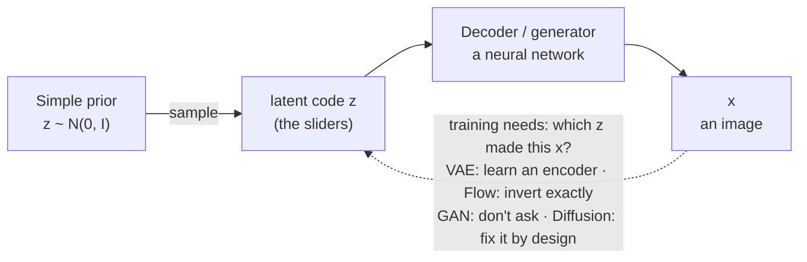

---
aliases:
  - Latent Variable Model
  - Latent Variables
  - Latent Variable
  - Latent Space
  - Latent Code
  - Marginal Likelihood
  - Manifold Hypothesis
tags:
  - generative-models
  - fundamentals
  - probability
---
> [!ABSTRACT] 🧠 Recall
> **In one line:** Assume every data point was produced from a **small hidden code $z$** — sample $z$ from something simple, push it through a network, get an image. Generation becomes *"noise in, data out"*.
> **Metaphor:** A mixing desk. A handful of sliders — pose, lighting, age, smile — and every face is one setting of them.
> **Where it bites:** VAEs, GANs, flows and diffusion are **all** this template. "Latent space", "latent diffusion", "interpolating in latent space" all mean *the sliders*.

---
A 256×256 colour photo of a face is **196,608 numbers**.

Set each of those numbers at random. What do you get?

Static. Every time. You could do it until the sun burns out and never once produce a face. So faces occupy a vanishingly thin sliver of the space of all possible images.

Now think about how you'd *describe* a face to a sketch artist: *about forty, turned slightly left, smiling, lit from above, short dark hair.* Thirty-odd properties, and the artist can draw it.

~={blue}196,608 numbers on the page. About thirty that actually *matter*. Where do the other 196,578 come from?=~

---
# The mixing desk 🎚️

![[latent_dials_mixing_desk.png]]

They're **consequences**. Turn the "lit from above" slider and ten thousand pixels change together, in a precisely coordinated way. The pixels aren't free; they're *driven*.

So build the model that way round:

1. Draw a short code $z$ from something trivially easy to sample — usually $z \sim \mathcal{N}(0, I)$, a few dozen to a few hundred numbers. That's the **prior**.
2. Push it through a network — the **decoder**, or *generator* — to get $x$.

That's the entire recipe for *generating*. All the difficulty is in **training** it, because nobody hands you the slider settings for your training photos.

> [!NOTE] Latent variable model
> A model $p(x) = \int p(x \mid z)\, p(z)\, dz$ in which observed data $x$ is explained by unobserved variables $z$ with a simple prior. *Latent* = hidden. The space $z$ lives in is the **latent space**. ^latent-variable-def

> [!SUCCESS] Core idea
> ~={pink}Real data lives on a thin, low-dimensional surface inside a huge space — the **manifold hypothesis** — and a latent variable model is a learned coordinate system for that surface.=~ It's the same bet that rescues everything from the [[Curse of Dimensionality]]: the space is enormous, but the *data* isn't. And it's the [[State-Space Model|hidden-state]] idea again — a hidden cause, and an observation it produces — without the time axis. ^manifold-core

---
# The catch — that integral

[[Maximum Likelihood]] needs $p(x)$. Here that means: *for this photo, add up the probability of producing it from **every possible** slider setting.* An integral over the whole latent space, per training image, per gradient step.

Hopeless. And the whole family tree of generative models is a list of ways round it:

| Family | How it dodges $\int p(x \mid z)p(z)\,dz$ |
|---|---|
| [[Variational Autoencoder]] | train a second network to **guess which $z$** produced each $x$, and optimise a bound |
| [[Generative Adverserial Network\|GAN]] | never compute $p(x)$ at all — a critic judges the samples |
| [[Normalizing Flows]] | make the decoder **invertible**, so each $x$ has exactly *one* $z$ and the integral vanishes |
| [[Diffusion Models]] | make the latents a *chain* of noisier copies of $x$, with the encoder **fixed** — nothing to learn on that side |
| [[Auto-regressive models]] | no latent at all — model the pixels/tokens directly, one at a time |

> [!TIP] Diffusion is a latent variable model too
> It doesn't look like one — its "latents" $x_1, \ldots, x_T$ are the same size as the image. But structurally it's a VAE with a thousand layers, whose encoder is *"add a bit of noise"* and needs no training. That reframing is exactly how [[Denoising Diffusion Probabilistic Models|the DDPM paper]] derives its loss.

---
# What a good latent space buys you

- **Sampling.** Draw $z$, decode. Done.
- **Interpolation.** Slide from one face's $z$ to another's and the decoded faces *morph* sensibly — because the desk's sliders mean something. Interpolate in **pixel** space and you get a ghostly double exposure.
- **Arithmetic.** *smiling woman − neutral woman + neutral man ≈ smiling man.* Directions in latent space correspond to attributes. Same phenomenon as word-vector arithmetic → [[Embeddings]].
- **Compression.** A few hundred numbers instead of 196,608 — which is what makes [[Latent Diffusion]] affordable.
- **Control.** Find the "age" direction and you have an age slider.

> [!WARNING] "Latent" means three different things in this area
> 1. **The sampled noise** you feed a GAN or a diffusion sampler — a random seed with structure.
> 2. **An encoder's compressed representation** of a particular image — [[Autoencoder]], [[Latent Diffusion]].
> 3. **An unobserved random variable** in a probabilistic model — this note.
>
> They overlap heavily but aren't identical. When a paper says "we operate in latent space", it almost always means (2). ^three-meanings-of-latent

---
---
#### 🖼️ The template every family fills in differently

---
> [!SUCCESS] If you remember one thing
> **Simple noise in → network → data out.** ~={pink}The families differ in one thing only: how they cope with not knowing which noise produced which training example.=~

---
# ⁉️
The most direct way to kill that integral: build the decoder so that it can be run **backwards** — every image maps to exactly one code. Then you can compute the likelihood *exactly*. What does that constraint cost?

→ [[Normalizing Flows]]
