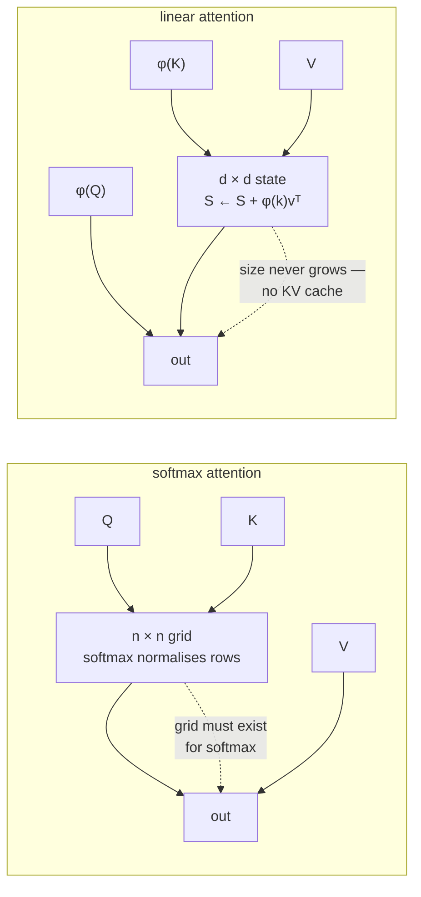

---
aliases:
  - Linear Attention
  - Subquadratic Attention
  - Mamba
  - Selective State Space
  - Linear Transformer
tags:
  - llm
  - attention
  - architecture
  - performance
  - long-context
---
> [!ABSTRACT] 🧠 Recall
> **In one line:** Drop the softmax and the matrix product **reassociates** — $(QK^\top)V$ becomes $Q(K^\top V)$, which is a fixed-size running state instead of an $n \times n$ grid.
> **Metaphor:** A cashier keeping a running balance instead of re-adding the entire day's receipts for every new sale.
> **Where it bites:** Mamba, RWKV, and the honest answer to "why hasn't this replaced transformers?" — plus the reason the models that ship are **hybrids**.

---
The attention bill, for one layer, at $d_{model} = 4096$:

```
n =   1,024 tokens :  softmax   0.02 TFLOP  ·  linear  0.07 TFLOP   ← linear is WORSE
n =   4,096 tokens :  softmax   0.27 TFLOP  ·  linear  0.27 TFLOP   ← dead even
n = 262,144 tokens :  softmax 1125.90 TFLOP ·  linear 17.59 TFLOP   ← 64× cheaper
```

Everyone quotes the last line. ~={blue}Notice the first one: below the model dimension, the "efficient" method costs three times more.=~

---
# The cashier's running balance

A shop, 400 sales today. At sale number 400 the cashier needs the day's total.

One cashier re-adds every previous receipt at each sale. By closing time they've done ~80,000 additions, and the work grows with the *square* of the day's length.

![[linear_attention_running_balance.png]]

The other keeps **a running balance**. One number on a pad, updated once per sale. 400 additions. At any moment they can answer "what's the total?" instantly — and critically, **the pad never gets bigger**. Sale 400 costs exactly what sale 4 cost.

Now: which one is [[KV Cache|the KV cache]]? Attention re-reads every past key and value at every decode step. It's the first cashier, and the pad-that-grows *is* the cache.

So: can attention keep a running balance?

Write out the two ways to bracket the same product:

$$\underbrace{(QK^\top)V}_{n \times n \text{ grid first}} \qquad = \qquad \underbrace{Q(K^\top V)}_{d \times d \text{ state first}}$$

Matrix multiplication is associative, so these are the **same answer**. The left one costs $O(n^2 d)$. The right one costs $O(n d^2)$ — and $K^\top V$ is a $d \times d$ matrix that doesn't depend on $n$ at all. **That's the running balance.**

> [!WARNING] So why doesn't everyone do this? The softmax is in the way
> The real formula is $\text{softmax}(QK^\top)V$, and softmax is a **row-wise non-linearity** applied to the grid. You cannot reassociate past it — the grid has to exist for the softmax to normalise it. ~={red}The quadratic cost is not really attention's fault. It is the softmax's.=~ ^softmax-blocks-it

---
# Removing it

Replace $\exp(q^\top k)$ with a product of feature maps, $\phi(q)^\top \phi(k)$ — any non-negative $\phi$ will do, `elu(x)+1` being the classic. Now the bracket moves freely:

$$\text{out}_t = \frac{\phi(q_t)^\top S_t}{\phi(q_t)^\top z_t}, \qquad S_t = S_{t-1} + \phi(k_t)v_t^\top, \qquad z_t = z_{t-1} + \phi(k_t)$$

Read that middle equation in words: **the state is the old state plus this token's contribution.** That's a recurrent neural network. Linear attention is an RNN with a matrix-valued hidden state — trained in parallel like a transformer, run as a recurrence at inference.

> [!SUCCESS] Core idea
> A transformer remembers by **keeping every token**; a linear model remembers by **folding every token into a fixed-size state**. ~={pink}Decode becomes O(1) in memory and O(1) per token — there is no KV cache, because there is nothing left to cache.=~ ^linear-is-rnn

![[linear_attention_crossover.png]]
> [!TIP] Reading the chart
> The crossover sits at $n = d$ — **4,096 tokens** for a 4096-wide model. Shorter than that and the shaded region is where most real requests live, softmax attention is genuinely the cheaper algorithm. Asymptotics decided this argument for everyone long before the arithmetic did.

---
# What a fixed state costs you 🎒

A $d \times d$ state is a lossy summary. Every new token overwrites some of it. So the failure mode is exactly the one you'd predict: **precise recall of something specific, seen long ago.**

Give a linear model a needle-in-a-haystack task — "what was the 6-digit code mentioned 40,000 tokens ago?" — and it struggles where a transformer, which still *has* that token's K and V verbatim, does not.

This is the whole trade, and it's worth being blunt about it:

| | Softmax attention | Linear / recurrent |
|---|---|---|
| **Memory at decode** | grows with every token | **constant** ✅ |
| **Time per token** | grows with context | **constant** ✅ |
| **Training** | parallel | parallel (with a scan) |
| **Exact recall from far back** | ✅ it kept the token | ❌ it kept a summary |
| **Cheap below 4k tokens** | ✅ | ❌ |

**Mamba** is the version that closed most of the quality gap, by making the state update *input-dependent* — the model learns what to write into the state and what to forget, per token, instead of applying one fixed decay. That selectivity is what lifted these models from "interesting" to "competitive".

> [!WARNING] Two different things are called a state-space model
> The [[State-Space Model]] note in this vault is the **control-theory** one: $x_{t+1} = Ax_t + Bu_t$, a physical system's hidden state evolving over time, the thing a [[Kalman Filter]] estimates. Mamba-style SSMs borrow that *exact* equation and learn $A$ and $B$ instead of deriving them from physics. Same maths, completely different intent — one is estimating a real hidden state, the other is compressing a sequence. ^ssm-two-meanings

---
# What actually ships: hybrids 🥪

Nobody serious builds a pure linear model at scale. The production answer is a **stack that is mostly linear with a few full-attention layers sprinkled in** — Jamba, Samba, Griffin and the recent Nemotron/Qwen hybrids all land on some version of this, typically one full-attention layer in every six to eight.

The intuition is clean: the recurrent layers do the bulk carrying of context cheaply, and the occasional full-attention layer provides the exact lookup that a summary can't. You pay for a small KV cache instead of an enormous one.

> [!TIP] The question to ask 🎯
> Not "quadratic or linear?" but **"how much of this workload needs exact recall, and from how far back?"** Long-document summarisation tolerates a summary. Retrieval over a 200k-token codebase does not. The hybrid exists because most real workloads are a mixture, and the mixture ratio is a design knob — which is precisely the same trade [[Sparse Attention#^hops-not-lookups|sparse attention]] makes with depth.

---
---
#### 🖼️ Grid, or running state



---
> [!SUCCESS] If you remember one thing
> Softmax is what forces the $n^2$ grid; take it away and attention becomes an RNN with a fixed-size state. ~={pink}You buy constant-cost decoding and pay in exact recall — which is why the shipping models keep a few full-attention layers to do the remembering.=~

---
# ⁉️
Sharing, compressing, skipping, reassociating — four separate attacks on the same bill. Put them together and ask the practical question: what actually happens when you hand a model 200,000 tokens, and which of the three walls do you hit first?

→ [[Long Context]]
