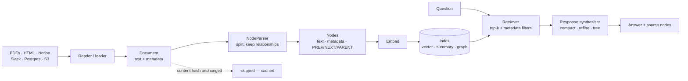

---
aliases:
  - Query Engine
  - Ingestion Pipeline
  - Node Parser
  - LlamaParse
tags:
  - llm
  - retrieval
  - engineering
  - tooling
---
> [!ABSTRACT] 🧠 Recall
> **In one line:** A framework whose atom is the **Node** — a chunk that carries metadata *and its relationships* — built around the half of RAG that actually takes the time: getting documents in.
> **Metaphor:** The goods-in department of a warehouse. Picking an order is trivial; unpacking, labelling and shelving whatever the lorry brought is the job.
> **Where it bites:** Your retrieval quality was decided at ingestion. By the time you're tuning `top_k`, the interesting decisions are already behind you.

---
900 insurance policy PDFs. Here's where three weeks went:

```
extracting text from PDFs        3 days   ← 40% are scans; two vendors' layouts
keeping tables as tables         1 day    ← the premiums ARE the tables
splitting without cutting clauses 1 day   ← see [[Chunking]]
attaching metadata (insurer,
  product, effective date)        1 day
─────────────────────────────────────
building the vector index         2 hours
tuning top_k and the prompt       1 hour
```

The part everyone calls "RAG" was an afternoon. ~={blue}The other three weeks were goods-in=~ — and that ratio holds on almost every real corpus.

So what would a framework look like if it were designed around *that* ratio instead of the afternoon?

---
# Goods-in

A warehouse has two halves and they are not equally hard.

**Picking** is easy: a barcode, a shelf location, a scanner. Two hours to set up, then it runs.

**Goods-in** is the job. A lorry backs up and what comes off it is chaos — some pallets shrink-wrapped, some loose, half the cartons mislabelled, one supplier who ships in metric and one in imperial. Someone has to open it, identify it, assign a barcode, **record where it came from and what it's part of**, and put it on a shelf.

![[llamaindex_goods_in.png]]

And note the sentence in bold, because it's the bit that distinguishes a good warehouse from a shed: the label doesn't just say *what* the thing is. It says which pallet it came off and which item sits next to it. That's how you fetch a box and then find the one that was packed beside it.

> [!NOTE] Node
> LlamaIndex's atom. A chunk of text plus **metadata** (source, page, dates, whatever you attach) plus **relationships** — `PREVIOUS`, `NEXT`, `SOURCE`, `PARENT`, `CHILD`. A `Document` is parsed into Nodes by a **NodeParser**; an **Index** organises Nodes; a **Retriever** fetches them; a **QueryEngine** turns a question into an answer over them. ^node-def

> [!SUCCESS] Core idea
> A plain chunk is an orphan: a string and a vector, with no idea what came before it. ~={pink}A Node knows its neighbours, so retrieving one lets you fetch its context without retrieving it.=~ That single property is what makes sentence-window and auto-merging retrieval possible — and those are the two cheapest quality wins in a document pipeline. ^nodes-have-neighbours

---
# The pipeline, and where each decision bites

```python
from llama_index.core import VectorStoreIndex, SimpleDirectoryReader
from llama_index.core.node_parser import SentenceSplitter

docs  = SimpleDirectoryReader("policies/").load_data()
nodes = SentenceSplitter(chunk_size=512, chunk_overlap=64).get_nodes_from_documents(docs)
index = VectorStoreIndex(nodes)

qe = index.as_query_engine(similarity_top_k=5)
print(qe.query("What is the notice period for unpaid leave?"))
```

Six lines to a working system, which is the demo. The real work is three settings deeper:

| Stage | The decision | Consequence |
|---|---|---|
| **Reader** | Naive PDF text vs a layout-aware parser | Tables survive or become word soup |
| **NodeParser** | Sentence / token / **Markdown-element** / semantic | Where clauses get cut. See [[Chunking]] |
| **Metadata** | What you attach, and *what's embedded with the text* | Enables filters: `insurer = X AND effective_date > 2024` 🥇 |
| **Index** | Vector / summary / property-graph | What kinds of question are answerable at all |
| **Retriever** | `top_k`, filters, hybrid, auto-merging | Precision, and whether you get whole answers |
| **Response synthesiser** | `compact` / `refine` / `tree_summarize` | What happens when 40 nodes don't fit the window |

**Metadata filtering is the under-sold one.** Half the "retrieval is bad" complaints are really *"it retrieved the right clause from the wrong insurer's 2019 policy."* That's not a similarity problem and no reranker fixes it — it's a `WHERE` clause you didn't have because you didn't attach the field at ingest.

And `refine` / `tree_summarize` deserve a sentence: when the retrieved nodes exceed the [[Context Window]], `refine` walks them one at a time carrying an answer forward, `tree_summarize` summarises pairwise up a tree. Both are $O(n)$ extra model calls — the reason a "cheap" query engine suddenly costs 30× is almost always that one of these kicked in silently.

---
# The two retrievers worth knowing

| Retriever | How | Fixes |
|---|---|---|
| **Sentence-window** | Embed single sentences; return the sentence **± k neighbours** | Precision *and* completeness — the [[Chunking\|small-to-big]] trade, solved by relationships |
| **Auto-merging** | Embed small children; if enough children of one parent hit, return the **parent** | The half-answer problem, automatically |

Both are two lines of config, and both are only possible because a Node knows its `PREVIOUS`, `NEXT` and `PARENT`. This is the payoff of the atom choice.

---
# The arithmetic, so you know what's actually expensive 🧮

```
900 PDFs × 40 pages           = 36,000 pages
× ~500 words/page             ≈ 18M words ≈ 24M tokens
÷ 512-token chunks            ≈ 47,000 nodes
embedding @ ~$0.02 / M tokens ≈ $0.48          ← the "expensive" bit. It is 48p.
layout-aware PDF parsing      ≈ $0.003/page × 36,000 ≈ $110
one LLM pass to extract
  metadata per node           ≈ 47,000 × 400 tok ≈ 19M tok @ $0.15/M ≈ $2.85
```

~={red}Parsing costs 200× more than embedding=~, and re-parsing when you change chunk size costs it again. Which is why the ingestion pipeline should be **cached and content-addressed** — `IngestionPipeline` with a doc store hashes each document and skips unchanged ones, so a re-run over 900 PDFs with 3 new ones touches 3.

> [!WARNING] "LlamaIndex or LangChain" is the wrong question
> They aren't competitors at the same layer. LlamaIndex's atom is the **Node** (documents, indices, query engines); LangChain's is the **Runnable** (composition, provider portability); [[LangGraph]]'s is the **state graph** (the loop). Mixing is normal and usually correct: **LlamaIndex readers and parsers for ingestion, LangGraph for the agent loop.**
>
> Pick one *as a framework religion* and you'll end up reimplementing the other one's strong half. ^not-a-religion

> [!TIP] The order to spend effort in 📥
> 1. **Fix the parser.** If tables and headings don't survive, nothing downstream can recover them.
> 2. **Attach metadata you'll filter on** — source, date, product, permissions. Retrofitting it means re-parsing everything.
> 3. **Use sentence-window or auto-merging** before touching the embedding model.
> 4. Only then tune `top_k` and add a [[Reranking|reranker]].
>
> And do **document-level permission filters at retrieval**, not in the prompt. "Only use documents the user can see" as an instruction is a suggestion; as a filter it's a constraint. See [[Guardrails]]. 🔒

Related: [[RAG]], [[Chunking]], [[Embeddings]], [[Vector Database]], [[Reranking]], [[Agentic RAG]], [[LangChain]].

---
---
#### 🖼️ The half of RAG that takes three weeks



---
> [!SUCCESS] If you remember one thing
> Your retrieval quality was decided at ingest, weeks before you touched `top_k`. ~={pink}A chunk that knows its neighbours can bring its context with it; an orphan string cannot.=~

---
# ⁉️
Every framework so far assumes you'll hand-write the prompt inside each step, then hand-tune it when it underperforms. That assumption is worth attacking on its own: what if the prompt were an *output* of the system rather than an input to it?

→ [[DSPy]]
