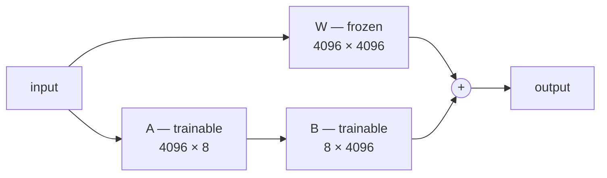

---
aliases:
  - Low-Rank Adaptation
  - QLoRA
  - PEFT
  - Adapters
tags:
  - llm
  - training
  - adaptation
  - performance
---
> [!ABSTRACT] 🧠 Recall
> **In one line:** Freeze the model; learn a **low-rank** update $\Delta W = BA$ with ~0.1% as many parameters — same quality, a single GPU, and swappable adapters.
> **Metaphor:** Not repainting the house — hanging a thin transparent overlay over a window. The wall is untouched; you can swap overlays in a second.
> **Where it bites:** It's how anyone fine-tunes a 70B model. And it's why one server can serve 100 customer-specific models.

---
You want to fine-tune a 7B model. Do the memory arithmetic honestly, in fp16 with Adam:

```
weights                    7B × 2 bytes  =  14 GB
gradients                  7B × 2 bytes  =  14 GB
Adam optimizer state (m,v) 7B × 8 bytes  =  56 GB   ← the killer
activations                            ~ 10 GB
                                        --------
                                        ~ 94 GB
```

That's a 7B model on an 80 GB A100 — and it doesn't fit. A 70B model needs over a terabyte.

Now a second problem: you have 50 enterprise customers, each wanting their own tuned model. That's 50 × 14 GB of weights to store and serve. Nobody can afford that.

But hold on. Consider what a fine-tune actually *changes*. It nudges a general model toward one domain. Does that nudge really require the same expressive capacity as the full 7 billion parameters that encode all of language?

---
# The overlay

You've bought a house. You want a different feel in the living room.

You *could* strip the walls back and repaint — every surface, from scratch. Expensive, slow, and permanent: you can't have the blue version on Tuesdays.

Or you hang a **thin coloured film over the window**. The walls, the furniture, the light fittings — all untouched. The room looks completely different. And when you want a different mood, you swap the film. Ten seconds. Keep twenty films in a drawer.

The insight: the *change* you wanted was **far simpler** than the thing you were changing.

> [!SUCCESS] Core idea
> The pre-trained weights are a huge, full-rank object encoding everything. But the **adaptation** to a specific task lives in a ~={pink}much lower-dimensional subspace — it has low "intrinsic rank."=~ So don't learn $\Delta W$ as a full matrix. Learn it as a product of two skinny ones. ^intrinsic-rank

---
# The mechanics

Freeze $W_0$ (a $d \times k$ [[Linear Projection|projection]]). Represent the update as a product:

$$W = W_0 + \Delta W = W_0 + BA, \qquad B \in \mathbb{R}^{d \times r},\ A \in \mathbb{R}^{r \times k},\ r \ll \min(d,k)$$

For $d = k = 4096$ and $r = 8$:

- Full $\Delta W$: $4096 \times 4096 = 16.8$M parameters
- $B$ and $A$: $2 \times 4096 \times 8 = 65{,}536$ parameters — **0.4%** 🤯

Only $A$ and $B$ get gradients, so the optimizer state shrinks by the same factor, and the 56 GB of Adam state becomes a rounding error. The frozen base still needs its 14 GB for the forward pass (and its activations for [[Backpropagation|backprop]]), but that's a fit, not a fantasy.

> [!NOTE] Initialisation matters
> $A$ is random Gaussian, $B$ is **zeros** — so $BA = 0$ at step 0 and training begins from *exactly* the pre-trained model, no discontinuity. The scaling factor $\alpha/r$ is applied to the update; it's effectively a learning-rate multiplier, and the common convention is $\alpha = 2r$. ^lora-init

> [!TIP] Zero inference latency — the property people miss
> At serving time you can **fold** the adapter in: $W' = W_0 + BA$, computed once. The result is an ordinary weight matrix. ~={blue}No extra layers, no extra latency, nothing to special-case.=~ That's what separates LoRA from earlier adapter methods, which inserted modules and cost latency forever. Or keep it *unmerged* and serve many adapters against one shared base — see below. ^lora-merge

→ [[LoRA- Low-Rank Adaptation of Large Language Models]]

---
# QLoRA: the other half of the trick

LoRA killed the optimizer state; the frozen base weights are still 14 GB (140 GB at 70B). **QLoRA** [[Quantization|quantizes]] the frozen base to **4-bit** and backprops *through* it into fp16 adapters. Three ingredients:

1. **NF4** — a 4-bit datatype matched to the roughly-normal distribution of weights
2. **Double quantization** — quantize the quantization constants too
3. **Paged optimizers** — spill to CPU on memory spikes instead of OOMing

Result: **a 65B model fine-tuned on one 48 GB GPU**, at near-full-fine-tune quality. → [[QLoRA- Efficient Finetuning of Quantized LLMs]]

---
# Serving: the reason this is an infrastructure story 🏗️

| | Full fine-tune | LoRA |
|---|---|---|
| Trainable params | 100% | ~0.1–1% |
| VRAM to train 7B | ~94 GB ❌ | ~16 GB ✅ |
| Artefact size | 14 GB | **~20 MB** 📦 |
| Serving 50 variants | 50 full models | 1 base + 50 tiny adapters ✅ |
| Inference latency | baseline | baseline (merged) |
| Quality | Reference | ~Equal on most tasks |
| Catastrophic forgetting | Higher risk | Lower — base is frozen |

That "1 base + 50 adapters" row is the commercially important one. Frameworks (S-LoRA, vLLM multi-LoRA) batch requests for *different* adapters against one resident base model, swapping the tiny matrices per request. Per-customer models become economically trivial. Also see [[CLEAR- Continuous Latent Adapter Routing for Utility-Preserving LLM Safety Alignment]].

> [!WARNING] Where LoRA underperforms
> It's excellent for style, format, task behaviour and persona. It is ~={red}weaker when you need to inject substantial new *knowledge*=~ or a new language — that's a full-rank change to the base distribution, and continued pre-training wins there.
>
> Practical knobs: **rank** $r$ = 8–16 for style, 32–64 for harder tasks (bigger isn't reliably better and overfits faster); apply adapters to **all** linear layers, not just Q and V — including the MLP — which the QLoRA paper found matters more than rank. ^lora-limits

---
---
#### 🖼️ Freeze the big thing, train a thin thing beside it


Two skinny matrices instead of one huge one — about 0.1% of the parameters, and the base model is untouched so you can swap adapters at will.

# ⁉️
All of this assumes you have (prompt, ideal response) pairs. But a raw pre-trained model doesn't answer questions at all — it just continues text. Something has to make it an assistant first.

→ [[Instruction Tuning]]
