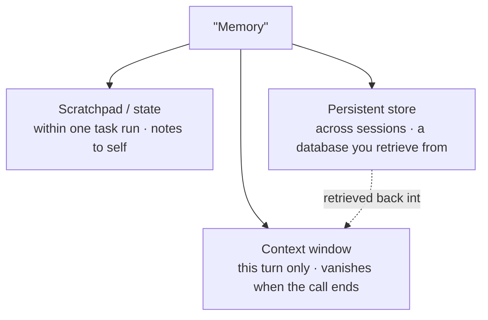

---
aliases:
  - Agent Memory
  - Long-term Memory
  - Scratchpad
  - Conversation Memory
tags:
  - llm
  - agents
  - architecture
---
> [!ABSTRACT] 🧠 Recall
> **In one line:** "Memory" is **three different systems** wearing one word — the context window (working), the scratchpad (episodic, this task), and a persistent store (long-term, across sessions).
> **Metaphor:** A desk. What's in front of you, the notepad beside you, and the filing cabinet behind you.
> **Where it bites:** Almost every "our agent doesn't remember" bug is someone expecting one of the three to behave like another.

---
Your assistant handles a customer in March. In June the same customer returns:

> *"Did you sort out that billing thing?"*

The bot has no idea what they're talking about. Fair enough — you knew the [[Context Window]] is wiped between sessions, so you "added memory."

Now three things go wrong in three different ways:

- It recalls the March billing issue ✅ but **forgets what it decided four turns ago** in this conversation
- It cheerfully repeats a preference the user **explicitly revoked** in April
- Your prompt has quietly grown to 40k tokens of accumulated "memories," it costs a fortune, and answers have got *worse* — see [[Lost in the Middle]]

One word, "memory," and three unrelated failures. That's the tell: ~={blue}they're not one system.=~

---
# The desk

Picture someone working at a desk.

**What's in front of them right now** — the open document, the page they're reading. Instantly available, and *small*. Push something on, something else falls off. That's the [[Context Window]]. **Working memory.**

**The notepad beside them** — scribbled calculations, "tried X, didn't work," a half-finished list. It exists for *this task*. When the task ends, the page is torn off and binned. That's the **scratchpad**. Episodic.

**The filing cabinet behind them** — records deliberately *chosen* to be kept, filed under a label, retrieved by going and looking. Survives everything. That's the **persistent store**. Long-term.

Nobody would confuse these three when talking about a person. The desk is not the cabinet. You don't "just make the desk bigger" to solve filing.

> [!SUCCESS] Core idea
> ~={pink}Memory is not a feature you add; it's three storage tiers with different lifetimes, costs and failure modes.=~ Decide, per piece of information: how long should this survive, and what causes it to be re-read? Answer that and the architecture writes itself. ^three-tiers

---
# The three tiers, precisely 🗄️

| | **Working** (context) | **Scratchpad** (episodic) | **Persistent** (long-term) |
|---|---|---|---|
| Lives in | The prompt itself | A file / state object for this task | A database, [[Vector Database\|vector store]], or graph |
| Lifetime | One request | One task or session | Forever, until deleted |
| Size | Tokens, hard-capped | MBs — it's a **file** | Unbounded |
| Read by | The model, always, automatically | The agent, by **re-reading the file** | **Retrieval** — must be searched |
| Cost | Tokens, every turn 💸 | Almost nothing | Storage + a retrieval call |
| Fails by | Overflowing; [[Lost in the Middle]] | Losing it when the process dies | Retrieving the wrong thing, or stale facts |
| Example | The last 6 turns | "Steps 1–4 done, step 5 failed with 403" | "Prefers metric units. Account tier: enterprise." |

> [!TIP] The scratchpad is the most under-used of the three
> For long agent tasks, the highest-leverage pattern is: **write state to a file, keep only a summary in context.** The agent re-reads the file when it needs detail. This is why coding agents keep a plan/TODO document — it converts ~={blue}an unbounded, expensive, lossy context problem into a bounded, cheap, exact file problem.=~ The model doesn't need to *remember* step 3; it needs to be able to *look it up*. 📝

---
# Long-term memory is a pipeline, not a bucket

Just appending facts to a store and retrieving by similarity fails fast. A real system needs four operations, and the last two are what everybody skips:

1. **Extract** — decide what's even worth keeping. Not the whole transcript: *"user is vegetarian"*, not *"user said hmm"*. An LLM call after each session, with a schema ([[Structured Output]]).
2. **Store** — with metadata: timestamp, source, confidence, user ID. Semantic facts and episodic events are different tables.
3. **Retrieve** — pull only what's relevant to the *current* turn ([[RAG]] machinery, plus recency and importance weighting).
4. **Update / forget** — ~={red}the hard one.=~ "Lives in London" must be *overwritten*, not appended, when they move to Berlin. Otherwise you accumulate contradictions and the model picks one at random. You need conflict detection, recency precedence, and explicit deletion. ^memory-update-problem

> [!WARNING] The failure modes nobody plans for
> - **Contradiction accumulation** — old and new facts coexist; answers become nondeterministic
> - **Context bloat** — injecting 40 memories per turn costs money *and* degrades quality
> - **Privacy and GDPR** — a persistent store of user facts is personal data. It needs deletion, export, and an audit trail. This is a *product and legal* requirement, not a nice-to-have 🔒
> - **Poisoned memory** — if a user (or a retrieved document) can write to long-term memory, they can plant an instruction that fires in a *future* session. That's a persistent [[Prompt Injection]], and it's the nastiest variant because it outlives the conversation. ~={red}Never store retrieved content as instructions.=~

> [!NOTE] Cheap first
> Before building any of this: **rolling summarisation** (compress old turns into a paragraph) plus a small **structured profile** (10 fields, explicitly updated) solves most products' actual needs. Vector-store memory is where you go when those genuinely don't. Start cheap. ^memory-start-cheap

Related: [[Beliefs]] for the probabilistic view of maintaining state under uncertainty, and [[Agentic Workflows]] for who does the reading and writing.

---
---
#### 🖼️ Three different things people call 'memory'

Only the third survives. And it survives because something *wrote it down* — not because the model remembers.

# ⁉️
Everything so far changes what the model *sees*. Nothing has changed what the model *is*. Sometimes the prompt genuinely isn't enough — the model's behaviour itself is wrong.

→ [[Fine-Tuning]]
