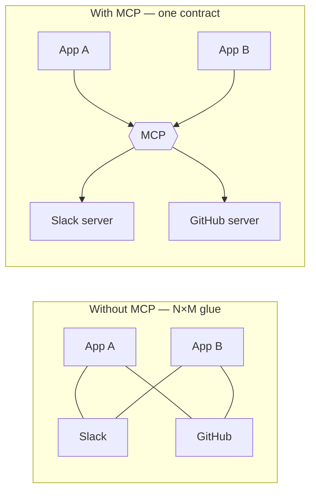

---
aliases:
  - MCP
  - MCP Server
tags:
  - llm
  - agents
  - engineering
  - tooling
---
> [!ABSTRACT] 🧠 Recall
> **In one line:** An open protocol that standardises how an LLM app discovers and calls external **tools, resources and prompts** — so integrations are $M + N$ instead of $M \times N$.
> **Metaphor:** USB-C. Before, every device had its own cable; now the socket is the standard and the device is somebody else's problem.
> **Where it bites:** Integration cost, plus a genuinely new supply-chain and [[Prompt Injection|injection]] surface.

---
You've built an agent with [[Tool Use]]. It talks to GitHub, Postgres, Slack and Google Drive. Four integrations: auth, schemas, error handling, pagination, four times.

Your colleague builds a different agent on a different framework. She writes ~={red}the same four integrations again=~, incompatibly.

Now count across the industry. $M$ applications × $N$ data sources = $M \times N$ bespoke connectors, each separately written, separately broken, separately maintained.

If that shape feels familiar, it should: it's the same one that produced ODBC for databases, and LSP for editor tooling. What did those do?

---
# The USB-C moment

Think about the drawer of cables everyone had in 2010. Mini-USB, micro-USB, 30-pin, barrel jacks, a proprietary one for the camera. Every device shipped its own cable because every device defined its own connector.

USB-C didn't make any device better. It **standardised the socket** — so a manufacturer implements the port once and works with every charger, and a charger works with every device. $M \times N$ collapsed into $M + N$.

The insight is a boring one and it's the right one: ~={blue}the integration was never the interesting part of anyone's product.=~

> [!NOTE] Model Context Protocol
> An open standard (JSON-RPC 2.0 over stdio or HTTP/SSE) defining how an **MCP host** (an LLM app) connects via a **client** to **servers** that expose:
> - **Tools** — callable functions the *model* decides to invoke (model-controlled)
> - **Resources** — readable data, addressed by URI, that the *application* pulls into context (app-controlled)
> - **Prompts** — reusable templates the *user* explicitly invokes, e.g. slash commands (user-controlled)
> ^mcp-def

> [!SUCCESS] Core idea
> The three primitives are separated by ~={pink}**who is in control**: the model, the application, or the user.=~ That's the design decision worth remembering — it's not three names for "stuff the server provides," it's a deliberate split of authority, and it's also the beginning of the security story. ^mcp-three-primitives

---
# What the protocol actually buys 🔌

**Discovery.** A client asks a server `tools/list` and gets back names, descriptions and JSON schemas at runtime. The agent didn't need to know them at build time — new capabilities can appear in a running system.

**Portability.** One MCP server works with every MCP-speaking host. Write the Postgres server once; every agent in the company gets a database.

**Local-first.** Servers commonly run as local processes over stdio — your credentials and data stay on your machine, and the model provider never sees them.

| Without MCP | With MCP |
|---|---|
| $M \times N$ bespoke connectors | $M + N$ ✅ |
| Tools hardcoded per framework | Discovered at runtime |
| Re-implement per app | Install a server |
| Every team writes its own auth | One auth model per server |

---
# The part to be careful about 🔒

An MCP server is ~={red}code you run with your credentials, whose tool descriptions are injected into your model's context.=~ Both halves of that sentence are attack surfaces:

> [!WARNING] Two distinct risks
> **1. Supply chain.** Installing a community MCP server is `npm install` with your API keys attached. It runs locally, with your permissions. Read it, pin it, sandbox it — or don't install it.
>
> **2. Tool-description injection.** The server's *descriptions* become part of the prompt. A malicious server can write a description that instructs the model to exfiltrate data via another tool's arguments. Worse, a compromised update can change a description your agent already trusts — the **rug pull**. And with several servers connected, one can describe itself in a way that hijacks calls intended for another (**tool shadowing**).
>
> Mitigations: pin versions, review descriptions as *untrusted text*, apply least privilege per server, log every call, and gate side effects behind human confirmation. See [[Prompt Injection]] and [[Guardrails]]. ^mcp-security

> [!TIP] When it's worth it
> **Use MCP** when several apps need the same integration, when you want local tools without shipping data to a provider, or to plug into an ecosystem of existing servers.
> **Skip it** for one app with three internal tools — plain [[Tool Use]] function calling is less machinery. A protocol pays off at $M \times N$; at $1 \times 3$ it's overhead. ⚖️

Note the framing that makes MCP click: it's not an *agent* framework. It says nothing about planning, loops, or [[Agentic Workflows|ReAct]]. It is purely the **connector layer** — how capabilities get to the model. Keeping that boundary clean is why it composes with everything.

---
---
#### 🖼️ One adaptor instead of N×M integrations

# ⁉️
Tools, memory, retrieval, loops — the system can now do a great deal. Which makes the next question the only one that matters: **how do you know when it's wrong?** And the most dangerous wrongness is the kind that looks exactly like rightness.

→ [[Hallucination]]
