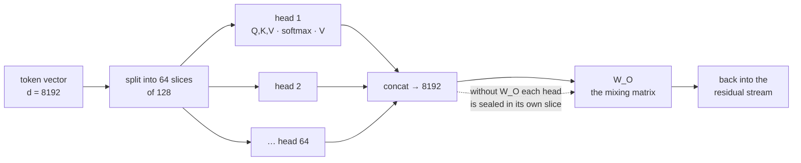

---
aliases:
  - MHA
  - Multi-Head Attention
  - Attention Heads
  - Output Projection
tags:
  - transformers
  - attention
  - architecture
  - fundamentals
---
> [!ABSTRACT] 🧠 Recall
> **In one line:** Don't run one attention over 4096 dimensions — run **32 attentions over 128 dimensions each**, in parallel, then mix the results with a fourth matrix.
> **Metaphor:** A refereeing crew. Several officials watch the *same* play, each looking for a different thing, and the crew chief merges their calls into one decision.
> **Where it bites:** The reason "more heads" is free, the reason head dimension is what the $\sqrt{d_k}$ in the formula is actually about, and the reason `W_O` exists at all.

---
A 70B model has $d_{model} = 8192$ and **64 heads**. Each head therefore gets $8192 / 64 = 128$ dimensions.

Notice what that arithmetic says. The heads don't each get a full-width copy of the model — they get *slices of one*. So:

```
one head  of width 8192   →  Q,K,V projections are 8192 × 8192
64 heads  of width  128   →  Q,K,V projections are 8192 × 8192
```

~={blue}Identical parameters. Identical FLOPs. So what did you actually buy by cutting it into 64 pieces?=~

---
# The refereeing crew

A football match, one play in the penalty box. You could appoint **one** official and ask them to watch everything: offside, handball, the shirt-pull, the ball crossing the line.

They will miss something. Not because they're bad, but because they have to produce **one** judgement about the play, and the play contains four independent things worth judging.

![[multi_head_referee_crew.png]]

So you appoint a crew. The assistant watches the offside line and nothing else. The referee watches the contact. The goal-line official watches the ball. Same play, same 90 seconds, four narrow jobs — and then the crew chief combines the calls into one decision.

Now the transformer version. One attention operation produces **one** set of weights per token: one answer to "who am I listening to?" But the token *"it"* in a long sentence needs several answers at once — which noun it refers to, what its grammatical role is, which clause it sits in.

One head has to average those questions together. Sixty-four heads don't.

> [!NOTE] Multi-head attention
> Split $d_{model}$ into $h$ heads of width $d_{head} = d_{model}/h$. Each head gets its own $W_Q, W_K, W_V$, runs the ordinary [[Query, Key, and Value (QKV)|attention]] formula over its slice, and produces its own output. The $h$ outputs are **concatenated** back to width $d_{model}$ and passed through one more learned matrix $W_O$. ^mha-def

> [!SUCCESS] Core idea
> Heads don't add capacity — they **partition** it. The same budget stops being one broad question and becomes ~={pink}64 sharp ones asked simultaneously.=~ ^heads-partition

---
# The fourth matrix nobody mentions 🧩

Every diagram shows three projections. There are **four**.

After the heads finish, you hold 64 vectors of width 128, stacked into one vector of width 8192. Concatenation alone would mean head 7 always writes into dimensions 896–1023 of the residual stream and can never influence anything else. The heads would be 64 sealed pipes.

$W_O$ ($8192 \times 8192$) is what unseals them. It lets any head's output land anywhere in the residual stream, and it lets the heads' contributions be *combined* rather than merely filed side by side.

$$\text{MultiHead}(X) = \text{Concat}(\text{head}_1, \dots, \text{head}_h)\,W_O$$

> [!TIP] Reading it as a sum, which is the more useful view
> Because concatenate-then-multiply is the same as slicing $W_O$ into $h$ blocks and adding, multi-head attention is exactly $\sum_i \text{head}_i W_O^{(i)}$ — **each head writes its own update into the residual stream, independently**. That reframing is the basis of most mechanistic interpretability work: you can delete one head's contribution and see what breaks. 🔬

---
# What the heads actually learn

Not what people assume. Probing studies of trained models find heads that are startlingly specific: previous-token heads, syntactic-dependency heads, rare-word heads, and **induction heads** — pairs of heads that implement "I saw `A B` earlier, I've just seen `A` again, so predict `B`." That circuit is a large part of why [[In Context Learning|in-context learning]] works at all.

And then the finding that ruins the tidy story: **most heads can be deleted**. Michel et al. (2019) pruned the majority of heads in a trained transformer at little cost, with some layers fine on **one** head. Voita et al. found the same for translation.

> [!WARNING] So heads are specialists — and most of them are redundant
> Both are true, and they're not in conflict. Training many heads makes it *likely* that the useful circuits form somewhere; it doesn't mean all 64 end up carrying weight. The redundancy is the price of the search, not the point of it. This is also why [[Grouped Query Attention|GQA]] gets away with what it does. ^heads-redundant

---
# Head count vs head width — the real trade

| Config ($d_{model}$ = 8192) | Heads | $d_{head}$ | What happens |
|---|---|---|---|
| One big head | 1 | 8192 | One relationship per token. Wastes the width. |
| Conventional | 64 | 128 | **The standard.** Enough width to be expressive, enough heads to specialise. |
| Very many, very thin | 256 | 32 | Each head's subspace is too small to represent much; quality drops |
| [[Grouped Query Attention\|GQA]] | 64 Q | 128 | Keeps 64 questions, keeps only 8 K/V sets — a serving fix, not a quality one |

The FLOPs are the same in every row. What changes is **how the same budget is carved up**.

---
# Where $\sqrt{d_k}$ fits in 📉

Head width is the quantity the scaling factor in the attention formula is defending against. Take one query against 40 keys, all random, and measure how much weight lands on the single best-scoring key:

![[attn_softmax_scaling.png]]
> [!TIP] Reading the chart
> At head dimension 128, the **unscaled** dot products put **87.2%** of the weight on one key — softmax has effectively become an `argmax`, and a saturated softmax has almost no gradient to learn its way out of. Divide by $\sqrt{d_k}$ and it sits at **14.5%**, flat at every width. The fix works at any head size; the problem gets worse as heads get wider. See [[Query, Key, and Value (QKV)#^why-sqrt-dk]].

---
---
#### 🖼️ Four matrices, not three



---
> [!SUCCESS] If you remember one thing
> Heads are a **partition of a fixed budget**, not an addition to it — which is why going from 8 heads to 64 costs nothing. ~={pink}The expressiveness comes from asking many narrow questions at once, and from `W_O` being allowed to mix the answers.=~

---
# ⁉️
Every head, in every layer, currently lets a token look at **every** other token — including the ones that come after it. That's fine for reading. It's fatal for a model whose entire job is predicting what comes next.

→ [[Causal Attention]]
