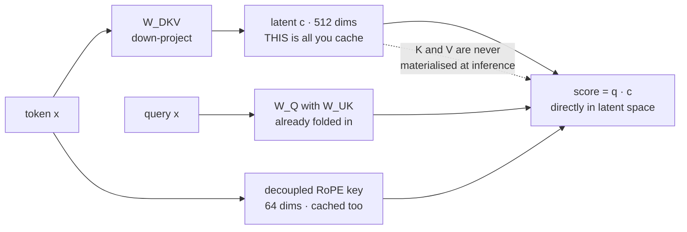

---
aliases:
  - MLA
  - Latent Attention
  - KV Compression
tags:
  - llm
  - attention
  - inference
  - performance
  - architecture
---
> [!ABSTRACT] 🧠 Recall
> **In one line:** Don't cache K and V — cache **one small latent vector per token** and rebuild K and V from it, with the rebuild matrix folded into the query so you never actually rebuild anything.
> **Metaphor:** A stenographer. Store shorthand, not the transcript; the expansion happens when someone asks, and mostly it never has to happen at all.
> **Where it bites:** DeepSeek's answer to the [[KV Cache]] wall — ~28× smaller than MHA, and unlike [[Grouped Query Attention|GQA]] it doesn't buy that by throwing heads away.

---
Same model shape — 80 layers, 64 heads, head dimension 128, fp16 — four ways of storing what each token needs to remember:

```
MHA  64 KV heads     2.50 MB per token      8k tokens fit in 20 GB
GQA   8 KV heads     0.31 MB per token     66k tokens fit
MQA   1 KV head      0.04 MB per token    524k tokens fit  ← quality drops
MLA  latent of 512   0.09 MB per token    233k tokens fit  ← quality does not
```

[[Grouped Query Attention|GQA]] got its 8× by **deleting 56 of the 64 key/value heads**. MQA deleted 63 and paid for it. ~={blue}MLA keeps all 64 — so where did its memory go?=~

---
# The stenographer

A court stenographer doesn't record the hearing by writing out every word. They write **shorthand**: a compressed encoding that holds everything needed to reconstruct the speech, in a fraction of the strokes.

![[mla_stenographer_shorthand.png]]

The reconstruction is a known, fixed procedure. So the shorthand isn't a lossy summary in the way a paraphrase is — it's the same information in a smaller representation, with the expansion rule kept separately, once, rather than stored per page.

Now the attention version. A token's K and V are both produced from the same token vector by two learned matrices. So they're not independent objects — they're two **views of one thing**. If they're two views of one thing, why store both?

So: project the token down to a single latent vector $c$ of width 512, and **cache only that**. When you need K and V, project back up.

$$c_t = W_{DKV}\,x_t \qquad K_t = W_{UK}\,c_t \qquad V_t = W_{UV}\,c_t$$

Down-project once, cache the small thing, up-project on demand.

> [!NOTE] Multi-head Latent Attention
> Attention that caches a **low-rank latent** $c_t$ per token in place of the per-head keys and values, reconstructing K and V through learned up-projections. All query heads are retained. Introduced with DeepSeek-V2. ^mla-def

---
# The part that makes it free ✨

The obvious objection: you've traded memory for compute. Every decode step now has to up-project the whole cache back into 64 heads' worth of K before you can do anything. That sounds worse, not better.

It isn't, because of one line of algebra. The score a query needs is:

$$q_t^\top K_s = (W_Q x_t)^\top (W_{UK} c_s) = \underbrace{\big(W_{UK}^\top W_Q\big)}_{\text{one matrix, precomputed}} x_t \cdot c_s$$

$W_{UK}$ is a **fixed, learned** matrix. So fold it into $W_Q$ *once, at load time*, and the query arrives already living in latent space. You then dot it straight against the cached $c_s$.

> [!SUCCESS] Core idea
> ~={pink}The up-projection is absorbed into the query, so K is never materialised at all.=~ You cache a 512-vector, and you attend against the 512-vector. The "decompression" is a matrix multiply that happened once, before the first request. ^mla-absorption

The same absorption works on the output side: $W_{UV}$ folds into $W_O$.

---
# The wrinkle: [[RoPE]] doesn't fold 🌀

Absorption relies on the matrices being fixed. [[RoPE]] applies a **rotation that depends on the token's position**, sitting right between $W_Q$ and $W_{UK}$ — and a position-dependent rotation can't be premultiplied into a static matrix. Apply RoPE and the trick dies.

The fix is blunt and effective: **split the head**. Most of each head (128 dims) carries no position information and goes through the latent path. A small extra slice (64 dims) carries RoPE and is cached separately, shared across all heads.

```
per token, per layer:   512 latent dims  +  64 decoupled RoPE dims
                        = 576 × 2 bytes × 80 layers = 0.088 MB
```

That `+64` is the whole reason MLA's cache isn't quite as small as MQA's. It's also the detail that gets left out of every summary of the method.

---
# Share it, or compress it?

| | What it does to capacity | Cache/token | Quality vs MHA |
|---|---|---|---|
| **MHA** | nothing | 2.50 MB | baseline |
| **[[Grouped Query Attention\|GQA]]** | **removes** K/V heads | 0.31 MB | ~indistinguishable at 8 groups |
| **MQA** | removes all but one | 0.04 MB | noticeable drop, less stable |
| **MLA** | **keeps all heads**, compresses storage | **0.09 MB** | reported **≥ MHA** |

![[attn_kv_bytes_per_token.png]]
> [!TIP] Reading the chart
> On the same 20 GB of cache budget, MHA serves about **8k tokens** and MLA about **233k** — 28× more, and 3.6× more than GQA. The bar to watch is the gap between GQA and MLA: that gap is the difference between *deleting* heads and *compressing* what they store.

> [!WARNING] MLA is not "more aggressive GQA"
> They attack different things. GQA reduces **how many distinct K/V sets exist** — a real reduction in what the model can represent, bought back by the fact that [[Multi-Head Attention#^heads-redundant|most heads are redundant anyway]]. MLA reduces **how those sets are stored**, and reconstructs them exactly. That's why DeepSeek report MLA matching or beating full MHA rather than merely getting close to it. ^mla-not-gqa

> [!TIP] The cost you do pay 💸
> MLA is a **training-time architecture**, not a kernel swap. You cannot convert an MHA checkpoint to MLA the way GQA offers [[Grouped Query Attention|uptraining]] — the latent space has to be learned. It also complicates every serving stack that assumed a K and a V tensor exist, which is a real part of why adoption trailed the paper. Further compression work in [[DeepSeek-V4.1-Flash- Pushing the Limits of KV Cache Compression]].

---
---
#### 🖼️ Cache the shorthand, fold the expansion into the query



---
> [!SUCCESS] If you remember one thing
> K and V are two views of one token, so store the token's compressed form and fold the expansion into the weights. ~={pink}You get MQA-scale memory with full multi-head capacity, because the compression is undone by algebra rather than at runtime.=~

---
# ⁉️
Every trick so far still computes **every pair** — all $n^2$ of them — and just stores or arranges the result more cleverly. But does token 20,000 really need to look at token 3? What if you simply didn't compute most of the grid?

→ [[Sparse Attention]]
