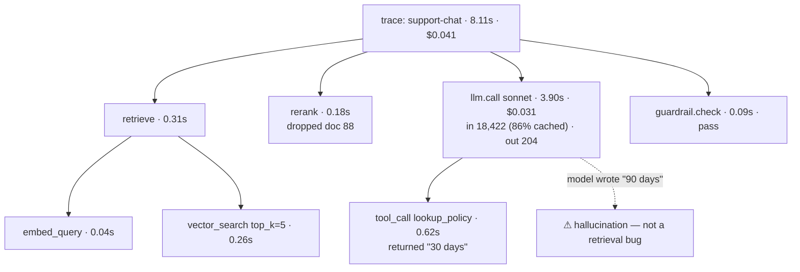

---
aliases:
  - Tracing
  - LLM Observability
  - LangSmith
  - Trace Tree
tags:
  - llm
  - engineering
  - infrastructure
  - metrics
---
> [!ABSTRACT] 🧠 Recall
> **In one line:** Record every run as a **tree of nested spans** — each with its exact inputs, outputs, tokens, cost and latency — because you cannot re-run a non-deterministic system to find out what it did.
> **Metaphor:** A flight recorder. Nobody explains an incident by re-flying the flight; they replay eighty channels of what was actually happening.
> **Where it bites:** The bug report arrives four days late, the run is unreproducible, and the logs say `status=200`.

---
A customer forwards a screenshot: *"your assistant told me we offer a 90-day refund. We offer 30."*

You go to the logs.

```
2026-09-18T14:22:11 INFO  chat.request  user=8812 model=sonnet tokens_in=18422
2026-09-18T14:22:19 INFO  chat.response status=200 tokens_out=204 dur_ms=8113
```

That is the complete record. Now try to answer any of these:

```
which of the 6 documents were retrieved, and in what order?
did one of them actually say 90, or did the model invent it?
what did the compaction step at turn 9 throw away?
did the search tool return an error that got swallowed?
was this the cheap model or the expensive one? (the router decided)
```

You can't. And you can't re-run it either: same input, [[Agentic Workflows#^agent-nondeterminism|different trajectory]]. ~={red}The run happened once, it is gone, and you logged its HTTP status.=~

So what would you have needed to record at 14:22:11?

---
# The flight recorder

An air accident investigation never begins with "let's fly it again and see." The flight is unrepeatable — the weather, the loading, the sequence of decisions will never recur.

![[observability_trace_waterfall.png]]

So aircraft carry recorders instead, and the design is the interesting part:

- **Everything, continuously** — not "significant events". Significance is only visible afterwards.
- **Timed and nested** — what was happening *during* what.
- **The inputs to every decision**, not just the outputs. The altimeter reading, not only the altitude.
- **Replayable** — investigators reconstruct the flight and watch it.

Every one of those is a reaction to the same underlying fact, and it's your fact too: **the event cannot be reproduced, so the recording has to be sufficient on its own.**

> [!NOTE] Trace and span
> A **span** is one timed operation with attributes: name, start/end, status, inputs, outputs. A **trace** is a tree of spans sharing a trace id — one whole run, with nesting showing what called what. This is ordinary [distributed tracing](https://opentelemetry.io); the LLM-specific part is *what goes in the attributes*. ^trace-span-def

```
trace  "support-chat"                         8.11 s   $0.041   user=8812
├─ span  retrieve                             0.31 s
│  ├─ span  embed_query                       0.04 s      12 tok
│  └─ span  vector_search  top_k=5            0.26 s   → doc ids [41,7,88,12,3]
├─ span  rerank                               0.18 s   → [7,41,3]
├─ span  llm.call  sonnet                     3.90 s   $0.031
│  │   in 18,422 (cached 15,900)  out 204     cache_hit=86%
│  └─ tool_call  lookup_policy(product="Pro") 0.62 s   → "…refund window: 30 days…"
└─ span  guardrail.check                      0.09 s   pass
```

Look at what that tree makes trivially answerable. Document 88 was retrieved and **dropped by the reranker**. The tool returned "30 days". So the model had the right number in front of it and wrote 90 — that's a [[Hallucination]], not a retrieval bug, and you now know which of the two teams to talk to. ~={blue}Half of debugging an LLM system is deciding which layer to blame, and the tree does that in one glance.=~

> [!SUCCESS] Core idea
> A log line records *that* something happened. A span records **what it was given and what it produced**. For a deterministic system the first is enough, because you can re-derive the second. ~={pink}For a non-deterministic one, anything you didn't record is gone forever.=~ ^record-inputs-not-events

---
# What to put on a span 🏷️

| Attribute | Why you'll want it |
|---|---|
| `trace_id`, propagated from the **user-facing request** | Otherwise you can't join a complaint to a run 🔗 |
| `session_id` / `thread_id` / `user_id` | Multi-turn debugging, and per-user cost |
| The **full rendered prompt** and the raw completion | The one thing frameworks hide and you always need |
| `model`, `temperature`, `seed`, provider, region | "Which model was it?" is a router question now |
| Tokens **split four ways**: cached in · uncached in · out · reasoning | They differ in price by up to 50× — [[Cost and Latency]] |
| `cost_usd`, computed at ingest | So the dashboard exists before finance asks |
| `cache_hit_rate` | A silent regression that shows up only on the invoice ([[Prompt Caching]]) |
| Tool name, **arguments**, result, error | Where agent runs actually go wrong |
| `step_index`, `max_steps`, `budget_remaining` | Distinguishes "finished" from "hit the cap" |
| Release / prompt version | The only way to say "this got worse on Tuesday" |

> [!TIP] Propagate one id from the browser and the rest is cheap
> Generate the trace id at the **edge**, put it in the response, and show it in the UI ("reference: `a91f…`"). A user reporting a bad answer then hands you the exact run. Without it you're searching by timestamp and user id across a week of traffic, which is the single most demoralising hour in this job. 🎫

**Use OpenTelemetry's GenAI conventions** rather than a vendor's SDK shape where you can. Traces are the highest-lock-in asset in [[Agent Frameworks|the whole framework decision]] — prompts and tools are portable, trace history is not — and OTel means the collector can fan out to an LLM-native backend (LangSmith, Langfuse, Phoenix, Braintrust) *and* your existing APM.

---
# From debugging to measurement

Once traces exist, three things fall out that are worth more than the debugging:

1. **Regression sets for free.** Every trace is a real input with a real trajectory. Flagged ones become [[Agent Evaluation|eval]] cases; the "does it still work" core set is just your top 10 traces from a good week.
2. **Online evals.** Run a cheap grader over a sample of live traces — groundedness, refusal rate, schema validity — and you have quality as a *time series* rather than a pre-release event.
3. **Cost and latency attribution** per feature, per customer, per prompt version. Every number in [[Cost and Latency]] comes from here.

> [!WARNING] Your traces are the most sensitive data you hold
> A trace contains the full prompt, which contains the retrieved documents, the user's message and whatever the tools returned — so it is a **copy of your most sensitive data, in a system your whole team can search, with a retention policy nobody set**.
>
> Non-negotiables: redact at the SDK *before* export (not in the backend), separate retention for payloads and for metrics (30 days vs 13 months is a common split), access control on payload viewing, and a deletion path keyed by user id for GDPR. ~={red}"We'll turn on tracing first and sort out PII later" means you have exported the PII already.=~ ^traces-are-pii

> [!TIP] Sampling, without losing the runs that matter
> At scale you cannot store every token. **Tail-based** sampling is the right shape: buffer the trace, decide at the end.
> ```
> keep 100%  of errors, guardrail blocks, and anything above a cost/latency threshold
> keep 100%  of runs a user thumbs-down or a human gate rejected
> keep   5%  of the rest, stratified by feature
> ```
> Head-based (decide at the start) is cheaper and throws away exactly the runs you'd have wanted. 🎯

Related: [[Evals]], [[Agent Evaluation]], [[Cost and Latency]], [[Agent State and Checkpointing]] (time travel as the other half of debugging), [[Model Gateway]] (which can emit most of this for free), [[ML Infrastructure]].

---
---
#### 🖼️ One run, one tree — and the failing node is visible



---
> [!SUCCESS] If you remember one thing
> You cannot re-run a non-deterministic system, so ~={pink}anything you didn't record is gone.=~ Record the *inputs to every decision*, not the fact that a decision happened.

---
# ⁉️
Traces tell you what one run did. They can't tell you whether the system is *better than last week* — for that you need a fixed set of runs, graded the same way every time. And for an agent, grading only the final answer misses most of what went wrong.

→ [[Agent Evaluation]]
