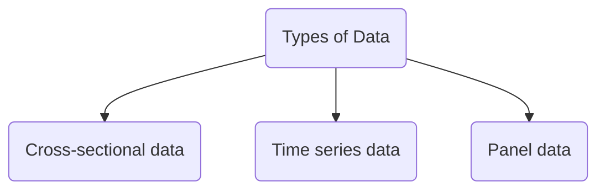

It's a [[Regression Analysis|regression technique]] that combines 2 key ideas:
- Panel Data
- OLS

## Panel Data
Also called **Longitudinal data** - tracks a single subject over a period of time

> [!NOTE] Types of data
> 
 >   - **Cross-Sectional Data**: The sales of 100 different coffee shops on one specific day.
 >   - **Time-Series Data**: The sales of _one single_ coffee shop over 100 days.
 >  - **Panel Data**: The sales of _100 different_ coffee shops over _100 days_.
 
---

## OLS
Stands for **Ordinary Least Squares**

So we know we need to do regression analysis but how is it done?
OLS is 1 such method to do regression.
Regression says we need to find the values for $\beta_0$ and $\beta_1$, to draw the **best fit line** which minimizes the residual (error). And OLS says residual is simply the **sum of squared errors**

